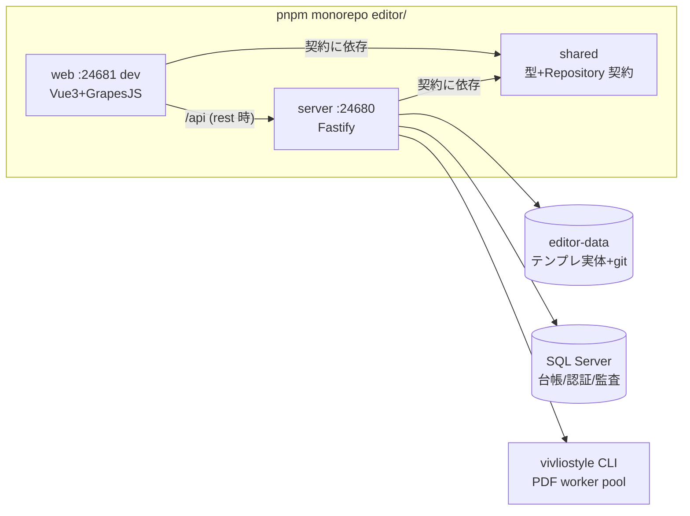

editor の構造・不変則を触る前に読む要約版。詳細の一次資料は `editor/README.md`・
`docs/editor/src/設計書.md`（v2.4）。**編集 2 系統の原則の正典は本書「中核原則」節**
（要点を本書が保持し、詳細・退行事例の経緯は設計書 6.1 節へ委譲する）。

## 全体像

<!-- ノードラベルは短い 2 行構成に保つ。長い行は Mermaid が CJK 幅を過小計算し枠外へ見切れる。 -->

- ポートは **server=24680 / Vite dev=24681** で固定。起動は `editor/start.bat`（引数順不同:
  `dev`/`prod` × `local`/`rest` × `lan`）。`rest` は SQL Server + 認証必須、`rest lan` は
  `HOST=0.0.0.0` + HTTPS（PFX 方式・`HTTPS=true` opt-in。無証明書時は HTTP +
  `COOKIE_SECURE=false` フォールバック）。
- テンプレ実体はリポジトリ**外**の `dataRoot`（既定 `../../editor-data`。ネスト git 回避、
  初期化は `editor/scripts/init-data-repo.bat`）。**本体=ファイル/git、DB=台帳**が基本方針。

## モジュール構成

| モジュール | 責務 |
|---|---|
| `shared/src/schemas.ts` | ドメイン型の正典（Zod。TS 型は `z.infer` 導出、実行時検証・OpenAPI と共用） |
| `shared/src/repositories/` | Repository 契約 7 種（Auth/Template/History/Part/User/Note/Review）。全メソッド `Result<T>` |
| `web/src/api/repositories.ts` | local（fixtures+localStorage）⇄ rest の**唯一の差し替え点**（`VITE_API_MODE`） |
| `web/src/lib/jinjaMask.ts` | Jinja タグ保護の核心（`toEditable` mask ⇄ `toTemplate` restore・pretty 整形はマスク段階） |
| `web/src/features/editor/` | GrapesJS 3 ペイン編集（`useGrapes` / `useTemplateEditor` / `services/templateEditorService.ts`） |
| `web/src/features/preview/` | vivliostyle ブラウザ内組版・PDF 出力・確定保存申請（`PreviewView`） |
| `web/src/workers/` | linkedom+comlink Worker（diff/toFilled 等）。不達時は main-thread へ恒久フォールバック |
| `server/src/routes/` | Fastify ルート 9 本 + openapi。保存は申請→承認ゲート（`reviews.routes.ts`） |
| `server/src/db/` | sproc ゲートウェイ（7 本・第 1 引数 `@操作` 分岐）。`msnodesqlv8` は `pool.ts` に隔離 |
| `server/src/vivliostyle/` | PDF build（常駐 worker pool）+ preview proxy。`@vivliostyle/cli` の唯一の駆動点 |
| `server/src/sync/` | パーツ自動反映 2 種（ペア同期 = 純関数エンジン `partSync.ts` + I/O 編成 `pairSyncService.ts` / 注記マスタ書き戻し・生成時適用 = `noteMasterService.ts`） |
| `server/src/config.ts` | 設定の一元解決（default < `appconfig.json` < env）。port/host/tls/dataRoot/auth |

## 中核原則

- **編集 2 系統**（根幹。詳細は設計書 6.1 節）: 編集タブ = `tpl.filled`（per-fund 実値）+
  ハイライト**無し** / 作成タブ = `toFilled(tpl.html, 共通sample)` + ハイライト**有り**。
  経路判定は `route.query.created === '1'` のみ。
- `toFilled` は**テキストノードのみ**差込（属性内 Jinja は round-trip 保持のため非差込）。ゆえに
  データ連動チャート（Jinja 属性で座標を出す SVG/CSS）はテンプレに入れない。
- 画面は Repository **契約**にのみ依存。local/rest の実装差し替えで画面コードは無改修。
- 確定保存は**申請 → 承認**の 2 段階ゲート。実ファイル + git 反映は `applyConfirmedSave` が
  唯一の関所（自己承認拒否・却下理由必須・監査ログ）。
- エラーは throw でなく `Result`/`AppError`（7 種 kind・message は日本語でユーザー表示可能）。
- **交付版⇄全体版 パーツ自動同期**: 承認の完結後に `pairSyncService` がベストエフォートで
  ペア版種のテンプレへパーツ単位の変更を転写する（失敗しても承認は成立）。ポリシーの正典は
  **パーツカタログ台帳の `同期既定` 列のみ**（`同期`/`非同期`/`交付版のみ`/`全体版のみ`/NULL=
  未判断。ペア個別オーバーライドは持たない）。実行状態（`lastSynced`・競合）は
  `dataRoot/sync/<pairKey>.json`（git 管理**内**）。自動で書くのは「同期既定=`同期` かつ
  前回同期以降 source だけが変わった」パーツの転写のみで、削除・初期差分・両側変更（競合）・
  挿入位置不明はスキップして人間に返す。転写は生テキストの span 置換（DOM round-trip 禁止 =
  非対象パーツは byte 不変）。対象は `data-part-id` 付きパーツのみ（カタログ外パーツは
  常に対象外。同期させたいパーツは `data-part-id` 付与 + カタログ登録で昇格する）。
- **パーツコメントは 1 段の入れ子スレッドで、版インスタンスごとに独立する**: コメントは
  `dataRoot/notes/<templateId>.json` に `pathKey → 投稿配列` で持ち、読み書きとも自版に閉じる
  (交付版⇄全体版のペアでも共有しない。基準日をまたぐ繰り越しもしない)。投稿は `status`
  (open / resolved)・`replyTo`(親投稿 id。null なら親)・`kind`(note / fix-request / question)
  を持ち、返信は同じパーツの親投稿にだけ付く(返信への返信は不可)。状態の切替は親にだけ許し、
  返信へ伝播する。親の削除は返信を道連れにする。上限は「ファイル 4MB」「`pathKey` 1000 件」
  「1 パーツ 200 投稿(返信を含む)」の 3 段で、件数上限だけではサイズを守れない(1 パーツで
  ファイル上限に達すると、そのテンプレの全コメントが保存不能になる)。旧形式(1 パーツ 1 件)と
  3 属性を持たない投稿は読み取り時に既定値(open / null / note)を補って読む(ID は
  `legacy:<pathKey>` 固定)。
- **コメントの一覧は右ペイン、スレッドの表示はキャンバスの吹き出し**: 右ペインは
  「プロパティ | コメント」の切替を持ち、コメント側(`features/editor/comments/CommentPanel.vue`)
  はテンプレート全体のコメントを一覧にする(検索 = 本文・投稿者 / 絞り込み = 状態・種別・
  投稿者・選択パーツ / 並び = 更新順・パーツ順。規則は `commentFilter.ts` の純関数)。
  新規投稿の入口は一覧の上の入力欄 1 つ(選択パーツ宛)で、返信・解決・編集・削除はスレッドに
  属する操作として吹き出しと一覧の行展開の両方に置く。一覧の行クリックはそのパーツを
  `selectPartByKey` で選択して canvas をスクロールする。吹き出しは**常にページへ重ねて出す**
  (表計算ソフトのセルコメントと同じ挙動)。左右どちらへ出すかは、吹き出しが帳票の上に
  重なる量が少ない側で選ぶ。**ページの大きさ・倍率は変えない** — ページの見えは PDF の見えと
  一致している必要があり、注釈の都合で本体を縮めない。配置計算は
  `web/src/features/editor/noteBubbleLayout.ts` の純関数。マーカーは未対応の親投稿があれば
  琥珀、全部解決済みなら灰色。
- **注記マスタ書き戻し + 生成時適用**（次回作成テンプレへの反映）: 承認の完結後に
  `noteMasterService` が `次回反映既定`=`反映` のパーツ HTML を**そのファンド・版種**の
  注記マスタ（仮組テーブル。実運用の既存注記テーブルへ差し替え前提）へ upsert し、テンプレ
  **新規生成の直後**にそのファンド・版種のマスタ行を生成 HTML の同一 `data-part-id` パーツへ
  span 置換で適用する（生成器 = Python プレースホルダに依存しない 2 段構え）。ポリシーの正典は
  **カタログ台帳の `次回反映既定` 列のみ**（`反映`/`非反映`/NULL=未判断=反映しない。オプトイン
  運用）。マスタのキーは（パーツID, ファンドコード, 版種）。書き戻しの契機は**承認のみ**
  （ペア同期で機械転写された側の版種は、その版種自身の承認時に昇格する）。書き戻し・適用とも
  ベストエフォート（失敗しても承認・生成は成立）。
- **vivliostyle build/preview API は外部公開面**: `POST /api/build`（inline）・
  `POST /api/build/project`（zip）・`POST /api/build/merge`（複数文書 → 通しページ番号付き
  1 PDF。結合PDF タブの裏方でもある）・`/api/preview` 一式（+ `/api/openapi.json`・
  `/api/health`）は
  外部クライアントが直接叩く公開 API であり、web UI から無参照でも**デッドコード扱いしない**
  （依存 `node-stream-zip` 等も同様。仕様は `/api/docs` の OpenAPI が正）。
- **パス検証は I/O 層に内蔵する**（2026-08 のセキュリティ修正）: `templateId` / `fundCode` は
  リクエスト由来のままディレクトリへ連結される。検証は呼び出し側ではなく、連結する唯一の場所
  （`files/draftFiles.ts`・`files/templateFiles.ts`・`files/notesFile.ts`）で強制する。正典は
  shared の `assertTemplateId` / `assertFundCode` / `assertTemplateFileName`（`domain/template.ts`。
  `TEMPLATE_FILENAME_RE` の各トークンが `/` `\` を除くのはこのゲートの一部）。書き込み・削除は
  例外、読み取り・存在確認は「無い」を返す、で使い分ける（ベストエフォート経路を落とさない）。
- **パスワード変更は本人 + 現行パスワードの二重証明**: `POST /api/auth/init-password` は
  `requireAuth` + セッション所有者と `username` の一致 + `verifyPassword` を全部通す。現行
  パスワードを知らない場合の復旧は**管理者リセットのみ**（`users.routes.ts`）。
- **アップロード zip の設定ファイルは JSON のみ**: vivliostyle CLI は config を
  モジュールとして読み込むため、`vivliostyle.config.{js,cjs,mjs,ts,mts,cts}` の受け入れは
  そのまま RCE になる。`projectInput.ts` はツリー内に 1 つでもあれば展開ごと 400 で拒否し、
  `vivliostyle.config.json` だけを採用する（こちらが `configPath` を渡さなくても CLI は cwd から
  自動発見するため、「使わない」ではなく「置かせない」で守る）。
- **他ユーザ由来の HTML/CSS を出す iframe は sandbox 必須**: 差分・比較・プレビューの
  `srcdoc` は申請者が書いた本文で、sandbox 無しだと承認者のブラウザ上・同一オリジンで
  スクリプトが走り職務分掌を回避できる。`sandbox="allow-same-origin"`（`allow-scripts` は
  付けない）＋ `compareService` の `sanitizePreviewHtml` ＋ CSS の `sanitizeStyleContent` の
  三重で守る。機械検証は `web/test/iframeSandbox.guard.test.ts`・`xssGuards.test.ts`。
- **資格情報は毎回ランダム・強制変更はサーバ側**: 新規作成 / リセットは CSPRNG 由来の一時
  パスワード（誤読回避の 32 文字集合 × 12 桁）を払い出し、平文は応答 1 回だけ返して DB・監査
  ログ・localStorage のどこにも残さない。`要パスワード変更` の強制は `requireAuth` が行い、
  通す例外は `/auth/init-password`・`/auth/me`・`/auth/logout` の 3 経路のみ
  （`server/test/mustChangePassword.test.ts` が機械固定）。KDF は非同期 `pbkdf2` のみで、
  ログイン試行は `auth/loginRateLimit.ts` が (IP, ログインID) 単位に絞る。
- **アップロード zip の資源上限は「実際に書いたバイト数」で強制する**: central directory の
  申告サイズは汎用フラグ bit3（データ記述子）で CRC 検証ごと無効化でき、申告値だけの検査は
  ガードにならない。`projectInput.ts` は inflate 出力を数えながら予算を強制し、申告値検査は
  早期 400 の足切りとしてのみ残す。拒否時は展開ディレクトリと zip 実体の双方を残さない。
- **`entry` は `safeProjectEntry` を通した値だけを CLI へ渡す**: vivliostyle CLI は `input` を
  封じ込めなしで解決し `http(s):`/`file:`/`data:` も受けるため、ここが唯一の関所。
  build/project と preview の両方が同じ `projectOptions(request, project.dir)` を経由する。
- **CSP は無効化しない**: グローバル（`app.ts`）は `script-src` に `'unsafe-inline'` を足さず、
  inline script はハッシュ許可（LF 正規化後に計算する）。`/api/docs`（Scalar）は nonce 無しの
  inline script を吐くため `openapi/docsRoutes.ts` に encapsulate して専用 CSP を当てる。
  プレビュー逆プロキシは **fail-close** で、既知のビューア接頭辞だけ `'unsafe-eval'` を許し、
  未知パスは必ず `script-src 'none'` 側へ倒す（path の percent-encoding は復号しない）。
- **認証前に本文をメモリへ積まない**: Fastify は content-type parser を preHandler より先に
  走らせるため `requireAuth` では防げない。`app.ts` の `onRequest` ゲートで未認証を 401 にする。
  ルート単位で `bodyLimit` を上げたら `config.RAISED_BODY_LIMIT_PATHS` へ必ず足すこと。
- **危険な既定値では起動しない**: host が loopback でないのに `AUTH_REQUIRED` 未設定なら
  `config.ts` が起動を拒否する（fail closed）。`start.bat` の `lan` は `rest` を含意し、
  `local lan` は起動せず異常終了する。サイズ上限の env は正の有限数へ正規化する
  （`Number('64MB')`=NaN で上限が黙って無効化されるため）。
- **git CLI へ渡す利用者由来値は 2 系統で守る**: リビジョン位置は形式検証（`isGitObjectId`）
  + `--end-of-options`、パス位置は `--` 区切り + 危険文字の拒否。`git show` の `--` 以降は
  パス扱いになるのでリビジョンを後ろへ回して守ることはできない。`execFile` でもオプション
  注入（`git show --output=<file>`）は成立するため「シェルを使っていないから安全」は誤り。
  検証は `isRepo()`/`hasHead()` の早期 return より前に置く。
- **差分計算は資源上限に当たっても例外にしない**: 承認者が「差分を見られないので承認できない」
  状態を作らないため、粒度を落としてでも表示は必ず出す。語句 LCS は 1 辺・1 ノード面積・文書
  単位の総セル予算の 3 点で押さえ、落ちたことは `coarse` フラグと `cmp-coarse` クラスの
  二経路で表に出して控えめな注記で伝える（モーダルやエラー表示にはしない）。
- **テンプレの JavaScript は生成時に確定し、以後は不変**（2026-08-04 の中核原則）:
  帳票テンプレの JS は開発者がテンプレ生成時に埋め込む**正当なコンテンツ**であり、除去しない。
  代わりに編集・申請・承認・ペア転写のどの経路でも**変更できない**ことをサーバが強制する。
  照合は `security/templateScripts.ts` が行い、入口は申請（`reviewRepo.submitReview`）と
  確定書込（`repositories/confirmedWrite.applyConfirmedWrite`）の 2 つだけ。比較は
  `data-opaque` を**復号した実体**に対して行う（チップの中身を信じない）。
  JS の正当な更新経路はテンプレ再生成かリポジトリ側でのファイル更新であり、編集フローからは変えられない。
- **確定テンプレへバイト列を書くのは `repositories/confirmedWrite.ts` だけ**:
  `files/templateFiles.ts` は読み取りとパス解決のみを持つ。書込プリミティブ（`atomicWrite`）と
  解決子（`templatePath` / `cssPath`）を同時に import するファイルが 1 つであることが不変則。
  `POST /api/generate` は未確定領域（`config.pendingDir`・**git 管理外**）にだけ書く。
  pending を追跡しないのは整理でなく防御で、`commitAll` の `git add -A` が未承認の内容を
  承認コミットへ巻き込むと確定領域を閉じた意味が消える。
- **他ユーザ由来の HTML を出す iframe は `sandbox="allow-scripts"`（same-origin なし）**:
  テンプレ JS は正当なので**動かす**（承認者は実行結果を見て判断する）。守るのは
  「動かさない」ことではなく「**親アプリに触らせない**」こと＝ opaque オリジンでの隔離。
  高さ追随は `contentDocument` を読めないので子→親の postMessage で行う。
  `allow-scripts` と `allow-same-origin` を**同時に付けない**のは不変（付けたら sandbox は無効と等価）。
- **画面内プレビューは opaque オリジンのビューアホスト iframe で組版する**（2026-08-06 完了。
  旧「⚠ 未完了の記録」の解消）: サーバが `/api/preview-host/index.html`（定数ホストページ +
  `@vivliostyle/core` バンドル内蔵）を**経路専用 CSP** で配信し（`script-src 'self'
  'unsafe-inline' 'unsafe-eval'`。srcdoc/blob は親の全域 CSP を継承するためサーバ配信が要件。
  緩さの射程はこの opaque iframe 内だけ）、web は `sandbox="allow-scripts"` の iframe に載せて
  文書・命令・状態を postMessage 契約（`shared/src/preview/hostProtocol.ts`）だけで運ぶ。
  発信元検証は `event.source` の同一性（opaque の `origin` は `'null'` で識別に使えない）。
  これで JS は PDF・承認画面・プレビューの 3 経路すべてで動き、見た目が揃う。
  - **子は認証付きサブリソースを一切要求しない**（不変則）: opaque オリジンの子が発する
    要求は cross-site 扱いになり SameSite=Lax のセッション cookie が**付かない**。認証オン
    配備（rest / lan）では子からの資産取得だけが 401 になり、プレビューが黙って劣化する。
    よってビューアバンドルはホストページへ内蔵し、テンプレ JS・フォントは**親**（認証済み・
    同一オリジン）が表示境界で文書へインライン展開する（`web/src/lib/previewSelfContain.ts`。
    展開可否の判断基準はサーバ `vivliostyle/inlineDocScripts.ts` と同一に保つ）。
  - **ホストページ CSP の `connect-src` から `data:` を外さない**: core は表セル・脚注用の
    内蔵 `user-agent.xml` を `data:application/xml,…` の XHR で読む。塞ぐと表を含む帳票の
    文書ロードが「The target resource is invalid」で中断し、**loading のまま全ページ hidden**
    で止まる（実測 5/5 再現 → `data:` 許可で 0/5。`e2e/smoke.spec.ts` の直行テストが退行網）。
  - core の `autoResize` は**使わない**: iframe 化でペインの伸縮が子 window の resize になり、
    core の resize 再レンダ（全ページ破棄 + 再組版）を親レイアウト確定のたびに踏む。この経路は
    途中キャンセル + `sizeIsGood` 早期 return で loading に置き去りにしうる形（bundle 静的確認）
    で、帳票は `@page` がページ寸法を決めるため再レイアウト自体が不要。リサイズ追随は zoom
    フィットのみで行い、フィット・ズームの `setOptions` は **COMPLETE 後に限る**（COMPLETE 前は
    `currentPage===null` と `needRefresh` の組でコマンドループが恒久停止しうる。
    `previewHost.ts` の BOOT_SCRIPT コメントが正典）。
- **Jinja のコンパイルは opaque オリジンの中だけで行う**（2026-08-07）:
  nunjucks はテンプレを実行時に JS へコンパイルする（`new Function`）ので、**他人が書いた本文を
  アプリのオリジンで `renderString` に通した時点で任意 JS 実行**になる（`memberLookup` が
  `constructor` を callable で返すため `{{ range.constructor("…")() }}` が通る）。承認画面が
  これをやっており、editor 1 ロールで承認者・管理者のセッションを取れた。
  - 描画は `lib/renderHostClient.ts` が `/api/render-host/index.html`（`server/src/render/renderHost.ts`
    が配信する定数ページ。nunjucks 内蔵・経路専用 CSP・`connect-src 'none'`）を
    `sandbox="allow-scripts"` の iframe に載せ、postMessage で依頼する。
    契約は `shared/src/render/hostProtocol.ts`。
  - **Worker へのオフロードは隔離ではない**（Worker は同一オリジンで cookie 付き fetch が通る）。
    `renderJinja` を Worker へ戻さないこと。
  - 発信元検証は `event.source === iframe.contentWindow` の**同一性**で行う（opaque オリジンの
    `origin` は `'null'` で他の任意の sandbox フレームとも一致し、識別に使えない）。
  - **アプリオリジンに eval 系の実行手段を残さない**（2026-08-08 に完遂）。隔離は「他人の本文を
    どこでコンパイルするか」を直したが、全域 CSP に `'unsafe-eval'` が残る限り**次に生えた
    コンパイル経路がまた動いてしまう**。最後の利用者だった `web/src/lib/fillJinja.ts` の
    `toFilled`（作成タブの値差込。Worker からも呼ばれ、Worker は同一オリジンで CSP を継承する）
    を `lib/jinjaExpr.ts` の**許可リスト式評価器**へ置き換え、`buildCspDirectives` の `script-src`
    から `'unsafe-eval'` を落とした。評価器は関数呼び出し・フィルタ・`~`・インライン `if` を
    受理せず、名前とメンバは **own property のみ**を引く（nunjucks の `memberLookup` と違い
    `constructor` へ届かない）。
  - **解釈できない式を握り潰さない**: 旧 `toFilled` は例外を `catch` して空文字を返したため、
    CSP でコンパイルが落ちても**例外もコンソール出力も出ず値が黙って空になる**だけだった。
    現行は `toFilledWithDiagnostics` が件数を返し、`toFilled` が初出のみ `console.warn` する。
    実テンプレが 1 件も許可リストの外に出ていないことは `web/test/fillJinja.test.ts` が固定する
    （フィルタ等を足したくなっても `new Function` を呼ぶ実装で解決しないこと）。
  - 機械検証は `web/test/ssti.guard.test.ts`（アプリオリジン側が `renderJinja` を import しない・
    `nunjucks` を直に import してよいのは `nunjucksRender.ts` だけ・アプリコードが `eval` /
    `new Function` を持たない・3 経路が `renderJinjaIsolated` を import かつ呼び出している・
    `allow-same-origin` が無い）と `server/test/config.security.test.ts`（`script-src` に
    `'unsafe-eval'` が無い）。
  - ⚠ **教訓**: この穴は「守り方を除去から隔離へ入れ替えたとき、**旧い守りが覆っていた範囲**と
    **新しい守りの射程**の差分を数えなかった」ために残った。sandbox は iframe の中にしか効かず、
    実行は iframe に入る**前**に起きていた。守りを入れ替えるときは必ずこの差分を数えること。
- **テンプレは同梱資産を相対パスで参照する**（2026-08-05）: `css/…` `fonts/…` `js/…`。
  CSS は per-fund（`config.cssDir`）、**フォントと JS は全ファンド共通**
  （`config.assetsDir` = `editor-data/assets`）。`vivliostyle/docAssets.ts` が
  拡張子許可リストで配信ルートへ配置し、**文書が実際に参照した資産だけ**を置く。
  symlink は辿らない。相対参照は**通す**のが仕様であり、遮断するのは絶対参照だけ。
- **PDF 組版で動くテンプレ JS は body 末尾のインライン `<script>` に限る**（実測）:
  外部 `src` はビューアアプリの URL 基準で解決されて 404 になり、`DOMContentLoaded` は
  発火しない。テンプレ生成器はこの制約を前提に JS を埋めること。
- **PDF ビルドの headless ブラウザは、そのビルドが押さえたオリジンにしか出られない**:
  `vivliostyle/egressGuard.ts` が中継として `proxyServer` に入る。CONNECT は一律拒否。
  遮断の単位が「loopback ホスト」でなく「ビルド専用オリジン」なのは、CLI が proxy の
  有無に関わらず `--disable-web-security` を渡すためで、loopback 全ポート中継は
  SOP 無効下では持ち出し経路そのものになる。「到達不能プロキシ + proxyBypass」案は
  CLI が `--proxy-bypass-list` に `<-loopback>` を必ず足すため**成立しない**（実測）。
  - **中継は予約ごとに 1 本立てる**（2026-08-08）。プロセス共有の許可集合に
    ポートを足す方式だと、判定が「**実行中の全ビルドの予約の和集合**」になり、SOP 無効の
    headless から**他利用者の組版中の原稿を読んで自分の PDF へ書き写せた**（既定 poolSize 2 で
    同時実行は普通に起きる）。予約ごとの中継なら判定入力に他ビルドの枠が存在せず、
    プロキシはブラウザ起動引数で決まるので文書内 JS からは差し替えられない。
  - **資格情報方式（`proxyUser`/`proxyPass`）は採らない**: CLI 実装上これは
    `page.authenticate` 経由（puppeteer が CDP の認証要求に応答する形）で、効くのは
    中継が 407 を返し**そのページの**要求に応答したときだけ。別ページや worker 経由の取得が
    1 つでもあれば組版ごと死ぬうえ、遮断の成否が puppeteer の実装へ従属する（bypass 依存を
    捨てたのと同じ形が戻る）。前提は `vivliostyleCliContract.test.ts` が機械固定する。
  - **span は全ポートを空き確認し、予約どうしを disjoint にする**: OS の ephemeral 割当は
    近接番地を続けて配るため、中継を分けても連続する 2 予約の span が重なって隣のビルドへ
    届く（実測で発覚）。枠取りは直列化する（並行 probe が互いに連番を割ってライブロックする）。
- **HTML 属性値は判定の前に `normalizeHtmlUrlValue`（`@editor/shared`）を通す**:
  走査器が渡すのは引用符を外しただけの原文で、ブラウザは文字参照を解き URL 中の
  TAB/LF/CR を捨ててから解決する。復号せずに判定すると `&#104;ttps://…` が素通りする。
- **PDF・プレビューで当たる CSS の適用元は 1 つ**: リクエストが `css` を持つなら
  `inlineCss` が stylesheet の `<link>` を落とす。両方当てると、下書きで削除した規則が
  ディスクの旧 per-fund CSS から復活する。
- **サニタイズが最後に喋る**（2026-08-05）: 出力バイトを最終的に決めるのはサニタイザと
  その直列化でなければならない。**サニタイズ後に文字列を触る処理を置かない。**
  `<link>` 除去や `</head>` 探索のような加工は DOM 上で行い、直列化は 1 回だけにする
  （正規表現で HTML を切り貼りすると、属性値に埋めたリテラルにマッチしてタグ終端を食い、
  `on*` が復活する。dompurify + js-beautify の実物で再現済み）。
  再発防止は `web/test/noPostSanitizeSurgery.guard.test.ts` がソース走査で機械検証する。
- **CSS の外部参照は削るのではなく拒む**: `@import` / `url()` を正規表現で削る実装は
  CSS のエスケープ（`@\69 mport` / `url(\68ttp://…)`）で必ず迂回される。判定は
  エスケープを解決するトークナイザ（`shared/src/security/cssExternalRefs.ts`）で行い、
  外部参照を含む CSS は **400 で拒否**する。web とサーバが同一関数を共有する。
- **認証・資格情報のガードは `config.requireAuth` を参照しない**: 参照すると設定 1 つで
  ガードが消える（`requireIdentifiedUser`）。レート制限と認証の判定・状態更新は
  **await を挟まない単一の同期関数**で行う（判定と計上を分けると、同一 tick の並行
  リクエストが全部「まだ 0 回」を読んで素通しする）。
- **ログイン失敗の応答は全次元を揃える**: 文言・HTTP ステータス・`code`・応答時間・
  レート制限の状態のいずれか 1 つでも未知 ID / 無効 ID / パスワード誤りで差があれば
  存在オラクルになる。ログインID の正規形（`auth/loginId.ts`）は**レート制限のキーにも
  sproc の引数にも同じ戻り値**を渡す（片方だけだと DB は同一行・JS は別キーになる）。
- **パスワード書き換えは旧セッション失効と同一トランザクション**（`db/sproc/user.sql`）。
  Node 側で sproc を 2 回呼ぶ形にすると、間で落ちたとき「パスワードは変わったが古い
  セッションは生きている」状態が残る。
- **変更系ルートの必要ロールは `routes/routeGuards.ts` の `ROUTE_POLICY` が正典**:
  未登録ルート・宣言とガードの食い違い・理由なしで viewer に開いた変更系ルートは
  **サーバ起動時に落ちる**。ロールは許可リストで書く。
- **プレビュー中継は許可リストが主防御・CSP は多層防御**: 中継してよいのは
  ビューア資産 `/__vivliostyle-viewer/**` とセッションの base 配下のみ（`previewProxy.allowForwardPath`）。
  `/@fs` は列挙漏れではなく**許可リスト非該当**で落ちる。プロキシは GET/HEAD 限定。
- **編集 canvas の能動コンテンツは入口で刈る**: canvas iframe に `sandbox` は付けられない
  （GrapesJS が親 document から canvas 内 DOM を直接操作するため `allow-same-origin` が必須で、
  かつ初回ナビゲーション後に付けても効かない）。刈り取りは `useGrapes.init` の
  `parse:html:root` フック 1 箇所（`lib/sanitizeHtml.ts` の `pruneCanvasActiveContent`）に集約し、
  GrapesJS 既定が落とさない `iframe`/`object`/`embed`/`frame`/`frameset` を自前で除く。
- **編集キャンバスの赤入れ表示は生 DOM の装飾で、モデルには載せない**: 確定版の値埋め込み本文
  （`loadForEdit` が `tpl.filled || toFilled(tpl.html, sample)` で解決する `confirmedBody`）
  からの変更箇所は、GrapesJS のモデル木と `Parser.parseHtml(確定版)` の定義木を比べて計算し
  （`features/editor/redline/`）、旧文言の `<del data-redline>`・追加要素の属性・挿入語句の
  CSS Highlight を canvas iframe の DOM にだけ置く。DOM 同士で比べないのは live 要素に自動 `id`
  が付くため。RTE は開始時に `innerHTML` を読んで終了時にモデルへ再取込するので、**選択のたびに
  選択パーツの装飾を外し**（click は dblclick に先行）、drag 開始で全装飾を外す。`partEls` は
  `[data-redline]` を除く（メモキー・採番を不変に保つ）。保存経路（`getHtml` / snapshot /
  申請 / PDF）には関与しない。作成経路（`?created=1`）は基準が無いので機能ごと出さない。
  表示 ON では行送り・改ページが PDF とずれる — これは仕様で、トグル OFF で戻す。
  パーツの並べ替えは構造キーで自分自身に一致するため差分に出ない（仕様）。
- **編集・プレビュー画面はタブの下に展開し、アプリヘッダとタブは 1 行 56px**（2026-09）:
  `/edit/:id` と `/preview/:id` は `MainLayout` の children（URL は不変）。`MainLayout` は
  `h-screen` の内側スクロールで、`route.meta.flush` のルートは本文の余白を持たず残りの高さを
  全部使う。タブ点灯は `features/layout/tabOf.ts` の純関数で、編集・プレビューは
  `route.query.created === '1'` なら「テンプレート作成」、でなければ「編集」に写す（2 系統の
  根拠を表示へ写すだけで、値の差込やハイライトには関与しない）。タブを押すと
  `stores/tabMemory.ts` が覚えた「そのタブで直前に見ていた画面」へ戻る。タブごとの直前画面の
  記録は `MainLayout` の `watch(route.fullPath)` で行う（`router.afterEach` ではない。
  `MainLayout` は children 全体で常駐し、タブを持たない画面は `tabOf` が弾く）。ヘッダ帯のロゴは
  副文言まで残し、ゾーン間は `gap-8` と `ml-auto` で空ける。機械検証は
  `e2e/tabbed_layout.spec.ts`・`e2e/header_layout.spec.ts`（アプリヘッダと上部バーの両方を
  明示セレクタで測る。素の `header` はアプリヘッダを掴む）。
- **承認タブは「編集タブで開いているテンプレート 1 件」の申請を縦に並べて 1 件ずつ決着する**
  （2026-09）: 精査キューの一覧は持たない。対象は `?template=<id>`（承認待ちバッジ・上部バーが
  渡す）→ 編集タブの直前画面（`tabMemory`）の `/edit/:id` の順で決め（`resolveReviewTarget.ts`）、
  どちらも無ければ編集タブでテンプレートを開くよう促す。申請の状態は
  `pending / approved / rejected` の 3 つ（保留は撤去。旧 `held` は読み取りで `pending` に
  正規化する）。要約箱 3 つで絞り、新しい順のアコーディオンに `ReviewDetail.vue`（申請 1 件の
  本体。組版 iframe 2 面）を載せる。**同時に展開できるのは 2 件**（`reviewAccordion.ts`。
  申請数に比例して iframe を持たせると承認者のブラウザが固まる）。各区画の右にコメントパネル
  （`CommentPanel.vue`）を置き、宛先パーツは区画内のセレクトで選び、行クリックは見た目比較の
  該当ページへ `gotoPage` で送る（アンカーはページ単位）。決着しても画面に留まり、区画が
  決着済み表示へ変わる。コメントは承認可否と独立（関所には触れない）。
  `pageAnchors` は index ごとに after → before で引き、修正前にしか無いページは修正前パネル
  だけが動く。コメント宛先の選択は区画（申請）ごとで、投稿先は呼び出し側が明示する。宛先は
  確定版の構造から作るため、申請側にだけ在る追加パーツには宛てられない。行クリックは
  文字差分タブ表示中でも見た目比較へ切り替えて送り、確定版に無いパーツの行は不活性にする。
  編集 canvas 側の構造キー（`partKey.ts` の `canvasRawKey`）は GrapesJS がライブ要素へ付ける
  自動 `id` を使わず、モデルの明示属性から `id` を引く。確定版 HTML を静的に読む側
  （`reviewPartMaps.ts`・compare）とキー集合が一致することが不変則で、`partKey.test.ts` が
  機械固定する（自動 `id` 入りのキーで保存された過去のコメント・修正履歴は新キーと一致せず
  「削除済みパーツ」扱いになる。移行は行わない）。
- **編集セッションはブラウザタブの寿命**（2026-09）: タブ遷移・プレビュー往復・リロードでは
  未確定の編集を破棄しない（離脱ガードは進行中の保存を待つだけ）。閉じる前の警告は dirty で
  出す。閉じた後の再オープンでは下書きを破棄して確定版から開く — 閉じる瞬間の通信は
  不確実なので、`sessionStorage` のトークン（`lib/draftOwner.ts`）と `localStorage` の所属
  記録を `loadForEdit` が比べて判定する。明示的な「編集を破棄」導線は置かない。同一テンプレの
  複数タブ・複数利用者の同時編集は非サポート（後から開いた側が先の下書きを破棄しうる）。
  所属キーが端末にまだ無いとき（旧ビルドからの移行直後）は、最初に開いた下書きを現在の
  セッションのものとして引き継ぐ（1 回限りの猶予。デプロイ後の最初のリロードで作業中の
  下書きを一斉に失わないため）。

- **守りを足すときは「その関門を通らない経路」を列挙する**（中核原則。ここを数え落とす形で
  4 件の迂回が生まれた）。列挙は文章ではなく**機械検証**として置く
  （`server/test/guardCoverage.guard.test.ts`）。現在覆っている列挙は 4 つ:
  - nunjucks がテンプレの字面から外部の値へ触る経路 = **プロパティ参照 / グローバル参照 /
    フィルタ解決**の 3 本。`memberLookup` と `contextOrFrameLookup` だけを包んでいた版は、
    `env.filters` が素のオブジェクトリテラルであることを突かれて `{{ 1|valueOf }}` から
    Context → Environment → `Function` へ到達できた（`"constructor"` は**文字列引数**なので
    名前遮断に掛からない）。`env.filters` は own-property だけの null プロトタイプ表にする。
  - 走査器が **raw text として読み飛ばす要素**と、その中身を検査する分岐の対。
    `<svg><style>` / `<svg><title>` は foreign content で raw text にならず、内側の
    `` が生きる。`title`/`textarea` で一度学んだ事実は、raw text 扱いする
    **全要素**へ一様に効く。
  - zip で**展開を許す拡張子**と、外部参照を検査する拡張子。`.md` は vivliostyle が原稿として
    組版するので、markdown 標準の画像 1 行が無検査で通っていた（HTML のタグ走査では拾えない）。
  - **requirements を pip へ渡す入口**。検査が publish 経路にしか無く、他の 3 入口が素通り
    だった。`--no-index` は requirements 内の `--find-links <URL>` を止めないので省略できない。
- **`Host` ヘッダは検査する**（DNS リバインディング）。攻撃者ページは自ドメインの DNS を
  後から `127.0.0.1` へ向け替えられ、ブラウザは同一オリジンのつもりで要求を出すため
  SameSite も CORS も効かない。唯一食い違うのが `Host`。効きどころは**認証を課さない配備**
  （既定の local モード）で、そこでは実質「loopback に到達できること」だけが認可条件になる。
  判定は**ホスト名だけ**（ポートは見ない）。既定は loopback 名のみ、LAN 公開時だけこの機械が
  実際に持つ名前とアドレスを足す（`ALLOWED_HOSTS` で追加可）。`config.requireAuth` で
  出し分けない（設定 1 つでガードが消える形を作らない）。
- **上限は「大きさ」と「計算量」の 2 軸で持つ**。入力長・件数・ノード数はどれも大きさの上限で、
  100 バイト未満の入力に刺さる指数バックトラックを止められない。しかもサニタイザ自身が
  固まると、規定の失敗の仕方（読込ごと拒否 + 件数通知）にすらならない
  = **守るためのコードが守る対象を殺す**。正規表現は「同じ位置へ 2 通りで到達しない」形に書く。
- **件数上限はサイズ上限を守れない**。メモは 1000 件 × 64KiB = 64MiB がファイル上限 4MiB の
  16 倍で、件数を守ったまま読めないファイルを作れた。上限は**実際に書いたバイト数**で強制する。
- **degrade を書き込みの入力にしない**。「読めないときは空を返す」は読み取りを守る仕組みだが、
  read-modify-write の入力にすると**破壊**になる（メモ全件が 1 件へ潰れた。git 管理外で復元
  不能）。読み取り経路と書き込み経路で別の関数を用意し、後者は読めなければ例外にする。
- **承認者が見る画面の完全性は 1 つの要件として扱う**。差分装飾は CSS カスケードレイヤの
  「**重要宣言では優先順位が逆転する**」性質で守る（差分装飾を最初に宣言したレイヤへ置き
  `!important` を付ける。レイヤ宣言は申請者 CSS より**前**に出す）。レイヤ名は文書ごとに
  CSPRNG で変える。実ブラウザで検証した唯一の突破口が「名前を当てて同じレイヤへ高詳細度で
  書く」形だった。`display` は上書きしない（表セルのレイアウトを壊す）。資源上限で差分に
  出せなかった領域は**警告として明示する**（粒度が粗いだけの `coarse` と違い、領域そのものが
  見えていない）。
- **隔離レンダーホストの realm は要求ごとに閉じる**。隔離の単位は iframe ではなく realm で、
  使い回すと 1 度の脱出が以後の全描画の応答を偽装できる（承認画面は申請者の本文 → 現行版の
  順に描画するので、差分の「変更前」側を申請者が決められる）。費用は実測で 1 要求あたり
  約 10 ms。

## してはならないこと・却下済み設計（再提案しない）

- **並行実装の drift 検査を「定数の一致」だけで済ませる**: しない。**両側に同じ穴がある形は
  一致検査では検出できない**（`SECURITY_HEADERS` の値は揃っていたのに、両方とも
  `send_error()` が返す応答を覆っていなかった）。付与の**やり方**まで検査する
  （`end_headers()` を override しているか）。
- **属性文脈で `esc()`（`quote=False`）を使う**: しない。`alt="{esc(...)}"` は原稿 1 行で
  属性を閉じて `on*` を持ち込める。属性値は `esc_attr()` を通す。
- **アクセストークンをコマンドライン引数へ載せる**: しない。プロセスのコマンドラインは同一
  ユーザーの他プロセスから読める（本リポジトリ自身が `Win32_Process.CommandLine` を読む）。
  curl は `-H @-` で標準入力から渡す。
- **素の `.jinja-chip.jinja-var` に `background` 直書き**: 編集タブへハイライトが漏れる
  （過去の `aa9bd65` 退行）。出し分けは body の `jinja-vars-highlight` クラス経由のみ。
- **filled/サンプルの全ファンド共通ダミー化**: 編集タブが実値を失う（過去の `42938a0` 退行）。
  per-fund 実値は `web/src/api/fixtures/sample/<fund>.json` が正典。
  以上 2 点 + 経路判定は `web/test/twoSystems.guard.test.ts` が機械検証する。
- **Prettier での出力整形**: 数 MB + Jinja 破壊リスクで不採用。js-beautify を
  `jinjaMask.toTemplate` のマスク段階（placeholder 退避後・decode 前）で使う。
  生 Jinja HTML へ直接整形をかけるのは厳禁。
- **Immer / diffDOM / mitt**: 評価の末見送り（状態ネストが浅い・語句単位 LCS 着色が後退・
  複数購読需要が未顕在）。再評価はその条件が立った時のみ。
- **DB sproc ゲートウェイ外の直接 SQL / 承認申請の DB 化**: しない。申請はファイル方式
  （`dataRoot/reviews/`）が「本体=ファイル/git」と整合しオフラインでも動く。
- **パーツ同期のペア個別オーバーライド / 実行状態（sync JSON）の DB 化**: しない（2026-08
  設計判断）。ポリシーはカタログ台帳の `同期既定` 列に一本化（特定ファンドだけ止めたい実例が
  出たら sync JSON へ `excluded` を後付けする）。`lastSynced` はファイル内容に従属する状態で、
  DB に置くと dataRoot の git 巻き戻しと乖離して偽競合・誤上書きを生む。同期時の DOM
  round-trip（linkedom 等での再直列化）も不可（非対象パーツまで再整形され差分が出る）。
- **メモを基準日の次の版へ繰り越す**: しない。コメントは版インスタンス単位のスレッドで、
  ペア版種（交付版⇄全体版）とも共有しない。基準日が変われば別スレッドとして扱う。
- **メモの保存先をペア単位ファイル（`notes/<pairKey>.json`）へ集約する**: しない。保存は
  版インスタンス単位（`dataRoot/notes/<templateId>.json`）が現行設計で、ペア単位ファイルへ
  集約するとペア共有を再導入することになるうえ、既存コメントの移行も要る。
- **吹き出しの場所を作るためにズームを下げる / canvas の描画領域を狭める**: しない（上記の
  中核原則）。
- **吹き出しと反対側へページを寄せて場所を作る**: しない（2026-09 に実機確認で撤回）。
  `.gjs-frame-wrapper`（ページ）は `width: 210mm !important`（= 794px）固定で、zoom は
  `transform: scale()` で掛かる。つまりレイアウト上の占有幅は表示倍率に関わらず常に 794px で、
  canvas コンテナ幅（~856px）との差である「寄せて空けられる余白」も常に ~62px しか無く
  （中央寄せの margin を 0 にしても動くのはその半分の ~31px）、ズームを上げるほど視覚上は
  余白が足りているように見えて実際には足りない乖離が起きる。ページの大きさ・倍率を変えずに
  余白を作る方法は無いため、常に重ねる方式（前項）へ単純化した。
- **注記マスタ反映の他ファンド横展開 / カタログ `内容HTML` への書き戻し**: しない（2026-08
  設計判断。要件は「そのファンドのみ」で、全ファンド共通ひな形であるカタログ `内容HTML` へ
  書き戻すと特定ファンドの文言で汚染される）。ペア転写側の版種の同時書き戻しもしない
  （書き戻しの契機は承認 1 本に保つ）。仮組テーブルへの差し替え時は sproc
  （`usp_注記マスタ`）の中身だけを書き換え、`@操作` と結果列の契約は保つ。
- **dataRoot のリポジトリ内回帰**: しない（ネスト git・`init-data-repo` の設計前提が崩れる）。
- **未認証の「パスワードをお忘れの方はこちら」導線**: 復活させない（2026-08 のセキュリティ
  修正で撤去）。自己申告のユーザーIDだけで再設定できる経路は、そのまま `admin` 乗っ取りになる。
- **`applyConfirmedSave` の `${templateId}.html` フォールバック**: 戻さない。規約外 id を素通し
  していたため、承認の関所を通った直後に templatesDir の外へ書ける最後の抜け道だった。
  ファンド CSS は共有ファイルなので、`fundCode` が id の示すファンドと一致することも要求する。
- **`sandbox` に `allow-scripts` を足す**: しない。`allow-same-origin` と併用した瞬間に sandbox は
  無効化と等価になる（中の JS が親オリジンの DOM へ到達する）。高さ追随のために
  `allow-same-origin` だけを許すのが現行の均衡。
- **canvas 投入前の DOMPurify 全面適用 / `load` での DOM 再直列化**: しない（2026-08 評価）。
  構造・inline style・class・`data-*`・Jinja chip・`` 吸収属性を壊し、table の foster
  parenting と実体参照の再エンコードで round-trip 差分を生む（`jinjaMask.ts` が避けている経路）。
  刈り取りはパース木上で行う。`on*` 除去だけを目的にした独自サニタイズ層も置かない
  （GrapesJS 既定で既に落ちており単独では無価値）。
- **`@fastify/rate-limit` / Redis 等でのレート制限**: 足さない（エアギャップ配布・単一プロセス
  構成）。多重化が要るときは `auth/loginRateLimit.ts` の内部だけを差し替える。
- **`templateScripts` を仕様準拠パーサ（parse5 等）で DOM 化する**: しない（2026-08-08 に試作して実測）。
  検査対象は**描画前の Jinja テンプレ**で、仕様準拠パーサの忠実さは「その字面を HTML として
  読んだ結果」に対する忠実さでしかない。`<textarea><script>…` のように
  **包みが描画で消える**形を単位ゼロで通す（実測: script を隠せる形が手書き 2/19 に対し parse5 は 12/19）。
  木構築はチップ復号後の断片（`<tr …>` など文書文脈を持たない）も捨てる。依存追加が
  オフライン重量物バンドルの再生成を伴う点も不利。**この評価が現行実装の迂回 2 件を炙り出した**
  ので、価値は「置き換え」でなく「差分の説明」にあった。再提案は `templateScripts.test.ts` の
  「描画前テンプレ特有の隠し方」テストが赤くなることで検出される。
  ※ `inlineCss.ts` の走査器がコメントを読み飛ばすのは**正しい**。あちらが見るのは
  描画後の文書で、Jinja による包みの消失が起きないため。両者の対象の違いを混同しないこと。
- **プレビュー CSP の fail-open / path の percent-decode**: しない。未知パスをビューア扱いに
  すると `base` 変更で素通しになり、復号すると `base:'/%40x'` が `/@x/...` に見えて逆向きの穴が
  開く（`decodeURI` は `@` を復号しないので upstream には届く）。生の前方一致 + fail-close が正。
- **`upgrade-insecure-requests` の付与**: しない。証明書なし LAN 公開の平文 HTTP 運用で
  アセットが読めなくなる。
- **CSP の静的 nonce**: 採らない。固定値の nonce は実質 `'unsafe-inline'` であり、範囲を
  encapsulate で明示する方（`docsRoutes.ts`）を選ぶ。
- **`@vivliostyle/cli` へ config ファイルのパスを渡す**: しない（2026-08-04）。渡すのは
  `projectConfig.parseProjectConfig` が許可リストで組み直したオブジェクトを `configData` で、だけ。
  パスを渡すと ①`locateVivliostyleConfig` の大小文字ヒットで別綴りの config が実行され、
  ②こちらの検証を通っていない生の設定が CLI に読まれる。`viteConfigFile: false` も併せて渡し、
  Vite の自動発見（`vite.config.*`）を止める。
- **`inlineCss` で `<link>` / `<script>` を要素名で無条件に落とす**: しない。同梱資産が
  道連れになる。判定は「`href`/`src` が**配信ルート配下の実体に解決されるか**」で行う。
  無条件に落とすのは `<base>`（相対解決先を丸ごと動かせる）と `<meta http-equiv>` だけ。
- **`iframe srcdoc` を URL 属性の許可リストへ載せる**: しない。値は HTML 文書であり、
  URL として検査すると `<` 始まりが必ず「相対参照」判定になって**検査した気になるだけ**。
  入れ子 HTML は `nestedHtmlAttrsFor` で宣言し、復号してから再帰的に走査する。
- **プレビュー子フレームのために cookie を `SameSite=None` にする / `preview-host` 資産ルート
  の認証を外す**: しない（2026-08-06）。`None` は `Secure` 必須で、証明書なし LAN の平文 HTTP
  運用（`COOKIE_SECURE=false`）では cookie ごと落ちて全面ログアウトになる。認証撤廃は
  per-fund CSS・テンプレ JS の未認証露出。解はどちらでもなく「**子が取りに行かない**」
  （中核原則「画面内プレビュー」の不変則）。資産ルートは親の fetch 用に認証必須のまま残す。
- **⚠ zip 経路（`POST /api/build/project`）には CSP が無い**: `previewProxy.CONTENT_CSP` は
  プレビュー中継の応答ヘッダ限定で、zip 内 HTML のインライン script は組版時に実行される。
  これを受け止めるのは CSP ではなく **egress 遮断 + 作業ディレクトリの封じ込め**。
- **赤入れの旧文言を GrapesJS component（`toHTML()` が空を返す専用 type）として挿す**: しない。
  `component:add` が dirty / undo / レイヤへ流れ、RTE の再取込で `data-gjs-type` が許可リスト外
  になって汎用 `del` として**モデルに吸収**される。装飾は生 DOM に限る。
- **canvas 入口の刈り取りを denylist へ戻す**: しない（2026-08-05 に許可リストへ反転）。
  `data-gjs-*` は `data-gjs-type` の 5 値だけを通し、`tagName` / `components` / `script` /
  `attributes` / `content` と未知 prop は一律削除する。ただし **`data-gjs-type` を無条件
  削除しない**。Jinja chip の型指定そのもので、削ると chip が汎用 component に落ちて
  `editable:false` が効かなくなる。
- **`jsInHtml` を true に戻す**: しない。true だと `editor.getHtml()` が component script を
  `<script>` として連結して返し、draft 経由で確定テンプレ（git 管理下）へ恒久混入する。
- **プレビュー・PDF 経路でテンプレの `<script>` をサニタイズで落とす**: しない。
  JS は正当なコンテンツで、落とすと承認者が「JS が効いていない見た目」を承認してしまう。
  守りは除去でなく隔離（opaque オリジン・egress 遮断）と出所の固定（不変性チェック）で行う。
- **UI/UX 見送り項目（2026-07）**: 右クリックメニュー / レスポンシブ 3 ペイン / determinate
  progress / Edge アプリのダーク対応は意図的見送り。再提案前に理由を確認する。
- **本文の最大幅（`MainLayout.vue` の `max-w-[1760px]`）を 1400px 未満へ狭める**: しない
  （2026-09）。上限 1760px は編集画面の要件（左ペイン 272px + 右ペイン 312px = 584px の固定幅と
  ページ実体 794px + 余白）から決めた値で、1400px 枠だと canvas がページより狭くなり上部バーも
  折り返す（実測）。下限 1400px は絞り込みバー（`SearchFilters`）の最大構成から逆算されている。
  項目名を含む placeholder
  「委託会社コードを入力/選択」の描画幅が 193px で、枠の padding と chevron の分だけ外枠は
  約 40px 大きいから列は 240px 要り、比較画面はこれを 4 列 + 「比較する版」220px + 間隔 48px
  ＝ **1228px** を 1 行に並べる。狭めると 5 列目が次行へ落ち、列を詰めれば placeholder が
  入力欄で見切れる（旧 1180px はこの状態で、実際に「委託会社コードを入力/選」と切れていた）。
  併せて編集・結合PDF 画面の「検索・クリア」も条件と同じ行に収まらなくなる。
  代案として検討した「placeholder から項目名を落とす」は、同じ行で Combobox だけ文言が変わって
  平仄が崩れ、委託会社とファンドが同一文言になって列を見分けられなくなるため却下した。
  機械検証は `e2e/filter_bar_layout.spec.ts`（placeholder の描画幅を同じフォントで実測して
  入力欄と比べる。`scrollWidth` は placeholder を勘定しないため使えない）。
- **編集画面ヘッダ（`EditorTopBar.vue`）に要素を足すときは 1 行に収まるか測る**: ヘッダは
  `flex-wrap` で、溢れると右端の「プレビュー」だけが 2 行目の左端へ孤立する。1440px での
  余裕は **13px 程度**しかなく、ボタン 1 つ（36px）で溢れる。現在は要素間隔 `gap-x-2`、
  左ゾーンの `max-w-[420px]`（`flex-wrap` の行送りは shrink より先に効くので、長いファンド名や
  承認待ちバッジで左ゾーンが伸びると縮む代わりに折り返す）、保存状態の文言を 2xl 未満で
  隠すこと（全文は `title` 属性で読める）の 3 つで枠に収めている。機械検証は
  `e2e/header_layout.spec.ts`（長いファンド名の seed で 1440px と 1600px の双方）。
- **精査キュー一覧（`ReviewQueueView`）と単件ルート `/reviews/:reqId` の復活**: しない
  （2026-09）。承認は「テンプレート 1 件の文脈」で行う。全テンプレート横断で承認待ちを見る
  場所は編集タブ一覧の承認待ちバッジと上部ナビの件数バッジ。
- **申請の保留（`held`）**: 復活させない（2026-09）。判断を先送りする状態は決着に寄与せず、
  「承認待ちに留めたまま承認者の指摘を残す」用途はコメント機能が引き受ける。
- **コメントのアンカーをページ座標にする**: しない。編集で本文が動くとずれ、版種をまたいで
  対応づけられない。`pathKey`（パーツ構造キー）が正典。
- **全テンプレート横断のコメント検索 API**: 足さない。検索は開いているテンプレート 1 件の中で
  クライアント側に閉じる。

## 触る前のチェックリスト

1. 2 系統の関連ファイル（`useGrapes` / `jinjaComponents` / `useTemplateEditor` /
   `templateEditorService` / `sampleCommon` / `genFilled` 等）を触る? → 本書「中核原則」と
   設計書 6.1 節を再読し、`twoSystems.guard.test.ts` を含む `pnpm test` を通す。
2. 型チェックは **`@editor/shared` の先行ビルドが前提**（`tsc -b editor/server`）。飛ばすと
   web/server の型解決が壊れる（`pnpm typecheck` は先行ビルド込み）。
3. カバレッジは **include 列挙 = テスト済みのみ・全指標 85% 閾値**。新規ファイルをテストしたら
   include へ追加する（正典は `editor/README.md`）。
4. CI 集約は `pnpm ci`（`check:comments → check:claude-hooks → check:ci → test:scripts →
   typecheck → test:coverage → test:docs → pie-chart:batch → pie-chart:batch:diff → build →
   test:e2e`）。e2e は playwright の project 2 つで、`test:e2e`（`ci`・GH Actions）は `chromium`
   だけを走らせる。`capture_docs.spec.ts` は `docs` project にあり、`e2e:editor`（`ci:affected` の
   editor 領域）だけが走らせて `docs/editor/images/` を再撮影する。その byte 差分は「再撮影」として
   コミットする。フルの `ci` は `pie-chart:batch` → `pie-chart:batch:diff` で `pie-chart/out/_baseline`
   を要求するため、clone 直後はまずルート `README.md` の「フル `ci` の前提」節に従って基準を
   1 回作る。
5. `editor/**` を変更したコミット前は `pnpm exec biome check --write editor/<対象>` を先行実行
   （lint-staged のステージ入れ替わり事故の回避）。
