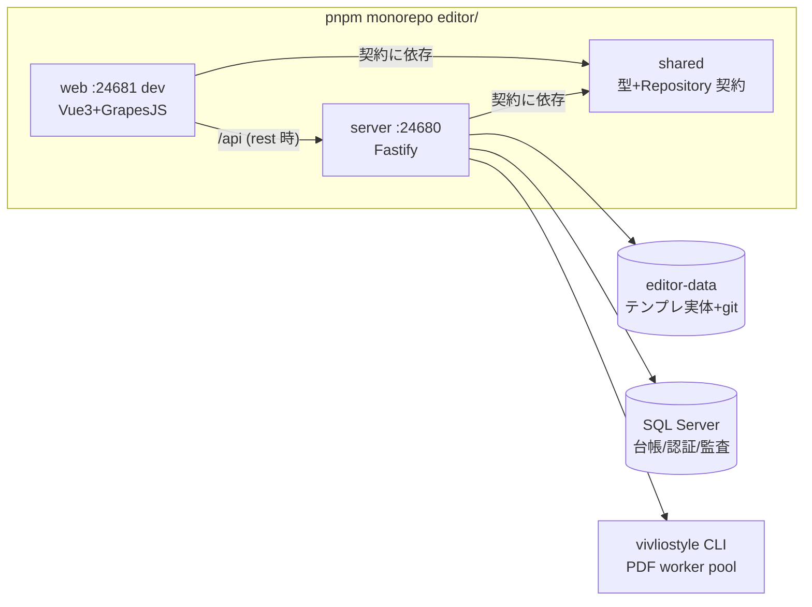

editor の構造・不変則を触る前に読む要約版。詳細の一次資料は `editor/README.md`・
`docs/editor/src/設計書.md`（v2.3）。**編集 2 系統の原則の正典は本書「中核原則」節**
（要点を本書が保持し、詳細・退行事例の経緯は設計書 7.1 章へ委譲する）。

## 全体像

<!-- ノードラベルは短い 2 行構成に保つ。長い行は Mermaid が CJK 幅を過小計算し枠外へ見切れる。 -->

- ポートは **server=24680 / Vite dev=24681** で固定。起動は `editor/start.bat`（引数順不同:
  `dev`/`prod` × `local`/`rest` × `lan`）。`rest` は SQL Server + 認証必須、`rest lan` は
  `HOST=0.0.0.0` + HTTPS（PFX 方式・`HTTPS=true` opt-in。無証明書時は HTTP +
  `COOKIE_SECURE=false` フォールバック）。
- テンプレ実体はリポジトリ**外**の `dataRoot`（既定 `../../editor-data`。ネスト git 回避、
  初期化は `editor/scripts/init-data-repo.bat`）。**本体=ファイル/git、DB=台帳**が基本方針。

## モジュール構成

| モジュール | 責務 |
|---|---|
| `shared/src/schemas.ts` | ドメイン型の正典（Zod。TS 型は `z.infer` 導出、実行時検証・OpenAPI と共用） |
| `shared/src/repositories/` | Repository 契約 7 種（Auth/Template/History/Part/User/Note/Review）。全メソッド `Result<T>` |
| `web/src/api/repositories.ts` | local（fixtures+localStorage）⇄ rest の**唯一の差し替え点**（`VITE_API_MODE`） |
| `web/src/lib/jinjaMask.ts` | Jinja タグ保護の核心（`toEditable` mask ⇄ `toTemplate` restore・pretty 整形はマスク段階） |
| `web/src/features/editor/` | GrapesJS 3 ペイン編集（`useGrapes` / `useTemplateEditor` / `services/templateEditorService.ts`） |
| `web/src/features/preview/` | vivliostyle ブラウザ内組版・PDF 出力・確定保存申請（`PreviewView`） |
| `web/src/workers/` | linkedom+comlink Worker（diff/toFilled 等）。不達時は main-thread へ恒久フォールバック |
| `server/src/routes/` | Fastify ルート 9 本 + openapi。保存は申請→承認ゲート（`reviews.routes.ts`） |
| `server/src/db/` | sproc ゲートウェイ（6 本・第 1 引数 `@操作` 分岐）。`msnodesqlv8` は `pool.ts` に隔離 |
| `server/src/vivliostyle/` | PDF build（常駐 worker pool）+ preview proxy。`@vivliostyle/cli` の唯一の駆動点 |
| `server/src/sync/` | 交付版⇄全体版 パーツ自動同期（純関数エンジン `partSync.ts` + 承認直後の I/O 編成 `pairSyncService.ts`） |
| `server/src/config.ts` | 設定の一元解決（default < `appconfig.json` < env）。port/host/tls/dataRoot/auth |

## 中核原則

- **編集 2 系統**（根幹。詳細は設計書 7.1 章）: 編集タブ = `tpl.filled`（per-fund 実値）+
  ハイライト**無し** / 作成タブ = `toFilled(tpl.html, 共通sample)` + ハイライト**有り**。
  経路判定は `route.query.created === '1'` のみ。
- `toFilled` は**テキストノードのみ**差込（属性内 Jinja は round-trip 保持のため非差込）。ゆえに
  データ連動チャート（Jinja 属性で座標を出す SVG/CSS）はテンプレに入れない。
- 画面は Repository **契約**にのみ依存。local/rest の実装差し替えで画面コードは無改修。
- 確定保存は**申請 → 承認**の 2 段階ゲート。実ファイル + git 反映は `applyConfirmedSave` が
  唯一の関所（自己承認拒否・却下理由必須・監査ログ）。
- エラーは throw でなく `Result`/`AppError`（7 種 kind・message は日本語でユーザー表示可能）。
- **交付版⇄全体版 パーツ自動同期**: 承認の完結後に `pairSyncService` がベストエフォートで
  ペア版種のテンプレへパーツ単位の変更を転写する（失敗しても承認は成立）。ポリシーの正典は
  **パーツカタログ台帳の `同期既定` 列のみ**（`同期`/`非同期`/`交付版のみ`/`全体版のみ`/NULL=
  未判断。ペア個別オーバーライドは持たない）。実行状態（`lastSynced`・競合）は
  `dataRoot/sync/<pairKey>.json`（git 管理**内**）。自動で書くのは「同期既定=`同期` かつ
  前回同期以降 source だけが変わった」パーツの転写のみで、削除・初期差分・両側変更（競合）・
  挿入位置不明はスキップして人間に返す。転写は生テキストの span 置換（DOM round-trip 禁止 =
  非対象パーツは byte 不変）。対象は `data-part-id` 付きパーツのみ（カタログ外パーツは
  常に対象外。同期させたいパーツは `data-part-id` 付与 + カタログ登録で昇格する）。
- **vivliostyle build/preview API は外部公開面**: `POST /api/build`（inline）・
  `POST /api/build/project`（zip）・`/api/preview` 一式（+ `/api/openapi.json`・`/api/health`）は
  外部クライアントが直接叩く公開 API であり、web UI から無参照でも**デッドコード扱いしない**
  （依存 `node-stream-zip` 等も同様。仕様は `/api/docs` の OpenAPI が正）。

## してはならないこと・却下済み設計（再提案しない）

- **素の `.jinja-chip.jinja-var` に `background` 直書き**: 編集タブへハイライトが漏れる
  （過去の `aa9bd65` 退行）。出し分けは body の `jinja-vars-highlight` クラス経由のみ。
- **filled/サンプルの全ファンド共通ダミー化**: 編集タブが実値を失う（過去の `42938a0` 退行）。
  per-fund 実値は `web/src/api/fixtures/sample/<fund>.json` が正典。
  以上 2 点 + 経路判定は `web/test/twoSystems.guard.test.ts` が機械検証する。
- **Prettier での出力整形**: 数 MB + Jinja 破壊リスクで不採用。js-beautify を
  `jinjaMask.toTemplate` のマスク段階（placeholder 退避後・decode 前）で使う。
  生 Jinja HTML へ直接整形をかけるのは厳禁。
- **Immer / diffDOM / mitt**: 評価の末見送り（状態ネストが浅い・語句単位 LCS 着色が後退・
  複数購読需要が未顕在）。再評価はその条件が立った時のみ。
- **DB sproc ゲートウェイ外の直接 SQL / 承認申請の DB 化**: しない。申請はファイル方式
  （`dataRoot/reviews/`）が「本体=ファイル/git」と整合しオフラインでも動く。
- **パーツ同期のペア個別オーバーライド / 実行状態（sync JSON）の DB 化**: しない（2026-08
  設計判断）。ポリシーはカタログ台帳の `同期既定` 列に一本化（特定ファンドだけ止めたい実例が
  出たら sync JSON へ `excluded` を後付けする）。`lastSynced` はファイル内容に従属する状態で、
  DB に置くと dataRoot の git 巻き戻しと乖離して偽競合・誤上書きを生む。同期時の DOM
  round-trip（linkedom 等での再直列化）も不可 — 非対象パーツまで再整形され差分が出る。
- **dataRoot のリポジトリ内回帰**: しない（ネスト git・`init-data-repo` の設計前提が崩れる）。
- **UI/UX 見送り項目（2026-07）**: 右クリックメニュー / レスポンシブ 3 ペイン / determinate
  progress / Edge アプリのダーク対応は意図的見送り。再提案前に理由を確認する。

## 触る前のチェックリスト

1. 2 系統の関連ファイル（`useGrapes` / `jinjaComponents` / `useTemplateEditor` /
   `templateEditorService` / `sampleCommon` / `genFilled` 等）を触る? → 本書「中核原則」と
   設計書 7.1 章を再読し、`twoSystems.guard.test.ts` を含む `pnpm test` を通す。
2. 型チェックは **`@editor/shared` の先行ビルドが前提**（`tsc -b editor/server`）。飛ばすと
   web/server の型解決が壊れる（`pnpm typecheck` は先行ビルド込み）。
3. カバレッジは **include 列挙 = テスト済みのみ・全指標 85% 閾値**。新規ファイルをテストしたら
   include へ追加する（正典は `editor/README.md`）。
4. CI 集約は `pnpm ci`（`check:comments → check:ci → typecheck → test:coverage → build →
   test:e2e`）。e2e の `capture_docs.spec.ts` は `docs/editor/images/` を再撮影して byte 差分を
   作るため、差分は「再撮影」としてコミットする。
5. `editor/**` を変更したコミット前は `pnpm exec biome check --write editor/<対象>` を先行実行
   （lint-staged のステージ入れ替わり事故の回避）。
