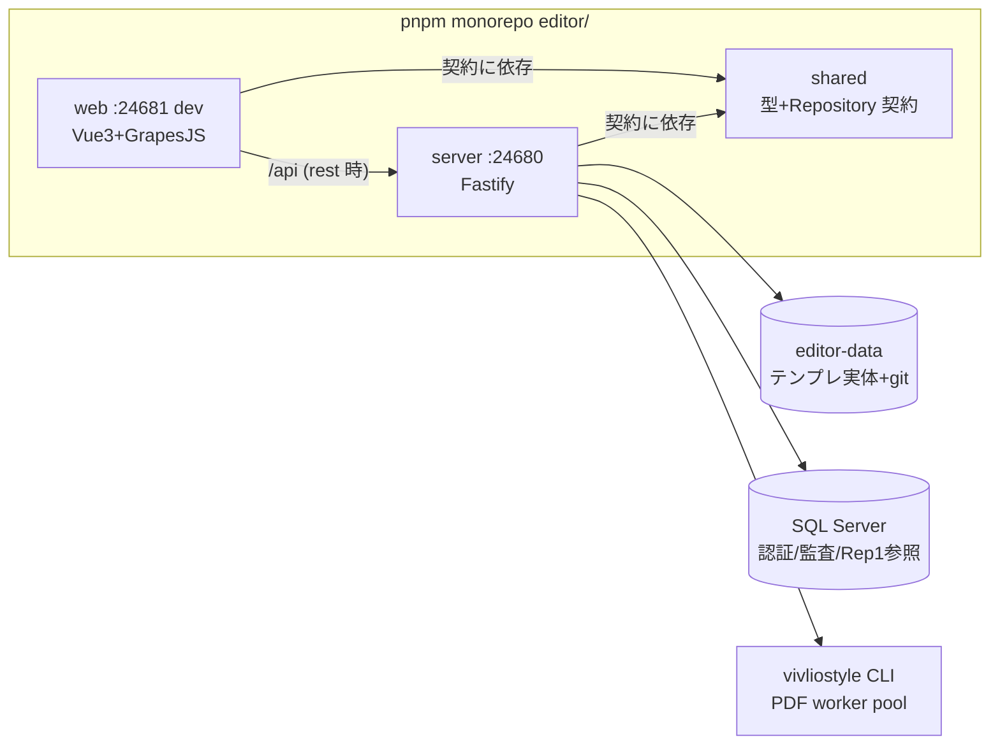

editor の構造・不変則を触る前に読む要約版。詳細の一次資料は `editor/README.md`・
`docs/editor/src/設計書.md`（v2.4）。**編集 2 系統の原則の正典は本書「中核原則」節**
（要点を本書が保持し、詳細・退行事例の経緯は設計書 6.1 節へ委譲する）。

## 全体像

<!-- ノードラベルは短い 2 行構成に保つ。長い行は Mermaid が CJK 幅を過小計算し枠外へ見切れる。 -->

```mermaid
flowchart LR
  subgraph MONO["pnpm monorepo editor/"]
    SH["shared<br/>型+Repository 契約"]
    WEB["web :24681 dev<br/>Vue3+GrapesJS"]
    SRV["server :24680<br/>Fastify"]
  end
  WEB -->|"契約に依存"| SH
  SRV -->|"契約に依存"| SH
  WEB -->|"/api (rest 時)"| SRV
  SRV --> DATA[("editor-data<br/>テンプレ実体+git")]
  SRV --> DB[("SQL Server<br/>認証/監査/Rep1参照")]
  SRV --> PDF["vivliostyle CLI<br/>PDF worker pool"]
```

- ポートは **server=24680 / Vite dev=24681** で固定。起動は `editor/start.bat`（引数順不同:
  `dev`/`prod` × `rest`（既定）/`local` × `lan`）。`rest` は SQL Server + 認証必須、`rest lan` は
  `HOST=0.0.0.0` + HTTPS（PFX 方式・`HTTPS=true` opt-in。無証明書時は HTTP +
  `COOKIE_SECURE=false` フォールバック）。
- テンプレ実体はリポジトリ**外**の `dataRoot`（既定 `../../editor-data`。ネスト git 回避、
  初期化は `editor/scripts/init-data-repo.bat`）。**本体=ファイル/git、DB=認証・監査・カタログと
  ファンド属性の参照**が基本方針。テンプレートの一覧・作成済みの判定はファイルで行い、DB の台帳は
  持たない。作成タブの会社・ファンド・シリーズは、同じサーバの `Rep1` を usrap の sproc から
  3 部名で読む（直接 SQL はしない）。ファイル名の会社コードは `Rep1` の委託会社略称。

## モジュール構成

| モジュール | 責務 |
|---|---|
| `shared/src/schemas.ts` | ドメイン型の正典（Zod。TS 型は `z.infer` 導出、実行時検証・OpenAPI と共用） |
| `shared/src/repositories/` | Repository 契約 7 種（Auth/Template/History/Part/User/Note/Review）。全メソッド `Result<T>` |
| `web/src/api/repositories.ts` | rest（既定）⇄ local（fixtures+localStorage、開発用）の**唯一の差し替え点**（`VITE_API_MODE`） |
| `web/src/lib/jinjaMask.ts` | Jinja タグ保護の核心（`toFilled`（`fillJinja.ts`）⇄ `toTemplate` restore・pretty 整形はマスク段階） |
| `web/src/lib/jinjaLex.ts` / `htmlScan.ts` / `fillAnalysis.ts` | 往復の判断の土台（字句解析・HTML 構造の走査・固める要素の決定）。字句解析の本体は `shared/src/jinja/jinjaLex.ts` の `lexJinja` 1 つで、web は再輸出とブロック木を持つ |
| `web/src/features/editor/` | GrapesJS 3 ペイン編集（`useGrapes` / `useTemplateEditor` / `services/templateEditorService.ts`） |
| `web/src/features/preview/` | vivliostyle ブラウザ内組版・PDF 出力・確定保存申請（`PreviewView`） |
| `web/src/workers/` | linkedom+comlink Worker（diff/toFilled 等）。不達時は main-thread へ恒久フォールバック |
| `server/src/routes/` | Fastify ルート 10 本 + openapi。保存は申請→承認ゲート（`reviews.routes.ts`） |
| `server/src/db/` | sproc ゲートウェイ（8 本・第 1 引数 `@操作` 分岐。`テンプレート` / `シリーズ` は `Rep1` を参照）。`msnodesqlv8` は `pool.ts` に隔離 |
| `server/src/vivliostyle/` | PDF build（常駐 worker pool）+ preview proxy。`@vivliostyle/cli` の唯一の駆動点 |
| `server/src/sync/` | パーツ自動反映 2 種（ペア同期 = 純関数エンジン `partSync.ts` + I/O 編成 `pairSyncService.ts` / 注記マスタ書き戻し・生成時適用 = `noteMasterService.ts`） |
| `server/src/config.ts` | 設定の一元解決（default < `appconfig.json` < env）。port/host/tls/dataRoot/auth |

## 中核原則

- **編集 2 系統**（根幹。詳細は設計書 6.1 節）: 編集タブ = `tpl.filled`（per-fund 実値）+
  ハイライト**無し** / 作成タブ = `toFilled(tpl.html, 共通sample)` + ハイライト**有り**。
  経路判定は `route.query.created === '1'` のみ。rest の `tpl.filled` は dataRoot
  `filled/<id>.html`（別ツールが置く値入り HTML。値は差込済みで、往復用の印は持たない）。承認は
  申請の `origin` で `filled/`（edit）と `templates/`（create）を書き分け、値入り HTML はプレビュー・比較・結合 PDF でも nunjucks を通さない。
  `status:'draft'`（pending だけの id）は作成経路（`?created=1`）で開く。`created` query を
  出す規則は `features/templates/editorRoute.ts` の `editorRoute`、pending の判定は同ファイルの
  `opensAsCreate` で、一覧・承認タブ・プレビューの戻る導線が共用する。編集経路（`origin='edit'`）
  の申請・承認は `filled/<id>.html` の存在を要求する（server `assertFilledPresentForEdit`、
  local `assertEditSubmissionAllowed`）。後者は内部で `resolveFilled` を引くほか、
  本文が空の申請も拒否する（空文字を「filled 無し」の印に使うための local 限定の規則で、
  server 側に対応は無い）。local の値入り HTML の有無は `resolveFilled`（`filledOverride` →
  作成承認済みなら無し → fixture）で決める。作成承認後に旧 `filled/` が残る rest とは意図的に
  違う（local は別ツールの配置運用を持たない）。
- **ID の 2 つの形**: 値入り HTML（`filled/`）は基準日ごとに別物なので `会社_ファンド_基準日_版種`、
  テンプレート（`templates/`）は基準日で使い回さないので `会社_ファンド_版種` で、区切りの数で見分ける
  （`shared/src/domain/template.ts`。`parseTemplateFileName` / `parseSkeletonFileName` /
  `parseAnyTemplateFileName`）。`templates/` は 3 つ区切りだけ、`filled/` は 4 つ区切りだけ、
  `pending/`・下書き・メモ・申請・作成履歴はどちらの形も受け、形はパスを組み立てる関数が強制する。
  `templates/` に残った 4 つ区切りは作成済み・コピー元・一覧に数えない。版の一覧（`filled/` の git
  履歴）は 3 つ区切りに空を返す。作成済みのテンプレートは作成タブから作成経路（`?created=1`）で開き、
  申請 → 承認で上書きする。生成は作成済み・承認待ちの作成申請・同意の無い作業中（下書きか
  `pending/`）を 409 で止め、下書きと `pending/` は生成器が成功した後に捨てる（コメントとパーツ変更
  履歴は残す）。作り直した id の同じタブの編集状態（Undo と下書きの持ち主）も捨てる。
- `toFilled` の値の差込は、固めていない要素ではテキストの位置だけ。属性値の中の Jinja は原文のまま
  残し、チップにも値にもしない。固めた要素（下記）は表示用に属性値の中まで値を入れて描くが、保存では
  常に原文へ戻す。ゆえにデータ連動チャート（Jinja 属性で座標を出す SVG/CSS）は、固められない限り
  作成タブで値の入った形に見えないので、テンプレに入れない。
- **作成タブの往復は、判断を原文の位置で 1 回だけ行う**: `toFilled` は原文を `lexJinja`
  （`shared/src/jinja/jinjaLex.ts`。関所と共用する唯一の字句解析）でトークンに切り、`htmlScan.ts` で
  HTML の構造を読み、`fillAnalysis.ts` で印を置ける位置と固める要素を決めてから値入り HTML を書く。
  - ブロックの範囲は HTML コメントの印（`<!--jinja-rt:o:…-->` と `<!--jinja-rt:c:…-->`）で表し、
    採用した枝の前後の原文を印に持たせる。採用した枝への編集はその枝へ書き戻し、他の枝は原文のまま
    保つ。for の 2 回目以降の繰り返しは `<!--jinja-rt:x:…-->` の後ろに並ぶ表示専用の写しで、保存時に
    捨てる。表・`select` の文脈に置かれた範囲を持たない文と Jinja コメント（``・`{# … #}`）は
    `<!--jinja-rt:t:<base64>-->` で表す（チップを置けない位置でもコメントは動かない）。
  - 印を置けない位置（表の行の間の値・SVG の中・本文中の `<style>` 等）は、それを含む最小の安全な
    要素を固める（値入りで見せ、保存は原文）。表の中で固めた範囲は `div.jinja-frozen-body`
    （`display: contents`）で包み、表の外へ追い出されたテキストもこの div の中に留める。固めた SVG の
    子孫は SVG の名前空間で描く部品型（`jinja-frozen-svg-in`）にする。
  - `toFilled` は自分の出力を `toTemplate` で戻して原文と比べ（自己検査）、食い違えば本文全体を
    固める。比べるときは `normalizeForRoundTrip` で、GrapesJS が捨てる空白を同じ規則で捨て、テキスト
    位置の Jinja をコメントへ置き換えて位置を固定し、属性の順序を揃える。
    - 既知の限界: Worker で走る自己検査は linkedom で読む（Worker にはブラウザの DOM が無い）。表の中身の
      追い出し（foster parenting）などブラウザだけで起きる崩れは自己検査では見つからず、保存時の `toTemplate`
      の検査（ブラウザの DOM で読む）が例外にして受け止める。
  - キャンバスの読み込みは、本文の断片を `parse:html:before` で `<body>` に包んでから解析させる。
    包まないと、先頭の要素より前のコメント（ブロックの開きの印）がブラウザの構文規則で body の外へ出て
    消える。
  - `toTemplate` は断片を文書（`asDocument`）に包んでから解析し、戻した結果のブロックの対応と編集用の
    印の残りを検査し、崩れていれば例外にする。server と web local も、作成・編集の両経路の申請本文と
    確定書込（server `confirmedWrite` / local `putContentOverrides`）で同じ印を 400 で拒否する（定義は
    `shared/src/security/editingMarkers.ts` の `findEditingMarkers` 1 つ。原文をブラウザと同じ規則で
    読む走査に、`lexJinja` と最短一致の 2 通りの区切りで Jinja を空白・`J` で伏せた写しの走査を足し、
    伏せた写しはコメントの中まで読む走査も掛け、どれかで見つかれば印とする）。
    - 既知の限界: 関所が調べるのは原文で、描画結果ではない（描画結果はサンプル・ファンドの値しだいで形が変わるので、関所の判定を値に依存させない）。Jinja でタグ名や属性をつなぎ合わせた形
      （`<{{ "span" }} data-jinja>`）は `J` で伏せた写しの走査で見つかるが、印をまるごと Jinja の式で
      組み立てた形（`{{ "" }}`）は見つからない。
    - 範囲の印の開きと閉じを両方消すと（文字編集で印をまたいで消した場合など）、そのブロックは採用した枝の
      中身だけを残した地の本文として保存され、例外にはならない。作成経路の申請の確認（`PreviewView.vue` の
      `submitForReview`）は、元のテンプレートと申請する本文の、閉じを持つ Jinja のブロックの開きの数
      （`jinjaLex.ts` の `countJinjaBlockOpens`。`if` `for` `raw` `verbatim` と中身を木にしないブロック）を比べ、
      減っていれば確認の説明に「元のテンプレートより Jinja のブロック（ など）が N 個少なくなっています。
      意図した削除でなければ、申請せずに編集画面で確かめてください。」を足す（申請は続けられる。どちらかが字句
      として読めなければ足さない）。編集経路は値入り本文で `toTemplate` を通らないので比べない。承認画面の差分
      でも Jinja の消失として見える。
  - 編集タブの値入り HTML は印を持たない。本番の `filled/` も local の fixture（`genFilled.ts` が
    `renderPlainFilled` で作る）も同じ。`toFilled` は作成タブ専用。
  - 旧形式の印（要素の属性で持つ `data-jinja-open` 等）は読まない。旧形式の下書きは編集画面を開いた
    ときに破棄してトーストで知らせ、確定版から開き直す（`legacyDraft.ts` の `isLegacyDraft`）。
    作成経路の下書きは旧形式の属性が 1 個でもあれば、編集タブの下書きは編集用の印が 1 個でもあれば
    旧形式とみなす（編集タブの本文は印を持たないため）。
  - ループの行の枠（琥珀色の点線、`#f59e0b`）と、固めた要素の枠（灰色の点線、レイヤー名
    「編集不可（Jinja）」）は、どちらも `.jinja-vars-highlight` の配下にだけ書き、作成タブにだけ出す。
- 画面は Repository **契約**にのみ依存。local/rest の実装差し替えで画面コードは無改修。
- 確定保存は**申請 → 承認**の 2 段階ゲート。実ファイル + git 反映は `applyConfirmedWrite` が
  唯一の関所（自己承認拒否・却下理由必須・監査ログ）。
  同じ申請者・同じテンプレ（大文字小文字を区別しない）・同じ経路（`origin`）・同じ本文（HTML と CSS の
  完全一致）の承認待ちが既にあれば、新しい申請を作らず 409（`code: 'REVIEW_DUPLICATE'`）で返す
  （二重クリック・再送。`filledHtml`・`cssBaseline`・`changedSummary` は本文の付随物なので照合しない）。
  server と web local で同じ規則・同じ code・同じ文言にする。server は重複の検査から件数上限の検査を
  経て `writeReview` までを申請専用の鎖（`reviewRepo.ts` の `withSubmitLock`）で直列化する。重複を
  上限より先に見るのは、上限ちょうどでの二重クリックを「上限」ではなく「重複」として返すため。承認の鎖（`withReviewLock`）と
  分けるのは、承認が git コミットを含んで遅く、申請をその後ろで待たせないため。照合は候補のメタを
  絞ってから本文を読んで hash で比べ（`reviewFiles.ts` の `findDuplicatePendingReview`。hash はメタに
  保存しない）、本文を読めない申請は判定から外す（壊れた 1 件のせいで同じ人がそのテンプレへ申請
  できなくなるのを避ける。その申請自体は承認時に止まる。ファイルが無い以外の失敗は警告ログに残す）。印の検査など入口の検査の後ろに置くので、
  入口で拒まれる申請は重複かどうかを見る前に止まる。web はこの 409 を受けたら、成功と同じく編集
  セッションを片付ける（同じ内容が既に承認待ちに載っているため）。
- エラーは throw でなく `Result`/`AppError`（7 種 kind・message は日本語でユーザー表示可能）。
- **交付版⇄全体版 パーツ自動同期**: 承認の完結後に `pairSyncService` がベストエフォートで
  ペア版種のテンプレへパーツ単位の変更を転写する（失敗しても承認は成立）。ポリシーの正典は
  **パーツカタログ台帳の `同期既定` 列のみ**（`同期`/`非同期`/`交付版のみ`/`全体版のみ`/NULL=
  未判断。ペア個別オーバーライドは持たない）。実行状態（`lastSynced`・競合）は
  `dataRoot/sync/<pairKey>.json`（git 管理**内**。`pairKey` はテンプレートが `会社_ファンド`、値入り HTML が
  `会社_ファンド_基準日`）。自動で書くのは「同期既定=`同期` かつ
  前回同期以降 source だけが変わった」パーツの転写のみで、削除・初期差分・両側変更（競合）・
  挿入位置不明はスキップして人間に返す。ペア側で削除したパーツ（同期したことがある = `lastSynced`
  を持つもの）は source にあっても戻さず、source が前回同期から変わっていなければ競合「ペア側削除」、
  変わっていれば「ペア側削除・ソース変更」として記録する（`lastSynced` は据え置く）。同期したことの
  無いパーツがペア側に無いのは「まだ写していない」だけなので、今までどおり挿入する。状態ファイルは
  ペアで 1 つで、バナーは両方の版の編集画面に出るため、「ペア側」という言い方は見る画面で指す側が
  変わる。そこで競合にパーツを消した側の版種（`deletedIn`）を持たせ、バナーは
  `p-123#1〔全体版で削除〕`・`p-123#1〔全体版で削除・交付版で変更〕` のように版種で書く
  （`web/src/lib/pairSyncText.ts`。`deletedIn` の無い記録は `〔種類〕` へ倒す）。両方の版から消えれば
  状態から消え、ペア側に同じ内容で戻せば同期済みになり、別の内容で戻せば「両側変更」へ移る。
  転写は生テキストの span 置換（DOM round-trip 禁止 =
  非対象パーツは byte 不変）。対象は `data-part-id` 付きパーツのみ（カタログ外パーツは
  常に対象外。同期させたいパーツは `data-part-id` 付与 + カタログ登録で昇格する）。
  CSS はテンプレ単位（`<会社>_<ファンド>_<版種>.css`）なので、ペアの CSS 2 枚（`…_交付版.css` ⇔
  `…_全体版.css`）も転写の対象になる。変更の検出は GrapesJS の書き出し形どうしで行う: web は確定版を
  canvas に読み込んだ直後の `getCss` を `cssBaseline` として申請に載せ（`sessionStorage` にも置く）、
  `shared/src/css/cssRules.ts` の `mergeCssRuleChangesFromBaseline` が `cssBaseline` → 申請の CSS で
  変わった規則（追加・変更・削除）だけを取り出す。ペア側の同じ規則が承認前のファイル（原文）と同じなら
  当て、違えば（版種固有に直してある）競合として飛ばす（外部ツールの原文と GrapesJS の書き直し形を直に
  比べると、編集していない規則まで変わって見えるため、検出と照合で物差しを分ける）。規則のキーは
  セレクタ規則が囲む at-rule の並び + 正規化セレクタ、`@page` 系が前置き、`@font-face` が
  `font-family` + `font-weight` + `font-style` で、比較は書式の違いを除いて行う（`sameCssRule`）。
  同じキーの重複規則は 1 つの規則として識別し、宣言が空の出現を外して前から出現ごとに比べて当てる
  （GrapesJS は重複を別々の規則のまま持つ）。ペア側の出現の形が原文と違えば（宣言の配り方を変えた・
  1 本にまとめた等）、対応が取れないので競合にする。
  競合はテンプレのペアキー（`cssSyncPairKey`。`会社_ファンド`）の同期状態ファイルの `css` 欄に記録し、
  本文の競合と同じバナーに出す（`getPairSyncStatus` の `cssConflicts`）。競合が消えるのは、両版の規則が
  一致したとき（両版ともエディタの書き出し形になったとき）。CSS の転写は承認 1 回につき 1 回で、本文の
  ペア同期が動く承認のときだけ動く。`cssBaseline` の無い申請（公開 API・`cssBaseline` を持たない申請）と、
  承認前の CSS を読めないときは CSS の転写だけを飛ばしてログに残す（承認は成立し、本文の同期は続ける）。
  下書きがあるのに `cssBaseline` が無いまま申請画面を開くと、「このまま申請するとペアの版種へ CSS が
  写りません。編集画面から開き直してください」の注意帯を出す。保存・申請・`cssBaseline` の CSS は
  `getCss({ keepUnusedStyles: true })` で書き出す（CSS は基準日をまたいで共有するので、ある文書で未使用の
  規則も消さない。承認後の CSS ファイルは全規則が GrapesJS の書き出し形になる）。`confirmedWrite` の
  `pair-sync` が CSS を書けるのはこのためで、型で CSS の書き込みを塞がないのは、交付版と全体版が別ファイルに
  なり、承認した側だけが直ると版種間で見た目がずれるため。規則への分割は既存の字句走査（`walkCss`）の
  上に組み、依存を足さない。
  - **規則のキーの正規化**（`cssRules.ts` の `canonicalSelector` ほか）: GrapesJS はセレクタと media の
    文字列をブラウザの CSSOM（`selectorText` / `mediaText`）から取り、ブラウザは `.a>.b` を `.a > .b`、
    `:before` を `::before` のように書き直す。原文の書き方しだいでキーが割れないよう、キーを作るときに
    次をそろえる。セレクタでは、コメントを空文字にし、空白の連続を 1 つにし、結合子（`>` `+` `~`）と `,`
    の前後・`(` の直後・`)` の直前の空白を消し、旧式の擬似要素 4 つ（`:before` `:after` `:first-line`
    `:first-letter`）を `::` にし、型セレクタ・擬似クラスと擬似要素の名前・属性名を小文字にし、
    `:nth-child` 系 4 つの引数（An+B）を Chromium の書き出し形（`even` → `2n`、`odd` → `2n+1`、`+5` → `5`、
    `0n+1` → `1`、`1n` → `n`）にする。at-rule の前置きでは、名前を小文字にし、コメントを空白にし、
    `@media` は文字列の外を全部小文字にし、`@media` `@supports` `@container` の `:` の後ろと括弧の内側の
    空白を消し（`@media(…)` は `@media (…)`）、`@page` はページセレクタを空白 1 つで続けた形
    （`@page :first`）にする。クラス名・id・属性値・文字列の中身・エスケープした文字・`@container` と
    `@layer` の名前の大文字小文字は区別したまま残す（別の規則を同じキーに畳まない）。規則の本文
    （`text`）は原文のまま。
  - **セレクタの並び（`.a, .b{…}`）は照合のときだけ 1 セレクタずつに展開する**: GrapesJS はクラスだけ
    （または id だけ）の並びを 1 セレクタ 1 規則に分けて持つので、照合の経路（`foldedCssRuleTexts`・
    `mergeCssRuleChanges`・`mergeCssRuleChangesFromBaseline`）では原文側も含む 4 つの CSS すべてを展開した
    「見かけの規則」で突き合わせる（公開の `splitCssRules` は展開しない）。ペア側への書き戻しは物理の規則
    ごとにセレクタごとの結果を集めて 1 つにまとめる。全部消えれば規則ごと消し、全部が同じ新しい本文なら
    並びのまま本文だけ置き換え、片方だけ変わった・消えたときは元の規則の位置で 1 セレクタずつに分割する
    （カスケードの順は変わらない。セレクタは原文の書き方を残す）。`:is(.a, .b)` のような括弧の中の `,` は
    展開せず、並びの中に正規化後に同じキーになるセレクタが 2 つ以上ある規則も展開しない（下の照合不可に
    なる）。
  - **照合不可**: 正規化と展開をしても、`cssBaseline` にあるのに承認前の原文に無いキーは残りうる。その
    規則の変更は、ペア側の同じ規則を引けないので当てられず、削除は「ペア側に無い = もう消えている」と
    取り違えて黙って残す。そこで、このキーは変更でも削除でも競合 `kind: '照合不可'`（転写元の版種
    `sourceEdition` 付き）として記録する（`CssMergeResult.unmatched`）。同じ向きの承認では、ペア側に
    そのキーが無い間は残す。解消するのは、ペア側も編集画面を通して承認され、両版のキーがそろったとき
    （以後は普通の競合と同じ判定）。バナーは `書式 .a〔照合不可〕` と出し、末尾に「照合不可の書式は、
    ペアの CSS が編集画面を通っていない書き方のため写せませんでした。ペアも編集画面で開いて申請・承認
    すると、次から照合できます。」を足す。承認直後の通知は件数だけで、種類は見せない。
  - **古い競合のキーの読み替え**: 同期状態ファイルの `css.conflicts[].ruleKey` は前の正規化のキーで
    残っていることがある。`computeCssSync` は、記録のキーが両版のどちらかに今のキーとしてあればそのまま
    使い、無いときだけ `canonicalCssRuleKeys` で読み替える（読み替えが冪等でない形、たとえば大文字の
    at-keyword の文を変えてしまうと、どちらの版にも無いキーになって「両版に無い = 解消」で黙って消える
    ため）。並びのキーは 1 セレクタずつに分かれ、各件が元の `detectedAt` を引き継ぐ。
    - 移行期の注記: 前の正規化はコメントを空白にしていたので、セレクタの中にコメントを書いた規則の古い
      競合は読み替えで戻せず、次の承認で消えることがある。読み替えは承認のときに行うので、承認が
      1 回通るまでは状態 API（バナー）に古い形のキー（`.a,.b` を 1 件）が出ることがある。承認が 1 回通れば
      読み替えが済み、以後は出ない。
  - **検証**: GrapesJS は `0.23.6` に固定する（`editor/web/package.json`。書き出し形が版で変わりうるため）。
    `web/test/cssRuleKeys.corpus.dom.test.ts`（jsdom）は GrapesJS 自身の書き直し（並びの分割・宣言の展開・
    空の規則の省略）を、`e2e/css_rule_keys.spec.ts`（Chromium）はブラウザの書き直しを、同じコーパス
    （`shared/test/fixtures/cssRuleKeysCorpus.ts`。fixture の CSS 8 本と合成ケース）で確かめ、
    「`getCss` 側の全キーが原文側にある」を固定する。吸収すると別の規則を畳む食い違いは
    `KNOWN_UNMATCHED` に載せ、照合不可になることを確かめる。どちらも冒頭で版を確かめ、上げたら
    コーパスと見積もりを取り直す。jsdom はブラウザの書き直しをしないので、dom テストだけでは足りない。
  - **既存データの見積もり**（手動・読み取り専用）: `web/test/cssKeyEstimate.manual.dom.test.ts` は、
    環境変数 `CSS_KEY_ESTIMATE_DIR`（`<dataRoot>/css` の**コピー**）があるときだけ走り、ファイルごとに
    照合不可になりうる規則の数・展開した並びの数と、ペアごとの重複の疑い（黙って追記された跡）を表に出す。
    `CSS_KEY_ESTIMATE_OUT` があれば JSON も書く。入力が本物の data ルート（`DATA_ROOT` と
    サーバ既定の data ルート）の配下なら止める。出力先が data ルートか入力フォルダの配下、または既存の
    ファイルでも止める（`appconfig.json` の `paths.dataRoot` で
    移した場所は検出できない）。起動は
    `CSS_KEY_ESTIMATE_DIR=<コピー先> pnpm exec vitest run --project web-dom editor/web/test/cssKeyEstimate.manual.dom.test.ts`。
    jsdom の制約で数は下限として読む。
- **パーツコメントは 1 段の入れ子スレッドで、版インスタンスごとに独立する**: コメントは
  `dataRoot/notes/<templateId>.json` に `pathKey → 投稿配列` で持ち、読み書きとも自版に閉じる
  (`pathKey` はページを含まない文書全体での `<アンカー>#<通し番号>`。改ページの項)
  (交付版⇄全体版のペアでも共有しない。基準日をまたぐ繰り越しもしない)。投稿は `status`
  (open / resolved)・`replyTo`(親投稿 id。null なら親)を持つ(種別は持たない。コメントは
  メモ 1 種類)。返信は同じパーツの
  親投稿にだけ付く(返信への返信は不可)。状態の切替は親にだけ許し、返信へ伝播する。親の削除は
  返信を道連れにする。上限は「ファイル 4MB」「`pathKey` 1000 件」「1 パーツ 200 投稿(返信を
  含む)」の 3 段で、件数上限だけではサイズを守れない(1 パーツでファイル上限に達すると、
  そのテンプレの全コメントが保存不能になる)。2 属性を持たない投稿は読み取り時に既定値
  (open / null)を補って読み、`pathKey` の値が配列でなければ読み捨てる。
- **コメントの一覧は右ペイン、スレッドの表示はキャンバスの吹き出し**: 右ペインは
  「プロパティ | コメント」の切替を持ち、コメント側(`features/editor/comments/CommentPanel.vue`)
  はテンプレート全体のコメントを一覧にする(検索 = 本文・投稿者 / 絞り込み = 状態・
  投稿者・選択パーツ / 並び = 更新順・パーツ順。規則は `commentFilter.ts` の純関数)。
  新規投稿の入口は一覧の上の入力欄 1 つ(選択パーツ宛)で、返信・解決・編集・削除はスレッドに
  属する操作として吹き出しと一覧の行展開の両方に置く。一覧の行クリックはそのパーツを
  `selectPartByKey` で選択して canvas をスクロールする。吹き出しは選択しただけでは開かず、
  マーカーのクリック・一覧の行クリック・投稿の追加で開く(選択が変われば閉じる)。開いたときは
  吹き出しは**常にページへ重ねて出す**(表計算ソフトのセルコメントと同じ挙動)。左右どちらへ
  出すかは、吹き出しが帳票の上に重なる量が少ない側で選ぶ。**ページの大きさ・倍率は変えない**
  — ページの見えは PDF の見えと一致している必要があり、注釈の都合で本体を縮めない。配置計算は
  `web/src/features/editor/noteBubbleLayout.ts` の純関数。マーカーは未対応の親投稿があれば
  琥珀、全部解決済みなら灰色。
- **注記マスタ書き戻し + 生成時適用**（次回作成テンプレへの反映）: 承認の完結後に
  `noteMasterService` が `次回反映既定`=`反映` のパーツ HTML を**そのファンド・版種**の
  注記マスタ（仮組テーブル。実運用の既存注記テーブルへ差し替え前提）へ upsert し、テンプレ
  **新規生成の直後**にそのファンド・版種のマスタ行を生成 HTML の同一 `data-part-id` パーツへ
  span 置換で適用する（生成器 = Python プレースホルダに依存しない 2 段構え）。ポリシーの正典は
  **カタログ台帳の `次回反映既定` 列のみ**（`反映`/`非反映`/NULL=未判断=反映しない。オプトイン
  運用）。マスタのキーは（パーツID, ファンドコード, 版種）。書き戻しの契機は**承認のみ**
  （ペア同期で機械転写された側の版種は、その版種自身の承認時に昇格する）。書き戻し・適用とも
  ベストエフォート（失敗しても承認・生成は成立）。
- **vivliostyle build/preview API は外部公開面**: `POST /api/build`（inline）・
  `POST /api/build/project`（zip）・`POST /api/build/merge`（複数文書 → 通しページ番号付き
  1 PDF。結合PDF タブの裏方でもある）・`/api/preview` 一式（+ `/api/openapi.json`・
  `/api/health`）は
  外部クライアントが直接叩く公開 API であり、web UI から無参照でも**デッドコード扱いしない**
  （依存 `node-stream-zip` 等も同様。仕様は `/api/docs` の OpenAPI が正）。
- **パス検証は I/O 層に内蔵する**（2026-08 のセキュリティ修正）: `templateId` / `fundCode` は
  リクエスト由来のままディレクトリへ連結される。検証は呼び出し側ではなく、連結する唯一の場所
  （`files/draftFiles.ts`・`files/templateFiles.ts`・`files/notesFile.ts`）で強制する。正典は
  shared の `assertTemplateId` / `assertTemplateAttributeToken` / `assertTemplateFileName`（`domain/template.ts`。
  `TEMPLATE_FILENAME_RE` の各トークンが `/` `\` を除くのはこのゲートの一部）。書き込み・削除は
  例外、読み取り・存在確認は「無い」を返す、で使い分ける（ベストエフォート経路を落とさない）。
- **パスワード変更は本人 + 現行パスワードの二重証明**: `POST /api/auth/init-password` は
  `requireAuth` + セッション所有者と `username` の一致 + `verifyPassword` を全部通す。現行
  パスワードを知らない場合の復旧は**管理者リセットのみ**（`users.routes.ts`）。
- **管理者の席の検査と更新はプロセス内で直列化する**: ユーザーの更新（PATCH `/users/:id`）は、
  有効な admin が 1 人も残らなくなる変更を `assertKeepsAdminSeat` で拒む。検査と `users.updateUser` の間に
  別の更新が割り込むと、2 人の admin が同時に互いを無効化できてしまうので、この 1 組をモジュール直下の
  鎖（`withUserLedgerLock`）で直列化する。作成とパスワードのリセットは席を減らさないので鎖に入れない。
  閉じるのはプロセス内だけで、**サーバ 1 台が前提**。複数台にするなら sproc 側で同一トランザクション内の
  検査が要る。
- **アップロード zip の設定ファイルは JSON のみ**: vivliostyle CLI は config を
  モジュールとして読み込むため、`vivliostyle.config.{js,cjs,mjs,ts,mts,cts}` の受け入れは
  そのまま RCE になる。`projectInput.ts` はツリー内に 1 つでもあれば展開ごと 400 で拒否し、
  `vivliostyle.config.json` だけを採用する（こちらが `configPath` を渡さなくても CLI は cwd から
  自動発見するため、「使わない」ではなく「置かせない」で守る）。
- **他ユーザ由来の HTML/CSS を出す iframe は sandbox 必須**: 差分・比較・プレビューの
  `srcdoc` は申請者が書いた本文で、sandbox 無しだと承認者のブラウザ上・同一オリジンで
  スクリプトが走り職務分掌を回避できる。`sandbox="allow-same-origin"`（`allow-scripts` は
  付けない）＋ `sanitizePreviewRoot` ＋ CSS の `sanitizeStyleContent` の
  三重で守る。機械検証は `web/test/iframeSandbox.guard.test.ts`・`xssGuards.test.ts`。
- **資格情報は毎回ランダム・強制変更はサーバ側**: 新規作成 / リセットは CSPRNG 由来の一時
  パスワード（誤読回避の 32 文字集合 × 12 桁）を払い出し、平文は応答 1 回だけ返して DB・監査
  ログ・localStorage のどこにも残さない。`要パスワード変更` の強制は `requireAuth` が行い、
  通す例外は `/auth/init-password`・`/auth/me`・`/auth/logout` の 3 経路のみ
  （`server/test/mustChangePassword.test.ts` が機械固定）。KDF は非同期 `pbkdf2` のみで、
  ログイン試行は `auth/loginRateLimit.ts` が (IP, ログインID) 単位に絞る。
- **アップロード zip の資源上限は「実際に書いたバイト数」で強制する**: central directory の
  申告サイズは汎用フラグ bit3（データ記述子）で CRC 検証ごと無効化でき、申告値だけの検査は
  ガードにならない。`projectInput.ts` は inflate 出力を数えながら予算を強制し、申告値検査は
  早期 400 の足切りとしてのみ残す。拒否時は展開ディレクトリと zip 実体の双方を残さない。
- **`entry` は `safeProjectEntry` を通した値だけを CLI へ渡す**: vivliostyle CLI は `input` を
  封じ込めなしで解決し `http(s):`/`file:`/`data:` も受けるため、ここが唯一の関所。
  build/project と preview の両方が同じ `projectOptions(request, project.dir)` を経由する。
- **CSP は無効化しない**: グローバル（`app.ts`）は `script-src` に `'unsafe-inline'` を足さず、
  inline script はハッシュ許可（LF 正規化後に計算する）。`/api/docs`（Scalar）は nonce 無しの
  inline script を吐くため `openapi/docsRoutes.ts` に encapsulate して専用 CSP を当てる。
  プレビュー逆プロキシは **fail-close** で、既知のビューア接頭辞だけ `'unsafe-eval'` を許し、
  未知パスは必ず `script-src 'none'` 側へ倒す（path の percent-encoding は復号しない）。
- **認証前に本文をメモリへ積まない**: Fastify は content-type parser を preHandler より先に
  走らせるため `requireAuth` では防げない。`app.ts` の `onRequest` ゲートで未認証を 401 にする。
  ルート単位で `bodyLimit` を上げたら `config.RAISED_BODY_LIMIT_PATHS` へ必ず足すこと。
- **危険な既定値では起動しない**: host が loopback でないのに `AUTH_REQUIRED` 未設定なら
  `config.ts` が起動を拒否する（fail closed）。`start.bat` の `lan` は `rest` を含意し、
  `local lan` は起動せず異常終了する。サイズ上限の env は正の有限数へ正規化する
  （`Number('64MB')`=NaN で上限が黙って無効化されるため）。
- **git CLI へ渡す利用者由来値は 2 系統で守る**: リビジョン位置は形式検証（`isGitObjectId`）
  + `--end-of-options`、パス位置は `--` 区切り + 危険文字の拒否。`git show` の `--` 以降は
  パス扱いになるのでリビジョンを後ろへ回して守ることはできない。`execFile` でもオプション
  注入（`git show --output=<file>`）は成立するため「シェルを使っていないから安全」は誤り。
  検証は `isRepo()`/`hasHead()` の早期 return より前に置く。
- **差分計算は資源上限に当たっても例外にしない**: 承認者が「差分を見られないので承認できない」
  状態を作らないため、粒度を落としてでも表示は必ず出す。語句 LCS は 1 辺・1 ノード面積・文書
  単位の総セル予算の 3 点で押さえ、落ちたことは `coarse` フラグと `cmp-coarse` クラスの
  二経路で表に出して控えめな注記で伝える（モーダルやエラー表示にはしない）。
- **テンプレの JavaScript は生成時に確定し、以後は不変**（2026-08-04 の中核原則）:
  帳票テンプレの JS は開発者がテンプレ生成時に埋め込む**正当なコンテンツ**であり、除去しない。
  代わりに編集・申請・承認・ペア転写のどの経路でも**変更できない**ことをサーバが強制する。
  照合は `security/templateScripts.ts` が行い、入口は申請（`reviewRepo.submitReview`）と
  確定書込（`repositories/confirmedWrite.applyConfirmedWrite`）の 2 つだけ。比較は
  `data-opaque` を**復号した実体**に対して行う（チップの中身を信じない）。
  JS の正当な更新経路はテンプレ再生成かリポジトリ側でのファイル更新であり、編集フローからは変えられない。
- **確定テンプレへバイト列を書くのは `repositories/confirmedWrite.ts` だけ**:
  `files/templateFiles.ts` は読み取りとパス解決のみを持つ。書込プリミティブ（`atomicWrite`）と
  解決子（`templatePath` / `resolveTemplateCssPath`）を同時に import するファイルが 1 つであることが不変則。
  `POST /api/generate` は未確定領域（`config.pendingDir`・**git 管理外**）にだけ書く。
  pending を追跡しないのは整理でなく防御で、`commitAll` の `git add -A` が未承認の内容を
  承認コミットへ巻き込むと確定領域を閉じた意味が消える。
- **他ユーザ由来の HTML を出す iframe は `sandbox="allow-scripts"`（same-origin なし）**:
  テンプレ JS は正当なので**動かす**（承認者は実行結果を見て判断する）。守るのは
  「動かさない」ことではなく「**親アプリに触らせない**」こと＝ opaque オリジンでの隔離。
  高さ追随は `contentDocument` を読めないので子→親の postMessage で行う。
  `allow-scripts` と `allow-same-origin` を**同時に付けない**のは不変（付けたら sandbox は無効と等価）。
- **画面内プレビューは opaque オリジンのビューアホスト iframe で組版する**（2026-08-06 完了。
  旧「⚠ 未完了の記録」の解消）: サーバが `/api/preview-host/index.html`（定数ホストページ +
  `@vivliostyle/core` バンドル内蔵）を**経路専用 CSP** で配信し（`script-src 'self'
  'unsafe-inline' 'unsafe-eval'`。srcdoc/blob は親の全域 CSP を継承するためサーバ配信が要件。
  緩さの射程はこの opaque iframe 内だけ）、web は `sandbox="allow-scripts"` の iframe に載せて
  文書・命令・状態を postMessage 契約（`shared/src/preview/hostProtocol.ts`）だけで運ぶ。
  発信元検証は `event.source` の同一性（opaque の `origin` は `'null'` で識別に使えない）。
  これで JS は PDF・承認画面・プレビューの 3 経路すべてで動き、見た目が揃う。
  - **子は認証付きサブリソースを一切要求しない**（不変則）: opaque オリジンの子が発する
    要求は cross-site 扱いになり SameSite=Lax のセッション cookie が**付かない**。認証オン
    配備（rest / lan）では子からの資産取得だけが 401 になり、プレビューが黙って劣化する。
    よってビューアバンドルはホストページへ内蔵し、テンプレ JS・フォントは**親**（認証済み・
    同一オリジン）が表示境界で文書へインライン展開する（`web/src/lib/previewSelfContain.ts`。
    展開可否の判断基準はサーバ `vivliostyle/inlineDocScripts.ts` と同一に保つ）。
  - **ホストページ CSP の `connect-src` から `data:` を外さない**: core は表セル・脚注用の
    内蔵 `user-agent.xml` を `data:application/xml,…` の XHR で読む。塞ぐと表を含む帳票の
    文書ロードが「The target resource is invalid」で中断し、**loading のまま全ページ hidden**
    で止まる（実測 5/5 再現 → `data:` 許可で 0/5。`e2e/smoke.spec.ts` の直行テストが退行網）。
  - core の `autoResize` は**使わない**: iframe 化でペインの伸縮が子 window の resize になり、
    core の resize 再レンダ（全ページ破棄 + 再組版）を親レイアウト確定のたびに踏む。この経路は
    途中キャンセル + `sizeIsGood` 早期 return で loading に置き去りにしうる形（bundle 静的確認）
    で、帳票は `@page` がページ寸法を決めるため再レイアウト自体が不要。リサイズ追随は zoom
    フィットのみで行い、フィット・ズームの `setOptions` は **COMPLETE 後に限る**（COMPLETE 前は
    `currentPage===null` と `needRefresh` の組でコマンドループが恒久停止しうる。
    `previewHost.ts` の BOOT_SCRIPT コメントが正典）。
- **Jinja のコンパイルは opaque オリジンの中だけで行う**（2026-08-07）:
  nunjucks はテンプレを実行時に JS へコンパイルする（`new Function`）ので、**他人が書いた本文を
  アプリのオリジンで `renderString` に通した時点で任意 JS 実行**になる（`memberLookup` が
  `constructor` を callable で返すため `{{ range.constructor("…")() }}` が通る）。承認画面が
  これをやっており、editor 1 ロールで承認者・管理者のセッションを取れた。
  - 描画は `lib/renderHostClient.ts` が `/api/render-host/index.html`（`server/src/render/renderHost.ts`
    が配信する定数ページ。nunjucks 内蔵・経路専用 CSP・`connect-src 'none'`）を
    `sandbox="allow-scripts"` の iframe に載せ、postMessage で依頼する。
    契約は `shared/src/render/hostProtocol.ts`。
  - **Worker へのオフロードは隔離ではない**（Worker は同一オリジンで cookie 付き fetch が通る）。
    `renderJinja` を Worker へ戻さないこと。
  - 発信元検証は `event.source === iframe.contentWindow` の**同一性**で行う（opaque オリジンの
    `origin` は `'null'` で他の任意の sandbox フレームとも一致し、識別に使えない）。
  - **アプリオリジンに eval 系の実行手段を残さない**（2026-08-08 に完遂）。隔離は「他人の本文を
    どこでコンパイルするか」を直したが、全域 CSP に `'unsafe-eval'` が残る限り**次に生えた
    コンパイル経路がまた動いてしまう**。最後の利用者だった `web/src/lib/fillJinja.ts` の
    `toFilled`（作成タブの値差込。Worker からも呼ばれ、Worker は同一オリジンで CSP を継承する）
    を `lib/jinjaExpr.ts` の**許可リスト式評価器**へ置き換え、`buildCspDirectives` の `script-src`
    から `'unsafe-eval'` を落とした。評価器は関数呼び出し・フィルタ・`~`・インライン `if` を
    受理せず、名前とメンバは **own property のみ**を引く（nunjucks の `memberLookup` と違い
    `constructor` へ届かない）。
  - **解釈できない式を握り潰さない**: 旧 `toFilled` は例外を `catch` して空文字を返したため、
    CSP でコンパイルが落ちても**例外もコンソール出力も出ず値が黙って空になる**だけだった。
    現行は `toFilledWithDiagnostics` が件数を返し、`toFilled` が初出のみ `console.warn` する。
    実テンプレが 1 件も許可リストの外に出ていないことは `web/test/fillJinja.test.ts` が固定する
    （フィルタ等を足したくなっても `new Function` を呼ぶ実装で解決しないこと）。
  - 機械検証は `web/test/ssti.guard.test.ts`（アプリコードが `renderJinja` も `nunjucks` も
    import しない・アプリコードが `eval` /
    `new Function` を持たない・3 経路が `renderJinjaIsolated` を import かつ呼び出している・
    `allow-same-origin` が無い）と `server/test/config.security.test.ts`（`script-src` に
    `'unsafe-eval'` が無い）。
  - ⚠ **教訓**: この穴は「守り方を除去から隔離へ入れ替えたとき、**旧い守りが覆っていた範囲**と
    **新しい守りの射程**の差分を数えなかった」ために残った。sandbox は iframe の中にしか効かず、
    実行は iframe に入る**前**に起きていた。守りを入れ替えるときは必ずこの差分を数えること。
- **文書は論理ルートの 1 段下（`doc/`）にあるものとして資産参照を解く**: HTML からは
  `../css/<会社>_<ファンド>_<版種>.css`・`../js/…`・`../images/…` と書く（`filled/`・`templates/`・`pending/`・
  `drafts/` のどれでも同じ）。CSS 内の参照は CSS 自身の位置が基準（`url(fonts/x.woff2)` = `css/fonts/x.woff2`、
  `url(../images/x.svg)` = `images/x.svg`）。解決は shared の `resolveDocAssetPath(url, from)` 1 本で、`from` は
  文書なら `'doc'`、CSS なら CSS の論理パス。ルートの外へ出る参照・絶対参照・規約外は解かない。物理的な
  置き場（`config.cssDir` / `config.jsDir` / `config.imagesDir`）が兄弟でなくても、この論理配置へ写して解く。
  文書直下基準の参照（`css/…` `images/…` 始まり）と `css/<fund>.css` は扱わず、互換の分岐も持たない。
  CSS はテンプレ単位で、名前は `cssFileNameOf(templateId)` が文書 ID から決める（基準日違いの値入り HTML は
  同じ CSS を共有する。`<link href>` の値は使わない）。`cssDir` の中は大文字小文字を区別せずに探し
  （`resolveTemplateCssPath`）、既存ファイルがあればその綴りで書き、綴りだけ違う同名が 2 つあればエラーに
  する。CSS が無いときは空で開き（`Template.cssMissing`）、編集画面とプレビューに警告を出す。生成直後
  （`pending/`）も対象で、`readPending` が CSS の有無（`cssFound`）を返し、無ければ確定版と同じく
  `cssMissing` を付ける（`writePending` は空でも CSS を必ず書くので、無いのは異常な状態。空のファイルとして
  あるときは付けない）。フォントは
  `<cssDir>/fonts`（配信パス `css/fonts/`、全ファンド共通・git 管理外）、JS は全ファンド共通の
  `config.jsDir`（既定 `editor-data/js`）。PDF は作業フォルダに `doc/index.html`（結合は `doc/doc-000.html` …）と
  兄弟の `css/` `js/` `images/` を置き、vivliostyle CLI を `configData` + `cwd` で起動する。
  `vivliostyle/docAssets.ts` が拡張子許可リストで**文書が実際に参照した資産だけ**を置く。CLI は `.js` を
  配らないので、テンプレ JS は文書へ埋め込む。inline の PDF と `/api/preview` は `singleDoc` を CLI へ渡さない
  （entry 1 本の config は既に単一文書で、渡すと組版がエラーページ 1 枚に壊れる。リクエストの `singleDoc` は
  無視する）。zip の経路（`POST /api/build/project` と zip の `/api/preview`）も、zip に config があるときは
  同じ理由で `singleDoc` を渡さず、config が無いときだけ渡す。symlink は辿らず、末尾が `.` や空白の区間と `:` を含む区間（Windows の名前の読み替え・NTFS の
  代替データストリーム）は配信・配置の両方で拒否する。相対参照は**通す**のが仕様であり、遮断するのは絶対
  参照だけ。`assetsDir` は廃止した（appconfig の `paths.assetsDir` は不明なキーとして読み込みエラー、
  環境変数 `ASSETS_DIR` は読まない）。旧構成の残り（`<dataRoot>/assets`・`cssDir` の CSS の
  `url(../fonts/…)`）は起動ログで警告するだけで起動は止めない（`files/legacyLayoutCheck.ts`。片付けは
  フォント移設パッチ）。
- **リクエストの `css` は `css/<テンプレ>.css` の位置の CSS として解釈し、入口で 1 回だけ
  `rebaseCssForDoc` で文書基準（`doc/` から見た `../css/fonts/x`）へ付け替える**: 呼んでよいのはサーバの
  `vivliostyle/requestCss.ts`（`build.ts` の 3 入口から）と、web の `nunjucksRender.ts`・
  `reviewCompareDocs.ts` だけ。二重に呼ぶと相対参照がずれる。機械検証は
  `server/test/requestCss.guard.test.ts` と `web/test/cssRebase.guard.test.ts`。
  HTML の `<style>` と `style` 属性は付け替えない（ブラウザが `doc/` 基準で普通に解く）。
- **ファンド別画像は `images/` の直下と 1 段下の会社フォルダに置き、配信経路は形で深さを固定する**:
  置き場は `config.imagesDir`（既定 `dataRoot/images`、git 管理外。確定領域の内側を指したら起動を中止する）。
  形は `images/<名前>` と `images/<会社フォルダ>/<名前>`（`.svg` `.png` `.jpg` `.jpeg`。2 段以上は配らない）で、
  名前の規則は検査しない。会社フォルダ名はテンプレの会社コードと大文字小文字の違いだけを許し、テンプレ ID が
  分かる経路（編集画面・画面内プレビュー・承認と比較の画面・editor から出す PDF）は web の
  `lib/fundImages.ts` の `companyFolderMatches` 1 本で照合して、合わないものは表示しない（PDF は web が
  ``・`style` 属性・`url()` の参照を落として配置させない）。ID を持たない公開 API（`/api/build` など）と
  サーバの配信ルートは深さ 1 までだけを検査する。実フォルダの綴りは大文字小文字を区別せずに探す（配信ルートと
  PDF の資産配置）。PDF は `docAssets.ts` の `images` グループ（深さ 1）が参照された画像だけを置く。画面内
  プレビューと編集画面は `GET /api/fund-assets/images/:file` と `GET /api/fund-assets/images/:dir/:file`
  （`routes/fundAssets.routes.ts`）だけから取り、プレビューホストのワイルドカードは `images/` を 404 にする。
  - ルートの引数（Fastify が 1 回パーセントデコード（%XX の復号）して渡す値）は復号済みとして扱い、もう一度は解かない
    （`shared` の `resolveServedRoutePath`。文字参照の復号・`?` `#` での切断・パーセントデコード（%XX の復号）をしない）。
    `a#b.svg`（URL では `a%23b.svg`）や `a?b.png` はその字面の名前で、`%41` も `A` ではなく字面の名前。
    `..`・空・`.` のセグメント、`\`・NUL、ルート絶対、scheme やドライブ指定で始まる形は、どこを指すかを
    推測せずに拒む。プレビューホストのワイルドカード（`previewHost.ts`）も同じ関数を通す。文書の中の
    URL 値を解く経路（`resolveDocAssetPath`・PDF の資産配置）は別で、こちらは文字参照を解き、パーセントデコードもする。
  - 画面内プレビューの親（`previewSelfContain.ts` の `assetUrl`）が配信 URL を組むときは、論理パスを
    セグメントごとに `encodeURIComponent` で符号化し直す。そのまま繋ぐと `#` `?` で URL が切れ、
    `%2e%2e` がブラウザの URL 解析で `..` になって cookie 付きの親が別の API を取りに行く。符号化後も
    ブラウザが解いたパスが接頭辞の下に収まらない参照と、符号化できない参照（対の無いサロゲート）は
    取りに行かない（その参照だけ諦め、文書全体の自己完結化は止めない）。
  - SPA の配信（`app.ts` の `setNotFoundHandler`）は、`/api` 以外の要求でも、パスの拡張子がフォント
    （`.woff2` `.woff` `.ttf` `.otf`。大文字小文字を区別しない。クエリは除いて判定）なら `index.html` を
    返さず 404（本文なし）にする。canvas が相対参照のフォントをアプリの URL 基準で取りに行ったとき、
    `index.html` を受け取ってフォントの解読エラー（OTS）を出さないため。SPA のルートに拡張子は付かない
    ので画面の遷移には影響しない。開発時は Vite が自前で fallback するので、効くのは本番配信だけ
    （canvas 側の根は下の編集画面の項で断つ）。
- **SVG は 2 つの関所で `inspectSvg`（shared。許可リスト・字句走査・fail closed）を通す**:
  配置時（`stageDocAssets`。参照された SVG だけを検査し、違反は置かず警告。置くのは検査した
  バイト列そのもの）と単体配信時（違反は 404）。`resolveServedAssetSource` の呼び出し元が検査を
  通ることは `server/test/guardCoverage.guard.test.ts` が固定する。`data:image/svg+xml` は共有の
  許可リストへ足さず、プレビューの埋め込み（`previewSelfContain.ts`）が作るときだけ使う。
  - SVG の中の CSS（`<style>` の中身・`style` 属性・プレゼンテーション属性）は文書内の `#id` しか指しては
    いけない。`url()` に加え、**関数の引数にある引用符の文字列**も URL 候補として `#id` だけを許す
    （`image-set("x.png" 1x)` のように文字列で URL を取る関数があるため。違反の文言は
    `引用符の文字列が #id 以外を指す(…)`）。URL を取る関数を名前で列挙せず、引数の文字列が URL にならない
    関数（`format` `local` `tech` `counter` `counters` と、セレクタの関数 `not` `is` `where` `has` `lang` `nth-child` `nth-last-child` `host` `host-context`）
    だけを許可リスト（`svgInspect.ts` の `STRING_ARG_SAFE_FUNCTIONS`）で外す。知らない関数は違反の側へ
    倒れる。`attr()` は代替値が型の指定しだいで URL として使われうるので載せない。`var()` で関数の中へ
    差し込めるカスタムプロパティ（`--u:"x.png"`）と `@property` の `initial-value` は、値の最上位の文字列も
    対象にする。関数の外の文字列（`font-family:"Noto Sans"`・`content:"注"`）は見ない。文字列は走査器
    （`walkCss`）が拾ったものを使い（`cssExternalRefs.ts` の `collectCssStringsInFunctions`）、別の正規表現で
    拾い直さない。`#id` かどうかは URL パーサが外す前後の C0 制御文字と空白だけを外して判定する（JS の
    `trim` は NBSP なども外し、ブラウザが相対 URL として解く値を `#id` と見誤る）。
    - `@namespace [接頭辞] <文字列 | url()>;` の名前空間 URI はブラウザが取得しないので、外部参照にも `#id` の
      検査にも数えない（`walkCss` が前置きの形を読み、`CssStringContext.namespace` で渡す。2 つ目の値・関数で
      包む・`;` で閉じない形は外さない）。外すのは規則のブロックの外（最上位）の `@namespace` だけで、
      `@media` や規則の中・カスタムプロパティの値に書いたものは外さない（ブラウザが名前空間として扱うのは
      最上位のものだけ）。資産の配置（`collectCssUrlCandidates`）は既存の資産パスに一致したとき
      コピーするだけで取得は起きないので、名前空間 URI も候補のまま拾う。
    - 既知の限界（安全側の誤検出）: 文字列を持つカスタムプロパティ（`--label:"注"`）は違反になる。
      `image-set(var(--x))` のように `var()` で URL を取る関数の中へ差し込めるので、宣言だけでは URL にならないと
      言えないため。
  - 属性は許可リスト方式のまま（知らない属性は違反）。`name` は SVG 1.1 の属性ではないが、スクリプトも
    URL も持たない無害な属性で、外部ツールの出力が持つので許す。
  - 単体配信の違反は 404・本文なしのまま（直接開かれうる URL に理由を出さない。ログ
    `asset.svg_rejected` には全文を残す）。理由は、ログインした利用者だけが呼べる確認 API
    `POST /api/fund-assets/inspect`（本文 `{ refs: Array<{ dir: string | null; file: string }> }`、1 回 50 件
    まで。応答は画像ごとの `status: 'ok' | 'missing' | 'svg_rejected'` と `svg_rejected` のときの
    `violations`）で編集画面とプレビューの警告欄に出す。判定は配信ルートと同じ関数（`inspectFundImage`）を
    通し、「確認では ok なのに配信は 404」のずれを作らない。`missing` は存在しない・経路が不正・許可外の
    拡張子をまとめたもので、どれかは区別しない（置き場の外の名前の有無を確かめる手段にしない）。
    ファイルの中身は返さず、違反の文言は 1 件 200 文字（UTF-16 単位）で切る。読み込みは 1 件ずつ順に
    行う。変更系の形（POST）だが読むだけでサーバ状態を変えないので、画像の閲覧と同じく viewer にも開く
    （`ROUTE_POLICY` に理由付きで登録）。web は `FundAssetRepository.inspect`（`repositories.ts`）から
    呼び、local はサーバが無いので常に `ok` を返す。
  - 警告文は `SVG の検査で配信しない画像があります（qr_code.svg: 許可されていない属性 name）。外部ツールの出力を直してください`
    （`lib/assetWarnings.ts` の `svgRejectedMessage`。並べ方は他の画像の警告と同じく 3 件まで、残りは件数。
    理由は 1 画像につき最初の 1 つだけ）。問い合わせる範囲は画面で違う: 編集画面は先読み（`preload`）に
    失敗した `` の画像だけを 1 回にまとめて問い合わせ（同じ参照は 2 度問い合わせない）、プレビューは
    組み立て済み文書の配信対象の画像（``・`srcset` などの属性・`<style>` と `style` 属性の
    `url()`）を問い合わせる。問い合わせの失敗は画面を
    止めず、警告も足さない（同じ画面の中では再試行しない）。
  - 実データの洗い出しは読み取り専用の CLI `server/scripts/find-svg-violations.ts`
    （`pnpm --filter server exec tsx scripts/find-svg-violations.ts --root <dataRoot>`。`--images <dir>` で
    上書き可）。対象は引数だけで決め、環境変数（`DATA_ROOT` など）と `appconfig.json` は読まず、`config.ts`
    も import しない。`images/` の直下と 1 段下の会社フォルダの `.svg` を配信と同じ `inspectSvg` に通し、
    1 枚 1 行で `<相対パス>\t<違反を / でつないだもの>` を出し、最後に件数を出す。違反があれば終了
    コード 1（引数の誤りは 2）。何も書かない。
- **編集画面の画像とフォントは canvas 専用の `<style>` で差し、属性も CSS も書き換えない**: 画像は
  `img[src="<原文>"]{content:url("<配信 URL>")}` を head の `<style>` に書く（`features/editor/fundImageLayer.ts`）。
  値入り本文（`filled` が非空）は確定パスだけを差し、Jinja 本文は `{{ fund.code }}` をテンプレ ID の
  ファンドコードで解く。代替画像処理（image view の `onError`）は対象の `src` で止める。テンプレの CSS の
  `url()`（フォント・背景画像）は、`url()` を含む宣言（と同じ規則内でその一括指定の後ろにある同系統の個別指定。
  `@font-face` は丸ごと）だけを配信 URL（フォント = `/api/preview-host/css/fonts/…`、画像 = fund-assets）へ
  直した複製（`features/editor/canvasCssAssets.ts`）を body の**末尾**の `<style data-canvas-css-assets>` に置く
  （GrapesJS は CSS 規則の入れ物を body の中に置くので、head では同じ規則に負ける）。複製は `load` のたびに
  作り直す。複製を元の規則順へ差し込む手段が無いので、後ろの規則で打ち消された `url()` 宣言が canvas でだけ
  効いて見える残差がある（保存内容と PDF には影響しない）。保存内容（DOM・モデル・`getHtml`/`getCss`）は
  変わらない。`{{` の残る値入り本文の参照・配信されない画像参照（ルート外・2 段以上・バックスラッシュ・
  会社フォルダ不一致）・CSS ファイルの不在は、編集画面とプレビューの警告欄に出す（`lib/assetWarnings.ts`）。
  - 差し替える `src` ごとに `:where(img[src="<原文>"]){display:inline-block}` も同じ `<style>` に足す
    （`fundImages.ts` の `fundImageCss`）。canvas では元の `src` が 404 になり、Chromium は読み込みに失敗した
    `` を代替表示のインライン要素として扱うので、`content:url()` で絵を差してもテンプレの
    `width:100%` などが効かず大きさが崩れる。`:where()` で詳細度を 0 にし、テンプレが `display` を
    指定していればそちらが勝つ。実ブラウザでの確認は `e2e/canvas_assets.spec.ts`。
  - 複製の入力は「本文の `<style>`（参照は文書の位置 `DOC_DIR` 基準で解く。canvas に元の規則が無いので
    全規則を複製する。次項）→ テンプレの CSS（参照は CSS の位置 `TEMPLATE_CSS_FROM` 基準）」の順で
    （`fundImageLayer` の `setCss(sources)`）、画像の警告（`cssImageIssues`）も同じ基準で判定する。
  - 元の `@font-face` には要求を起こさせない。`load` は複製を `setStyle` より先に作り直し（canvas が
    描かれていれば、元の規則より前に複製が置かれる）、さらに GrapesJS が canvas の `<style>` に規則を書く
    直前（`css:mount:before`。描き直しのたびに通る）に、元の `@font-face` の `src` のうち `css/fonts/` に
    解ける `url()` を取得を起こさない `local("")` へ置き換える（`canvasCssAssets.ts` の
    `canvasFontFaceSrcDisabled`）。複製を後ろに置くだけでは足りないのは、Chromium が記述子の同じ
    `@font-face` を 1 つの書体にまとめ、複製の読み込みに失敗したときや複製に無い字形があるときに元の規則へ
    取りに行くため（アプリの URL 基準で SPA の `index.html` を受け取り、OTS のエラーを出す）。置き換えは
    canvas に描く文字列だけで、GrapesJS のモデル（`getCss` の出どころ）と保存内容は変わらない。
    `url()` に続く `format()` / `tech()` も一緒に除く（`local()` には付けられない書き方のため）。確認は `e2e/canvas_assets.spec.ts`（canvas のフレームからの、`/api/` で始まらない
    フォントの要求が 0 件で、配信 URL への要求が 1 件以上）。
- **本文の `<style>` は原文のまま運び、canvas では複製で効かせる**（`features/editor/bodyStyle.ts`）:
  GrapesJS のパーサは本文の `<style>` を取り除いて規則を CSS の入れ物へ移し、`load` の `setStyle` が入れ物を
  テンプレの CSS で入れ替えるので、そのままでは保存（`getBodyHtml` / `getCss`）から消える。そこで、HTML の
  名前空間で子要素を持たない本文の `<style>` は、パーサが取り除く前に中身の無い置き場の要素へ差し替え、原文
  （要素 1 つの HTML）を部品（型 `body-style`）に持たせる。部品の `toHTML` は原文をそのまま返すので、保存・
  Undo の snapshot・下書きの再読込はどれも原文を通り、読み込むたびに同じ部品へ戻る。往復用の印を保存へ
  出さないので、印を拒む編集タブの関所とも、`toTemplate` で原文へ戻す作成タブとも両立する。原文は DOM の
  属性ではなくモジュール内の対応表で渡す（利用者の HTML が置き場を名乗って任意の HTML を保存へ書かせない）。
  - 置き場は canvas では常に隠し、規則は前項の canvas 専用の複製で効かせる（保存内容には何も足さない）。
    レイヤーには「CSS（本文の <style>）」の行として見え、消せる（消すと保存からも消える）。パーツとページの
    数え方（`pageItems`）は置き場と `<style>` を数えない。
  - 中に Jinja を含む `<style>` は `fillJinja` が原文を運ぶチップ（`jinja-rawtext`）にするので置き場には
    ならない。作成タブではそのチップの原文を `toFilled` と同じサンプルで描画し（`renderJinjaStyleCss`）、
    同じ複製に入れて canvas で効かせる。描画した規則はどこにも保存されず、保存はチップの原文のまま。
    描画できないものは複製しない。編集タブ（値入りの本文でチップを持たない）は描画しない。
  - SVG・MathML の中の `<style>` と子要素を持つ `<style>` は運ばず、GrapesJS の既定の扱い（取り除く）に
    任せる。原文を運ぶと子要素の属性（`onclick` など）が canvas 入口の刈り取り
    （`pruneCanvasActiveContent`）を素通りして保存へ出るため。
  - GrapesJS の既定の HTML パーサは公開されていないので、同じ手順をこちらに写して持つ
    （`bodyStyleParserHtml`）。GrapesJS を `0.23.6` に固定している理由の 1 つで、上げるときは写した手順を
    見直す。
  - 既知の限界: SVG の `foreignObject` の中の HTML の `<style>` も運ばない（保存で消える）。運ぶと SVG の中の
    子要素の属性が canvas 入口の刈り取りを素通りして保存へ出うるので、安全側に倒す。
  - 作成タブの描画は HTML の文字参照の規則でエスケープする（`autoescape`）ので、値に引用符を含むと CSS の文字列が
    崩れる。プレビュー・PDF も同じ規則で描くので見え方は同じで、直す相手はテンプレの書き方（CSS の文字列に値を
    差し込まない）。
- **改ページは内容の根の直下の `div.pagebreak` と inline の `break-*` だけで判定する**
  （`web/src/lib/pageBreaks.ts`）: テンプレは本文を `.page` で包まず、`section` の間に空の
  `

`（区切り）を置き、テンプレの CSS に `.pagebreak{break-after:page}` を書いて改ページを
  表す。どこでページが切れるかの判定は `pageBreaks.ts` の 1 か所に置き、編集 canvas（GrapesJS の wrapper の生 DOM）・
  承認タブのマーカー（`reviewCompareDocs.ts`）・版比較と承認の文字一覧（`htmlBlockDiff.ts`。Worker の linkedom でも
  動く）・ページ線・Inspector の改ページ・警告が同じ関数を使う。呼び出し側ごとに数え方が違うと、ページ数・
  パーツの番号・メモのキーが画面ごとに食い違うため。CSS の解析と computed style は判定に使わない。computed style は
  canvas でしか取れず（静的な文書・Worker には無い）、全要素を読むので重い。テンプレの CSS が区切りをどう描くか
  （`display:none` など）にも判定を左右させない。`.page` を前提にした数え方は無い。fixture も
  `section` と区切りの形で、ページの下の余白は持たない（ページの境目は区切りが表す）。
  - 数える並び（`pageItems`）: 根（canvas は wrapper、静的な文書は body）の直下の要素。固めた範囲の包み
    （`div.jinja-frozen-body`。canvas だけの `display: contents` の要素で、保存・描画した文書には無い）は透明に扱い、
    中身を根の直下として数える（`rootBlocks`。包みのまま数えると、本文全体を固めた文書が 1 ページになる）。
    `<style>`・本文の `<style>` の置き場（`[data-body-style]`）・赤入れの削除要素（`[data-redline]`）・描画で要素として
    残らないチップ（`` などの文・Jinja コメント・値の出力）は数えない。原文を運ぶ `rawtext` のチップは、
    原文が `<style>` か `` なら数えず、`<textarea>` などほかの要素ならパーツに数える（描画後も要素として
    残るため）。根の直下の SVG・MathML の要素は、canvas でも承認タブ・比較と同じくパーツに数える。数えた要素のうち
    区切りでないものがパーツになる。
  - 数えない要素のページ（canvas の `markPages` の `data-pv-idx` と、比較の `splitTopLevel` の付き従う block は同じ
    規則）: 区切りか inline の `break-after` を持つパーツの後ろ（または本文の先頭）にあれば、次のパーツか区切りの
    ページ、そうでなければ直前のパーツのページ。区切りの間の付き従う block は白紙のページに入る。
  - 区切りは `div` で、クラスに `pagebreak` を持つ要素（大文字小文字を区別する。`class="x pagebreak"` も可）。
    区切りはパーツに数えず、「`break-after:page` を持つ中身の無い要素」としてページに置く。
  - inline の改ページは style 属性の `break-before` / `break-after` だけを読む。値の `page`・`column`・`region` は
    改ページ、`left`・`verso` は次のページを左、`right`・`recto` は右にする（大文字小文字と `!important` は無視し、
    同じ端の宣言が複数あれば後ろを採る）。style 属性の `page-break-before/after` と `break-*: always` は改ページに
    数えない。Vivliostyle が style 属性では効かせないため（CSS の規則に書いた `page-break-*` は効く）。
  - 隣り合う 2 つの要素の境目に、前の要素の `after` か後ろの要素の `before` の要求があれば新しいページを始める
    （同じ境目の要求は 1 回）。最初の要素の `before` と最後の要素の `after` は改ページしない。要求の間に区切りしか
    無ければ白紙のページになる。つまり先頭の区切り・連続した区切り・inline の `break-after` の直後の区切りは白紙の
    ページを 1 枚ずつ作り、末尾の区切りは 1 つなら何も足さない（2 つなら白紙が 1 枚）。
  - 左右の指定は、後ろの要素の `before` を前の要素の `after` より優先し、`page` より左右を優先する。1 ページ目は右と
    し（最初の要素の `before` が左右の指定なら、それが 1 ページ目の側になる）、新しいページが指定と逆の側なら
    白紙のページを 1 枚挟む。
  - この規則は Vivliostyle（プレビュー・PDF）の組み方に合わせたもので、`e2e/page_breaks.spec.ts` が同じ形を
    編集画面とプレビューの両方で組ませ、各ページの先頭の文言（白紙は空）を突き合わせて固定している。
  - `` の中の区切りは、描画した後の DOM で数える。作成タブの canvas は共通サンプルで描いた本文、承認と
    比較は描画した文書（`buildHtmlDiff` へ渡るのは描画後の HTML）なので、選ばれた枝の区切りだけを数える。
  - パーツのキー（メモの `pathKey`・修正履歴の `partKey`）は、ページを含まない文書全体での
    `<アンカー>#<通し番号>`（`partKey.ts`。アンカーは `@/lib/blockKey` の `rawKey`（`data-part-id` → `id` → class →
    タグ）、番号は全パーツの中での同じアンカーの出現順。例 `.fund_summary#1`）。区切りの追加・削除でキーがずれない。
    canvas で原文を運ぶチップ（`<script>`・`<math>`・`<textarea>` など）は、チップの `span` ではなく原文の要素から
    アンカーを取る（`partKey.ts` の `canvasRawKey`）。承認・比較が読む描画後の文書では原文の要素そのものだから。
    原文のアンカーの属性値に Jinja があるときは描画後の値と一致しない（既知の限界。canvas は原文、承認・比較はファンドの値で描いた後の文書でアンカーを読むので、原理的に一致しない。編集画面の警告欄で知らせる。下記）。
    版比較の `DiffBlock.partKey` も同じキーで、ページの中の整列に使う `key` とは別に持つ。旧形式（`ページ/パーツ`）
    のキーは本番に無いので移行しない。読み込んだメモと修正履歴に残っていれば、紙面のどのパーツにも出さず件数を
    警告する（下記。コメント一覧と修正履歴では、構造に無いキーとして「削除済みパーツ」と出る）。server はキーを不透明な文字列として扱い、何もしない。
  - 編集画面のページ数は区切り単位で、紙のページ数ではない（あふれた分のページは数えない）。紙のページは
    プレビューが正で、編集画面であふれを推定してページを足すことはしない。ヘッダの幅を変えずに、ページ線の
    ラベル（`ここまで Nページ目（区切り単位）`）・1 ページ表示の切替のツールチップ（`1 ページ（区切り単位）だけ
    表示`）・ページ送りの総ページ数のツールチップ（`ページ数は区切り単位です。紙のページ数はプレビューで確かめて
    ください`。`PageNav` の `countHint` で、編集画面だけが渡す）の 3 か所で示す。
  - canvas: `useGrapes.ts` は `splitPages` の結果からページごとのパーツ（`pageBlocks`）と区切りの置かれたページ
    （`pageBreakPages`）を持ち、各要素の生 DOM にページ番号の属性（`data-pv-idx`）を付ける（保存されない）。区切りには
    置かれたページの番号を付けるので、1 ページ表示ではそのページの末尾に帯が見え、白紙のページは帯だけになる。
    ページ送り・ページ線・パーツの挿入先は、ページの先頭の要素（`pageHead`。パーツ、白紙ならその区切り）を基準に
    する。ページ線は境目ごとに 1 本で、要素の無い白紙のページの前後の 2 本は同じ位置に来るので 1 本にまとめ、
    ラベルを `ここまで Nページ目（区切り単位。Nページ目は白紙）` にする（`usePageGuides.ts`）。区切りだけの白紙の
    ページは、その先頭の区切りに canvas 専用の印（`data-pv-blank`。`data-pv-idx` と同じく生 DOM だけで保存
    されない）を付け、高さ 40px の帯に「白紙のページ（区切りが続いているか、左右合わせで入るページ）」と書く。
    要素の無い白紙のページは描く要素が無いので、1 ページ表示でそのページを表示している間だけ、可視制御の CSS
    （`pageViewCss`）が wrapper の `::before` に同じ文言の帯を出す。帯に高さがあるのでページ線のラベルが重ならない。
    パーツの挿入先（`insertTarget.ts`）は現在ページの範囲の末尾で、選んだパーツがあればその直後、無ければ次の
    区切りの直前（白紙のページではそのページの区切りの直前、要素の無い白紙のページでは次のページの先頭の直前で、
    前のページの末尾のパーツになる）。次の区切り（ページの境目）が固めた範囲の包みの中にあるときは挿入できない
    （包みの中身は保存で原文から作り直すので、中に入れても消える）。左の区画の追加ボタンを押せなくし、
    ツールチップで「このページの区切りが固めた範囲（ などの包み）の中にあるため、ここには挿入できません。
    別のページを選んでください。」と出す（根の直下のパーツを選んでいればその直後に入れられる）。挿入した後、1 ページ
    表示では挿入したパーツのページへ送る（隠れたページのパーツを選んだままにしない。全ページ表示では動かさない）。「最後のパーツの直後」にしないのは、
    作成タブの `` の範囲の閉じの印の手前（枝の中）に入るため。
  - 区切りの帯: canvas 専用の CSS（`pagebreakCanvasCss`。保存 CSS にも本文にも出ない）で、根の直下の区切りを
    「改ページ」の文字の付いた破線の帯にする（テンプレの CSS の `display:none` などに負けないよう `!important`。
    作成タブ・編集タブのどちらでも出す）。部品の型 `pagebreak`（名前「改ページ」）で、選んで Delete で消せる。
    「編集を許可」が OFF のときは他のパーツと同じく消せない。中に何も入れられず、複製しない。帯を選んでいる
    ときは Inspector の幾何と改ページの段を出さない。
  - Inspector の「前で改ページ / 後で改ページ」（`partBreak.ts` が決め、`useGrapes.ts` の `setPartBreak` が反映する）は、
    選んだ要素が属するパーツの前後に区切りを置く・消す操作。パーツの直前（直後）が区切りか、パーツの inline に
    その端の `break-*` があれば ON。ON にするとパーツの直前（直後）に `

` を 1 つ入れ、その端の印刷で効かない inline の
    指定（`page-break-*` の改ページの値と `break-*: always`。同じプロパティは最後の値で判じる。`ignoredInlineBreakProps`）
    を消す（区切りに置き換わるので、警告の元を残さない）。
    OFF にするとパーツにいちばん近い区切りを 1 つだけ消し（連続した区切りの間の白紙のページを残す。区切りが
    残る間は ON のまま）、inline の `break-*` と `page-break-*` も消す。どちらも 1 回の Undo で戻り、何も変わらない操作は
    Undo と修正履歴を積まない。幾何（`geomToStyle`）は `page-break-before/after` を書かない。固めた範囲の包みの中の
    パーツでは、ボタンを押せない（包みの中身は保存で原文から作り直すので、中に区切りを入れても消える）。
  - 承認タブの見た目比較（`annotatePages`）は、body の直下を同じ規則で分け、変更のあったページの各パーツに
    `data-review-marker` を付け（ページを包む要素は作らない）、ジャンプ用の id をページの先頭の要素に付ける
    （既存の id は上書きしない）。数えたページ数が差分側と違えば、その面には印を付けない。版比較と承認の文字一覧
    （`htmlBlockDiff.ts`）も同じ規則でページに分け、`cssBefore` / `cssAfter` は改ページの判定に使わない。行の
    ラベルは `ページN・パーツM`（canvas の `partLabelMap` と同じ採番）。本文の直下の地の文や `<style>` のように
    パーツに数えない行は `ページN` とだけ出し、パーツの番号とキーの番号を進めない。
  - 警告は編集画面の警告欄に、資産の警告の後ろへ足す（`features/editor/pageWarnings.ts`）。開くことは止めない。
    - 根の直下にない区切りや入れ子の要素の `break-*`（`findUncountedBreaks`）:
      `改ページとして数えていない指定が N か所あります（ページの一番外側にない 
 や、入れ子の要素の改ページ指定）。編集画面のページ数がプレビューとずれることがあります`
    - style 属性の `page-break-*`（`always` / `left` / `right`）か `break-*: always` で、同じ端が `break-*` で改ページ
      していないもの。深さは問わない（`findIgnoredInlineBreaks`）:
      `印刷では改ページされない指定が N か所あります（要素に直接書いた page-break-before/after や break-before/after: always）。区切り（
）を使ってください`
    - CSS の規則に書いた改ページ指定のうち、編集画面のページに数えないもの（`.pagebreak` 以外のセレクタの
      `break-*` / `page-break-*`、`.pagebreak` の前で改ページする指定と後ろの左右の指定）。改ページの値は数え方
      （`isBreakValue`）の範囲に `always` を足したもので、`break-*` は `page` `left` `right` `recto` `verso`
      `column` `region` `always`、`page-break-*` は `always` `left` `right`。`@media screen` の中なども媒体を見ずに対象にする（安全側）。
      テンプレの CSS と本文の `<style>` を見る。判定（ページ数・区切りの扱い）には使わない（`cssRuleBreakSelector`）:
      `書式に、区切り（.pagebreak）以外の改ページの指定があります（例: <最初のセレクタ>）。編集画面のページ数には数えないので、本当のページ数はプレビューで確かめてください。`
    - 数えた区切りが 1 つ以上あり、テンプレの CSS にも本文の `<style>` にも `.pagebreak` / `div.pagebreak` の
      改ページ指定が無い（`pagebreakCssDefined`。`@media print` の中も見る）:
      `テンプレの CSS に .pagebreak の改ページ指定がありません。PDF は編集画面の区切りどおりに改ページされません`
    - 根の直下の、描画すると要素になりうるチップ（`|safe` を通す出力と、中身に `<` を含む ``）
      （`findElementizingChips`）。出し分けの分岐は無いが、編集タブの値入り本文には Jinja が無いので事実上
      作成タブだけに出る:
      `本文の直下に、描画すると要素になる差し込み（|safe など）があります。承認タブとパーツの番号がずれることがあるので、パーツ（div など）の中へ入れてください。`
    - 根の直下のパーツのうち、キーに採用されるアンカーの属性（`data-part-id` → `id` → class）の原文に Jinja を
      含むもの。固めた要素は運んでいる原文で見る（`partKey.ts` の `jinjaAnchoredParts`）。出し分けの分岐は無いが、
      編集タブの値入り本文には Jinja が無いので事実上作成タブだけに出る:
      `パーツの名前（data-part-id・id・class）に差し込みがあります。このパーツのメモは承認タブで別のパーツ扱いになるので、data-part-id を固定の値で付けてください。`
    - 読み込んだメモと修正履歴に旧形式のキー（`/` を含む `ページ/パーツ` の形）がある（`legacyPartKeyCount`）:
      `古い形式のキーのメモ・修正履歴が N 件あり、どのパーツにも表示していません`
  - 区切りは常に「後ろで改ページする要素」とみなす。テンプレの CSS が `.pagebreak` に `break-before` や左右の
    指定を書いていると編集画面と PDF の切れ方がずれるので、上の CSS の規則の警告で知らせる。
  - 値の出力（`|safe` など）や `` の中身が描画で要素になるときは、承認タブ・比較（描画した文書を数える）
    だけがその要素をパーツに数えるので、上の警告で知らせる（canvas の数え方は変えない）。
  - Inspector の改ページは根の直下の要素だけを見るので、作成タブの `` の範囲の印（HTML コメント）は
    飛ばして隣を見る。枝の最後のパーツの「後で改ページ」は閉じの印の手前（枝の中）に区切りを入れる。その枝が
    選ばれたときだけ改ページする、という意味になる（仕様）。
  - 既知の限界: 左右（`left` / `right` / `recto` / `verso`）で挟む白紙は、あふれの無い前提で数える。あふれ
    （1 区切りの中身が紙 2 枚以上になること）は推定しないので、あふれのある文書では編集画面と PDF で白紙の位置が
    ずれうる。紙のページはプレビューが正。
- **PDF 組版でテンプレ JS が動くのは、実行時にインラインの `<script>` になっているものに限る**（実測）:
  外部 `src` はビューアアプリの URL 基準で解決されて 404 になり、`DOMContentLoaded` は
  発火しない。inline（`/build`）と merge（`/build/merge`）の経路は、配信ルートに実体がある
  `<script src>` をサーバがインライン展開してから組むので実行される（`inlineDocScripts.ts`。実体の無い
  参照は要素ごと落ち、2MB を超えるものは展開しない）。zip 経路（`/build/project`）はインラインの
  `<script>` だけが動く。テンプレ生成器はこの制約を前提に JS を埋めること。
- **PDF ビルドの headless ブラウザは、そのビルドが押さえたオリジンにしか出られない**:
  `vivliostyle/egressGuard.ts` が中継として `proxyServer` に入る。CONNECT は一律拒否。
  遮断の単位が「loopback ホスト」でなく「ビルド専用オリジン」なのは、CLI が proxy の
  有無に関わらず `--disable-web-security` を渡すためで、loopback 全ポート中継は
  SOP 無効下では持ち出し経路そのものになる。「到達不能プロキシ + proxyBypass」案は
  CLI が `--proxy-bypass-list` に `<-loopback>` を必ず足すため**成立しない**（実測）。
  - **中継は予約ごとに 1 本立てる**（2026-08-08）。プロセス共有の許可集合に
    ポートを足す方式だと、判定が「**実行中の全ビルドの予約の和集合**」になり、SOP 無効の
    headless から**他利用者の組版中の原稿を読んで自分の PDF へ書き写せた**（既定 poolSize 2 で
    同時実行は普通に起きる）。予約ごとの中継なら判定入力に他ビルドの枠が存在せず、
    プロキシはブラウザ起動引数で決まるので文書内 JS からは差し替えられない。
  - **資格情報方式（`proxyUser`/`proxyPass`）は採らない**: CLI 実装上これは
    `page.authenticate` 経由（puppeteer が CDP の認証要求に応答する形）で、効くのは
    中継が 407 を返し**そのページの**要求に応答したときだけ。別ページや worker 経由の取得が
    1 つでもあれば組版ごと死ぬうえ、遮断の成否が puppeteer の実装へ従属する（bypass 依存を
    捨てたのと同じ形が戻る）。前提は `vivliostyleCliContract.test.ts` が機械固定する。
  - **span は全ポートを空き確認し、予約どうしを disjoint にする**: OS の ephemeral 割当は
    近接番地を続けて配るため、中継を分けても連続する 2 予約の span が重なって隣のビルドへ
    届く（実測で発覚）。枠取りは直列化する（並行 probe が互いに連番を割ってライブロックする）。
- **HTML 属性値は判定の前に `normalizeHtmlUrlValue`（`@editor/shared`）を通す**:
  走査器が渡すのは引用符を外しただけの原文で、ブラウザは文字参照を解き URL 中の
  TAB/LF/CR を捨ててから解決する。復号せずに判定すると `&#104;ttps://…` が素通りする。
  `<meta http-equiv="refresh">` の検出（`htmlExternalRefs.ts` の `metaRefreshUrl`）も、`http-equiv` の比較と
  `content` の構文の切り出しを文字参照を復号した値で行い（`&#114;efresh`・`0&#59;url=…` を見逃さない）、
  同じ属性が 2 つあればブラウザと同じく最初の属性だけを見る。URL の部分は HTML の仕様の refresh の手順
  どおりに切り出し、`url` の後ろに `=` の無い形（`0;url https://…`・`0;ur'https://…'`）も URL として拾う
  （拾い過ぎて止まるのは形の崩れたテンプレだけなので、安全側に倒す）。戻り値は復号済みの URL で、呼び出し
  側はもう一度復号しない（2 回復号すると `&amp;#35;x` が `#x` に化け、ブラウザの読みと食い違う）。
- **PDF・プレビューで当たる CSS の適用元は 1 つ**: リクエストが `css` を持つなら
  `inlineCss` が stylesheet の `<link>` を落とす。両方当てると、下書きで削除した規則が
  ディスクの旧テンプレ CSS から復活する。
- **サニタイズが最後に喋る**（2026-08-05）: 出力バイトを最終的に決めるのはサニタイザと
  その直列化でなければならない。**サニタイズ後に文字列を触る処理を置かない。**
  `<link>` 除去や `</head>` 探索のような加工は DOM 上で行い、直列化は 1 回だけにする
  （正規表現で HTML を切り貼りすると、属性値に埋めたリテラルにマッチしてタグ終端を食い、
  `on*` が復活する。dompurify + js-beautify の実物で再現済み）。
  再発防止は `web/test/noPostSanitizeSurgery.guard.test.ts` がソース走査で機械検証する。
- **CSS の外部参照は削るのではなく拒む**: `@import` / `url()` を正規表現で削る実装は
  CSS のエスケープ（`@\69 mport` / `url(\68ttp://…)`）で必ず迂回される。判定は
  エスケープを解決するトークナイザ（`shared/src/security/cssExternalRefs.ts`）で行い、
  外部参照を含む CSS は **400 で拒否**する。web とサーバが同一関数を共有する。
  走査器（`walkCss`）は CSS Syntax の前処理（CR・CRLF・FF を LF 1 つへ畳む）をしてから読み、位置は原文へ
  戻して返す（`\75\r\nrl(http://…)` のエスケープ直後の CRLF を空白 1 つとして読む）。URL が外部かの判定は、
  WHATWG URL パーサが解析の前に外す文字を外した値で行う（`urlNormalize.ts` の `stripUrlIgnoredChars`。前後の
  C0 制御文字と空白、位置を問わず TAB・LF・CR）。外す前だと `url("\1 http://…")` や `"ht\9 tp://…"` は
  scheme の形をしないので相対参照に見えるが、ブラウザは `http://…` を取りに行く。JS の `trim` は C0 制御
  文字を外さず、逆に URL パーサが外さない NBSP などを外すので使わない。
- **認証・資格情報のガードは `config.requireAuth` を参照しない**: 参照すると設定 1 つで
  ガードが消える（`requireIdentifiedUser`）。レート制限と認証の判定・状態更新は
  **await を挟まない単一の同期関数**で行う（判定と計上を分けると、同一 tick の並行
  リクエストが全部「まだ 0 回」を読んで素通しする）。
- **ログイン失敗の応答は全次元を揃える**: 文言・HTTP ステータス・`code`・応答時間・
  レート制限の状態のいずれか 1 つでも未知 ID / 無効 ID / パスワード誤りで差があれば
  存在オラクルになる。ログインID の正規形（`auth/loginId.ts`）は**レート制限のキーにも
  sproc の引数にも同じ戻り値**を渡す（片方だけだと DB は同一行・JS は別キーになる）。
- **パスワード書き換えは旧セッション失効と同一トランザクション**（`db/sproc/user.sql`）。
  Node 側で sproc を 2 回呼ぶ形にすると、間で落ちたとき「パスワードは変わったが古い
  セッションは生きている」状態が残る。
- **変更系ルートの必要ロールは `routes/routeGuards.ts` の `ROUTE_POLICY` が正典**:
  未登録ルート・宣言とガードの食い違い・理由なしで viewer に開いた変更系ルートは
  **サーバ起動時に落ちる**。ロールは許可リストで書く。
- **プレビュー中継は許可リストが主防御・CSP は多層防御**: 中継してよいのは
  ビューア資産 `/__vivliostyle-viewer/**` とセッションの base 配下のみ（`previewProxy.allowForwardPath`）。
  `/@fs` は列挙漏れではなく**許可リスト非該当**で落ちる。プロキシは GET/HEAD 限定。
- **編集 canvas の能動コンテンツは入口で刈る**: canvas iframe に `sandbox` は付けられない
  （GrapesJS が親 document から canvas 内 DOM を直接操作するため `allow-same-origin` が必須で、
  かつ初回ナビゲーション後に付けても効かない）。刈り取りは `useGrapes.init` の
  `parse:html:root` フック 1 箇所（`lib/sanitizeHtml.ts` の `pruneCanvasActiveContent`）に集約し、
  GrapesJS 既定が落とさない `iframe`/`object`/`embed`/`frame`/`frameset` を自前で除く。
- **編集キャンバスの赤入れ表示は生 DOM の装飾で、モデルには載せない**: 確定版の値埋め込み本文
  （`loadForEdit` が `tpl.filled || toFilled(tpl.html, sample)` で解決する `confirmedBody`）
  からの変更箇所は、GrapesJS のモデル木と `Parser.parseHtml(確定版)` の定義木を比べて計算し
  （`features/editor/redline/`）、旧文言の `<del data-redline>`・追加要素の属性・挿入語句の
  CSS Highlight を canvas iframe の DOM にだけ置く。DOM 同士で比べないのは live 要素に自動 `id`
  が付くため。RTE は開始時に `innerHTML` を読んで終了時にモデルへ再取込するので、**選択のたびに
  選択パーツの装飾を外し**（click は dblclick に先行）、drag 開始で全装飾を外す。`pageItems` は
  `[data-redline]` を除く（メモキー・採番を不変に保つ）。保存経路（`getHtml` / snapshot /
  申請 / PDF）には関与しない。作成経路（`?created=1`）は基準が無いので機能ごと出さない。
  表示は既定 OFF。ON にすると行送り・改ページが PDF とずれる（仕様）。
  パーツの並べ替えは構造キーで自分自身に一致するため差分に出ない（仕様）。
- **「未確定」は保存内容が確定版と違うときだけ**: `dirty` は `component:update` の発火ではなく、
  保存内容（`getBodyHtml()` + `getCss()`）が確定版の正規形と違うかで決める。正規形は確定版から
  開いた初回に canvas から取り `lib/confirmedCanonical.ts` へ永続する（キーは templateId +
  `updatedAt`。承認で更新されれば無効）。無ければ確定版を先に読み込んで測ってから draft で
  入れ替える。変更のたび 300ms で突き合わせ、同じ内容へ戻れば「変更なし」へ下ろし draft を消す
  （進行中の autosave を待ち、待機中に再編集が入れば消さない）。`component:update` の UI 状態
  prop（`grapesEvents.SAVE_NEUTRAL_PROPS`）の濾過は即時応答用の補助で、主防御にしない。
  機械検証は `web/test/grapesEvents.test.ts`・`web/test/confirmedCanonical.dom.test.ts`・
  `e2e/canvas.spec.ts`「往復統合」。
- **autosave は「呼んだ時点までの変更が保存されたか」を返す**（`features/editor/useAutosave.ts`）:
  保存中に入った変更は、その保存が終わったあと debounce を待たずにもう一度保存する（保存中の変更を
  残したまま `saved` にしない）。`flush(): Promise<boolean>` はそこまで待ち、`true` = 呼んだ時点までの
  変更がすべて保存された（または保存するものが無かった）、`false` = 保存に失敗して未保存が残っている。
  失敗したら未保存の印を戻すので、「再試行」（`manualSave` → `flush()`）が実際に保存し直す。自動では
  再試行しない。`saved` は未保存が無いときだけで、保存済みのあとに編集したら `idle` へ下ろす。
  - 画面離脱（`onBeforeRouteLeave` → `leaveGuard.ts` の `leaveAfterSave`）は、debounce 待ちの変更も含めて
    `flush()` してから離れ、`false` なら「変更を保存できませんでした」の確認（「離れる / 留まる」）を出す。
    プレビュー・承認タブへの遷移は先に `flush()` してから `router.push` する。この `flush()` の結果は
    見ない（保存に失敗しても遷移は止めない）。失敗していれば、遷移のときに `onBeforeRouteLeave` の
    `flush()` がもう一度保存を試み、それでも駄目なら上の確認を出す。ログイン画面へ移されるとき
    （セッション切れの転送・ログアウト）は保存を試みるが、結果によらず確認せずに離れる（ログインし直す
    まで保存できないので、留まらせても保存できない）。route を経ないアンマウント（タブを閉じる・
    再読込）は `beforeunload` に任せる。
- **パーツの修正履歴の 1 件は web が作る id で識別する**: セッション内の履歴（`editorSession` の
  `partHistory`）と、画面を開くたびに読み直す永続履歴の両方に同じ 1 件が載るので、web が 1 件ごとに
  UUID を作り（`lib/newId.ts`。`crypto.randomUUID` が無い HTTP の LAN 公開では `getRandomValues` で作る）、
  セッション内の 1 件と記録要求（`RecordPartChangeRequest.id`。省略可能）に同じ id を使う。表示
  （`usePartEditHistory` の `displayHistory`）はセッション内 → 永続の順に並べ、同じ id の 2 件目以降を
  落とす。server は `id` が無い古い呼び出しには今までどおり `pt-<UUID>` を付ける。id の無い既存の行
  （手で直した行など）には、読むときに内容から決まる `legacy-<sha1>` を付けて返す（ファイルは書き換え
  ない。同じ行は毎回同じ id になる）。記録の時点では id の重複を除かない（表示で除く）。
- **起動時のズームは 100%**: 編集キャンバスは画面に合わせず A4 実寸で開き、window・ペインの
  resize でも倍率を据え置く（追随させるのは overlay と縦配置だけ）。画面へのフィットは
  Ctrl+0 / % ボタンの手動操作のみ（`useZoomFit.fitToView`）。狭い画面では横スクロールになる（仕様）。
- **編集画面の赤入れ表示は既定 OFF**: 開いた直後は差分を出さず、上部バーのボタンで明示したときだけ
  表示する。
- **保存内容に GrapesJS 由来の揮発物を載せない**: 幾何（幅・余白）は inline `style` 属性に
  保存する（`avoidInlineStyle:false`。CssRule `#id` は使わない — 自動 id が保存内容の一部になる）。
  `getBodyHtml()` は明示属性に無い `id` を落とす（選択で StyleManager が id セレクタを作ると
  `getHtml()` が自動 id を出力し、draft / Undo snapshot に混入して再読込で構造キーが合わなくなる）。
  canvas に GrapesJS の `protectedCss` を当てない（`protectedCss:''`。PDF と同じ CSS で描く。
  保存 CSS へ混入して load のたび積み増すのを止める）。この変更のスパイク検証で確認したのは
  table の auto layout が `box-sizing` の差を吸収した 1 テンプレのみで、flex/grid +
  `width:%` + padding/border で寸法を出すテンプレは canvas 上の見えが変わりうる（実画面での
  確認が必要。box-sizing が要るならテンプレの CSS 側で宣言する）。`avoidInlineStyle` は GrapesJS
  0.23 系で deprecated 扱いで、false にしても `getCss()`（`CssGenerator.buildFromModel`）は
  inline style を持つ component へ無条件で `#<自動id>{…}` をミラーする（対応する `id` 属性は
  HTML 側に出ないため必ず死んだセレクタになる） — `buildFromModel` はこの設定値を生成のたびに
  読むだけなので、`getCss()` は `editor.getConfig().avoidInlineStyle` を呼び出しの間だけ
  `true` に立てて `ed.getCss()` を呼び、`finally` で元へ戻す（ミラーを生成元で止める。
  component 木の走査や文字列除去をこちら側で再実装しない — GrapesJS の内部形式・述語と
  二重実装すると版が上がるたびズレうる）。同期呼び出しの間だけの切替なので他経路
  （`patchSelectedStyle` 等）には影響しない。既定 `forceClass:true` は component 生成時に
  inline style が非空だと自動生成クラスへ丸ごと
  移し替えるため、`forceClass:false` も併せて必要（無いと load の再パースで幾何が
  inline style → 自動クラスへ化けて round-trip が壊れる）。Undo ミラーは `:v2`（旧ミラーは
  読まない）。機械検証は `web/test/saveFormat.dom.test.ts`。
  - GrapesJS 0.23.6 のパーサは、`@media` / `@supports` の中に入れ子にした `@font-face` を
    `@media screen{font-family:…;src:…}` の形に崩す。編集画面はその `@font-face` を GrapesJS に通さず運ぶ:
    開くとき（`load`）に `splitNestedFontFaces`（`lib/cssCarry.ts`。字句は `collectCssStructure`）で取り出し、
    外側の前置きで包み直した原文の文字列のまま持ち、残りだけを `setStyle` へ渡す。canvas では本文の `<style>`
    と同じく CSS の複製（`syncCanvasCssCopy`）へ丸ごと入れて効かせ、保存の `getCss` の末尾へ改行区切りで戻す
    （下書き・CSS の baseline・汚れの判定・スナップショットはすべて `getCss` を通る）。外側のブロックの普通の
    規則は GrapesJS に残す（ブロックごと動かすとカスケード上の位置が変わり、PDF の見た目が変わるため）。
    - 既知の短所: 運んだ `@font-face` は CSS の中で末尾へ動く（GrapesJS も最上位の `@font-face` を末尾へ動かす。
      `saveFormat.dom.test.ts` の「最上位の @font-face は GrapesJS 自身が末尾へ動かす」）。
      ペア同期は規則をキーで突き合わせるので、位置の移動は変更にならない（`cssRules.test.ts`）。
- **テキスト編集中の Undo は、追記と操作を別々の 1 手にする**: GrapesJS はテキスト編集中の入力を
  DOM にだけ持ち、モデルへは編集を閉じるとき（`disableEditing` の `syncContent`）に反映する。Undo の
  snapshot はモデルから取るので、編集を開いたまま操作すると追記がその操作の 1 手に混ざる。マウスなら
  押した時点で GrapesJS が編集を閉じるが、キーボードでボタンを押したときやハンドルを押したときは閉じない。
  - Undo 可能な操作の入口（改ページ・配置の初期化・パーツの追加・移動・削除・Inspector の数値・
    Undo/Redo のボタン）は、テキスト編集を閉じてモデルへの反映を終えてから走らせる
    （`textEditFinish.ts` の `afterTextEdit`）。上限時間内に閉じられなければ、操作を取りやめて
    トーストで知らせる。開いたまま走らせると、`beginUndo` の操作では追記が独立した 1 手にならず、
    `pushUndo` の操作では Undo の順序が逆になる。
  - `disableEditing` は 1 回の編集につき 1 回しか呼ばない。閉じている途中や上限で打ち切った後に
    呼ばれても、同じ Promise を待ち直す。呼び直すと `rte:disable` が 2 回出て、修正履歴にテキストの
    編集が 2 件残る。
  - 余白・幅のハンドルのドラッグは、押下で pointer を捕まえて（`setPointerCapture`）受ける。
    ハンドルは canvas の iframe の上に重なるので、捕まえないと外へ出た移動と離す操作が iframe へ
    流れる。drag の間だけ iframe の `pointer-events` を切り替える方法は採らない（iframe の状態を
    書き換えて戻す経路が増える）。
- **編集・プレビュー画面はタブの下に展開し、アプリヘッダとタブは 1 行 56px**（2026-09）:
  `/edit/:id` と `/preview/:id` は `MainLayout` の children（URL は不変）。`MainLayout` は
  `h-screen` の内側スクロールで、`route.meta.flush` のルートは本文の余白を持たず残りの高さを
  全部使う。タブ点灯は `features/layout/tabOf.ts` の純関数で、編集・プレビューは
  `route.query.created === '1'` なら「テンプレート作成」、でなければ「編集」に写す（2 系統の
  根拠を表示へ写すだけで、値の差込やハイライトには関与しない）。タブを押すと
  `stores/tabMemory.ts` が覚えた「そのタブで直前に見ていた画面」へ戻る。ただし承認タブは直前画面へ
  戻さず常に `/reviews` を開き、対象は編集タブで開いているテンプレートから決める（次項）。点灯している
  タブを押したときも直前画面（＝今の画面）へは戻さず、そのタブの一覧を開く。編集画面の上部バーの
  「一覧へ戻る」はブラウザ履歴を辿らず、経路のタブ（`tabOf`）の一覧へ送る。他タブやプレビューを
  経由すると履歴の直前は一覧でなくなり、編集タブは編集中の画面へ戻すので、履歴を辿ると一覧へ
  行く道が無くなるため。ヘッダ帯のロゴ（ツール名）は編集の一覧へのリンク。タブごとの直前画面の
  記録は `MainLayout` の `watch(route.fullPath)` で行う（`router.afterEach` ではない。
  `MainLayout` は children 全体で常駐し、タブを持たない画面は `tabOf` が弾く）。ヘッダ帯のロゴは
  副文言まで残し、ゾーン間は `gap-8` と `ml-auto` で空ける。機械検証は
  `e2e/tabbed_layout.spec.ts`・`e2e/header_layout.spec.ts`（アプリヘッダと上部バーの両方を
  明示セレクタで測る。素の `header` はアプリヘッダを掴む）。
  - 対応する画面幅の下限は 1400px（本文の最大幅を 1400px 未満へ狭めない、却下済み設計「本文の最大幅を 1400px 未満へ狭める」と対）。1400px・1440px
    で上部バーが 1 行に収まることを `e2e/header_layout.spec.ts` が測る。下限より狭い幅では上部バーが 2 行に
    折り返すことがある（`flex-wrap`。崩さずに全部出すための仕様）。
- **承認タブは「編集タブで開いているテンプレート 1 件」の申請を縦に並べて 1 件ずつ決着する**
  （2026-09）: 精査キューの一覧は持たない。対象は `?template=<id>`（承認待ちバッジ・上部バーが
  渡す）→ 編集タブの直前画面（`tabMemory`）の `/edit/:id` の順で決め（`resolveReviewTarget.ts`）、
  どちらも無ければ編集タブでテンプレートを開くよう促す。申請の状態は
  `pending / approved / rejected` の 3 つ（保留は撤去。3 状態の外（旧 `held` など）の申請は
  1 件ずつ読み飛ばし、一覧全体は落とさない）。要約箱 3 つで絞り、新しい順のアコーディオンに `ReviewDetail.vue`（申請 1 件の
  本体。組版 iframe 2 面）を載せる。**同時に展開できるのは 2 件**（`reviewAccordion.ts`。
  申請数に比例して iframe を持たせると承認者のブラウザが固まる）。各区画の右にコメントパネル
  （`CommentPanel.vue`）を置き、宛先パーツは区画内のセレクトで選び、行クリックは見た目比較の
  該当ページへ `gotoPage` で送る（アンカーはページ単位）。決着しても画面に留まり、区画が
  決着済み表示へ変わる。コメントは承認可否と独立（関所には触れない）。
  `pageAnchors` は index ごとに after → before で引き、修正前にしか無いページは修正前パネル
  だけが動く。コメント宛先の選択は区画（申請）ごとで、投稿先は呼び出し側が明示する。宛先は
  確定版の構造から作るため、申請側にだけ在る追加パーツには宛てられない。行クリックは
  文字差分タブ表示中でも見た目比較へ切り替えて送り、確定版に無いパーツの行は不活性にする。
  編集 canvas 側の構造キー（`partKey.ts` の `canvasRawKey`）は GrapesJS がライブ要素へ付ける
  自動 `id` を使わず、モデルの明示属性から `id` を引く。確定版 HTML を静的に読む側
  （`reviewPartMaps.ts`・compare）とキー集合が一致することが不変則で、`partKey.test.ts` が
  機械固定する（自動 `id` 入りのキーで保存された過去のコメント・修正履歴は新キーと一致せず
  「削除済みパーツ」扱いになる。移行は行わない）。キーの書式は文書全体での `<アンカー>#<通し番号>` で
  ページを含まない。旧形式（`ページ/パーツ`）のキーも移行せず、編集画面で件数だけを警告する（改ページの項）。
- **編集セッションはブラウザタブの寿命**（2026-09）: タブ遷移・プレビュー往復・リロードでは
  未確定の編集を破棄しない（離脱ガードは未保存の変更を保存し終えるまで待つだけ。上の autosave の項）。閉じる前の警告は dirty で
  出す。閉じた後の再オープンでは下書きを破棄して確定版から開く — 閉じる瞬間の通信は
  不確実なので、`sessionStorage` のトークン（`lib/draftOwner.ts`）と `localStorage` の所属
  記録を `loadForEdit` が比べて判定する。明示的な「編集を破棄」導線は置かない。同一テンプレの
  複数タブ・複数利用者の同時編集は非サポート（後から開いた側が先の下書きを破棄しうる）。
  所属キーが端末にまだ無いとき（旧ビルドからの移行直後）は、最初に開いた下書きを現在の
  セッションのものとして引き継ぐ（1 回限りの猶予。デプロイ後の最初のリロードで作業中の
  下書きを一斉に失わないため）。
  画面の UI 状態も同じセッションの一部でプレビュー往復で戻す（`stores/editorSession.ts` の `ui`）。
  倍率・ページ表示・右ペインのタブ・赤入れ表示（既定 OFF）・guide は localStorage へ永続しリロードでも戻る。
  **`allowEdit` と選択は永続しない**（リロード後は安全側の既定 OFF・未選択）。

- **守りを足すときは「その関門を通らない経路」を列挙する**（中核原則。ここを数え落とす形で
  4 件の迂回が生まれた）。列挙は文章ではなく**機械検証**として置く
  （`server/test/guardCoverage.guard.test.ts`）。現在覆っている列挙は 4 つ:
  - nunjucks がテンプレの字面から外部の値へ触る経路 = **プロパティ参照 / グローバル参照 /
    フィルタ解決**の 3 本。`memberLookup` と `contextOrFrameLookup` だけを包んでいた版は、
    `env.filters` が素のオブジェクトリテラルであることを突かれて `{{ 1|valueOf }}` から
    Context → Environment → `Function` へ到達できた（`"constructor"` は**文字列引数**なので
    名前遮断に掛からない）。`env.filters` は own-property だけの null プロトタイプ表にする。
  - 走査器が **raw text として読み飛ばす要素**と、その中身を検査する分岐の対。
    `<svg><style>` / `<svg><title>` は foreign content で raw text にならず、内側の
    `` が生きる。`title`/`textarea` で一度学んだ事実は、raw text 扱いする
    **全要素**へ一様に効く。
  - zip で**展開を許す拡張子**と、外部参照を検査する拡張子。`.md` は vivliostyle が原稿として
    組版するので、markdown 標準の画像 1 行が無検査で通っていた（HTML のタグ走査では拾えない）。
  - **requirements を pip へ渡す入口**。検査が publish 経路にしか無く、他の 3 入口が素通り
    だった。`--no-index` は requirements 内の `--find-links <URL>` を止めないので省略できない。
- **`Host` ヘッダは検査する**（DNS リバインディング）。攻撃者ページは自ドメインの DNS を
  後から `127.0.0.1` へ向け替えられ、ブラウザは同一オリジンのつもりで要求を出すため
  SameSite も CORS も効かない。唯一食い違うのが `Host`。効きどころは**認証を課さない配備**
  （既定の local モード）で、そこでは実質「loopback に到達できること」だけが認可条件になる。
  判定は**ホスト名だけ**（ポートは見ない）。既定は loopback 名のみ、LAN 公開時だけこの機械が
  実際に持つ名前とアドレスを足す（`ALLOWED_HOSTS` で追加可）。`config.requireAuth` で
  出し分けない（設定 1 つでガードが消える形を作らない）。
- **上限は「大きさ」と「計算量」の 2 軸で持つ**。入力長・件数・ノード数はどれも大きさの上限で、
  100 バイト未満の入力に刺さる指数バックトラックを止められない。しかもサニタイザ自身が
  固まると、規定の失敗の仕方（読込ごと拒否 + 件数通知）にすらならない
  = **守るためのコードが守る対象を殺す**。正規表現は「同じ位置へ 2 通りで到達しない」形に書く。
- **件数上限はサイズ上限を守れない**。メモは 1000 件 × 64KiB = 64MiB がファイル上限 4MiB の
  16 倍で、件数を守ったまま読めないファイルを作れた。上限は**実際に書いたバイト数**で強制する。
- **degrade を書き込みの入力にしない**。「読めないときは空を返す」は読み取りを守る仕組みだが、
  read-modify-write の入力にすると**破壊**になる（メモ全件が 1 件へ潰れた。git 管理外で復元
  不能）。読み取り経路と書き込み経路で別の関数を用意し、後者は読めなければ例外にする。
- **承認者が見る画面の完全性は 1 つの要件として扱う**。差分装飾は CSS カスケードレイヤの
  「**重要宣言では優先順位が逆転する**」性質で守る（差分装飾を最初に宣言したレイヤへ置き
  `!important` を付ける。レイヤ宣言は申請者 CSS より**前**に出す）。レイヤ名は文書ごとに
  CSPRNG で変える。実ブラウザで検証した唯一の突破口が「名前を当てて同じレイヤへ高詳細度で
  書く」形だった。`display` は上書きしない（表セルのレイアウトを壊す）。資源上限で差分に
  出せなかった領域は**警告として明示する**（粒度が粗いだけの `coarse` と違い、領域そのものが
  見えていない）。
- **隔離レンダーホストの realm は要求ごとに閉じる**。隔離の単位は iframe ではなく realm で、
  使い回すと 1 度の脱出が以後の全描画の応答を偽装できる（承認画面は申請者の本文 → 現行版の
  順に描画するので、差分の「変更前」側を申請者が決められる）。費用は実測で 1 要求あたり
  約 10 ms。

## してはならないこと・却下済み設計（再提案しない）

- **`allowEdit` を永続する**: しない。編集許可はリロード後に安全側の既定 OFF から始める必要が
  ある（誤って未確認のテンプレへ編集可能な状態で着地させない）。プレビュー往復（同一セッション）
  でだけ `sess.ui` 越しに値が残るのは、それがリロードを跨がない in-memory の状態だから。
- **並行実装の drift 検査を「定数の一致」だけで済ませる**: しない。**両側に同じ穴がある形は
  一致検査では検出できない**（`SECURITY_HEADERS` の値は揃っていたのに、両方とも
  `send_error()` が返す応答を覆っていなかった）。付与の**やり方**まで検査する
  （`end_headers()` を override しているか）。
- **属性文脈で `esc()`（`quote=False`）を使う**: しない。`alt="{esc(...)}"` は原稿 1 行で
  属性を閉じて `on*` を持ち込める。属性値は `esc_attr()` を通す。
- **アクセストークンをコマンドライン引数へ載せる**: しない。プロセスのコマンドラインは同一
  ユーザーの他プロセスから読める（本リポジトリ自身が `Win32_Process.CommandLine` を読む）。
  curl は `-H @-` で標準入力から渡す。
- **素の `.jinja-chip.jinja-var` に `background` 直書き**: 編集タブへハイライトが漏れる
  （過去の `aa9bd65` 退行）。出し分けは body の `jinja-vars-highlight` クラス経由のみ。
- **filled/サンプルの全ファンド共通ダミー化**: 編集タブが実値を失う（過去の `42938a0` 退行）。
  per-fund 実値は `web/src/api/fixtures/sample/<fund>.json` が正典。
  以上 2 点 + 経路判定は `web/test/twoSystems.guard.test.ts` が機械検証する。
- **自動 id を保存内容に載せる**: しない。選択で GrapesJS が作る自動 id（`i[a-z0-9]+`）は
  `getBodyHtml()`/`getCss()` の両方から落とす。draft / Undo snapshot に混入すると再読込で
  確定版と構造キーが一致しなくなる。
- **protectedCss を保存 CSS に載せる**: しない。`protectedCss:''` で canvas の下地を
  `a4CanvasCss` 側に一本化し、`getCss()` が load のたび `box-sizing`/`body{margin}` を
  積み増さないようにする。
- **旧 Undo ミラーを正規化で救う**: しない。明示属性化した自動 id はテンプレ由来 id と
  判別できないため、`:v2` より前のミラーは読み込まない（後片付けもしない。端末に残っても
  読まれないだけで害はない）。
- **Prettier での出力整形**: 数 MB + Jinja 破壊リスクで不採用。js-beautify を
  `jinjaMask.toTemplate` のマスク段階（placeholder 退避後・decode 前）で使う。
  生 Jinja HTML へ直接整形をかけるのは厳禁。
- **Immer / diffDOM / mitt**: 評価の末見送り（状態ネストが浅い・語句単位 LCS 着色が後退・
  複数購読需要が未顕在）。再評価はその条件が立った時のみ。
- **DB sproc ゲートウェイ外の直接 SQL / 承認申請の DB 化**: しない。申請はファイル方式
  （`dataRoot/reviews/`）が「本体=ファイル/git」と整合しオフラインでも動く。
- **パーツ同期のペア個別オーバーライド / 実行状態（sync JSON）の DB 化**: しない（2026-08
  設計判断）。ポリシーはカタログ台帳の `同期既定` 列に一本化（特定ファンドだけ止めたい実例が
  出たら sync JSON へ `excluded` を後付けする）。`lastSynced` はファイル内容に従属する状態で、
  DB に置くと dataRoot の git 巻き戻しと乖離して偽競合・誤上書きを生む。同期時の DOM
  round-trip（linkedom 等での再直列化）も不可（非対象パーツまで再整形され差分が出る）。
- **メモを基準日の次の版へ繰り越す**: しない。コメントは版インスタンス単位のスレッドで、
  ペア版種（交付版⇄全体版）とも共有しない。基準日が変われば別スレッドとして扱う。
- **メモの保存先をペア単位ファイル（`notes/<pairKey>.json`）へ集約する**: しない。保存は
  版インスタンス単位（`dataRoot/notes/<templateId>.json`）が現行設計で、ペア単位ファイルへ
  集約するとペア共有を再導入することになるうえ、既存コメントの移行も要る。
- **吹き出しの場所を作るためにズームを下げる / canvas の描画領域を狭める**: しない（上記の
  中核原則）。
- **吹き出しと反対側へページを寄せて場所を作る**: しない（2026-09 に実機確認で撤回）。
  `.gjs-frame-wrapper`（ページ）は `width: 210mm !important`（= 794px）固定で、zoom は
  `transform: scale()` で掛かる。つまりレイアウト上の占有幅は表示倍率に関わらず常に 794px で、
  canvas コンテナ幅（~856px）との差である「寄せて空けられる余白」も常に ~62px しか無く
  （中央寄せの margin を 0 にしても動くのはその半分の ~31px）、ズームを上げるほど視覚上は
  余白が足りているように見えて実際には足りない乖離が起きる。ページの大きさ・倍率を変えずに
  余白を作る方法は無いため、常に重ねる方式（前項）へ単純化した。
- **コメントのあるパーツを選んだだけで吹き出しを開く**: しない（Q16）。紙面へ重なる吹き出しが
  頼んでいないのに出る形になる。開くのはマーカーのクリック・一覧の行クリック・投稿の追加の
  明示操作でだけ、選択が変われば閉じる。
- **注記マスタ反映の他ファンド横展開 / カタログ `内容HTML` への書き戻し**: しない（2026-08
  設計判断。要件は「そのファンドのみ」で、全ファンド共通ひな形であるカタログ `内容HTML` へ
  書き戻すと特定ファンドの文言で汚染される）。ペア転写側の版種の同時書き戻しもしない
  （書き戻しの契機は承認 1 本に保つ）。仮組テーブルへの差し替え時は sproc
  （`usp_注記マスタ`）の中身だけを書き換え、`@操作` と結果列の契約は保つ。
- **dataRoot のリポジトリ内回帰**: しない（ネスト git・`init-data-repo` の設計前提が崩れる）。
- **未認証の「パスワードをお忘れの方はこちら」導線**: 復活させない（2026-08 のセキュリティ
  修正で撤去）。自己申告のユーザーIDだけで再設定できる経路は、そのまま `admin` 乗っ取りになる。
- **`applyConfirmedWrite` の `${templateId}.html` フォールバック**: 戻さない。規約外 id を素通し
  していたため、承認の関所を通った直後に templatesDir の外へ書ける最後の抜け道だった。
  CSS の書き先はサーバが id から `cssFileNameOf` で決める（申請の `fundCode` では選ばない）。
- **`sandbox` に `allow-scripts` を足す**: しない。`allow-same-origin` と併用した瞬間に sandbox は
  無効化と等価になる（中の JS が親オリジンの DOM へ到達する）。高さ追随のために
  `allow-same-origin` だけを許すのが現行の均衡。
- **canvas 投入前の DOMPurify 全面適用 / `load` での DOM 再直列化**: しない（2026-08 評価）。
  構造・inline style・class・`data-*`・Jinja chip・`` 吸収属性を壊し、table の foster
  parenting と実体参照の再エンコードで round-trip 差分を生む（`jinjaMask.ts` が避けている経路）。
  刈り取りはパース木上で行う。`on*` 除去だけを目的にした独自サニタイズ層も置かない
  （GrapesJS 既定で既に落ちており単独では無価値）。
- **`@fastify/rate-limit` / Redis 等でのレート制限**: 足さない（エアギャップ配布・単一プロセス
  構成）。多重化が要るときは `auth/loginRateLimit.ts` の内部だけを差し替える。
- **`templateScripts` を仕様準拠パーサ（parse5 等）で DOM 化する**: しない（2026-08-08 に試作して実測）。
  検査対象は**描画前の Jinja テンプレ**で、仕様準拠パーサの忠実さは「その字面を HTML として
  読んだ結果」に対する忠実さでしかない。`<textarea><script>…` のように
  **包みが描画で消える**形を単位ゼロで通す（実測: script を隠せる形が手書き 2/19 に対し parse5 は 12/19）。
  木構築はチップ復号後の断片（`<tr …>` など文書文脈を持たない）も捨てる。依存追加が
  オフライン重量物バンドルの再生成を伴う点も不利。**この評価が現行実装の迂回 2 件を炙り出した**
  ので、価値は「置き換え」でなく「差分の説明」にあった。再提案は `templateScripts.test.ts` の
  「描画前テンプレ特有の隠し方」テストが赤くなることで検出される。
  ※ `inlineCss.ts` の走査器がコメントを読み飛ばすのは**正しい**。あちらが見るのは
  描画後の文書で、Jinja による包みの消失が起きないため。両者の対象の違いを混同しないこと。
- **HTML の走査器を 1 本にまとめる**: しない。タグを読む走査器は 5 本あり、読む対象と、読めない
  入力での倒し方がそれぞれ違う。申請の関所の印の検出（`shared/src/security/editingMarkers.ts`）は
  見落としが確定テンプレートへの焼き付きになるので、Jinja を伏せた写しまで読み、閉じない raw text
  は伏せずに先を読む（誤検出の側）。PDF・プレビューの組み立て（`vivliostyle/inlineCss.ts`）は描画後の
  文書を読み、確信が持てなければ `ok:false` で加工を諦める（fail closed）。不変性の照合
  （`security/templateScripts.ts`）は描画前の Jinja を読み、コメントの中まで走査して拾いすぎる側へ
  倒し、作業量の予算で打ち切ったら拒否する。ペア同期（`sync/partSync.ts`）は境界が決まらなければ
  黙って打ち切って転写を見送り、エディタの位置の判定（`web/src/lib/htmlScan.ts`）は近似で失敗しない。
  1 本にすると、どれかの倒し方がほかへ漏れる（照合がコメントを読み飛ばせば、上の項目の
  「包みが描画で消える」迂回が通る）。共有するのは、どの走査器でもブラウザと同じ答えになるべき
  小さな部品だけで、`shared/src/html/htmlLex.ts`（HTML の空白・英字・タグ名の終わり・コメントの
  終わり・属性 1 つの読み取り）と `shared/src/html/rawText.ts`（raw text の終わり探し）に置く。
  raw text 要素の集合、コメントの中を読むか、タグ内の Jinja、失敗時の方針、予算は各走査器に残す。
  部品を変えると 5 本の判定が同時に動くので、5 本すべてで同じ答えが正しいときだけ部品へ寄せる。
- **プレビュー CSP の fail-open / path の percent-decode**: しない。未知パスをビューア扱いに
  すると `base` 変更で素通しになり、復号すると `base:'/%40x'` が `/@x/...` に見えて逆向きの穴が
  開く（`decodeURI` は `@` を復号しないので upstream には届く）。生の前方一致 + fail-close が正。
- **`upgrade-insecure-requests` の付与**: しない。証明書なし LAN 公開の平文 HTTP 運用で
  アセットが読めなくなる。
- **CSP の静的 nonce**: 採らない。固定値の nonce は実質 `'unsafe-inline'` であり、範囲を
  encapsulate で明示する方（`docsRoutes.ts`）を選ぶ。
- **`@vivliostyle/cli` へ config ファイルのパスを渡す**: しない（2026-08-04）。渡すのは
  `projectConfig.parseProjectConfig` が許可リストで組み直したオブジェクトを `configData` で、だけ。
  パスを渡すと ①`locateVivliostyleConfig` の大小文字ヒットで別綴りの config が実行され、
  ②こちらの検証を通っていない生の設定が CLI に読まれる。`viteConfigFile: false` も併せて渡し、
  Vite の自動発見（`vite.config.*`）を止める。
- **`inlineCss` で `<link>` / `<script>` を要素名で無条件に落とす**: しない。同梱資産が
  道連れになる。判定は「`href`/`src` が**配信ルート配下の実体に解決されるか**」で行う。
  無条件に落とすのは `<base>`（相対解決先を丸ごと動かせる）と `<meta http-equiv>` だけ。
- **`iframe srcdoc` を URL 属性の許可リストへ載せる**: しない。値は HTML 文書であり、
  URL として検査すると `<` 始まりが必ず「相対参照」判定になって**検査した気になるだけ**。
  入れ子 HTML は `nestedHtmlAttrsFor` で宣言し、復号してから再帰的に走査する。
- **プレビュー子フレームのために cookie を `SameSite=None` にする / `preview-host` 資産ルート
  の認証を外す**: しない（2026-08-06）。`None` は `Secure` 必須で、証明書なし LAN の平文 HTTP
  運用（`COOKIE_SECURE=false`）では cookie ごと落ちて全面ログアウトになる。認証撤廃は
  テンプレ CSS・テンプレ JS の未認証露出。解はどちらでもなく「**子が取りに行かない**」
  （中核原則「画面内プレビュー」の不変則）。資産ルートは親の fetch 用に認証必須のまま残す。
- **⚠ zip 経路（`POST /api/build/project`）には CSP が無い**: `previewProxy.CONTENT_CSP` は
  プレビュー中継の応答ヘッダ限定で、zip 内 HTML のインライン script は組版時に実行される。
  これを受け止めるのは CSP ではなく **egress 遮断 + 作業ディレクトリの封じ込め**。
- **赤入れの旧文言を GrapesJS component（`toHTML()` が空を返す専用 type）として挿す**: しない。
  `component:add` が dirty / undo / レイヤへ流れ、RTE の再取込で `data-gjs-type` が許可リスト外
  になって汎用 `del` として**モデルに吸収**される。装飾は生 DOM に限る。
- **canvas 入口の刈り取りを denylist へ戻す**: しない（2026-08-05 に許可リストへ反転）。
  `data-gjs-*` は `data-gjs-type` の 5 値だけを通し、`tagName` / `components` / `script` /
  `attributes` / `content` と未知 prop は一律削除する。ただし **`data-gjs-type` を無条件
  削除しない**。Jinja chip の型指定そのもので、削ると chip が汎用 component に落ちて
  `editable:false` が効かなくなる。
- **`jsInHtml` を true に戻す**: しない。true だと `editor.getHtml()` が component script を
  `<script>` として連結して返し、draft 経由で確定テンプレ（git 管理下）へ恒久混入する。
- **プレビュー・PDF 経路でテンプレの `<script>` をサニタイズで落とす**: しない。
  JS は正当なコンテンツで、落とすと承認者が「JS が効いていない見た目」を承認してしまう。
  守りは除去でなく隔離（opaque オリジン・egress 遮断）と出所の固定（不変性チェック）で行う。
- **UI/UX 見送り項目（2026-07）**: 右クリックメニュー / レスポンシブ 3 ペイン / determinate
  progress / Edge アプリのダーク対応は意図的見送り。再提案前に理由を確認する。
- **本文の最大幅（`MainLayout.vue` の `max-w-[1760px]`）を 1400px 未満へ狭める**: しない
  （2026-09）。上限 1760px は編集画面の要件（左ペイン 272px + 右ペイン 312px = 584px の固定幅と
  ページ実体 794px + 余白）から決めた値で、1400px 枠だと canvas がページより狭くなり上部バーも
  折り返す（実測）。下限 1400px は絞り込みバー（`SearchFilters`）の最大構成から逆算されている。
  項目名を含む placeholder
  の最長（「ファンドコードを入力/選択」。旧項目名「委託会社コードを入力/選択」と同じ字数）の描画幅が 193px で、枠の padding と chevron の分だけ外枠は
  約 40px 大きいから列は 240px 要り、比較画面はこれを 4 列 + 「比較する版」220px + 間隔 48px
  ＝ **1228px** を 1 行に並べる。狭めると 5 列目が次行へ落ち、列を詰めれば placeholder が
  入力欄で見切れる（旧 1180px はこの状態で、実際に「委託会社コードを入力/選」と切れていた）。
  併せて編集・結合PDF 画面の「検索・クリア」も条件と同じ行に収まらなくなる。
  代案として検討した「placeholder から項目名を落とす」は、同じ行で Combobox だけ文言が変わって
  平仄が崩れ、委託会社とファンドが同一文言になって列を見分けられなくなるため却下した。
  機械検証は `e2e/filter_bar_layout.spec.ts`（placeholder の描画幅を同じフォントで実測して
  入力欄と比べる。`scrollWidth` は placeholder を勘定しないため使えない）。
- **編集画面ヘッダ（`EditorTopBar.vue`）に要素を足すときは 1 行に収まるか測る**: ヘッダは
  `flex-wrap` で、溢れると右端の「プレビュー」だけが 2 行目の左端へ孤立する。長いファンド名で
  1 行に収まったときの残り（右ゾーンを押しやるスペーサーの幅）は、下限の 1400px で **29px 程度**、
  1440px で **69px 程度**しかない。ボタン 1 つは間隔込みで 44px（36px + `gap-x-2`）なので、
  1400px ではボタン 1 つで溢れる。現在は要素間隔 `gap-x-2`、
  左ゾーンの `max-w-[420px]`（`flex-wrap` の行送りは shrink より先に効くので、長いファンド名や
  承認待ちバッジで左ゾーンが伸びると縮む代わりに折り返す）、保存状態の文言を 2xl 未満で
  隠すこと（全文は `title` 属性で読める）の 3 つで枠に収めている。機械検証は
  `e2e/header_layout.spec.ts`（長いファンド名の seed で 1400px・1440px・1600px）。
- **精査キュー一覧（`ReviewQueueView`）と単件ルート `/reviews/:reqId` の復活**: しない
  （2026-09）。承認は「テンプレート 1 件の文脈」で行う。全テンプレート横断で承認待ちを見る
  場所は編集タブ一覧の承認待ちバッジと上部ナビの件数バッジ。
- **申請の保留（`held`）**: 復活させない（2026-09）。判断を先送りする状態は決着に寄与せず、
  「承認待ちに留めたまま承認者の指摘を残す」用途はコメント機能が引き受ける。
- **コメントのアンカーをページ座標にする**: しない。編集で本文が動くとずれ、版種をまたいで
  対応づけられない。`pathKey`（パーツ構造キー）が正典。
- **全テンプレート横断のコメント検索 API**: 足さない。検索は開いているテンプレート 1 件の中で
  クライアント側に閉じる。
- **ペア同期の状態ファイルを `filled/` と `templates/` で共有する**: しない。テンプレート（`templates/`）の
  ファイル名は基準日を持たない（`会社_ファンド_版種`）ので、ペアのキー（`templatePairKey`）は
  テンプレートが `会社_ファンド`、値入り HTML が `会社_ファンド_基準日` になり、状態ファイルは別になる。
  1 つにまとめると、基準日の違う値入り HTML の同期状態とテンプレートの同期状態が混ざる。
  ただし CSS の競合は例外: CSS はテンプレ単位で基準日をまたいで共有されるので、値入り HTML の承認でも
  テンプレのペアキー（`cssSyncPairKey`。`会社_ファンド`）の状態ファイルの `css` 欄へ記録する。基準日ごとの
  状態ファイルには CSS の競合を書かない。本文のパーツの状態は今のまま基準日ごと。
- **編集タブのバナーに `templates/` 側の競合を出す**: しない。バナーは値入り HTML のペアの
  有無を見る。`templates/` 側はその版種自身の承認時に扱う。
  ただし CSS の競合は例外: どの基準日の編集画面でも、作成タブでも、そのテンプレの CSS の競合を同じ
  バナーに出す（`getPairSyncStatus` の `cssConflicts`。作成経路でも現況を取る）。パーツの競合は今のまま
  値入り HTML のペアだけが持つ。
- **HTML の `<style>` / `style` 属性も付け替える**: しない。申請の `filledHtml` は付け替え済みの
  `<style data-preview-css>` を含み、本文として再入する経路があるため、付け替えると二重になる。
- **フォントを複数の配信パス（`fonts/` と `css/fonts/`）で配る**: しない。同じ実体が 2 つの
  パスで見え、許可リストの判定が 2 系統になる。
- **編集画面で画像の `src` を書き換えて表示する**: しない。文字編集・ペースト・ドロップの取り込み口が
  複数あり、戻し忘れの経路が残ると配信ルートの URL が保存内容（下書き・申請・確定）へ混入する。
  CSS の `content: url()` なら属性を一切変えずに済む。
- **`data:image/svg+xml` を共有の許可リスト（`ALLOWED_DATA_PREFIXES`）へ足す**: しない。テンプレの
  著者が未検査の SVG を data URI で直接書けるようになる。
- **画像をプレビューホストのワイルドカード（`/api/preview-host/*`）でも配る**: しない。SVG 検査を
  通らない配信経路ができ、同じ実体を複数の配信パスで配ることになる。
- **旧構成（`<dataRoot>/assets`・CSS の `url(../fonts/…)`・旧 `editor/data`）を理由に起動を止める**:
  しない（2026-10）。片付けはフォント移設パッチ（`editor/patches/2026-10-fonts-to-css/`）に任せ、
  サーバは残りを起動ログで警告するだけにする（`files/legacyLayoutCheck.ts`）。止めると、パッチを
  流す前の確認や生成を使わない運用まで止まる。流し忘れるとフォントと JS の欠けた PDF が成功扱いで
  出るリスクは了承済みで、運用手順書の更新手順で「フォント移設パッチは必須」と目立たせて補う。
- **文書直下基準の参照（`css/…` `images/…`）や `css/<fund>.css` との互換分岐を持つ**: しない（2026-10）。
  実データは文書位置基準（`../`）とテンプレ単位 CSS で、旧形式のデータは移行もしない。互換の分岐を残すと
  解決の物差しが 2 本になり、経路ごとに片方だけ直す形の食い違い（プレビューには出るが PDF には出ない等）を
  生む。
- **CSS の規則分割・転写に postcss などの依存を足す**: しない。遮断端末へ配る依存が増える。分割は既存の
  字句走査（`walkCss`）の上に組んだ `shared/src/css/cssRules.ts` で足りる。
- **ブロックの印を要素の属性に付ける**: しない。表の中の印は HTML パーサが追い出し、テキストだけの枝は
  表せない。コメントは表・SVG の中でも動かず、GrapesJS もそのまま書き出す。
- **旧形式の下書きを新形式へ変換する**: しない。旧形式の if は採用した枝しか持たず、退避した原文も壊れて
  いる場合があるので、変換結果を信用できない。

## 触る前のチェックリスト

1. 2 系統の関連ファイル（`useGrapes` / `jinjaComponents` / `useTemplateEditor` /
   `templateEditorService` / `sampleCommon` / `genFilled` 等）を触る? → 本書「中核原則」と
   設計書 6.1 節を再読し、`twoSystems.guard.test.ts` を含む `pnpm test` を通す。
2. 型チェックは **`@editor/shared` の先行ビルドが前提**（`tsc -b editor/server`）。飛ばすと
   web/server の型解決が壊れる（`pnpm typecheck` は先行ビルド込み）。
3. カバレッジは **include 列挙 = テスト済みのみ・ファイル単位で全指標 85% 閾値**。新規ファイルを
   テストしたら include へ追加し、そのファイル単体で 85% を満たすこと（正典は `editor/README.md`）。
4. CI 集約は `pnpm ci`（`check:comments → check:claude-hooks → check:ci → test:scripts →
   typecheck → test:coverage → test:docs → pie-chart:batch → pie-chart:batch:diff → build →
   test:e2e`）。e2e は playwright の project 2 つで、`test:e2e`（`ci`・GH Actions）は `chromium`
   だけを走らせる。`capture_docs.spec.ts` は `docs` project にあり、`e2e:editor`（`ci:affected` の
   editor 領域）だけが走らせて `docs/editor/images/` を再撮影する。その byte 差分は「再撮影」として
   コミットする。両 project とも `editor/server/scripts/e2e-rest-server.ts` のサーバ（sproc は
   in-memory フェイク `server/test/fakes/sprocFake.ts`、dataRoot は一時ディレクトリを毎回作り直し）
   を相手に走り、SQL Server は不要。フルの `ci` は `pie-chart:batch` → `pie-chart:batch:diff` で
   `pie-chart/out/_baseline` を要求するため、clone 直後はまずルート `README.md` の
   「フル `ci` の前提」節に従って基準を 1 回作る。
5. `editor/**` を変更したコミット前は `pnpm exec biome check --write editor/<対象>` を先行実行
   （lint-staged のステージ入れ替わり事故の回避）。
