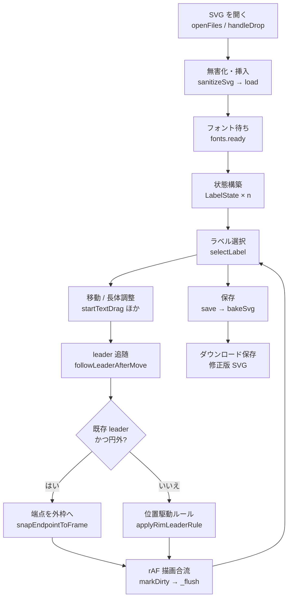
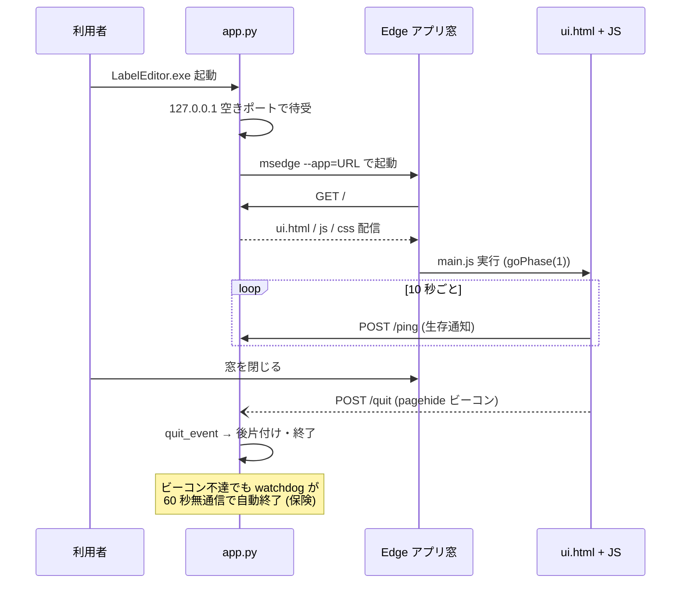
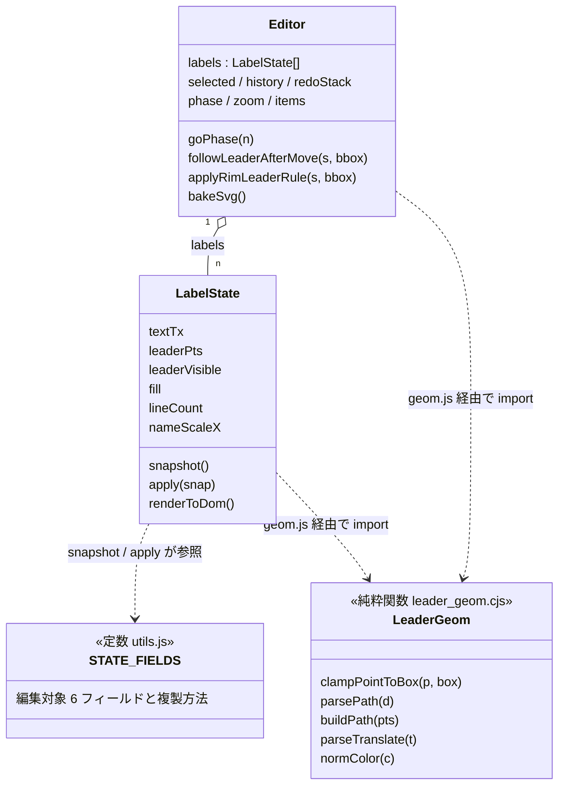
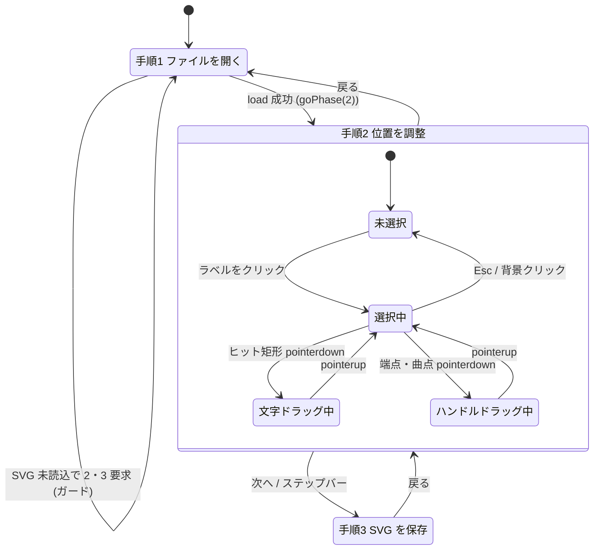

本書は SVG ラベル位置エディタ（graph-editor）の構造・依存・編集モデル・配布方式を、Python / JavaScript にまだ慣れていない読者でも実装を追えるところまで掘り下げて記述する。一次資料は `graph-editor/README.md` とソース。本文中のコード抜粋はすべて実ソースからの引用で、引用元をパスで示す。

# 1. 用語解説

| 用語 | 意味 |
|---|---|
| アプリモード（Edge） | `msedge.exe --app=<URL>` で起動する、アドレスバーの無い 1 窓のブラウザ。見た目は普通のデスクトップアプリになる。 |
| ローカルサーバ | 自分の PC の中だけで動く HTTP サーバ。本ツールは `127.0.0.1` の空きポートで待ち受け、外部には公開しない。 |
| leader（引出線） | ラベルとスライスを結ぶ折れ線（`<path>` 要素）。点列は「アンカー（円側の根元）→ 曲点 → 端点（文字側）」。 |
| transform / translate | SVG 要素を動かす属性。`transform="translate(10,5)"` は「右へ 10、下へ 5 ずらして描け」。編集中はこれで動かし、保存時に実座標へ焼き込む。 |
| getBBox / CTM | ブラウザが計算する SVG 要素の外接矩形（BBox）と座標変換行列（CTM）。マウス座標を SVG 座標へ変換するのに使う。 |
| rAF（requestAnimationFrame） | 「次の描画フレームで 1 回だけ呼んで」とブラウザに頼む API。ドラッグ中の大量イベントを 1 フレーム 1 回の再描画にまとめる。 |
| UMD | ブラウザ（グローバル変数）と Node（`module.exports`）の両方で読み込める JS の書き方。`leader_geom.cjs` が採用。 |
| File System Access API | ブラウザからネイティブの「開く/保存」ダイアログを出す新しめの API（`showOpenFilePicker` 等）。本ツールは **VDI で不安定なため使わない**（12 章）。 |
| PyInstaller onefile | Python スクリプトと同梱リソースを単一 exe に固めるパッケージャ。実行時に一時フォルダ（`sys._MEIPASS`）へ展開される。 |
| 長体 | 文字を横方向にだけ圧縮する表現（100〜70%）。SVG では名前部分の `<tspan>` に `textLength` を付けて実現する。 |

# 2. 全体アーキテクチャ


## 2.1 構成要素

| ファイル | 行数 | 役割 |
|---|---|---|
| `app.py` | 298 | 標準ライブラリの小さな HTTP サーバ（127.0.0.1）で `resources/web/` を配信し、Edge をアプリモードで起動・常駐管理。実行時の外部依存なし |
| `resources/web/ui.html` | 133 | **静的マークアップのみ**。3 段ウィザードの画面骨格（アプリバー / ステップバー / 3 画面 / フッター / トースト）。ロジックは含まない |
| `resources/web/styles.css` | 232 | ライトテーマ CSS 一式（外部 CSS フレームワーク不使用） |
| `resources/web/js/` | 計 8 本 | エディタの全ロジック（2.2 節） |
| `resources/web/lib/leader_geom.cjs` | 62 | 引出線まわりの DOM 非依存な純粋関数（UMD、6 章） |
| `requirements.txt` | — | 実行は標準ライブラリのみ。`pyinstaller` はビルド時のみ |
| `scripts/build.bat` / `build.ps1` | — | exe をワンクリックでビルド（`--onefile`、11 章） |

## 2.2 フロントエンドの 8 モジュール（`resources/web/js/`）

フロントエンドのロジックは責務別の 8 モジュールに分割されている。

| モジュール | 行数 | 責務 |
|---|---|---|
| `main.js` | 50 | エントリポイント。`Editor` 生成 → イベント配線 → 画面 1 表示。`window.__editor` の公開、`/quit` ビーコン、`/ping` ハートビート |
| `editor.js` | 1117 | エディタ本体。セッション状態（開いたファイル群・選択・履歴）+ ライフサイクル + 描画統括を担う `Editor` クラス |
| `label-state.js` | 193 | 1 ラベル分の状態モデル `LabelState` と実 DOM 同期（`renderToDom`） |
| `constants.js` | 81 | 調整用定数（`CONFIG.condenseMin` 等）・既定スタイル・UI 文言・操作表の一元管理 |
| `dom.js` | 43 | UI 要素の id 参照を一元化する DOM ハンドル集 |
| `geom.js` | 10 | `leader_geom.cjs`（グローバル `LeaderGeom`）を ES モジュールへ橋渡しして再エクスポート |
| `icons.js` | 51 | アイコンの inline SVG 化とトースト通知 |
| `utils.js` | 88 | 状態を持たない純粋ユーティリティ（`sanitizeSvg` / `hasFsAccess` / `STATE_FIELDS` 等） |

読み込み順が要点で、`leader_geom.cjs` は classic script としてグローバル `LeaderGeom` を先に生やしてから、module の `main.js` が動く（`resources/web/ui.html` 末尾）:

```html
  <!-- DOM 非依存の純粋関数 (引出線ジオメトリ/パース)。ui.html と vitest 単体テストで共有。
       classic script として global `LeaderGeom` を生やすため、main スクリプトより前に読み込む。 -->
  <script src="lib/leader_geom.cjs"></script>
  <script type="module" src="js/main.js"></script>
```

## 2.3 編集フロー全体（アクティビティ図）

SVG を開いてから保存するまでの処理の流れ。各ノードの実装は 4〜6 章で順に詳述する。

<!-- ノードラベルは短い 2 行構成（改行は `<br/>`）に保つ。長い行は CJK 幅の過小計算で見切れる。 -->



# 3. app.py 詳解

`app.py` は標準ライブラリのみ（`http.server` / `logging` / `subprocess` / `winreg` / `threading` / `webbrowser`）で書かれた常駐プロセス。`main()` の処理手順:

1. **ロギング初期化**（`_setup_logging`）: `startup.log` へ INFO 出力。exe は `console=False` で標準エラーが見えないため、ファイル出力で起動診断を可観測にする。置き場は配布 exe では `%LOCALAPPDATA%\LabelEditor\data\logs`（可変状態をプログラムフォルダの外へ出す。pdf-to-svg の F43 と同じ判断）。明示指定は `LABELEDITOR_DATA_DIR`、ユーザー領域が使えない端末（VDI）だけ exe 隣の `data\logs` へ落ちる。ソース実行はリポジトリ直下 `data/logs`。
2. **空きポートで待受**: `ThreadingHTTPServer(("127.0.0.1", 0), Handler)`。ポート番号 0 は「OS が空きポートを割り当てる」の意味。127.0.0.1 バインドなので外部には公開されない。
3. **終了フラグと watchdog 用状態を付与**: `server.quit_event`（threading.Event）と `server.last_seen`（最終リクエスト時刻）。
4. **サーバをデーモンスレッドで起動**（`serve_forever`）。
5. **Edge を探索**（`_find_edge`）: App Paths レジストリ（HKLM → HKCU）→ 既知のインストールパス（`ProgramFiles` 等）の順。見つからなければ None。
6. **Edge をアプリモードで起動**: `msedge.exe --app=<URL> --no-first-run --no-default-browser-check`（`_edge_launch_args`）。**隔離 `--user-data-dir` や `--disable-gpu` は付けない**（VDI クラッシュ対策。12 章）。Edge 側の verbose 診断ログ（`--enable-logging --log-file=… --v=1`）は**既定で付けない**。環境変数 `LABELEDITOR_EDGE_LOG` を立てたときだけ付き、出力先は `%LOCALAPPDATA%\LabelEditor\logs\edge.log`（起動ごとに作り直し、終了時に 4MiB へ切り詰め）。
7. **サーバ寿命を Edge プロセスに縛らない**: Edge はコールド起動時に自プロセスを再起動して初回プロセスが早期終了することがあるため、`_watch_proc` は終了をログするだけで、サーバは畳まない。
8. **フォールバックと watchdog**: Edge 不在なら `webbrowser.open(url)` で既定ブラウザへ。`_idle_watchdog` を起動する。
9. **終了待ち**: `server.quit_event.wait()`。`/quit` ビーコンか watchdog がこれを解除する。
10. **後片付け**: `shutdown` / `server_close`、生存中の Edge を `terminate`。

## 3.1 終了契機の設計

終了は「窓を閉じたときの `/quit` ビーコン」が本線、「アイドル watchdog」が保険という二段構え。フロント側（`main.js`）は `pagehide` で `/quit` を送り、10 秒ごとに `/ping` を送り続ける。サーバ側はハートビートの途絶を見張る（`app.py`）:

```python
def _idle_watchdog(server):
    """ハートビート途絶を見張り、最終アクセスから IDLE_TIMEOUT 秒で self-shutdown する。"""
    while not server.quit_event.wait(IDLE_TIMEOUT / 4):
        if time.monotonic() - server.last_seen > IDLE_TIMEOUT:
            server.quit_event.set()
            return
```

`IDLE_TIMEOUT = 60` 秒。タブクラッシュ等でビーコンが届かなくても、ハートビートが 60 秒途絶えればサーバは自主終了し、ゾンビプロセスが残らない。

## 3.2 HTTP ハンドラ

- `do_GET`: `/`・`/index.html`・`/ui.html` → メモリ上の `UI_HTML`、`/lib/leader_geom.cjs` → `LEADER_GEOM`、`/favicon.ico` → 204、その他は `_serve_static`（`styles.css` / `js/*.js` を**拡張子ホワイトリスト + パストラバーサル防止**付きで配信）。
- `do_POST`: `/quit` → 204 + `quit_event.set()`、`/ping` → 204（`last_seen` 更新）。
- 同梱リソースは起動時に `sys._MEIPASS`（PyInstaller 展開先）または `resources/web/` から読み込む。

## 3.3 起動〜終了シーケンス

exe 起動から窓を閉じてサーバが自動終了するまでの時系列。ハートビート（`/ping`）とビーコン
（`/quit`）の二段構えが 3.1 節の設計に対応する。



# 4. 初期化とイベントフロー

## 4.1 起動 → 編集可能まで

`main.js` の初期化はほぼこれだけで、以降のすべては `Editor` クラスに委ねる:

```javascript
drawIcons(document);                 // 静的マークアップ内のアイコンを inline SVG 化
const editor = new Editor(dom);
editor.bindEvents();                 // 全イベント配線
editor.updateToolbar();
editor.goPhase(1);                   // 最初は「ファイルを開く」画面
window.__editor = editor;            // E2E フック公開
window.addEventListener("pagehide", () => { navigator.sendBeacon("/quit"); });
setInterval(() => fetch("/ping", { method: "POST", keepalive: true }), 10000);
```

SVG ファイルを開いてから編集可能になるまで（`editor.js` の `openFiles` → `load`）:

1. `openFiles`: 従来型 `<input type=file>` でファイルを選ぶ（複数可）。各ファイルに一意 `id` を採番して保持する。
2. `load(item)`: 世代番号 `_loadSeq` を進め（読み込み中に別ファイルが来たら後勝ち）、`sanitizeSvg` で `<script>` / `on*` 属性 / `javascript:` を除去してから `<svg>` を `#canvas` にインライン挿入する。
3. `viewBox` から元寸法（`baseW/baseH`）を取り、ズームを適用し、**先に編集画面（手順 2）を表示してから** BBox を測る（非表示要素の `getBBox` は 0 になるため順序が重要）。
4. `await document.fonts.ready` で SVG 埋め込みフォントの読み込みを待つ（フォント確定前に BBox を測るとずれる）。
5. `#labels > g.label` ごとに `new LabelState(g, this)` を作り、`attachHitArea` で透明ヒット矩形をかぶせる。
6. ハンドル用オーバーレイ `<g id="editor-overlay" data-editor="1">` を最前面に追加する。

> [!INFO] pie-chart の生成 SVG はフォントを base64 で自己内包しているため、DOM に挿入するだけで実フォントのまま正確に表示される（WYSIWYG が成立する根拠）。

## 4.2 選択・ドラッグのイベントフロー

ドラッグの定型処理は `onDrag` に集約されている。ポイントは (1) 逆 CTM を開始時に 1 回だけ取得して毎フレームの reflow を避ける、(2) **実際に動いた最初の 1 回だけ**履歴を積む（クリックだけで履歴が汚れない）:

```javascript
onDrag(evt, onMove) {
  const inv = this.svg.getScreenCTM().inverse();
  const start = this.toSvgPoint(evt, inv);
  let pushed = false;
  const move = (e) => {
    const p = this.toSvgPoint(e, inv);
    const dx = p.x - start.x, dy = p.y - start.y;
    if (!pushed && (dx || dy)) { this.pushHistory(); pushed = true; }
    onMove(dx, dy);
  };
  const up = () => { window.removeEventListener("pointermove", move); /* ... */ };
  window.addEventListener("pointermove", move); /* up/cancel も登録 */
}
```

- **文字のドラッグ**: ヒット矩形の `pointerdown` → `startTextDrag` → `onMove` で `textTx` を更新し、`followLeaderAfterMove` が引出線端点を毎フレームラベル外枠へ再スナップする。
- **ハンドルのドラッグ**: ハンドルの `pointerdown` → `startLeaderDrag`。このとき `_auto = false` を立て、以後この引出線は位置駆動ルール（4.3 節）で上書きしない（手動編集の尊重）。
- **描画は rAF スケジューラに合流**: 変更は `markDirty({dom, overlay, inspector})` でフラグを立てるだけにし、`requestAnimationFrame` で 1 フレーム最大 1 回だけ実 DOM に反映する。保存前などは `flushNow()` で同期確定する。

## 4.3 状態モデル（`label-state.js`）と位置駆動ルール

`LabelState` は `<g class="label">` から `textTx`（translate）・`leaderPts`（path 点列）・`fill`・`lineCount`・`nameScaleX` 等を SVG 属性・`data-*` 属性から復元して保持し、`renderToDom` で JS 状態を実 DOM へ反映する。スナップショット/リストアの対象フィールドは `utils.js` の `STATE_FIELDS` に一元化されており、**状態項目を増やすときはこの 1 箇所に足せば履歴・リセットにも自動で乗る**。

主要クラスと定数・純粋関数群の関係（クラス図）:



`STATE_FIELDS` の 6 フィールド（`textTx` / `leaderPts` / `leaderVisible` / `fill` / `lineCount` /
`nameScaleX`）が「編集で変化し Undo・リセットの対象になる状態」の正確な全集合である
（`utils.js`）。`LabelState.snapshot` / `apply` の双方が同じ表を参照するため、項目追加はここ
1 箇所で済む。

位置駆動の引出線ルール（`applyRimLeaderRule`）: ラベル中心が円周の**外**にあれば自動 leader を生成・端点追従（`_auto=true`）し、円**内**なら自動分のみ除去する。白文字タイプ（スライス内ラベル）は円外へ出ると黒、円内に戻ると白へ自動で切り替える。手動編集済み（`_auto=false`）の leader は保持する。

## 4.4 アプリの状態遷移

画面は `goPhase(n)`（`editor.js`）が切り替える 3 フェーズのウィザードで、`main.js` が起動直後に
`goPhase(1)` を呼ぶ。SVG 未読込のまま 2・3 へ進もうとするとガードが 1 へ戻す。手順 2 の内側には
選択・ドラッグのサブ状態がある。



- ドラッグ中は `onDrag` が `pointermove` / `pointerup` / `pointercancel` を window に配線し、
  **実際に動いた最初の 1 回だけ** `pushHistory` する（4.2 節）。
- ハンドルドラッグ開始時に `_auto = false` が立ち、以後その leader は位置駆動ルールの対象外に
  なる（4.3 節の leader 状態モデル）。

# 5. 編集モデル

## 5.1 ラベルの DOM 構造

```
<g class="label" data-name="…" data-line-count data-percent data-name-scale-x>
  {引出線 <path fill="none">?}
  {<text><tspan>…</tspan></text>}
</g>
```

- 文字は `<text>` の `transform=translate` で動かし、**保存時に `x` / `y` へ焼き込んで transform を除去**する（7 章）。
- 引出線は `<path d="M…L…">` の点列を直接編集する（先頭＝アンカー固定 / 末尾＝文字側）。

## 5.2 ハンドル 3 種

選択中ラベルにはオーバーレイとして丸ハンドルが出る。色と役割は `_buildOverlay`（`editor.js`）で決まる:

```javascript
const color = i === 0 ? "#ffb84c" : i === last ? "#57c878" : "#4c9aff";
// 先頭=アンカー: 橙, 末尾=端点: 緑, 中間: 青
if (i === 0) { c.style.cursor = "not-allowed"; }        // アンカー=固定・ドラッグ不可
else { c.style.cursor = "move"; c.addEventListener("pointerdown", ...startLeaderDrag); }
```

| 色 | 名称 | 位置 | 可動性 |
|---|---|---|---|
| 緑 `#57c878` | 端点 | 文字側（点列の末尾） | ドラッグ可 |
| 青 `#4c9aff` | 曲点 | 折れ目（中間点） | ドラッグ可 |
| 橙 `#ffb84c` | アンカー | 円に接する根元（点列の先頭） | **完全固定**（スライス中心角のリム点にロック。pointerdown リスナー自体が付かない） |

## 5.3 右パネル（インスペクタ）

セグメントトグルで「引出線 表示/非表示」「曲げ点 あり/なし」「文字色 黒/白」「行数 1 行/2 行」を切り替え、**長体スライダ**で名前部分だけを横圧縮する（`editor.js` `_inspectorBodyHtml`）:

```html
<input type="range" id="scaleRange" min="0.7" max="1" step="0.01" value="...">
```

下限 0.7（= 70%）は `constants.js` の `CONFIG.condenseMin` で定義。長体の実現方法は pie-chart と同じで、名前 `<tspan>` に `textLength` + `lengthAdjust="spacingAndGlyphs"` を付与する。スライダは `input` イベントでライブ反映し、操作開始時に 1 度だけ履歴を積む。

# 6. 引出線幾何 lib/leader_geom.cjs

DOM 非依存の純粋関数集（62 行、UMD）。ブラウザでは classic script としてグローバル `LeaderGeom` になり、Node では `module.exports` で読める。プロジェクトの `package.json` が `"type": "module"` のため拡張子は `.cjs`。

公開関数:

| 関数 | 役割 |
|---|---|
| `clampPointToBox(p, box)` | 点 p を矩形へクランプ（矩形外なら外枠上の最近点）。引出線端点を必ずラベル外枠上に載せる核 |
| `parsePath(d)` | `"M x,y L x,y ..."` を正規表現で数値抽出し点列 `[{x,y},...]` へ |
| `buildPath(pts)` | 点列 → `"M x,y L x,y ..."` |
| `parseTranslate(transform)` | `translate(dx,dy)` の抽出（無ければ `{0,0}`） |
| `normColor(c)` | 色表記の正規化（`white` / `#fff` → `#ffffff` 等） |

核となる `clampPointToBox` は 6 行の純粋関数:

```javascript
function clampPointToBox(p, box) {
  return {
    x: Math.max(box.left, Math.min(p.x, box.right)),
    y: Math.max(box.top, Math.min(p.y, box.bottom)),
  };
}
```

> [!WARN] **共有範囲の正確な理解**: この `.cjs` を共有しているのは **graph-editor 内部の 2 者**、すなわち `ui.html`（ブラウザ実行）と `test/editor_leader_geom.test.ts`（vitest 単体テスト）である。**pie-chart は独自の引出線幾何 `pie-chart/src/svg_export/leader_geometry.ts` を持つ並行実装**で、この `.cjs` を import していない。ただし端点の BBox クランプ規約（外枠上に載せる）は pie-chart の規約に合わせているため、幾何仕様を変える際は pie-chart 側の仕様も突き合わせて確認すること。

# 7. 保存処理

保存は「編集用の足場をすべて取り除いたクリーンな SVG を書き出す」処理。`save` → `bakeSvg`（`editor.js`）:

1. `flushNow()` で保留中の描画を確定してから DOM を読む。
2. `this.svg.cloneNode(true)` で複製を作る（画面上の編集セッションは壊さない）。
3. 複製から**補助要素を除去**: `[data-editor], [data-editor-hit]`（ハンドル・オーバーレイ・ヒット矩形）を remove、`.is-selected` クラスも除去。
4. 表示用の width/height（ズーム反映値）を元寸法へ戻す。
5. 各ラベルの `<text>` の `transform=translate` を `x` / `y` 属性へ**焼き込み**、transform を除去（`<tspan>` の `x` も加算。`dy` は相対値なので不変）。非表示の引出線（`display:none`）は remove。
6. `XMLSerializer` で直列化し、XML 宣言を前置して返す。

```javascript
bakeSvg() {
  const clone = this.svg.cloneNode(true);
  clone.querySelectorAll("[data-editor], [data-editor-hit]").forEach((el) => el.remove());
  clone.querySelectorAll(".is-selected").forEach((el) => el.classList.remove("is-selected"));
  clone.setAttribute("width", `${this.baseW}px`);
  clone.setAttribute("height", `${this.baseH}px`);
  // ... text の transform 焼き込み / 非表示 path 除去 ...
  const xml = new XMLSerializer().serializeToString(clone);
  return `<?xml version="1.0" encoding="UTF-8"?>\n${xml}`;
}
```

**保存先はダウンロードフォルダ固定**。`utils.js` の `hasFsAccess()` は**常に false を返す**設計（VDI の管理された Edge ではネイティブピッカーがレンダラごとクラッシュするため。12 章）で、保存は常に `Blob` + `<a download>` によるダウンロードになる。保存先を選ぶダイアログは出ない。元ファイルは上書きされない。

# 8. パフォーマンスと応答性

編集ツールの品質は「ドラッグに引っかかりが無いこと」で決まる。本章はその応答性を支える 3 つの仕組みと、意図的な割り切りをまとめる。

## 8.1 描画は rAF スケジューラに合流（4.2 節）

ドラッグ中の `mousemove` は 1 秒に数十〜百回発生するが、DOM 反映をイベントごとに行うと再計算・再描画が輻輳する。変更は `markDirty` でフラグを立てるだけにし、`requestAnimationFrame` で **1 フレーム最大 1 回**だけ実 DOM へ反映する。DOM を読む必要がある場面（保存・検証）では `flushNow()` で同期確定してから読む — 「書きは遅延バッチ・読みは明示フラッシュ」の一方通行で、描画と計測の競合を作らない。

## 8.2 座標変換は掴んだ瞬間に 1 回だけ（4.2 節）

マウス座標 → SVG 論理座標の変換に使う逆 CTM（座標変換行列）は、ドラッグ開始時に 1 回だけ取得してドラッグ中は使い回す。`getScreenCTM()` はレイアウト確定を要する（reflow を誘発し得る）API のため、move ごとに呼ぶとドラッグが重くなる。ズームや窓サイズはドラッグ中に変わらない前提を置ける操作モデルだから成立する省略である。

## 8.3 起動時の `fonts.ready` 待ちと規模の割り切り

- 初期化は `document.fonts.ready` を待ってからラベルの BBox を測る。待ちの分だけ起動は一拍遅くなるが、フォント確定前の BBox は不正確で、引出線端点の初期位置がずれるため正確性を優先している。
- 対象はラベル十数枚の円グラフ SVG に限定しており、要素数がその規模を超えない前提で全ラベル走査（O(n)）を素直に書いている。汎用 SVG エディタ化して要素数が桁で増える改修は、この前提ごと見直しが要る。
- サーバ側は静的配信のみで性能要素は無い。idle watchdog（60 秒）はゾンビプロセス防止であり、応答性には関与しない（3.1 節）。

# 9. テスト

| ファイル | 種別 | 検証内容 |
|---|---|---|
| `test/editor_leader_geom.test.ts` | vitest 単体 | `leader_geom.cjs` の 5 純粋関数を網羅検証 |
| `test/editor_drag.e2e.ts` | Playwright E2E | 実 Chromium + 実 `getBBox` で「ラベルを動かしても引出線端点が必ずラベル外枠上」の不変条件を検証（手動 leader / 位置駆動の自動生成・削除の 2 ケース） |
| `test/capture_docs.e2e.ts` | Playwright | 操作手順書向けスクリーンショット取得（`docs/graph-editor/images/` へ出力） |
| `test/editor_server.mjs` | — | E2E 用の依存ゼロ静的サーバ。`resources/web/` を :5179 で配信（Playwright の `webServer` が起動） |
| `test/fixtures/editor_pie.svg` | — | E2E 用最小フィクスチャ |

E2E は `window.__editor` フック（`main.js` が公開する `Editor` インスタンス）経由で操作する。`load(item)`（ファイル選択ダイアログを介さないプログラム的読込）・`selectLabel`・`nudge`・`flushNow`・`labels` が入口で、ファイル選択・フォント読込・rAF を跨いだ検証を決定的にする。

実行コマンドは `graph-editor/package.json` の scripts（`test` = `vitest run` / `test:e2e` =
`playwright test` / `typecheck` = `tsc --noEmit`）を経由する。ワークスペースルートからは:

```
pnpm --filter graph-editor run test        # vitest 単体
pnpm --filter graph-editor run test:e2e    # Playwright E2E
pnpm --filter graph-editor run typecheck   # tsc --noEmit
```

> [!WARN] `test/capture_docs.e2e.ts` は実行のたびに `docs/graph-editor/images/` のスクリーン
> ショット 6 枚を**再撮影して上書き**する。UI を変えていなくても描画差で byte 差分が出ることが
> あるため、差分が出たら「再撮影」としてそのままコミットする。

## 9.1 CI 統合とテスト戦略の意図

上記 3 コマンドはリポジトリ横断の CI 集約 `pnpm run ci` に `ci:graph-editor` として組み込まれ、pre-push でローカル実行される。層の切り方には設計上の対応関係がある:

- **単体テストできるのは `leader_geom.cjs` を DOM 非依存の純粋関数に切り出してあるから**（6 章）。幾何ロジックをブラウザ実装から分離したのは、テスト可能性そのものを狙った構造であり、ブラウザと vitest が同一実装を共有する。
- **E2E は「実ブラウザでしか検証できない不変条件」に限定する**。引出線端点が常にラベル外枠上にあるという保証は実 `getBBox` の値に依存するため、モックでは検証にならない。逆に言えば、実 DOM を要しない検証を E2E に足すのは層の誤配置である。

# 10. 依存関係とライセンス

**実行時依存はゼロ**が本ツールの特徴で、依存の少なさがそのまま配布・保守の軽さになっている。

| 区分 | 依存 | ライセンス |
|---|---|---|
| 実行時（サーバ） | Python 標準ライブラリのみ（`http.server` / `threading` 等） | — |
| 実行時（UI） | ブラウザ標準 API のみ（フレームワーク・外部 JS ライブラリ不使用） | — |
| 実行環境 | Windows 10/11 + システム標準 Edge | — |
| ビルド時 | PyInstaller | GPL 2.0 + 例外（例外条項により生成 exe に GPL は及ばない） |
| 開発時 | vitest / Playwright / TypeScript（typecheck のみ） | MIT / Apache-2.0 |

フォントは同梱しない — 編集対象の SVG が pie-chart 側で base64 自己内包しているため、本ツール側にフォントのライセンス管理は発生しない。外部通信も無い（127.0.0.1 のみ）。

# 11. ビルド・配布

- `scripts/build.bat` → `scripts/build.ps1`: 共有ライブラリ `scripts/lib/build-python-venv.ps1` で隔離 venv（`.venv-build`）を用意し（オフライン優先、共有 wheelhouse 使用）、**PyInstaller `--onefile`** でビルドする:

```powershell
& $vpy -m PyInstaller --noconfirm --clean --onefile --windowed --name LabelEditor `
  --add-data 'resources/web/ui.html;.' `
  --add-data 'resources/web/styles.css;.' `
  --add-data 'resources/web/js;js' `
  --add-data 'resources/web/lib/leader_geom.cjs;lib' `
  app.py
```

- 出力は `dist/LabelEditor.exe`（単一ファイル・~10MB）。配布先に Python も WebView2 も不要（描画は OS の Edge）。
- `console=False`（黒窓なし）。そのため起動診断は `startup.log` が頼り（3 章）。
- 診断ログ（Python 側起動診断）は既定で `%LOCALAPPDATA%\LabelEditor\data\logs\startup.log` に出る（exe を共有フォルダ・ネットワークドライブへ置いて複数人が起動しても、exe 隣への共同追記で記録が混ざらない。プログラムフォルダを書き込み可能にする要件も作らない）。ユーザー領域が使えない端末だけ exe 隣の `data\logs` へ落ちる。Edge 側の verbose ログは**既定で出さない**（既定プロファイルで開くため、利用者の Edge セッション全体の診断が配布物の隣に溜まり、回覧時に一緒に渡ってしまうのを避ける）。必要なときだけ `LABELEDITOR_EDGE_LOG=1` を立て、`%LOCALAPPDATA%\LabelEditor\logs\edge.log` を見る。

# 12. VDI / リモートデスクトップ対応

VDI（仮想デスクトップ）環境の「管理された Edge」で安定動作させるため、次の 3 点を設計原則とする。

1. **Edge は特殊フラグ無しで起動する**。隔離 `--user-data-dir` + `--disable-gpu`（ソフトウェア描画固定）のような非標準構成は、VDI では Edge のレンダラが不安定になり**アプリ窓がクラッシュ**するため使わない（Edge ログに `GetGpuDriverOverlayInfo failed ...` が出る。通常の Edge ブラウジング自体は安定）。**安定動作している既定 Edge と同じ構成**で開く。
2. **File System Access API を使わない**。ネイティブピッカー（`showOpenFilePicker` / `showSaveFilePicker`）は VDI の管理された Edge でレンダラごとクラッシュするため、開くは従来型 `<input type=file>`（+ D&D）、保存はダウンロードに固定する（`hasFsAccess()` が常に false）。
3. **サーバ寿命を Edge プロセスに縛らない**。Edge のコールド起動はプロセスを再起動するため、プロセス監視での終了判定は誤爆する。終了は `/quit` ビーコン + アイドル watchdog（60 秒）に一本化する（3.1 節）。

> [!INFO] 落ちる・開かない場合はまず `%LOCALAPPDATA%\LabelEditor\data\logs\startup.log`（Python 側。ユーザー領域が使えない端末では exe 隣の `data\logs`）を見る。Edge 側の詳細が要るときだけ `LABELEDITOR_EDGE_LOG=1` を立てて再現させ、`%LOCALAPPDATA%\LabelEditor\logs\edge.log` を見る（既定では出力されない）。

# 13. リンク集・参考情報と改善項目

## 13.1 一次資料・関連文書

- `graph-editor/README.md` — 開発者向けクイックスタート
- `docs/graph-editor/src/設計正典.md` — モジュール責務・却下済み設計の要約版（触る前に読む）
- 別冊: 「SVG ラベル位置エディタ 操作手順書」（事務担当者向け）・「同 配布・運用手順書」（情報システム担当向け)
- 関連ツール: pie-chart（前工程の SVG 生成器）。`leader_geom.cjs` は pie-chart の `leader_geometry.ts` と**独立の並行実装**だが、端点の BBox クランプ規約を合わせてある — leader の幾何仕様を変えるときは pie-chart 詳細設計書 8 章と突き合わせること（6 章 WARN）。

## 13.2 既知の改善項目

- **編集対象の拡張はしない方針**: テキスト編集・要素追加・配色変更は意図的な非機能。要望が立った場合も、まず pie-chart 側（自動配置の改良）で解決できないかを先に検討する。
- **保存先がダウンロードフォルダ固定**: VDI 安定性との交換条件（12 章）。File System Access API の復活はしない（却下済み設計）。
