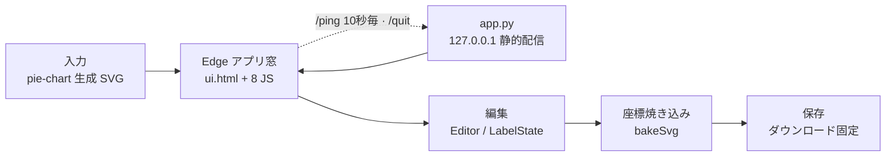

graph-editor（LabelEditor）の設計正典。pie-chart が生成した SVG のラベル・引出線（leader）を
人手で微調整する Edge シェル型ローカルアプリ（Python 簡易サーバ + vanilla JS、PyInstaller で
単一 exe 配布）。詳細は別冊「詳細設計書」、検証コマンドは下記チェックリスト参照。

## 全体像

<!-- ノードラベルは短い 2 行構成（改行は ` `）に保つ。長い行は CJK 幅の過小計算で見切れる。 -->

`app.py` は静的配信とライフサイクル管理のみ。編集ロジックは全部ブラウザ側 JS が担う。

## モジュール構成

| モジュール | 責務 |
|---|---|
| `app.py` | 標準ライブラリのみの HTTP サーバ（127.0.0.1 空きポート）。Edge `--app` 起動・`/quit` ビーコン・60 秒 idle watchdog |
| `resources/web/js/main.js` | エントリポイント。`Editor` 生成・`goPhase(1)`・`/quit` ビーコン・`/ping` ハートビート・`window.__editor` 公開 |
| `resources/web/js/editor.js` | `Editor` クラス本体。ウィザード・選択・ドラッグ・Undo/Redo・rAF 描画スケジューラ・`bakeSvg` 保存 |
| `resources/web/js/label-state.js` | `LabelState`: 1 ラベルの状態モデルと実 DOM 同期（`renderToDom` / `rebuildTextContent`） |
| `resources/web/js/constants.js` | `CONFIG` 定数・既定 leader スタイル・UI 文言・`INSPECTOR_ACTIONS` 操作表 |
| `resources/web/js/dom.js` | UI 要素 id 参照の一元化 |
| `resources/web/js/geom.js` | global `LeaderGeom` を ES モジュールへ橋渡し（再エクスポートのみ） |
| `resources/web/js/icons.js` | inline SVG アイコンとトースト通知 |
| `resources/web/js/utils.js` | 純粋ユーティリティ（`sanitizeSvg` / `hasFsAccess` / `STATE_FIELDS`） |
| `resources/web/lib/leader_geom.cjs` | DOM 非依存の leader 純粋関数（UMD）。ブラウザと vitest が同一実装を共有 |

## 中核原則

- **File System Access API は使わない**: `utils.js` の `hasFsAccess()` は**常に false**。VDI の
  管理された Edge ではネイティブピッカーがレンダラごとクラッシュするため、開く =
  `<input type=file>` + D&D、保存 = `Blob` ダウンロード固定（`openFiles` / `save`）。
- **Edge は特殊フラグ無しで起動**: 隔離 `--user-data-dir` や `--disable-gpu` を付けると VDI で
  窓ごとクラッシュした実績があり、既定 Edge と同じ構成で `--app=<URL>` のみ（`app.py`）。
- **サーバ寿命は Edge プロセスに縛らない**: Edge のコールド起動は自プロセスを再起動し初回
  プロセスが早期終了するため、終了は `/quit` ビーコン + `IDLE_TIMEOUT`（60 秒）watchdog に一本化。
- **編集状態は `STATE_FIELDS` に一元化**: `textTx` / `leaderPts` / `leaderVisible` / `fill` /
  `lineCount` / `nameScaleX` の 6 フィールドが Undo・リセット対象の全集合。項目追加はここ 1 箇所。
- **leader 幾何は `leader_geom.cjs` の純粋関数**（`clampPointToBox` / `parsePath` / `buildPath` /
  `parseTranslate` / `normColor`）。DOM 非依存でブラウザとテストが同一実装を共有する。
- **leader 点列の不変条件**: 先頭アンカーはスライス中心角リム点へ常時ロック（`sliceMidAnchor`、
  `renderToDom` が毎回固定し UI もドラッグ不可）。末尾端点は必ずラベル外枠上
  （`snapEndpointToFrame` = `clampPointToBox`）。
- **自動 / 手動 leader の区別は `_auto` フラグ**: 手動でハンドルを動かした leader は位置駆動
  ルール（`applyRimLeaderRule`）が二度と上書きしない。自動分のみ円内で除去・円外で再生成。
- **描画は rAF スケジューラに合流**: 変更は `markDirty` でフラグを立てるだけにし 1 フレーム最大
  1 回反映。DOM を読む前は `flushNow()` で同期確定。
- **保存は非破壊**: `bakeSvg` が `transform` を `x`/`y` へ焼き込み、編集用要素
  （`[data-editor]` 等）を除去したクリーン SVG を書き出す。元ファイルは上書きしない。

## 却下済み / してはならないこと

- **FS Access API を復活させない**（`hasFsAccess()` を true に戻さない）: VDI クラッシュの実測に
  基づく決定。機能差は「保存先がダウンロードフォルダ固定」のみで、安定性を優先する。
- **Edge 起動フラグを増やさない**: 隔離 `--user-data-dir` + `--disable-gpu` は過去に VDI で
  クラッシュ（`edge.log`: GetGpuDriverOverlayInfo failed）。診断用 `--enable-logging` 系のみ可。
- **サーバ終了を Edge の `proc.wait()` に縛らない**: `_watch_proc` は観測ログのみ。wait 終了に
  すると Edge コールド再起動で初回起動が空白になる退行を再現する。
- **pie-chart レンダラへの依存を持ち込まない**: `leader_geom.cjs` は独立実装で、pie-chart の
  `leader_geometry.ts` とは並行実装。ただし端点の BBox クランプ規約は合わせているため、幾何仕様を
  変えるときは pie-chart 側と突き合わせる。

## 触る前のチェックリスト

1. `pnpm --filter graph-editor run test` — vitest 単体（`leader_geom.cjs` の純粋関数）。
2. `pnpm --filter graph-editor run test:e2e` — Playwright E2E（実 Chromium + 実 `getBBox` で
   「端点は常にラベル外枠上」の不変条件）。`test/editor_server.mjs`（:5179）が自動起動する。
3. `pnpm --filter graph-editor run typecheck` — `tsc --noEmit`。
4. E2E の `test/capture_docs.e2e.ts` は `docs/graph-editor/images/` のスクリーンショット 6 枚を
   **再撮影して上書き**する。差分が出たら「再撮影」としてそのままコミットする。
5. exe 配布物を変えるときは `scripts/build.bat`（PyInstaller `--onefile`）の `--add-data` 一覧と
   `app.py` の `resource_path` 解決が一致しているか確認する。
