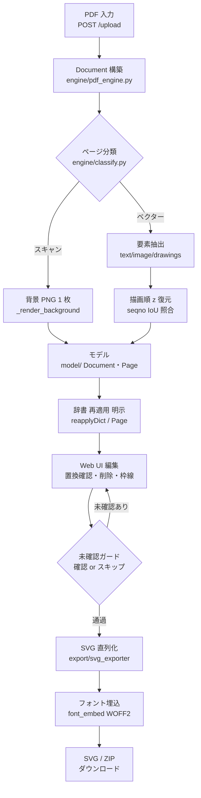
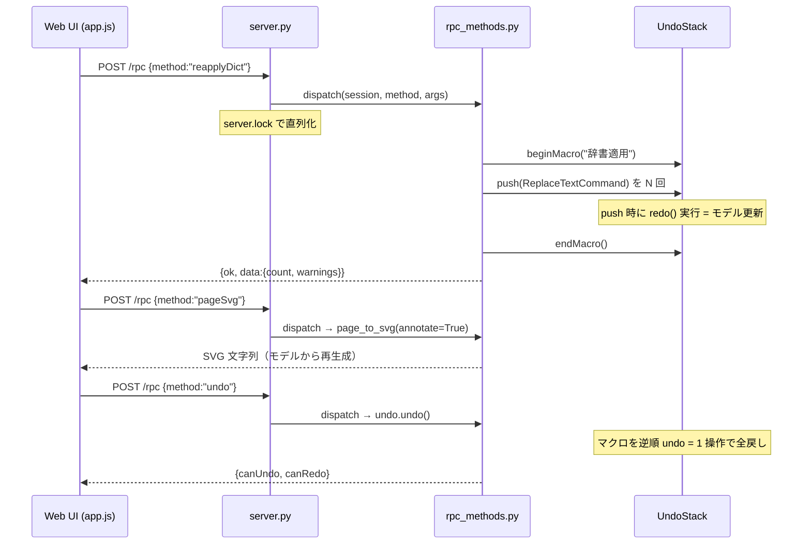
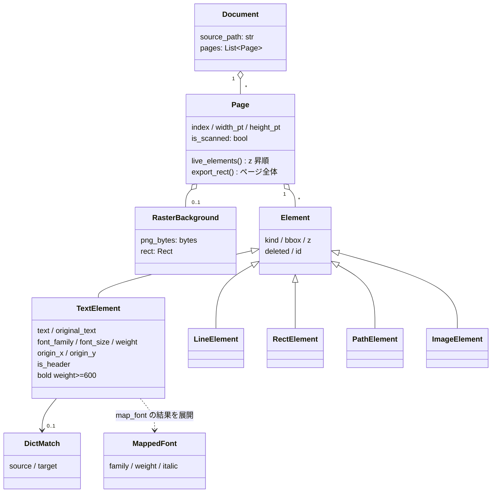
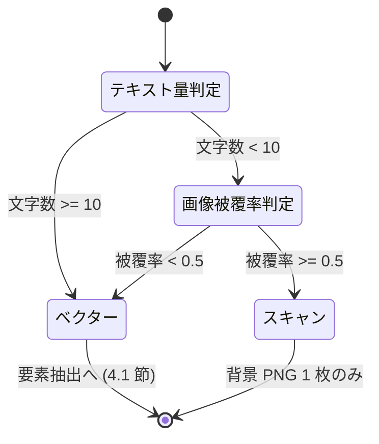

本書は PdfToSvg の実装構造・依存・ライフサイクルを、Python にまだ慣れていない読者でも実装を追えるところまで掘り下げて記述する。対象リビジョンは最新版。本文中のコード抜粋はすべて実ソースからの引用で、引用元をパスで示す。

# 1. 用語解説

| 用語 | 意味 |
|---|---|
| model is truth | 「編集状態の正はモデル（Python のデータ構造）にあり、画面は写しにすぎない」という設計原則。SVG は常にモデルから再生成する。 |
| dataclass（Python） | `@dataclass` を付けたクラス。属性宣言だけでコンストラクタ等が自動生成される。モデル層の全クラスが採用。 |
| RPC | Remote Procedure Call。ここでは Web UI から `POST /rpc` に `{method, args}` を送ってサーバ側の関数を呼ぶ仕組み。 |
| コマンドパターン | 編集操作を「redo()（実行）と undo()（取り消し）を持つオブジェクト」として表す設計。Undo/Redo の実装単位になる。 |
| Undo スタック / マクロ | 実行済みコマンドの積み上げ。マクロは複数コマンドを 1 束にして「1 操作 = 1 Undo」にする仕組み。 |
| 論理削除 | 要素をリストから消さず `deleted=True` の印を付けて非表示にする削除。Undo で戻せる。 |
| z 順 | 描画の重なり順。PDF の描画順を保持し、SVG でも同じ順に並べることで塗り重ねを再現する。 |
| NFKC 正規化 | Unicode の互換正規化。全角英数と半角英数、㌢ と センチ のような表記ゆれを同一視できる形に揃える。 |
| ベースライン | 文字が乗る基準線。PDF のテキスト座標はベースライン原点で表される。 |
| WOFF2 サブセット | フォントから使用文字だけを抜き出した軽量フォント。SVG に base64 で埋め込む。 |
| onedir（PyInstaller） | exe と依存 DLL 群をフォルダ一式で配布する形式。単一 exe（onefile）より起動が速く、隣に `data/` を置ける。 |
| アプリモード（Edge） | `msedge.exe --app=<URL>` によるアドレスバー無しの 1 窓表示。デスクトップアプリの見た目になる。 |
| IoU | Intersection over Union。2 矩形の重なり具合（0〜1）。描画順の照合に使う。 |

# 2. アーキテクチャ

設計原則は**「モデルが真実（model is truth）」**。編集は Web UI から `/rpc` 経由でコマンドを Undo スタックへ push してモデルを更新し、SVG はモデルから直接書き出す（決定的・GUI 非依存でユニットテスト可能）。


PDF 入力から SVG 出力までの処理の流れ（アクティビティ図）。辞書置換は `/upload` では行わず、
Web UI の再適用ボタン（既定は表示中ページのみ、全ファイルは明示選択）からの Undo 可能な
コマンドとしてのみ積まれる。未確認ガード（8 章）は書き出しの手前に立つ:

<!-- ノードラベルは短い 2 行構成（改行は <br/>）。長い 1 行は CJK 幅の過小計算で枠外へ見切れる。 -->



## 2.1 操作 1 回のシーケンス（用語置換の例）

ユーザーが PDF を開いてから置換結果を目にするまで、データは次の 1 方向に流れる。

1. UI が `POST /upload` へ PDF バイト列を送る → `loader.load_document_bytes` が一時ファイル経由で `pdf_engine.load_document` を呼び、`Document`（モデル）を構築する（辞書はここでは適用しない）。
2. ユーザーが辞書タブの再適用ボタンを押す → `reapplyDictPage`（既定・表示中ページのみ）/ `reapplyDict`（全ファイル・明示選択）が「ヘッダ検出 → 置換計画 → 適用」を行う。適用は `ReplaceTextCommand` 群を**マクロ**として Undo スタックへ push する（1 回の再適用 = 1 Undo）。
3. UI が `pageSvg` RPC を呼ぶ → `svg_exporter.page_to_svg(page, annotate=True)` が**モデルから** SVG を生成して返し、UI がそのまま表示する。
4. 以降の編集（削除・枠線等）も同じ形: RPC → コマンド生成 → Undo スタックへ push（push 時に `redo()` が走りモデルが変わる）→ UI が SVG を取り直す。
5. `undo` / `redo` RPC はスタック上のコマンドの `undo()` / `redo()` を呼ぶだけ。画面は毎回モデルから再生成されるので、モデルと画面がずれることがない。

辞書の再適用（`reapplyDict`）から Undo までの往復をシーケンス図で示す。`/rpc` は `server.lock`
で直列化され、置換 N 件はマクロ 1 束（= 1 Undo）として積まれる（7 章）:



## 2.2 モジュール構成

| パス | 責務 | 章 |
|---|---|---|
| `src/app.py` | エントリポイント。Edge 探索・アプリ窓起動・ライフサイクル管理 | 10 |
| `src/config.py` | パス解決（frozen exe / ソース実行の双方）。data/・fonts/・resources/ の基準 | 10 |
| `src/engine/pdf_engine.py` | PyMuPDF で PDF を抽出し Document モデルへ | 4 |
| `src/engine/classify.py` | ベクター / スキャン（画像主体）ページの判定 | 4 |
| `src/model/document.py`, `elements.py` | Document / Page / 各 Element（Text/Line/Rect/Path/Image） | 3 |
| `src/model/fonts.py` | PDF フォント名 → Windows 標準 / 同梱フォントへのマッピング、ウェイト保持 | 3 |
| `src/export/svg_exporter.py` | モデル → SVG 文字列の決定的シリアライズ | 5 |
| `src/export/font_embed.py` | fontTools によるサブセット化 + base64 WOFF2 @font-face 埋め込み | 5 |
| `src/dictionary/store.py` | 辞書の JSON 永続化（add/upsert/update/delete/all/lookup/import/export） | 6 |
| `src/dictionary/apply.py` | ヘッダ検出・置換適用・折返しヘッダの畳み込み | 6 |
| `src/dictionary/normalize.py` | NFKC 正規化（全角/半角差の吸収） | 6 |
| `src/web/server.py` | ローカル HTTP サーバ（静的配信 + /rpc + /upload + /quit + /ping） | 7 |
| `src/web/rpc_methods.py` | RPC 実体。WebSession が複数 PDF・辞書・Undo を保持 | 7 |
| `src/web/commands.py`, `undo_stack.py` | コマンドパターン（Delete/ReplaceText/AddElement）と純 Python Undo | 7 |
| `src/web/loader.py` | PDF バイト列 → Document（一時ファイル経由） | 7 |
| `resources/web/` | Edge アプリ窓の UI（index.html / app.js / rpc.js / dom.js / geometry.js） | 8 |
| `fonts/` | 同梱フォント（BIZ UDPゴシック / Noto Serif JP, SIL OFL） | 9 |
| `packaging/pdftosvg.spec` | PyInstaller 設定（Qt 除外・fonts/resources 同梱） | 10 |
| `tests/` | pytest（engine/model/dictionary/export/web） | 13 |

# 3. モデル層 model/

主要クラスの関係をクラス図で示す（`src/model/document.py` / `elements.py` / `fonts.py`）。
`Document` → `Page` → `Element` の素直なコンテナ階層で、描画要素 5 種はすべて基底 `Element` の
派生。`MappedFont` はフォントマッピング（3.3 節）の結果値で、モデルには保持されず
`TextElement.font_family` / `weight` / `italic` へ展開される:



## 3.1 Element クラス群（`src/model/elements.py`）

すべての描画要素は基底 `Element` を継承した dataclass。共通属性は「種別・外接矩形・描画順・論理削除フラグ・ID」の 5 つだけ:

```python
@dataclass
class Element:
    """全要素の基底。"""
    kind: str = "element"
    bbox: Rect = field(default_factory=lambda: Rect(0, 0, 0, 0))
    z: int = 0
    deleted: bool = False
    id: int = field(default_factory=new_id)
```

派生クラスと固有属性:

| クラス | kind | 固有属性 |
|---|---|---|
| `TextElement` | `"text"` | `text`, `original_text`（置換前・Undo/レビュー用）, `font_family`, `original_font`（マップ前 PDF 名）, `font_size`, `weight`（CSS 100–900）, `italic`, `color`, `origin_x/origin_y`（ベースライン原点）, `is_header`, `dict_match` |
| `LineElement` | `"line"` | `x0, y0, x1, y1`, `width`, `color` |
| `RectElement` | `"rect"` | `rect`, `stroke`, `fill`, `stroke_width` |
| `PathElement` | `"path"` | `d`（SVG path 文字列）, `stroke`, `fill`, `stroke_width` |
| `ImageElement` | `"image"` | `rect`, `img_bytes`, `ext`（"png"/"jpeg"） |

中心となる `TextElement` の実定義（`src/model/elements.py`）:

```python
@dataclass
class TextElement(Element):
    kind: str = "text"
    text: str = ""
    original_text: str = ""  # 辞書置換前の値 (Undo / レビュー用)
    font_family: str = "sans-serif"
    original_font: str = ""  # マッピング前の PDF フォント名 (デバッグ用)
    font_size: float = 12.0
    weight: int = 400  # CSS フォントウェイト (100-900)。元 PDF のウェイトを保持
    italic: bool = False
    color: str = "#000000"
    origin_x: float = 0.0  # ベースライン原点 (SVG <text> の x)
    origin_y: float = 0.0
    is_header: bool = False
    dict_match: Optional[DictMatch] = None

    @property
    def bold(self) -> bool:
        """太字相当か (weight>=600)。weight を単一ソースとする。"""
        return self.weight >= 600
```

- `original_text` / `original_font` は `__post_init__` で初期値が自動コピーされる。置換後も元の値が残るため、「変更箇所の一覧」や Undo の材料になる。
- `bold` を独立フラグにせず `weight >= 600` の導出プロパティにしている点に注目（真実は weight ひとつ）。

## 3.2 Document / Page（`src/model/document.py`）

`Document` は `source_path` + `pages`、`Page` はページ寸法と要素リストを持つだけの素直な構造:

```python
@dataclass
class Page:
    index: int
    width_pt: float
    height_pt: float
    is_scanned: bool = False
    background: Optional[RasterBackground] = None
    elements: List[Element] = field(default_factory=list)

    def live_elements(self) -> List[Element]:
        """削除されていない要素 (z 昇順)。"""
        items = [e for e in self.elements if not e.deleted]
        return sorted(items, key=lambda e: e.z)

    def export_rect(self) -> Rect:
        """書き出し領域 (ページ全体)。"""
        return Rect(0, 0, self.width_pt, self.height_pt)
```

「model is truth」の実現はこの 2 メソッドに集約される。削除は要素を消さず `deleted=True` の**論理削除**（Undo 可能）、描画・書き出しは常に `live_elements()`（削除除外・z 昇順）を読む。`export_rect()` は常にページ全体で、クロップ（切り抜き）という概念は持たない。UI の「範囲削除」は矩形内要素の一括論理削除である。

## 3.3 フォントマッピング（`src/model/fonts.py`）

PDF 内のフォント名（例 `BIZ-UDPGothic-Bold`、サブセット接頭辞付き `ABCDEF+MS-Gothic` 等）を、表示可能なフォントへ写像する。中心は `map_font`:

```python
def map_font(pdf_name: str, text: str = "") -> MappedFont:
    key = _norm(pdf_name)                       # 小文字化 + 空白/-/_/, 除去
    hit = _EXACT.get(key)                        # 完全一致表を引く
    weight: Optional[int] = None
    italic = False
    if hit is None:
        base, weight, italic = _strip_style(key) # 末尾スタイルトークン剥がし
        hit = _EXACT.get(base)                    # 基底名で再照合
    if hit is not None:
        resolved = weight if weight is not None else hit.weight
        return MappedFont(hit.family, resolved, hit.italic or italic)
    generic, ja_hint = _classify(pdf_name)        # 未知名を種別推定
    script = "ja" if (ja_hint or contains_japanese(text)) else "latin"
    return MappedFont(_DEFAULTS[(script, generic)], weight or 400, italic)
```

手順: (1) 名前を正規化して完全一致表（PDF 標準 14 フォント・欧文エイリアス・Windows 標準和文・有料和文フォント）を引く → (2) 外れたら `Bold` / `W6` / `Italic` 等の末尾スタイルトークンを剥がして基底名で再照合（剥がしたトークンはウェイト・イタリックとして反映）→ (3) それでも未知なら serif / sans / mono と和文ヒントを推定し、既定フォントへフォールバック。有料・非搭載の和文フォント（ヒラギノ等）は同梱の `BIZ UDPGothic` / `Noto Serif JP` へ寄せる。

付随ヘルパー: `needs_embedding`（同梱フォントのみ埋込対象）、`is_variable_family`（Noto Serif JP は可変フォント）、`static_weight_bucket`（BIZ UDPGothic は 400/700 の 2 バケットへ丸め）、`fallback_css`（和文テキスト + 欧文ファミリ時に和文フォントをフォールバック連結）、`is_width_overflow`（置換後の幅超過警告。全角=1em・半角=0.5em の概算）。

# 4. 変換エンジン engine/

## 4.1 抽出手順（`src/engine/pdf_engine.py`、PyMuPDF）

`load_document` が各ページを `_extract_page` にかける。手順:

1. `fitz.open(path)` で PDF を開き、ページを走査する。
2. **スキャン判定**（4.2 節）。スキャンページなら `get_pixmap(matrix=2 倍)` で PNG 背景画像 1 枚を作って終了（要素抽出しない）。
3. **描画順（z）復元の下ごしらえ**: `get_texttrace()` から文字列描画の連番（seqno）を、`get_bboxlog()` から画像系描画の位置を集める。
4. **テキスト / 画像ブロック**: `page.get_text("dict")` のブロックを走査し、テキスト span を `_text_element` で `TextElement` に、画像ブロックを `ImageElement` にする。span と seqno の対応付けは **IoU 最大**で照合する（面積最大だと巨大 span が小さい span を吸ってしまうため）。
5. **ベクター描画**: `page.get_drawings()` を走査し、線分は `LineElement`、矩形は `RectElement`、それ以外の複合パスは SVG path の `d` 文字列を組み立てて `PathElement` にする。
6. **色**: span 色は sRGB 整数 → `#rrggbb`、drawings 色は 0..1 の float → `#rrggbb` へ変換する（`engine/colors.py`）。

テキスト 1 個の変換（`src/engine/pdf_engine.py`）:

```python
def _text_element(span: dict, z: int) -> Optional[TextElement]:
    text = sanitize_text(span.get("text", ""))
    if text == "" or text.isspace():
        return None
    bbox = span["bbox"]
    origin = span.get("origin", (bbox[0], bbox[3]))
    flags = span.get("flags", 0)
    raw_font = _clean_font(span.get("font", "sans-serif"))
    mapped = fonts.map_font(raw_font, text)
    weight = mapped.weight
    if (flags & FLAG_BOLD) and weight < 600:   # 名前に重み指定が無い時のみ持ち上げ
        weight = 700
    return TextElement(
        bbox=Rect.from_xyxy(*bbox), z=z, text=text,
        font_family=mapped.family, original_font=raw_font,
        font_size=float(span.get("size", 12.0)), weight=weight,
        italic=bool(flags & FLAG_ITALIC) or mapped.italic,
        color=int_to_hex(span.get("color", 0)),
        origin_x=origin[0], origin_y=origin[1],
    )
```

> [!WARN] `pdf_engine.py` は **AGPL ライセンスの PyMuPDF** に依存する唯一のモジュール（14 章）。差し替え候補（pypdfium2）を見据えて、PyMuPDF への依存はこのファイルに閉じている。

## 4.2 スキャン判定（`src/engine/classify.py`）

「テキストがほぼ無い、かつ画像がページの半分以上を覆う」の AND 条件でスキャンページと判定する。どちらか一方でも弱ければベクター扱い（テキスト編集を優先）:

```python
MIN_TEXT_CHARS = 10          # これ未満ならテキストほぼ無し
IMAGE_COVERAGE_RATIO = 0.5   # 画像がページ面積のこれ以上を覆えば画像主体

def is_scanned_page(page: "fitz.Page") -> bool:
    text = page.get_text("text").strip()
    if len(text) >= MIN_TEXT_CHARS:
        return False                          # 文字が十分 → ベクター
    page_area = abs(page.rect.width * page.rect.height)
    if page_area <= 0:
        return False
    image_area = 0.0
    for info in page.get_image_info():
        bbox = info.get("bbox")
        if bbox:
            r = fitz.Rect(bbox)
            image_area += abs(r.width * r.height)
    coverage = image_area / page_area
    return coverage >= IMAGE_COVERAGE_RATIO    # 両条件成立でスキャン
```

判定の遷移を状態遷移図で示す。しきい値は `MIN_TEXT_CHARS = 10`（文字数）と
`IMAGE_COVERAGE_RATIO = 0.5`（画像被覆率）の 2 つで、**両条件が成立したときだけ**スキャン扱いに
なる（迷ったらベクター = テキスト編集を優先）:



# 5. SVG エクスポート export/

## 5.1 決定的直列化（`src/export/svg_exporter.py`）

`page_to_svg(page, annotate=False)` の手順:

1. `page.export_rect()`（ページ全体）から `<svg>` の `width` / `height` / `viewBox`（常に `0 0 width height`）を出力する。数値は `f"{v:.3f}"` の末尾ゼロ除去で正規化し、表記ゆれを排除する。
2. スキャン背景があれば先頭に `<image>`（base64 PNG）。
3. `live_elements()`（削除除外・**z 昇順**）を順に直列化する。要素の出力順 = z 順なので、同一モデルからは常に同一の SVG が出る（決定的出力）。
4. `annotate=True` のときだけ各タグへ `data-el="<id>"` を付ける。これは Web UI が「クリックした SVG 要素 → モデル要素」を対応付けるための編集用注釈で、**書き出し（`exportSvg`）は `annotate=False`** のため成果物には残らない。
5. 使用フォントの `@font-face` CSS（5.2 節）を `<style>` として挿入する。

テキストの直列化には据え方の 3 分岐がある。未編集は元 PDF のベースライン原点（従来出力と完全一致）。単独行の置換は元と幅が違うため、元のベースラインに置くと表のセル内で上下にずれて見える — そこで外接箱の縦中央へ据え直す。折返し畳み込みの置換（`wrap_align` 設定済み）は、縦は**下揃え**（`origin_y` = 最終行のベースラインへ据え直し済み）、横は**元の折返し行の揃え**（左/中央/右）を `text-anchor` で踏襲し、全幅への引き伸ばしはせず合成領域の幅を超える恐れがあるときだけ `textLength` で圧縮する:

```python
def _text_to_svg(el: TextElement) -> str:
    family = fonts.fallback_css(el.font_family, el.text)
    weight = f' font-weight="{el.weight}"' if el.weight != 400 else ""
    style = ' font-style="italic"' if el.italic else ""
    stretch = ""
    if el.bbox.w > 0:
        stretch = f' textLength="{_fmt(el.bbox.w)}" lengthAdjust="spacingAndGlyphs"'
    if el.text == el.original_text:
        x, y, base = el.origin_x, el.origin_y, ""      # 未編集: 元ベースライン
    elif el.wrap_align is not None:
        y, base = el.origin_y, ""                       # 折返し畳み込み: 下揃え
        if el.wrap_align == "center":
            x, base = el.bbox.x + el.bbox.w / 2, ' text-anchor="middle"'
        elif el.wrap_align == "right":
            x, base = el.bbox.x1, ' text-anchor="end"'
        else:
            x = el.bbox.x                               # 左揃え (既定 anchor)
        if not fonts.is_width_overflow(el.text, el.font_size, el.bbox.w):
            stretch = ""                                # 幅超過時のみ圧縮
    else:
        x = el.bbox.x
        y = el.bbox.y + el.bbox.h / 2                   # 単独行の置換: 箱の縦中央
        base = ' dominant-baseline="central"'
    return (
        f'<text x="{_fmt(x)}" y="{_fmt(y)}"{base} '
        f'font-family={quoteattr(family)} font-size="{_fmt(el.font_size)}" '
        f'fill="{el.color}"{weight}{style}{stretch}>'
        f'{escape(sanitize_text(el.text))}</text>'
    )
```

`textLength` + `lengthAdjust="spacingAndGlyphs"` により、置換後の文字列も元の幅に収まるよう字間・グリフが自動調整される。

## 5.2 フォント埋込（`src/export/font_embed.py`）

`font_face_css(elements)` が「使用文字の収集 → サブセット化 → @font-face 連結」を行う。

1. `_collect_usage`: 各テキストのフォールバック連鎖を辿り、可変フォントはファミリ単位・静的フォントは（ファミリ, ウェイトバケット）単位で使用文字集合を集める。
2. `_subset_woff2`: 同梱ソース（TTF/WOFF1。WOFF2 をソースにしないのは再圧縮劣化を避けるため）を `fontTools.subset` で使用文字だけに絞り、`flavor="woff2"` で書き出す:

```python
def _subset_woff2(filename: str, chars: Set[str]) -> bytes | None:
    data = _source_font_bytes(filename)   # lru_cache 済み。毎回 BytesIO から再構築
    if data is None:
        return None
    font = TTFont(BytesIO(data))
    options = subset.Options()
    options.flavor = "woff2"
    subsetter = subset.Subsetter(options)
    subsetter.populate(text="".join(chars))
    subsetter.subset(font)
    font.flavor = "woff2"
    buf = BytesIO()
    font.save(buf)
    return buf.getvalue()
```

3. `_face`: base64 の `data:font/woff2` を `@font-face` にする。可変フォントは `font-weight: 100 900`、静的フォントはバケットに応じた範囲（400 → `1 599`、700 → `600 1000`）を宣言する。

# 6. 辞書機能 dictionary/

## 6.1 永続化（`src/dictionary/store.py`）

`DictionaryStore` は JSON ファイルを正典とするインメモリ CRUD。公開 API:

| メソッド | 動作 |
|---|---|
| `add(source_raw, target, enabled=True, joined=False)` | 追加・採番・即保存 |
| `upsert(source_raw, target, joined=False)` | 正規化キーが一致すれば target と joined を更新、無ければ追加 |
| `update(mid, ...)` / `delete(mid)` | 更新 / 削除 |
| `all()` | `source_raw` 昇順の一覧コピー |
| `lookup(text)` | 正規化キーで置換後の語を取得（enabled のみ） |
| `lookup_wrap(text)` | 連結由来（`joined=True`）エントリに限って取得（折返し連結照合専用） |
| `export_json(path)` / `import_json(path)` | JSON 入出力（import は upsert・取込件数を返す） |

保存は**アトミック書き込み**（`tempfile.mkstemp` → `os.replace`）で、書き込み途中のクラッシュでも辞書ファイルが壊れない。読込（`_load`）は壊れた JSON でも起動を止めない。フォーマットは `[{"source", "target", "enabled", "joined"}]` の素直な配列で、人手編集・他端末との共有が可能（`joined` は折返し連結取り込み由来の印。キーの無い旧形式は False として読む）。

## 6.2 正規化（`src/dictionary/normalize.py`）

辞書照合キーの正規化。既定は「trim + NFKC（全角半角統一）+ 連続空白圧縮」で、オプションで大小無視（casefold）・カタカナ→ひらがな畳み込み（kana_fold）を足せる:

```python
def normalize(text: str, opts: NormOptions = DEFAULT_OPTIONS) -> str:
    s = text.strip()
    if opts.nfkc:        s = unicodedata.normalize("NFKC", s)
    if opts.collapse_ws: s = _WS.sub(" ", s)
    if opts.casefold:    s = s.casefold()
    if opts.kana_fold:   s = s.translate(_KATA_TO_HIRA)
    return s
```

これにより「Ｈｅａｄｅｒ　Ａ」（全角）と「Header A」（半角）が同じ辞書エントリに当たる。

## 6.3 ヘッダ検出と折返し畳み込み（`src/dictionary/apply.py`）

表のヘッダは 1 セルが複数行に折り返されていることが多い。そこで「縦に隣接・同一列・同一サイズ」のテキスト群を 1 グループに束ね、結合した文字列で辞書を引く。

**ヘッダ検出** `detect_headers(page)` の考え方（疑似コード）:

```
band_limit = ページ高さ × 0.25            # 上部バンド
top_candidates = origin_y <= band_limit のテキスト
top_row = そのうち最上行 ±3pt に乗っているもの
各テキスト: is_header = 太字 (weight>=600) または top_row 内
折返しグループの先頭がヘッダなら、後続行も is_header = True
```

ヘッダ判定は適用のゲートには使わない（辞書はヘッダ・本文を問わず全文に当たる）。用途は確認一覧（`planPage`）の「ヘッダ/本文」表示のみ。

**折返し判定** `_is_wrap_follower`（疑似コード）:

```
gap = 下要素の origin_y − 上要素の origin_y
follower ⟺ 0 < gap <= max(font_size) × 1.3      # 行送りの範囲内
        かつ x 方向の重なり率 >= 0.5              # 同じ列
        かつ |font_size 差| <= 0.5               # 同じ書式
```

**置換計画** `plan_replacements(page, store)`（疑似コード）:

```
for group in 折返しグループ (2 要素以上):
    hit = 結合文字列で連結由来エントリのみを引く (lookup_wrap)
          # CJK を含めば区切り無し、含まねば空白区切り
    if hit:
        Replacement(先頭要素へ置換適用, 後続行は deleted=True,
                    new_bbox=グループ結合矩形,
                    align=元の行揃えの検出 (left/center/right),
                    baseline_y=最終行のベースライン, warning=幅超過?)
for el in 未消費の単独テキスト:
    if 辞書ヒット (lookup): Replacement(el, ...)
```

`align` は各行 bbox の左端・中央・右端のばらつき（max−min）を比べ、最も揃っている辺を元の揃えとみなす（同点は左揃え。`_detect_wrap_align`）。置換後テキストは合成領域内で**下揃え**（`baseline_y`）+ この揃えで描かれる（5.1 節の `_text_to_svg`）。

連結照合が引くのは**連結由来（`Mapping.joined=True`）エントリだけ**である点が重要:
クリック取り込みの連結で登録した語だけが 2 行畳み込みの対象になり、単独行として手入力した語が
偶然連結形と一致して意図せず 2 行を畳む事故を防ぐ（`DictionaryStore.lookup_wrap`）。

適用（`apply_replacement`）は `text` の書き換え・`dict_match` 記録・結合矩形と据え方（`wrap_align` / 最終行ベースラインへの `origin_y`）の据え直し・後続行の論理削除を行う。`auto_apply` = 検出 → 計画 → 適用の一括実行だが、これは**テスト・バッチ用のヘルパ**で、本番 UI はアップロード時に辞書を適用しない（適用は再適用 RPC の Undo 可能経路のみ）。UI で文字をクリックした際の `joined_candidate` も同じグループ判定を使うため、「クリック取り込みで折返しを連結」チェックが ON なら**折返しセルはクリック 1 回で全体が「元の語」に入り**、そのエントリに連結由来（`joined`）が記録される。チェック OFF（既定）ではクリック行のみを取り込む。

# 7. Web 層 web/

## 7.1 HTTP サーバ（`src/web/server.py`）

標準ライブラリ `ThreadingHTTPServer`、127.0.0.1 のみで待受。

| メソッド/パス | 役割 |
|---|---|
| `GET /`（静的） | `resources/web` 配下の配信（拡張子ホワイトリスト + パストラバーサル防止） |
| `POST /rpc` | `{method, args}` を dispatch し `{ok, data}` を返す |
| `POST /upload?name=` | PDF バイト列を受領し Document 化（辞書は適用しない。適用は再適用 RPC のみ） |
| `POST /quit` | ウィンドウ閉鎖ビーコン（quit_event を立てる） |
| `POST /ping` | 生存ハートビート（idle watchdog の last_seen 更新） |

スレッド並列で来るリクエストからセッション状態を守るため、`/rpc` と `/upload` は `server.lock`（threading.Lock）で**直列化**する:

```python
def _handle_rpc(self):
    try:
        req = json.loads(self._read_body() or b"{}")
        method = req.get("method"); args = req.get("args") or {}
    except (json.JSONDecodeError, AttributeError) as exc:
        self._send_json({"ok": False, "error": f"bad request: {exc}"}, 400); return
    try:
        with self.server.lock:
            data = rpc_methods.dispatch(self.server.session, method, args)
    except KeyError:
        self._send_json({"ok": False, "error": f"unknown method: {method}"})
    except Exception as exc:
        self._send_json({"ok": False, "error": str(exc)})
    else:
        self._send_json({"ok": True, "data": data})
```

## 7.2 セッションと RPC（`src/web/rpc_methods.py`）

`WebSession` がサーバ側の全状態を持つ: `store`（辞書）・`undo`（Undo スタック）・`docs`（開いている Document のリスト）・`suggest_join`（クリック取り込みで折返しを連結するか。既定 False）。

`HANDLERS` には**全 21 メソッド**が登録されている:

| 分類 | メソッド |
|---|---|
| 状態・表示 | `state`, `pageSvg`, `planPage`, `removedList` |
| 辞書 CRUD | `dictList`, `dictAdd`, `dictDelete`, `dictSuggest` |
| 辞書入出力 | `dictJson`, `dictImportJson`（文字列ベース。ファイル保存/読込はブラウザ側が行う） |
| 辞書適用 | `setSuggestJoin`, `reapplyDict`, `reapplyDictPage`（ヘッダ・本文を問わず全文に適用） |
| 編集 | `applyDelete`, `deleteRegion`, `addBorder`, `undo`, `redo` |
| 書き出し・管理 | `exportSvg`, `zipEntries`（複数 SVG の ZIP 集約）, `removeFile` |

要点:

- `state` はファイル/ページ一覧に加え、ページごとの「要確認」フラグ（辞書置換が入ったページ）を返す。UI のガードバー（8 章）の材料。
- 辞書の一括適用（`_apply_plans`）は `undo.beginMacro` 〜 `endMacro` で N 件の置換を 1 Undo にまとめる。置換後の幅超過は警告ログに出す。
- `exportSvg` は `page_to_svg`（注釈なし）+ ファイル名 `{元名}_p{ページ番号}.svg`。`zipEntries` は複数 SVG を標準 `zipfile` で 1 本にまとめて base64 で返す。

## 7.3 コマンドと Undo（`src/web/commands.py`, `undo_stack.py`）

コマンドは Qt 等に依存しない素の Python クラス。共通基底クラスは持たず、「`redo()` / `undo()` / `label` を持つ」ことが規約（push 時に `redo()` が実行される）。実コマンドは 3 種: `DeleteCommand`（`deleted` トグル）・`AddElementCommand`（枠線追加）・`ReplaceTextCommand`（テキスト置換）。

代表として `ReplaceTextCommand` の全体。コンストラクタで**変更前の値をすべて控えておき**、`redo` は新値を、`undo` は旧値を書き戻すだけの、コマンドパターンの教科書どおりの形:

```python
class ReplaceTextCommand:
    def __init__(self, el, new_text, dict_match=None, new_bbox=None):
        self.label = "テキスト置換"
        self.el = el; self.new_text = new_text
        self.dict_match = dict_match; self.new_bbox = new_bbox
        self.old_text = el.text; self.old_match = el.dict_match
        self.old_bbox = el.bbox
    def redo(self) -> None:
        self.el.text = self.new_text
        if self.dict_match is not None: self.el.dict_match = self.dict_match
        if self.new_bbox is not None:   self.el.bbox = self.new_bbox
    def undo(self) -> None:
        self.el.text = self.old_text
        self.el.dict_match = self.old_match
        self.el.bbox = self.old_bbox
```

`UndoStack` は QUndoStack 互換の API（`push/undo/redo/canUndo/canRedo/beginMacro/endMacro/clear`）を純 Python で再実装したもの。内部はコマンド列 `_stack` と現在位置 `_pos` の 2 つだけで、`_pos` より先が Redo 分岐、新規 push で Redo 分岐は破棄される。マクロ中のコマンドは `_Macro` に集約され、`_Macro.undo` は逆順に各 undo を呼ぶ。

# 8. フロント UI resources/web/

フレームワーク無しの素の JavaScript。構成:

| ファイル | 役割 |
|---|---|
| `index.html`（254 行） | 4 ステップ画面のマークアップ・ステップバー・ガードバー・フッター |
| `app.js`（972 行） | 4 ステップ状態機械の本体。全状態・描画・編集・書き出し |
| `rpc.js`（27 行） | `window.rpc(method, args)` = `/rpc` への fetch ラッパ |
| `dom.js` / `geometry.js` | 純粋ヘルパ（アイコン生成・エスケープ / 座標変換・ページ指定パース） |
| `styles.css` | スタイル |

- 状態は `phase`（1〜4）と `page`（表示ページ）が中心で、`render()` が phase に応じて画面・ステップバー・フッターを切り替える。
- ステップ 2（用語置換）: 置換一覧の行クリックで該当箇所をフラッシュ、SVG の文字クリックで `dictSuggest` → 辞書「元の語」へ自動取り込み。「クリック取り込みで折返しを連結」チェック ON なら折返し 2 行を連結して取り込み、そのエントリに連結由来（`joined`）を記録する（一覧に「連結」バッジ表示）。再適用は「このページのみ」が主ボタン、「全ファイル」は明示選択。
- ステップ 3（削除・枠線の編集）: ツールは「選択 / 範囲削除 / 枠線」。範囲削除・枠線はドラッグ矩形 → `deleteRegion` / `addBorder` RPC。
- ステップ 4（書き出し）: 1 枚なら SVG を直接ダウンロード、複数枚なら `zipEntries` で **ZIP 1 ファイル**にまとめてダウンロード。

**未確認ガードバー**: 辞書置換が入ったページには「確認しました / スキップ」のステータスが付く。未確認（pending）が残ったまま次のステップへ進もうとするとガードバーが出て、「最初の未確認へ」（該当ページへジャンプ）か「未確認をすべてスキップして進む」を選ばせる。確認漏れのまま書き出す事故を防ぐ仕組み。

# 9. データ・設定・フォント

exe と一緒に持ち運ぶデータ（辞書・ログ）と、同梱フォントの扱いを示す。

## 9.1 データ

辞書・ログはデータ置き場（**配布 exe では既定で `%LOCALAPPDATA%\PdfToSvg\data\`**、ソース実行時はリポジトリ直下の `data/`）に置く。以下、この場所を `data/` と書く。

| ファイル | 役割 |
|---|---|
| `data/dictionary.json` | 用語マッピング（人手編集・共有可・NFKC 正規化。上限 20,000 件） |
| `data/logs/startup.log` | Python 側起動診断ログ（exe は console=False のため stderr の代替・追記） |
| `data/logs/edge.log` | Edge 側ログ（`--enable-logging`、毎回上書き。アプリ窓のクラッシュ要因の観測窓口） |
| `data/tmp/<pid>/` | 実行時の作業領域（PDF・JSON 一時）。**終了時に丸ごと削除** |

置き場の決定順（`config._resolve_data_dir`）は「①環境変数 `PDFTOSVG_DATA_DIR` → ②既存の可搬インストール（exe 隣に `data/dictionary.json` がある場合のみ）→ ③`%LOCALAPPDATA%\PdfToSvg\data`（実際に書けることをプローブで確認）→ ④exe 隣の `data/`（③が使えない端末のフォールバック）」。可変状態を exe の隣（＝ CPython ランタイム DLL と PyMuPDF ネイティブモジュールの置き場）から出すのが目的で、プログラムフォルダが書き込み可能である必要をなくす。詳細と ACL 要件は別冊「配布・運用手順書」1.1 節。

辞書ファイルの壊れた要素（配列に dict 以外が混ざる等）は読み飛ばして起動し、読み飛ばし件数・読み込み失敗を UI へ通知する（`DictionaryStore.load_skipped` / `load_failed` → `dictList` → トースト）。exe は `console=False` で例外が画面に出ないため、読み込み時の例外は「何も起きず起動しない」恒久 DoS になる。

辞書フォーマット:

```
[
  {"source": "元の語", "target": "置換後の語", "enabled": true, "joined": false},
  {"source": "Old Header", "target": "New Header", "enabled": false, "joined": false},
  {"source": "商品名称", "target": "Product", "enabled": true, "joined": true}
]
```

パス解決（`src/config.py`）: 同梱リソースは `sys._MEIPASS` 経由で `resources/` `fonts/` を、可変データは上表の決定順で `data/` を解決する。作業一時領域を `data/tmp/<pid>` に付け替えるのは、VDI で C:/%TEMP% が使えない環境でも動かすため（データ置き場自体も、書けることを確認してから採用する）。

## 9.2 フォント

同梱フォントは BIZ UDPゴシック（ゴシック代替）と Noto Serif JP（明朝代替）。いずれも SIL OFL 1.1 で再配布可。元 PDF のウェイト（Light/Regular/Medium/Bold）を保持するため、フォント名から CSS ウェイトを抽出し `<text>` に数値 `font-weight` を出力する。出力時は使用グリフのみをサブセット化し base64 WOFF2 として @font-face に埋め込む（5.2 節）。

# 10. ビルド・配布と起動ライフサイクル

## 10.1 ビルド・配布

1. `scripts\build.bat` → `build.ps1` が共有ライブラリ `scripts/lib/build-python-venv.ps1` で隔離 venv（`.venv-build`）を作成し、必要依存のみインストールする（オフライン優先 = 共有 wheelhouse 使用）。
2. `pyinstaller packaging/pdftosvg.spec --clean --noconfirm --distpath dist --workpath build` で **onedir** exe を生成する。
3. 成果物 `dist/PdfToSvg/`（exe + _internal + resources + fonts）をフォルダごと配布する。

spec は PySide6 / Qt DLL / tkinter を除外し、`fonts/` と `resources/` を datas として、PyMuPDF のネイティブ DLL を binaries として同梱する。`console=False`（黒窓なし）。データ置き場は初回起動時に生成される（既定は `%LOCALAPPDATA%\PdfToSvg\data\`。9.1 節）。配布フォルダ自体は**利用者が書き込めない場所に置ける**設計で、共有配置時は読み取り＋実行のみの ACL を推奨する（配布・運用手順書 1.1 節）。

## 10.2 起動ライフサイクル（`src/app.py`）

1. ロギング初期化（`data/logs/startup.log`）。
2. 実行専用の作業領域 `data/tmp/<pid>` を作り、`tempfile` の既定先をそこへ付け替える。
3. `DictionaryStore` + `WebSession` + HTTP サーバを組み立てる（ポートは 0 指定で OS 自動割当・127.0.0.1 のみ）。
4. サーバを daemon スレッドで起動する。
5. `_find_edge()` がレジストリ（App Paths、HKLM → HKCU）→ 既知パスの順に msedge.exe を探索する。
6. **端末標準の「管理された」既定 Edge** を `--app=URL` で開く（余計なフラグは付けない）。Edge ログ（`--enable-logging --log-file=data/logs/edge.log`）のみ付与。Edge 不在なら既定ブラウザで開く。
7. 終了契機は窓を閉じた時の `/quit` ビーコン、または `/ping`（UI が 10 秒毎に送信）の途絶を見張る idle watchdog（60 秒）。
8. 終了時にサーバを畳み、Edge を terminate、`data/tmp/<pid>` を丸ごと削除する。

> [!INFO] **留意**: サーバ寿命は起動した msedge.exe プロセスに縛らない。Edge はコールド時に自身を別プロセスへ再起動するため、起動プロセスの早期終了でサーバを畳むと初回が空白になる。終了は /quit ＋ watchdog に一本化している。

# 11. VDI/リモートデスクトップ対応

> [!WARN] VDI ではアプリ窓（Edge）の起動フラグ構成が安定性を左右する。本節の制約を踏まえずに起動フラグを追加しないこと。

Edge は**余計なフラグを付けず、安定動作している既定 Edge と同じ構成**で開く。隔離 `--user-data-dir` ＋ `--disable-gpu`（ソフトウェア描画固定）のような非標準構成は、VDI では Edge のレンダラが不安定になり**アプリ窓がクラッシュ**するため使わない（`edge.log` に `GetGpuDriverOverlayInfo failed to retrieve video device` が出る。通常の Edge ブラウジング自体は安定）。

ファイルの開く/保存も同じ理由で File System Access API のネイティブピッカー（`showOpenFilePicker`/`showSaveFilePicker`/`showDirectoryPicker`）を使わない（VDI でレンダラごとクラッシュする）。開くは**従来型 `<input type=file>`、保存はダウンロード**に統一する（保存先はダウンロードフォルダ固定）。ドラッグ＆ドロップでも読み込める。

なお落ちる場合は `data/logs/startup.log`（Python 側）と `data/logs/edge.log`（Edge 側）で要因を切り分ける。

# 12. パフォーマンスに関する考慮事項

対話ツールとしての応答性は「変換 1 回・書き出し 1 回が体感で待てる長さに収まる」ことが基準で、スループットよりも最悪ケースの回避（数十秒級の処理を作らない）を優先している。

## 12.1 フォントサブセットの高速化（5.2 節）

出力サイズを決めるのは WOFF2 サブセット埋込であり、ここに 2 つの実装判断がある。

- **サブセット元は TTF/WOFF1 原本、出力だけ WOFF2**: WOFF2 をサブセット元にすると fontTools が glyf テーブルの全再構築を行い、書き出しのたびに数十秒かかって実用に耐えない（実測に基づく採用済み判断）。原本 TTF から使用グリフのみ抜き出し、最後に WOFF2 圧縮する順なら数秒で済む。
- **原本バイト列のプロセス内キャッシュ**: `_source_font_bytes` は `lru_cache` で同梱フォントのディスク読込を 1 回に抑える。複数ページ書き出しで同じフォントを繰り返し読まないためのもの。

そもそも「使用グリフのみ」のサブセット化自体が最大の軽量化で、和文フォント全体（数 MB）を埋め込まずに済む。出力サイズの上限はテストで機械監視する（13 章）。

## 12.2 スキャンページの扱い（4.2 節）

スキャン判定されたページはテキスト・ベクター抽出を**行わず**、ページ全体を 2 倍解像度の pixmap 1 枚（PNG）として背景に置くだけにする。編集不能なページへ抽出コストを払わない打ち切りであり、誤ってベクター扱いした場合の膨大なパス要素生成（数万要素）も避けられる。

## 12.3 モデル再生成と RPC の直列化（7 章）

- 画面更新は常に `live_elements()`（削除除外・z 昇順）からのページ単位再生成で、差分管理を持たない。1 ページの要素数は高々数百〜数千であり、再生成の単純さ（バグの少なさ）が差分更新の速さに勝ると判断している。
- `/rpc` は `ThreadingHTTPServer` 上で `server.lock` により**直列化**する。本ツールは 1 人 1 プロセスのローカルアプリであり、並行編集の整合性問題を作らないことを並列性能より優先した。
- 描画順の照合（`_match_seqno`）は候補矩形との IoU 計算で、ページ内要素数の 2 乗に比例し得るが、上記の要素数規模では問題にならない。IoU 方式は「重なり面積最大」方式の誤照合（巨大 span が小 span を吸う）を避けるための正確性優先の選択である。

## 12.4 やらないことによる性能

QtWebEngine ランタイム非同梱（~50MB 配布）、外部通信ゼロ、`data/tmp/<pid>` のローカル作業領域（9.1 節）は、いずれも起動時間と配布サイズを直接短くしている。性能改善の第一手は「重い依存を足さない」であり、新依存の追加はこの観点の審査を先に通すこと。

# 13. テスト

`tests/` に pytest スイート（`python -m pytest`）。fixtures の PDF は `conftest.py` が fitz で**動的生成**する（ベクター 3 要素 / 塗り順検証用バナー / 全面画像スキャンの 3 種）。

| テスト | 主眼 |
|---|---|
| `test_pipeline.py` | 抽出 → 辞書 → 書き出しの E2E。塗り順（z）、削除除外、フォントマップ、`textLength`、`dominant-baseline`、XML 不正文字除去、和文サブセット埋込 + 出力サイズ上限 |
| `test_web_rpc.py` / `test_shell_rpc.py` | RPC 実体（state/planPage/applyDelete/deleteRegion/removeFile/addBorder、辞書 JSON 往復、再適用のマクロ 1 Undo、HTTP スモーク） |
| `test_wrap_header.py` | 折返し連結（区切り無し / 空白 / 広 gap 不連結 / 単独行 / 揃え検出と下揃え出力） |
| `test_seqno_match.py` | 描画順の IoU 照合（巨大 span / 無限 bbox の排除） |
| `test_store_matcher.py` / `test_normalize.py` / `test_fonts.py` / `test_font_weight.py` | 辞書正規化 lookup・upsert / フォントマップ・ウェイト |
| `test_scan_ocr.py` | スキャン検出・背景 image |
| `test_undo_stack.py` | push / macro / 空 macro / redo 分岐破棄 |

検証の考え方: SVG 出力は決定的（同一 Document → 同一 SVG）であることを前提に、**部分文字列・XML 構造・要素順序・サイズ上限**を検証する（golden ファイルとのバイト比較ではない）。フロントの純粋関数（`geometry.js`）には Vitest の最小テストがある。

golden バイト比較でなく構造検証を選ぶのは、フォント埋込の base64 が環境（フォントバージョン）で揺れ得るためで、「壊れたら困る性質」を列挙して個別に主張する方が変更耐性が高い。

## 13.1 CI と自動化

- ローカル実行の正は `python -m pytest`（`pdf-to-svg/` 直下）。コミット前に全通過を確認する。
- リポジトリ横断のコメント規約チェック `pnpm run check:comments` の走査対象にも含まれる（`.py` の docstring・節区切り等の機械判定項目）。
- モデル・エクスポータを触る変更は、`annotate=False` の書き出し出力が従来と完全一致すること（`test_pipeline.py` の検証範囲）を崩さないのが前提条件になる。

# 14. 依存関係・要件とライセンス

**技術要件**: Windows 10/11 + システム標準 Edge が唯一の環境前提。外部サービス・外部通信は無く、管理者権限も不要。ネットワークは 127.0.0.1 のローカル HTTP のみで、プロキシ・証明書などの社内ネットワーク設定に依存しない。同梱フォント（BIZ UDPゴシック / Noto Serif JP）は SIL OFL 1.1 で再配布可能なものだけを選んでいる（9.2 節）。

> [!WARN] 本ツールは **PyMuPDF (AGPL)** に依存するため、**社内 / 身内限定の配布**を前提とする。外部・商用配布が必要になった場合は、抽出部 `engine/pdf_engine.py` を BSD ライセンスの **pypdfium2** 等へ差し替えるか、Artifex の商用ライセンスを取得すること。UI は OS 標準 Edge のアプリモードのため Qt 依存は無い。

依存一覧:

| コンポーネント | バージョン | ライセンス | 役割 |
|---|---|---|---|
| PyMuPDF (fitz) | ≥1.24 | AGPL | PDF 抽出・vector/raster 判定（`engine/` に隔離） |
| fontTools | ≥4.50 | MIT | フォントサブセット（TTF→WOFF2） |
| brotli | ≥1.1 | Apache 2.0 | WOFF2 圧縮 |
| Pillow | ≥10.0 | HPND | 依存宣言のみ（ソース中に直接の使用箇所なし。画像は PyMuPDF の pixmap で完結） |
| PyInstaller (dev) | ≥6.20 | GPL+例外 | exe ビルド |
| pytest (dev) | ≥8.0 | MIT | テスト |

# 15. 開発・運用フロー

## 15.1 Git 運用と変更の作法

- コミット条件は `python -m pytest` 全通過（13.1 節）。モデル・エクスポータの変更は書き出し出力の互換（`annotate=False` 完全一致）を守る。
- PyMuPDF（AGPL）への依存は `engine/pdf_engine.py` に閉じたまま保つ。他モジュールから `fitz` を import しない — 将来の pypdfium2 差し替え（14 章）の前提条件である。
- Edge 起動フラグ・ファイル入出力を触る前に 11 章（VDI 制約）を必ず読む。非標準フラグ追加とネイティブピッカーは禁止事項。

## 15.2 ビルド・配布

実手順は別冊「PdfToSvg 配布・運用手順書」を正典とする。要点のみ: `scripts\build.bat` が隔離 venv（`.venv-build`）で PyInstaller onedir を生成し（10.1 節）、配布物に Qt DLL が無いことをチェックリストで確認する。

## 15.3 障害対応の逆引き

| 症状 | 見る場所・対処 |
|---|---|
| アプリ窓が開かない・すぐ落ちる | `data/logs/startup.log`（Python 側）→ `data/logs/edge.log`（Edge 側）の順に切り分け（11 章） |
| VDI でだけクラッシュする | 起動フラグの非標準化が疑い筆頭。既定 Edge と同じ構成へ戻す（11 章） |
| 置換されない語がある | 辞書の `enabled`、NFKC 正規化キーの一致、折返しヘッダの連結条件と連結由来 `joined` フラグ（6.3 節）を順に確認 |
| 出力 SVG が異常に大きい | フォントサブセット失敗（原本フォント不在等）の兆候。12.1 節と `test_pipeline.py` のサイズ上限を参照 |
| 終了してもプロセスが残る | `/quit` ビーコン不達時は idle watchdog（60 秒）で自然終了する。それでも残る場合は `startup.log` で watchdog 動作を確認（10.2 節） |

## 15.4 辞書マスタの配布

`data/dictionary.json` は人手編集・共有可能な JSON で、部署内での配布・上書き運用を想定している（別冊運用手順書の辞書共有節を参照）。

# 16. リンク集・参考情報と改善項目

## 16.1 一次資料・関連文書

- `pdf-to-svg/README.md` — 開発者向けクイックスタート
- `docs/pdf-to-svg/src/設計正典.md` — 層責務・却下済み設計の要約版（触る前に読む）
- 別冊: 「PdfToSvg 操作手順書」（事務担当者向け）・「PdfToSvg 配布・運用手順書」（運用者向け）
- `fonts/OFL-*.txt` — 同梱フォントのライセンス原文

## 16.2 既知の改善項目

- **pypdfium2 への差し替え**: AGPL（PyMuPDF）解消の本命。`engine/pdf_engine.py` の隔離が済んでいるため、差し替えはこのファイルの再実装で完結する（14 章）。
- **パスベース辞書入出力の整理**: `dictExport`/`dictImport` の旧経路は現 UI から未使用であり、整理候補（7.2 節）。
- **スキャンページの OCR**: 非対応（スキャンページは背景画像のみ）。要望が立った時点で検討する。
