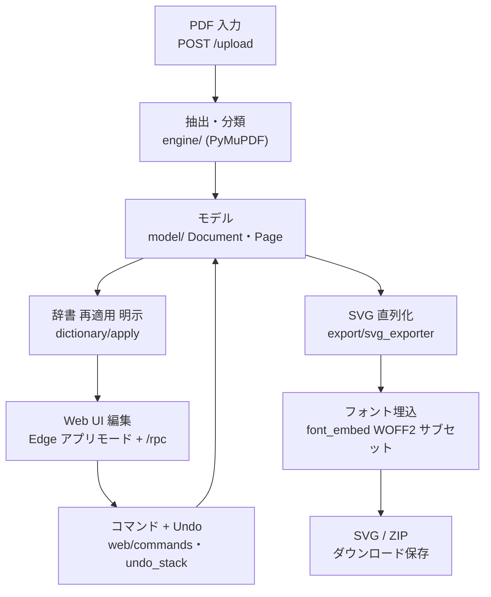

PdfToSvg の設計正典。**「どの層が何を決めるか・何を変えてはいけないか」を調べる時はまずここ**。
各層の詳解は別冊「PdfToSvg 詳細設計書」へ、配布・運用は「配布・運用手順書」へ委譲する。
検証は `pdf-to-svg/` 直下で `python -m pytest`（`test/` の `test_*.py`。TS の E2E と同居）。

## 全体像

<!-- ノードラベルは短い 2 行構成（改行は  ）。長い 1 行は CJK 幅の過小計算で枠外へ見切れる。 -->

## モジュール構成

| モジュール | 責務 |
|---|---|
| `src/app.py` / `config.py` | エントリポイント（Edge 探索・起動・終了管理）/ パス解決（同梱リソースと可変データ置き場） |
| `src/engine/pdf_engine.py` | PyMuPDF で抽出しモデル化。**AGPL 依存はこのファイルに隔離** |
| `src/engine/classify.py` | ベクター / スキャン判定（`MIN_TEXT_CHARS`=10・`IMAGE_COVERAGE_RATIO`=0.5） |
| `src/model/` | `Document`/`Page`/`Element` 5 種（dataclass・論理削除・z 順）とフォントマッピング |
| `src/export/` | モデル → 決定的 SVG 直列化 + 使用グリフのみの WOFF2 サブセット `@font-face` 埋込 |
| `src/dictionary/` | JSON 永続辞書（アトミック保存）・NFKC 正規化照合・折返しセルの連結置換 |
| `src/web/` | ローカル HTTP サーバ（静的配信 + `/rpc` 21 メソッド + `/upload` `/quit` `/ping`）・コマンド・Undo |
| `resources/web/` | 素の JS の 4 ステップ UI（フレームワーク無し） |

## 中核原則

- **model is truth**: 編集状態の正はモデル。画面も成果物も常に `live_elements()`（削除除外・z 昇順）
  から再生成する。削除は `deleted=True` の論理削除（Undo 可能）で、要素をリストから消さない。
- **Edge シェル・Qt 非依存**: UI は OS 標準 Edge の `--app=` アプリモード + 標準ライブラリ
  `ThreadingHTTPServer`（127.0.0.1 のみ・外部通信なし）。PySide6/QtWebEngine は同梱しない。
- **終了は /quit + watchdog に一本化**: 窓閉鎖の `/quit` ビーコンと、UI が 10 秒毎に送る `/ping`
  の途絶を見張る idle watchdog（`IDLE_TIMEOUT` 60 秒）。起動した msedge.exe プロセスの終了には
  サーバ寿命を縛らない（Edge はコールド時に自身を別プロセスへ再起動するため）。
- **編集 = コマンドパターン**: 全編集は `redo()`/`undo()` を持つコマンドとして `UndoStack` へ push
  （push 時に `redo()` 実行）。辞書一括適用は `beginMacro`〜`endMacro` で N 件置換 = 1 Undo。
- **辞書は正規化マッチ**: 照合キーは NFKC + trim + 連続空白圧縮（全角/半角差を吸収）。折返しヘッダ
  は「縦隣接・同一列・同一サイズ」で束ねて連結照合し、2 行目以降は論理削除で畳む。
- **辞書適用は明示操作のみ・既定は表示中ページ**: アップロード時の自動適用は行わない（適用は
  再適用ボタン＝Undo 可能な Command マクロ経路に一本化）。主ボタンは「このページのみ再適用」で、
  全ファイルへの適用は明示選択。適用対象はヘッダ・本文を問わず**全文**（「ヘッダのみ適用」トグルは
  2026-07 廃止。ヘッダ判定は確認一覧の表示ラベルのみに使う）。折返し連結照合は**連結由来
  （`joined=True`）エントリのみ**に一致させる: クリック取り込みの連結（チェック ON 時のみ）で
  登録した語だけが 2 行畳み込みの対象で、手入力・旧形式 JSON の語は単独行照合のみ
  （`DictionaryStore.lookup_wrap`）。連結置換後のテキストは合成領域内で**下揃え**（最終行の
  ベースライン）+ **元の折返し行の揃え（左/中央/右）を検出して踏襲**する（全幅引き伸ばしは
  せず、幅超過時のみ `textLength` 圧縮）。
- **SVG 出力は決定的**: 同一モデル → 同一 SVG（数値は `:.3f` 正規化・出力順 = z 順）。編集用の
  `data-el` 注釈は `annotate=True` のときだけで、書き出し（`exportSvg`）には残らない。
- **フォントは同梱 2 種へ寄せて埋込**: 未知・有料フォントは BIZ UDPGothic / Noto Serif JP へ
  フォールバックし、使用グリフのみ WOFF2 サブセット化して base64 `@font-face` で埋め込む。

## セキュリティ（2026-08-04 追加）

- **同一オリジン検査は `origin_guard.py` の `parse_request()` 1 箇所だけに置く。**
  RPC ディスパッチャやハンドラ本体には書かない（危険メソッドの列挙はブロックリストになる）。
- 許可は `127.0.0.1:<port>` / `localhost:<port>` の**完全一致 2 つのみ**。`Origin: null` は不可。
  Host も同じ集合で検査する（**DNS リバインディング**は Host 無検査でのみ成立する）。
- **CORS ヘッダは出さない。** 出さないことが防御。
- `do_GET` / `do_HEAD` に副作用を持たせない。
- サーバ構築は `create_server()` の 1 経路のみ。`ThreadingHTTPServer` を手組みすると
  `configure_guard` を取りこぼし、未設定サーバは `unconfigured` で全拒否になる。
- 拒否時に未読本文が残る場合（`Transfer-Encoding` あり等）は、書き込み側を半クローズして
  相手が閉じるまで読み捨てる。即閉じると OS の RST で**送信済みの 403 ごと破棄**され、
  クライアントが拒否理由を受け取れない。
- **ヘッダ検査は非ブラウザには効かない。非安全メソッドはセッショントークンで認可する**
  （2026-08-06 追加）。`Host`/`Origin`/`Content-Type` はヘッダでしかなく、同一マシンの別
  プロセス（VDI/RDS では別ユーザー）は自由に詐称できる。起動ごとに `secrets.token_urlsafe(32)`
  を発行し、`parse_request()` の G6 で `hmac.compare_digest` の**定時間・完全一致**を要求する
  （検査を足す場所はここ 1 箇所だけ。ハンドラやディスパッチャには書かない）。
  受け渡しは `--app=` の URL クエリ 1 本。`X-Session-Token` ヘッダで送り、ヘッダを付けられない
  `navigator.sendBeacon('/quit')` だけがクエリ `?token=` で代替する。
- **トークンを配信物へ埋めない**（却下済み）。`GET /` は安全メソッドで誰でも撃てるため、
  `index.html` へ埋めた瞬間に任意のローカルプロセスが読み出せ、守ろうとしている脅威が復活する。
  同じ理由で **`startup.log` にトークンを書かない**（ログはポータブル配布物の隣に残る）。
  残る漏えい面は `msedge.exe` のコマンドラインとブラウザ履歴（Jupyter の `?token=` と同じ割り切り）。
- **安全メソッドはトークンを要求しない**。ゆえに `do_GET`/`do_HEAD` には副作用も機微データも
  置かない（従来の「副作用を持たせない」に「秘密を返さない」が加わった）。
- **全応答に防御ヘッダを載せる**（成功 `_send` と拒否 `_reject` の双方）:
  `X-Frame-Options: DENY` / CSP `frame-ancestors 'none'` + `default-src 'self'` /
  `X-Content-Type-Options: nosniff` / `Cross-Origin-Resource-Policy: same-origin`。
  CSP の例外は実際に要る 3 つだけ（inline `<style>` と `style=` 属性のための
  `style-src 'unsafe-inline'`、SVG 埋め込み画像とサブセットフォントのための
  `img-src`/`font-src` の `data:`）。**script へは開けない**。
  ⚠ Host 検査はポート探索オラクルを塞がない（IP リテラル直指定の `Host` は許可値そのもの）。
  そこを鈍らせるのは CORP であり、Host 検査が担うのは DNS リバインディングの遮断だけ。
- **接続そのものにも上限を置く**（2026-08-07 追加）。`parse_request()` のガードは
  リクエスト行とヘッダが届いて初めて走るので、**何も送らない接続には届かない**。
  `Handler.timeout`（無通信 10 秒でソケットを閉じる）と
  `BoundedThreadingHTTPServer`（同時接続 32・超過は受け付けず即切断）が対で要る。
  `_linger_close` の期限は**接続単位**で持つ（recv ごとに測り直すと「0.4 秒ごとに 1 バイト」
  で 1 MiB 分スレッドを握られる）。
- **外部由来の入力は「上限が効く」形で受ける**（2026-08-07 追加。攻撃者が件数・要素数を
  決められる箇所はすべて）。速さではなく**必ず返ること**が要件で、上限に当たったら拒否
  （辞書取り込み 20,000 件）か degrade（要素数 `MAX_PAGE_ELEMENTS` / `MAX_DOC_ELEMENTS`、
  seqno 照合の `_SeqnoIndex`、折返し探索の `MAX_WRAP_SCAN`）へ倒し、**回し続けない**。
  degrade したことは `Page.truncated` / `load_skipped` で UI へ返す（黙って消さない）。
- **辞書ファイルは外部由来**（メール・共有フォルダで配られる）。要素 1 個の型崩れで
  `DictionaryStore.__init__` から例外を抜けさせない — exe は `console=False` で例外が
  画面に出ないため、そのまま**エラーも出ない起動不能**になる（旧 P035）。壊れた要素は
  捨てて起動し、件数を通知する。
- **可変状態はプログラムフォルダの外**（2026-08-07 追加。F43 の判断）。onedir 配布の exe
  隣は CPython ランタイム DLL と PyMuPDF ネイティブモジュールの置き場で、そこが書き込み
  可能である必要を作ると DLL 差し替えで「次に起動した人の権限で任意コード実行」になる。
  既定は `%LOCALAPPDATA%\PdfToSvg\data`、明示指定は `PDFTOSVG_DATA_DIR`、既存の可搬
  インストールと書き込み不可端末だけが exe 隣へ落ちる（決定順は `config._resolve_data_dir`）。
  フォールバックが残る以上、**手順書側の ACL 要件も併記する**（配布・運用手順書 1.1 節）。
- **接続の資源上限は「量」と「本数」の両方で持つ**（2026-08-07 追加）。本文サイズ上限
  （`MAX_UPLOAD_BYTES` / `MAX_RPC_BYTES`）だけでは、何も送らない接続や接続の本数で潰せる。
  `Handler.timeout`（= `REQUEST_TIMEOUT`）は**ガードの手前**を閉じる唯一の手段で（同一
  オリジン検査はリクエスト行とヘッダが届いて初めて走る）、`MAX_CONNECTIONS` は超過分を
  キューに積まず即切断する。拒否後の `_linger_close` の期限は per-recv でなく**接続単位**
  （per-recv だと「0.4 秒ごとに 1 バイト」でスレッドを握られる）。同じ理由で**要求の読み取り
  本体も接続単位の絶対期限で縛る**（`MAX_REQUEST_SECONDS` / `_DeadlineSocketIO`。各 recv の
  手前で残り時間へタイムアウトを張り直す）。`Handler.timeout` は recv ごとに再武装される
  無通信上限なので、改行を送らず per-recv 未満の間隔で 1 バイトずつ送れば `readline` を無限に
  引き延ばせた — 拒否経路だけでなく**受理側の読み取り**にも同じ「期限は単位ごと」を効かせる。
- **Edge の verbose ログは既定 OFF の opt-in**（`PDFTOSVG_EDGE_LOG`。2026-08-07 追加）。
  既定プロファイルで開く設計上、`--enable-logging --v=1` は利用者の Edge セッション全体の
  診断をアプリ終了後も書き続ける。出力先は `%LOCALAPPDATA%\PdfToSvg\logs` 固定で
  `config.data_dir()` の解決に乗せない（可搬運用・書き込み不可端末では exe 隣へ落ちるため、
  配布物を回覧すると記録ごと渡ることになる）。起動ごとに作り直し、終了時に上限で切り詰める。
  併せて閉じるのは**セッショントークンの漏えい**で、トークンは `--app=` の URL クエリで
  渡すため verbose ログが URL を書けば平文でディスクに残る。既定 OFF はこれを実測に
  頼らず構造的に閉じる。
- `origin_guard.py` は graph-editor `app.py` との**並行実装**。片方を変えたら必ず両方。
  トークン機構・`SECURITY_HEADERS`・判定表・上記の資源上限・Edge 起動引数を逐語で一致させる。
  drift は `test/test_parallel_impl_drift.py` が機械検出する（同じ検査を graph-editor 側にも
  複製してあるのは、CI が片側だけ走る形（`ci:pdf-to-svg` / `ci:graph-editor`）だと検査が
  片側にしか無い場合に「変えた側では落ちない」ためで、この重複は意図的）。
  **共有の決めごとを足したら drift 検出の表にも足すこと**（`SECURITY_HEADERS` しか見て
  いなかった時期に、資源上限と Edge ログ既定 OFF の片側実装を実際に取りこぼした）。
- 検証は `python -m pytest pdf-to-svg`。`pnpm run ci:pdf-to-svg` と `ci:affected` に組み込み済み
  （2026-08-04 以前は `BENIGN_PREFIXES` に入っていて **CI が 1 段も起動しなかった**）。

## 却下済み設計（再提案しないこと）

- **PySide6 / QtWebEngine シェル**: Phase2 で撤廃。QtWebEngine ランタイム同梱で配布物が肥大し、
  Edge アプリモード + ローカルサーバで同等の UI が ~50MB で成立するため。Qt 復活は不可。
- **隔離 `--user-data-dir` + `--disable-gpu` での Edge 起動**: VDI でレンダラが不安定になり
  アプリ窓ごとクラッシュ（`edge.log` に `GetGpuDriverOverlayInfo failed`）。既定 Edge と同じ
  構成（余計なフラグ無し）で開くのが正。起動フラグを足す前に設計書 12 章を読むこと。
- **File System Access API のネイティブピッカー**: VDI でレンダラごとクラッシュ。開くは
  `<input type=file>` + ドラッグ&ドロップ、保存はダウンロード（保存先固定）に統一。
- **`proc.wait()` でのサーバ終了連動**: Edge のコールド再起動で起動プロセスだけ早期終了し、
  初回起動が空白になる。終了契機は `/quit` + watchdog のみ（`_watch_proc` は観測ログ専用）。
- **WOFF2 をサブセット元にする**: fontTools が glyf 全再構築で数十秒かかり実用に耐えない。
  サブセット元は TTF/WOFF1 原本、出力だけ WOFF2。
- **描画順照合の「重なり面積最大」方式**: 巨大 span が小 span を吸い誤った seqno を与える。
  IoU 最大で照合する（`_match_seqno`。無限 bbox の排除も兼ねる）。

## 触る前のチェックリスト

1. モデル・エクスポータを触る? → `python -m pytest` 全通過を確認。`annotate=False` の書き出し
   出力は従来と完全一致が前提（`test_pipeline.py` が部分文字列・構造・サイズ上限で検証）。
2. Edge の起動フラグ・ファイル入出力を触る? → VDI 制約（上記却下集・設計書 12 章）を先に読む。
   非標準フラグ追加とネイティブピッカーは禁止。
3. PDF 抽出を触る? → PyMuPDF（AGPL）依存は `engine/pdf_engine.py` に閉じたまま保つ。
   他モジュールから `fitz` を import しない（将来の pypdfium2 差し替えを守る）。
4. ビルド・配布? → `scripts/build.bat` が隔離 venv（`.venv-build`）で PyInstaller onedir を生成。
   配布物に Qt DLL が無いことをチェックリスト（配布・運用手順書 3 章）で確認する。
