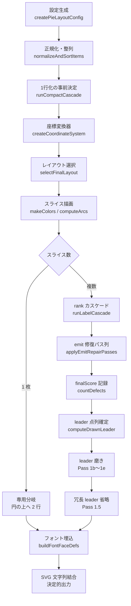
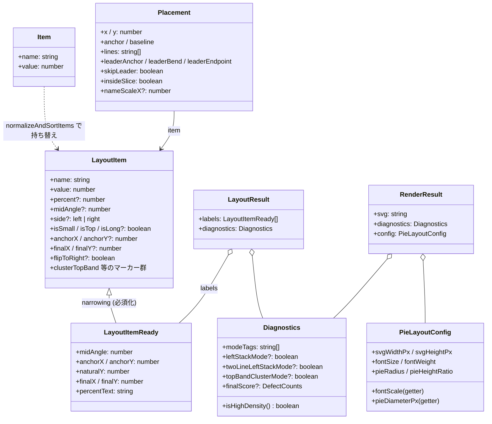
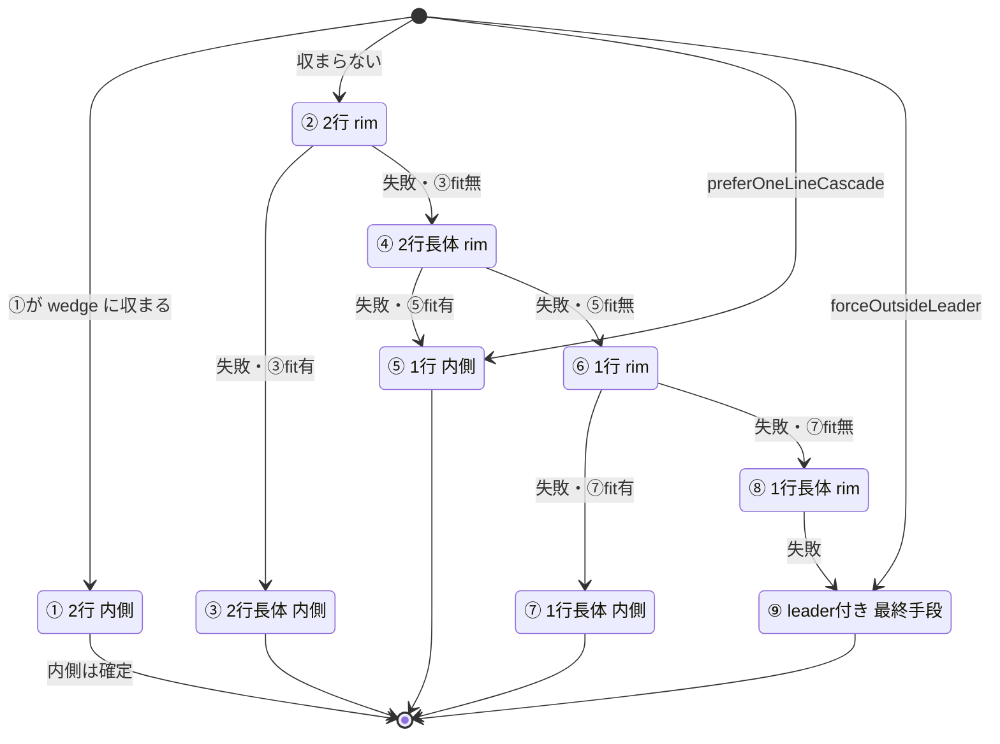
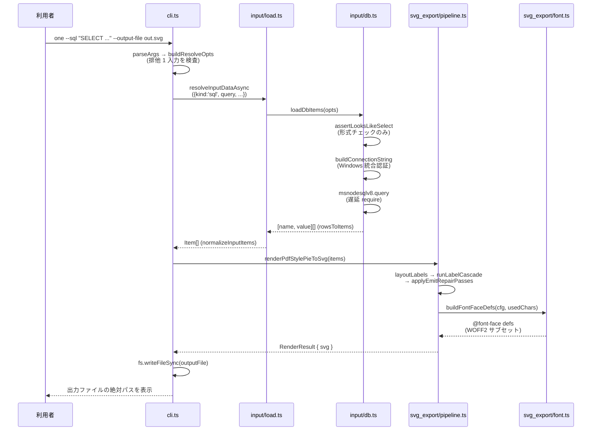

本書は pie-chart の構造・レイヤ責務・ラベル配置/引出線アルゴリズム・決定的出力の検証方針を記述する。TypeScript にまだ慣れていない読者でも実装を追えるところまで掘り下げることを目標にしている。一次資料は `pie-chart/README.md` とソースのコメント（コメント規約準拠）。配置パイプラインの設計判断（モード×パス対応・do-no-harm ゲートの使い分け・却下済み設計案）の正典は別冊「pie-chart 設計正典」で、本書はその実装詳解にあたる。本文中のコード抜粋はすべて実ソースからの引用で、引用元をパスで示す。

# 1. 用語解説

本書で繰り返し使う用語を先にまとめる。TypeScript / SVG に不慣れな場合はここを起点に読み進めること。

| 用語 | 意味 |
|---|---|
| SVG | XML テキストで図形を記述する画像形式。本ツールの出力は `<svg>...</svg>` の文字列 1 本。 |
| viewBox | SVG の論理キャンバス。`viewBox="0 0 600 450"` なら幅 600 × 高さ 450 の座標空間に描く。「viewBox はみ出し」= ラベルがこの枠の外へ見切れること。 |
| leader（引出線） | ラベルとスライスを結ぶ折れ線。`<path>` 要素で描く。 |
| rim | 円グラフの外周（円周）。「rim 配置」は円周のすぐ外側に引出線なしでラベルを置く形。「rim 正面」は自スライスの中心角の延長線上を指す。 |
| wedge | スライスの扇形領域そのもの。「wedge 内配置」はラベルを扇形の内側に収める形（rank ①③⑤⑦）。 |
| seam（シーム） | 12 時位置の継ぎ目。先頭スライスと末尾スライスが接する角度（`startangle` = 90°）。この近傍のラベルを扱う逃がしパスと、その do-no-harm に使う `seamSnapshot` / `seamRestore` を「seam 系」と呼ぶ。 |
| nudge（ナッジ） | ラベルを最小限だけずらす押し退け。引出線端点・pie・他ラベル・viewBox 端との干渉を避けるための微移動（`nudgeTextAwayFromXxx` 群）。 |
| clips | `countDefects` が数える不具合の 1 つで、ラベルが viewBox の外へ見切れている件数。 |
| through | 二級 defect の 1 つで、引出線が他ラベルの箱を貫通している対。`countDefects` の総数には含めず、`EmitDefectVec` が「新規対なし」で見る。 |
| inv | 二級 defect の 1 つで、隣接ラベルの縦順序が角度順と逆転している対の数（angular inversion）。増加を許さない。 |
| faux-bold（擬似太字） | 太字フォントを使わず、塗りと同色の stroke を文字に重ねて太く見せる手法。`--stroke-ratio` / `textWeightStrokeRatio` で量を決め、0 で無効。文字幅（advance）は変えない。 |
| IoU | Intersection over Union。2 つの矩形の重なり面積を和集合の面積で割った比。本書では重なり判定の計算量を述べる箇所で、その種の幾何計算の代表として挙げる。 |
| anchor / baseline | テキストの揃え位置。anchor は横（start/middle/end）、baseline は縦（top/middle/bottom）の基準。 |
| 論理座標 | pie 中心を原点 (0,0)、pie 半径を 1.0 とする内部座標系。レイアウト計算はすべてこの単位で行い、描画直前に px へ変換する。 |
| 決定的出力 | 同じ入力から毎回バイト単位で同一の SVG が出ること。乱数・時刻・実行環境に依存しない。回帰検証（byte-diff）の土台。 |
| 長体（nameScaleX） | 文字を横方向にだけ縮める圧縮。`textLength` 属性で実現し、下限は 0.7（それ以上つぶさない）。 |
| rank カスケード | ラベル 1 枚の置き方を「良い形」から順に試す仕組み。rank ①（スライス内 2 行原寸）〜⑨（引出線つき外側配置 = 最終手段）まで降格しながら最初に成立した形を採る（6 章）。 |
| 配置モード | チャート全体の幾何条件で発火する専用配置。`leftStackMode`（左列 1 行縦積み）/ `twoLineLeftStackMode`（左列全 2 行密ピッチ）/ `topBandClusterMode`（12時クラスタ再配置）の 3 種で、`src/layout/diagnostics.ts` が判定し `src/svg_export/mode_passes.ts` の専用パスが担当する。 |
| do-no-harm | 修復パスの採否基準。「適用して不具合数が悪化しないときだけ採用、悪化したら差し戻す（revert）」という原則。計測系は 4 系統あり（9.4 節）、段階で使い分ける。 |
| `EMIT_REPAIR_PASSES` の stage | emit 修復パス列の各エントリが持つ適用先の区分。`'emit'`（既定 = 実出力のみ）/ `'scoring'`（採点のみ）/ `'both'`（両方）。採点列と emit 列を同一テーブルから生成し、列のずれ（drift）を構造的に防ぐ（9.3 節）。 |
| scorer / 採点 | 配置候補の優劣を数える内部の不具合カウント（`countDefects`）。emit（実際の SVG 書き出し）と同じ基準であることを `verify/consistency.ts` が検証する。 |
| 独立オラクル | 本体のロジックを import せず、生成済み SVG を独自の判定式で検査する検証器（`src/verify/svg.ts`）。本体のバグが検証もすり抜ける事態を防ぐ。 |
| draft / form | rank カスケード内部の中間表現。form はラベルの形（行数・幅・長体率）、draft は座標・引出線込みの配置案。最終的に `Placement` へ確定する。 |
| interface（TS） | TypeScript の型定義。`interface Item { name: string; value: number }` は「name と value を持つオブジェクト」という形の宣言で、実行時コードは生成されない。 |
| getter（TS） | `get fontScale() { ... }` の形で定義する読み取り専用プロパティ。参照するたびに計算されるので、基になる値を差し替えると派生値も追随する。 |
| Node SEA | Node.js の Single Executable Application。JS バンドルを node.exe に注入して単一 exe を作る仕組み（14 章）。 |
| WOFF2 サブセット | フォントから実際に使う文字だけを抜き出した小さなフォント。SVG に base64 で埋め込む（10 章）。 |

# 2. レンダリングパイプライン全体像

公開 API は `renderPdfStylePieToSvg`（async、`src/svg_export/pipeline.ts`）。ここが全レイヤを束ねるオーケストレータで、以降の章は呼び出される順に各レイヤを説明する。


## 2.1 レイヤ構成と依存方向

役割別フォルダ（`input/` / `layout/` / `svg_export/` / `verify/` / `glyph_advance/`）で構成し、依存は常に「下層ほど純粋（副作用・外部依存なし）」の一方向。

| レイヤ | ファイル | 責務 | 章 |
|---|---|---|---|
| 型 | `src/types.ts` | 全体共通の TS interface（`Item` / `LayoutItem` / `Placement` / `Diagnostics` / `PieLayoutConfig` 等） | 3 |
| 入力 | `src/input/load.ts` + `samples.json` / `src/input/db.ts` | サンプル読込、JSON / Excel / DB(SQL Server) 入力、`{name, value}` 正規化。DB はネイティブ依存ごと `db.ts` に隔離 | 3 |
| 設定 | `src/config.ts` | 基準寸法・フォント・派生スケール getter 群（`createPieLayoutConfig`）+ 配色（`makeColors`） | 4 |
| 幾何 | `src/layout/geometry.ts` | 純粋幾何/測定/ナッジ系ヘルパー（SVG 文字列生成なし・副作用なし）+ glyph advance 表の束ね | 7 |
| glyph 幅表 | `src/glyph_advance/weight_400.ts` / `weight_700.ts` | 生成物（`npm run gen:widths`）。実フォントの glyph advance 例外表 | 7 |
| レイアウト | `src/layout/diagnostics.ts` | 論理座標でのラベル位置決定（左右割当・Y 解決・flip 判定・X 配置）とモード判定・per-item マーカー付与。公開 API は `layoutLabels` | 5 |
| 経路選択 | `src/layout/placement.ts` | rank ①〜⑨ の配置候補（form / draft）を作るビルダ群と、引出線 SVG path（`leaderPath`） | 6 |
| 描画 | `src/svg_export/rendering.ts` | 論理座標 → SVG px への座標変換、スライス path・テキスト要素（純粋関数） | 8 |
| 引出線幾何 | `src/svg_export/leader_geometry.ts` | 実描画する引出線の点列を確定する `computeDrawnLeader` と交差・貫通・角度整合の計測 | 8 |
| 後処理 | `src/svg_export/post_layout.ts` | overlap 解消（対角押し + 縦分離）・compact cascade・視覚 viewBox nudge・長体クランプ | 9 |
| モード特化 | `src/svg_export/mode_passes.ts` | 配置モード専用パス（左列縦積み / top-band クラスタ / 右上逃がし） | 9 |
| emit 修復 | `src/svg_export/emit_repair.ts` | `EMIT_REPAIR_PASSES` 修復パス列・採点（`countDefects` 系）・do-no-harm ゲート基盤 | 9 |
| フォント | `src/svg_export/font.ts` | WOFF2 サブセット埋込（async I/O + キャッシュ。SEA では失敗を throw、dev のみフォントと認識できたときにフルフォント fallback） | 10 |
| 統合 | `src/svg_export/pipeline.ts` | `renderPdfStylePieToSvg` の最終アセンブリ、rank カスケード実行エンジン、候補選択 | 2, 6, 9 |
| 検証 | `src/verify/svg.ts` / `consistency.ts` / `oracle_sync.ts` | 独立オラクル検証 / 採点↔emit 一致検証 / オラクル複製定数の drift ガード | 12 |
| エントリ | `src/cli.ts` / `src/test_batch.ts` | CLI（`list` / `one` / `batch` / `license`）/ 全 83 サンプル一括生成 + 比較ビューア | 12, 15 |

サイズ感の目安（行数）: `svg_export/emit_repair.ts` 2,305 / `mode_passes.ts` 1,735 / `layout/diagnostics.ts` 1,626 / `svg_export/pipeline.ts` 1,591 / `layout/geometry.ts` 1,153 / `svg_export/leader_geometry.ts` 1,063 / `layout/placement.ts` 968 / `svg_export/post_layout.ts` 721。src 全体で約 14,000 行（2026-07 時点の目安）。

## 2.2 トップレベルの処理手順

`renderPdfStylePieToSvg`（`src/svg_export/pipeline.ts`）の流れをアクティビティ図で示す。



各ステップの担当章: 設定生成は 4 章、正規化と `runCompactCascade` は 3 章と 9.2 節、`selectFinalLayout`（`layoutLabels` + 回転 do-no-harm + 右上逃がし枚数探索）は 5 章、`runLabelCascade` は 6 章、`applyEmitRepairPasses` は 9.3 節、`computeDrawnLeader` と Pass 1b〜1e は 8.3 節、フォント埋込は 10 章。

エントリ部の実コード（`src/svg_export/pipeline.ts` 抜粋）:

```ts
export async function renderPdfStylePieToSvg(
  rawItems: unknown,
  options: Partial<PieLayoutConfig> & { compactLabel?: boolean } = {},
): Promise<RenderResult> {
  const cfg = createPieLayoutConfig(options);
  const items: LayoutItem[] = normalizeAndSortItems(rawItems);
  if (items.length === 0) {
    throw new Error('At least one item with a non-zero value is required.');
  }

  if (options.compactLabel === undefined) {
    runCompactCascade(items, cfg);
  }

  const coord = createCoordinateSystem(cfg);
  const { width, height, xScale, yScale } = coord;

  const finalLayout: LayoutResult | null = selectFinalLayout(items, cfg, coord);
  const colors = makeColors(items.length, cfg);
  const arcs = computeArcs(items, cfg);
```

最終段は文字列の単純結合で、外部ライブラリを使わない（`src/svg_export/pipeline.ts`）:

```ts
  // ── 3. SVG 全体を結合 ──
  const fontDefs = await buildFontFaceDefs(cfg, usedChars);
  const svg = [
    `<?xml version="1.0" encoding="UTF-8"?>`,
    `<svg xmlns="http://www.w3.org/2000/svg" viewBox="0 0 ${width} ${height}" width="${cfg.svgWidthPx}px" height="${cfg.svgHeightPx}px" shape-rendering="geometricPrecision">`,
    fontDefs,
    `<rect width="${width}" height="${height}" fill="${cfg.backgroundColor}" />`,
    `<g id="slices">${sliceGroups.join('')}</g>`,
    `<g id="labels">${labelGroups.join('')}</g>`,
    `</svg>`,
  ].join('');

  return { svg, diagnostics: diagnostics!, config: cfg };
}
```

戻り値の型（`src/types.ts`）。SVG 文字列に加えて、配置判断に使った診断情報と設定を返すので、呼び出し側やテストが判断根拠を検査できる:

```ts
export interface RenderResult {
  svg: string;
  diagnostics: Diagnostics;
  config: PieLayoutConfig;
}
```

> [!INFO] スライスが 1 枚だけのときは配置問題が存在しないため、`items.length === 1` の専用分岐が円の上方へ名前・% の 2 行を置くだけで返す。以降の章のレイアウト機構はすべて複数スライス時の話。

# 3. 型とデータ入力層

## 3.1 主要 interface（`src/types.ts`）

主要な型の関係をクラス図で示す。`LayoutItem` は入力からレイアウト各段が自分の担当フィールドを**段階的に付け足していく**「建造中」の型で、`LayoutItemReady` は必須フィールドが埋まったことを表す narrowing 型（`LayoutItem & {...必須化}`）である。



入力 1 件は最小の `Item`（`src/types.ts`）:

```ts
export interface Item {
  name: string;
  value: number;
}
```

`LayoutItem` のフィールドは大別して「角度・分類（`buildProfiles` が付与）」「配置座標（`buildCandidates` / `resolveSidePositions` / `placeX` が付与）」「flip / band メタ」「配置マーカー群」の 4 群（抜粋）:

```ts
export interface LayoutItem {
  name: string;
  value: number;
  signedValue?: number;
  percent?: number;
  percentText?: string;

  // 角度・分類 (buildProfiles)
  midAngle?: number;
  side?: 'left' | 'right';
  isSmall?: boolean;
  isTiny?: boolean;
  isTop?: boolean;
  isBottom?: boolean;
  isUpperLeft?: boolean;
  isUpperRight?: boolean;
  isLong?: boolean;
  compactLabel?: boolean;
  estLines?: number;

  // 配置座標 (buildCandidates / resolveSidePositions / placeX)
  anchorX?: number;
  anchorY?: number;
  naturalY?: number;
  finalX?: number;
  finalY?: number;
  upperLeftRenderY?: number;

  // flip / band メタ
  flipToRight?: boolean;
  flipToLeft?: boolean;
```

これに続けて、配置マーカー（`useStackRimY` / `keepTwoLineLeftStack` / `topRightRejected` / `clusterTopBand` / `bottomCenterBelow` / `forceOutsideLeader` / `lowerLeftDropLeader` / `bisectedDominantCenter` 等）が 1 つずつ doc comment 付きで宣言されている。どの関数が立ててどの関数が読むかはフィールドのコメントが正典なので、マーカーを追うときは `src/types.ts` を先に読むと早い。

> [!WARN] `LayoutItem` は index signature（`[key: string]: unknown` のような任意キー許可）を**意図的に持たない**。フィールドを増やすときは必ず interface に宣言する。これにより `item.finalY` を `item.finalW` と書き間違えるようなミスがコンパイル時に検出される。`Diagnostics` / `PieLayoutConfig` も同方針。

その他の重要な型:

| 型 | 役割 |
|---|---|
| `LayoutItemReady` | `buildCandidates` 通過後に必須フィールドが埋まったことを表す型。`LayoutResult.labels` はこの型で返す。 |
| `LayoutResult` | `{ labels: LayoutItemReady[]; diagnostics: Diagnostics }`。レイアウト層（5 章）の出力。 |
| `Placement` | rank カスケード → 後処理 → SVG 出力の間で受け渡す確定配置。`x, y, anchor, baseline, lines, leaderAnchor/Bend/Endpoint, skipLeader, insideSlice, nameScaleX` 等を持つ。 |
| `Diagnostics` | 混雑診断の結果。`modeTags`・配置モードフラグ（`leftStackMode` / `twoLineLeftStackMode` / `topBandClusterMode`）・各種密度フラグ・`isHighDensity()`・`finalScore`。 |
| `PieLayoutConfig` | 設定。基本フィールド + 派生 getter をすべて明示宣言（4 章）。 |
| `SampleEntry` / `Samples` | `samples.json` の 1 件 / 全体の型。 |

## 3.2 入力の正規化（`src/input/load.ts`）

入力ソースは 5 系統（sample / data / dataJson / xlsx / sql）。同期版 `resolveInputData` は前 3 系統のみ、非同期版 `resolveInputDataAsync` が xlsx / sql も扱う。非同期版の引数は discriminated union で、「どの入力か」を型レベルで確定させる（`src/input/load.ts`）:

```ts
export type ResolveAsyncOpts =
  | { kind: 'sample'; sample: string }
  | { kind: 'data'; data: unknown[] }
  | { kind: 'dataJson'; dataJson: string }
  | { kind: 'xlsx'; xlsx: string; sheet: string; range: string }
  | {
      kind: 'sql';
      query: string;
      server?: string;
      database?: string;
      nameColumn?: string;
      valueColumn?: string;
    };
```

`normalizeInputItems` は `[name, value]` タプルと `{name, value}` オブジェクトの両形式を受け付けて `Item[]` に揃える。それ以外の形は即例外にして、不正入力を早期に落とす:

```ts
export function normalizeInputItems(rawItems: unknown): Item[] {
  if (!Array.isArray(rawItems)) {
    throw new Error('Input data must be an array.');
  }
  return rawItems.map((item: unknown): Item => {
    if (Array.isArray(item) && item.length >= 2) {
      return { name: String(item[0]), value: Number(item[1]) };
    }
    if (typeof item === 'object' && item !== null && 'name' in item && 'value' in item) {
      const obj = item as { name: unknown; value: unknown };
      return { name: String(obj.name), value: Number(obj.value) };
    }
    throw new Error('Each item must be {name, value} or [name, value].');
  });
}
```

描画直前には `normalizeAndSortItems`（`src/svg_export/pipeline.ts`）がさらに: (1) 有限かつ絶対値が 0 より大きい値だけ残す、(2) 絶対値化しつつ元の符号を `signedValue` に保持、(3) **値降順・「その他」末尾**に並べ替える:

```ts
export function normalizeAndSortItems(rawItems: unknown): LayoutItem[] {
  return normalizeInputItems(rawItems)
    .filter((item) => Number.isFinite(Number(item.value)) && Math.abs(Number(item.value)) > 0)
    .map((item) => ({
      name: item.name,
      value: Math.abs(Number(item.value)),
      signedValue: Number(item.value),
    }))
    .sort((a, b) => {
      const aOther = isOtherCategory(a.name);
      const bOther = isOtherCategory(b.name);
      if (aOther !== bOther) return aOther ? 1 : -1;
      return b.value - a.value;
    });
}
```

> [!INFO] 並び順はここで内部的に確定するため、`samples.json` や Excel 上の行の並びは出力に影響しない。

## 3.3 Excel / DB ローダ（依存の隔離）

- `loadXlsxItems({ path, sheet, range })`（`src/input/load.ts` の xlsx 節）: Excel から 2 列固定（左=name、右=value）で読む。`parseRange` が `"A2:B11"` を分解し、2 列でなければ throw。空行はスキップ、name 空欄・非数値 value は明示エラー。数式セルは結果値を、リッチテキストは平文を `unwrapCellValue` で取り出す。`exceljs` 依存はこのファイルに閉じる。
- `loadDbItems`（`src/input/db.ts`）: SQL Server へ 1 本の読み取りクエリを投げ、結果セットの 2 列を読む（`rowsToItems`。列名指定は `nameColumn` / `valueColumn` 両方必須、無指定は先頭 2 列）。`buildConnectionString` が Windows 統合認証（`Trusted_Connection=yes`）の ODBC 接続文字列を組み、driver / server / database / extra の各値は許可リストで検証する。ネイティブ依存 `msnodesqlv8` は `createRequire` による**遅延ロード**で、未導入環境でも他入力と `tsc` は動く。SEA（exe 版）では冒頭の `isSea()` ガードが明示エラーにする（exe 版は DB 入力非対応。14 章）。

クエリの形式チェック `assertLooksLikeSelect`（`src/input/db.ts`）。先頭キーワード（SELECT / WITH）と文中の `;` を見るだけの**形式チェックであって権限境界ではない**。`SELECT … INTO` や `WITH … DELETE` は形の上で通り、T-SQL は文の区切りに `;` を要求しないため、文字列パターンで読み取り専用性は強制できない。読み取り専用は接続アカウントの権限（対象 DB で `db_datareader` だけを持つログイン）で担保する:

```ts
export function assertLooksLikeSelect(query: string): void {
  const trimmed = query.trim().replace(/;\s*$/, '').trim();
  if (trimmed === '') {
    throw new Error('Query is empty.');
  }
  if (trimmed.includes(';')) {
    throw new Error('Query looks like multiple statements (embedded ";"); pass a single query.');
  }
  if (!/^(select|with)\b/i.test(trimmed)) {
    throw new Error('Query must start with SELECT or WITH (this is a typo check, not a boundary).');
  }
}
```

> [!INFO] DB ローダを `load.ts` へ統合しない理由: `input/db.ts` の module 境界はネイティブ依存の隔離に加えて、テストの `vi.mock` 差し替え点でもある（統合すると同一モジュール内呼び出しになりモック不能）。設計正典の却下理由集にも記載。

# 4. 設定層 config.ts

## 4.1 基準寸法と base 値

`createPieLayoutConfig(overrides)` は base 値に overrides を重ねたうえで派生 getter を載せて返す。単位換算は `PT_PER_MM = 1/0.352778 ≈ 2.83465`。主要な base 値（`src/config.ts` 抜粋）:

```ts
  const base = {
    baselineFontSize: 20,

    svgWidthPx: 600,
    svgHeightPx: 450,

    pieRadius: 1.0,
    pieHeightRatio: 0.7, // pie 直径が `svgHeightPx` に占める割合 (= 半径が高さ半分の 70%)
    labelRadius: 1.19,
    startangle: 90.0,
    counterclock: false,

    fontSize: 40,
    textRenderScale: 0.68,

    smallSliceThreshold: 6.0,
    tinySliceThreshold: 4.0,
    topZoneDeg: 38.0,
    bottomZoneDeg: 28.0,

    denseCountThreshold: 9,
    ultraDenseCountThreshold: 11,
    oneSideDenseThreshold: 6,

    pieLabelClearance: 0.08,
    pieLabelClearanceMin: 0.05,
    nameCondenseSteps: [0.7],
    ...overrides,
  };
```

寸法の考え方: `1 viewBox unit = 1px` 固定、キャンバスは **600×450px 固定**。pie の直径は「高さの 70%」で **fontSize に依存しない**。pie は常にキャンバス中央にあり、上下余白は `(svgHeightPx − pieDiameterPx) / 2` の逆算で決まる。

`pieLabelClearance`（円とラベル bbox の狙いギャップ 0.08）はラベルごとに「viewBox に収まる範囲」でのみ広がり、収まらない幅広ラベルは `pieLabelClearanceMin`（0.05 = 旧既定）まで円へ寄る（`src/layout/geometry.ts` の `pieClearanceWithinViewBox`）。この 2 段構えにより、クリアランス拡大が見切れを新設しない。

フォントウェイトは `WEIGHT_FONT` 表（400=Regular / 700=Bold の woff2）から `fontWeight` に応じて `embedFontPath` 既定が自動選択される。`textWeightStrokeRatio` は faux-bold（擬似太字）用で、塗りと同色の stroke を font-size 比で載せる（0=無効。advance 不変）。

## 4.2 派生 getter の連動

派生値はオブジェクトリテラルの `get` アクセサで定義し、`this` 経由で他の getter を連鎖参照する。`fontSize` を 1 か所変えるだけで、それを参照するすべての派生寸法が自動で追随する（`src/config.ts` 抜粋）:

```ts
  return {
    ...base,
    get fontScale(): number {
      return this.fontSize / this.baselineFontSize;
    },
    get geometryScale(): number {
      return Math.max(0.82, 1.0 + (this.fontScale - 1.0) * 0.25);
    },
    get fontSizeUnits(): number {
      return this.fontSize * this.textRenderScale;
    },
    get pieDiameterPx(): number {
      const diameter = this.pieHeightRatio * this.svgHeightPx;
      if (diameter <= 0 || diameter > this.svgWidthPx) {
        throw new Error(/* pieDiameterPx out of range ... */);
      }
      return diameter;
    },
    get pieRadiusPx(): number {
      return this.pieDiameterPx / 2;
    },
    get pxPerUnit(): number {
      return this.pieRadiusPx / this.pieRadius;
    },
```

ほかに `canvasYlim` / `canvasXlim`（ラベル可動域を論理単位で返す）、`scaledMinGap` 等の gap 系（`gapScale` 倍）、`bottomSpecialY` / `flipHorizontalCap` 等の配置系派生値が同じ形で連なる。getter を追加したら `src/types.ts` の `PieLayoutConfig` にも宣言を追加すること（明示宣言の方針）。

## 4.3 配色（`makeColors`）

`makeColors` は 4 段グレースケール `grayScale4`（`['#d1d2d4', '#a7a9ab', '#808284', '#57585a']`）をスライス数だけ循環させる。先頭と末尾が同色になる場合は末尾を `base[1]` へずらし、隣接同色で境界が消えるのを避ける。1 スライス時は最も淡い色のみ。

# 5. レイアウト層 layout/diagnostics.ts

ラベルの縦横位置を**論理座標**で決める中核レイヤ。公開 API は `layoutLabels` の 1 関数のみで、ファイル内は section header コメントで 6 区分されている。あわせて配置モードの判定（`Diagnostics` の生産者）と per-item マーカー付与もこの層が担う。

## 5.1 座標系

- **原点**: pie 中心 (0,0)。論理単位で `pieRadius = 1.0`。
- **角度**: `startangle = 90`（12 時方向が 0 番目のスライスの開始）、`counterclock = false`（時計回り）。`midAngle` は度数法で `normalizeAngle` により [0, 360) に正規化。`classifySide` は `90 < angle < 270` を左、それ以外を右と判定する。
- **y の向き**: 論理座標は数学の慣例どおり上向きが正。SVG は下向きが正なので、描画層の `yScale` が反転を吸収する（8 章）。

## 5.2 セクション構成

`src/layout/diagnostics.ts` 冒頭のバナーコメントに対応する 6 区分:

1. **profiles**: `buildProfiles / classifySide / estimateTextLines / calcMidAngles / buildCandidates`
2. **diagnostics**: `collectSliceCounts / deriveModeTags / runDiagnostics`
3. **resolve (vertical)**: `baseGap / pairGap / resolveSidePositions / applyBottomSpecial`
4. **flip helpers**: `estimateUpperLeftStackHeight / flipUpperLeftStackToRight / applyFlipToRight / applyBottomFlipToLeft` 等
5. **render Y assignment + placeX**: `assignUpperLeftRenderY / placeX / spreadSmallSlicesX` + 特殊配置マーカーを立てる `markXxx` 関数群
6. **`layoutLabels`**（公開 API・エントリ）

## 5.3 ステップ 1: 角度計算とプロファイル化

`calcMidAngles` は各スライスの中心角（度）を求めるだけの薄い関数:

```ts
function calcMidAngles(values: number[], cfg: PieLayoutConfig): number[] {
  return arcAngles(values, cfg).map(({ midAngle }) => normalizeAngle(radToDeg(midAngle)));
}
```

`buildProfiles` が角度・割合・名前長から分類フラグ一式を付与する。以降のすべての判断はこのフラグを参照する（`src/layout/diagnostics.ts` 抜粋）:

```ts
    return {
      name,
      value,
      signedValue: Number(signedValues ? signedValues[index] : values[index]),
      percent,
      midAngle: angle,
      side: classifySide(angle),
      isSmall: percent <= cfg.smallSliceThreshold,
      isTiny: percent <= cfg.tinySliceThreshold,
      isTop: Math.abs(angle - 90) <= cfg.topZoneDeg,
      isBottom: Math.abs(angle - 270) <= cfg.bottomZoneDeg,
      isUpperLeft: angle > 90 && angle < 180,
      isUpperRight: angle >= 0 && angle < 90,
      isLong: name.length >= cfg.longLabelLen,
      isVeryLong: name.length >= cfg.veryLongLabelLen,
      compactLabel: isCompact,
      estLines: estimateTextLines(name, cfg, isCompact),
    };
```

続く `buildCandidates` が各ラベルに (1) `anchorX/anchorY`（引出線の起点。スライス中心角上の円周点）と (2) `naturalY`（重なり解消前の希望 Y 位置）を与える。

## 5.4 ステップ 2: 混雑診断と配置モード判定（`runDiagnostics` / `deriveModeTags`）

側別・帯別のスライス数を `collectSliceCounts` で数え、閾値と比較して密度フラグを立てる。フラグは以降のあらゆる分岐の入力になる（`src/layout/diagnostics.ts` 抜粋）:

```ts
    manyItems: profiles.length >= cfg.denseCountThreshold,
    ultraDenseItems: profiles.length >= cfg.ultraDenseCountThreshold,
    oneSideDense: Math.max(leftCount, rightCount) >= cfg.oneSideDenseThreshold,
    isHighDensity: () =>
      Boolean(diag.manyItems || diag.oneSideDense || diag.topSmallDense || diag.longLabelDense),
    modeTags: [] as string[],
```

配置モードは `deriveModeTags` が**幾何条件のみ**で立てる（サンプル名指し・per-sample config は禁止。分布は `test/__snapshots__/mark_flags.test.ts.snap` のゴールデンが固定）。発火条件の実体:

```ts
  // leftStackMode: 左側 small slice >=4 件で発火する汎用ケース。
  const leftStackMode = diag.upperLeftSmallCount! >= 4;

  // twoLineLeftStackMode: 左列 (その他除く) に外側ラベルが多数 (>=6) 寄る過密チャート。
  const twoLineLeftStackMode = !leftStackMode && (diag.leftColumnCount ?? 0) >= 6;

  // topBandClusterMode: 12時近傍 (mid 90°±30°) に small slice が 4 件以上集まる密集ケース。
  const topBandClusterMode = (diag.topBandClusterCount ?? 0) >= 4;
```

現行 83 サンプルでのモード分布（設計正典の配置モード対応表と同値）:

| モード | 件数 | 発火条件 | 担当パス（9 章） |
|---|---|---|---|
| （なし = 素のカスケード） | 54/83 | — | `runLabelCascade` の①〜⑨カスケードのみ |
| `leftStackMode` | 21 | 左側 small slice ≥4（`upperLeftSmallCount`） | 左列 1 行強制縦積み + `mode_passes.ts` の left-stack 系パス群 |
| `twoLineLeftStackMode` | 8 | 左に外側ラベル ≥6（`leftColumnCount`）。leftStack と排他 | `applyTwoLineLeftColumn`（全 2 行のまま canvas 全高の密ピッチ縦 1 列） |
| `topBandClusterMode` | 1 | 12時近傍 ±30° に small slice ≥4（`topBandClusterCount`）。leftStack と並行発火しうる | `applyTopBandClusterReorder`（midAngle 順再スタック + 天端リフト） |

## 5.5 ステップ 3: 縦位置の解消（`resolveSidePositions`）

左右のサイドごとに、ラベル同士が縦に重ならないよう `finalY` を反復調整する:

```ts
function resolveSidePositions(
  sideItems: LayoutItemReady[],
  side: 'left' | 'right',
  diagnostics: Diagnostics,
  cfg: PieLayoutConfig,
): void {
  if (sideItems.length === 0) return;
  setInitialFinalY(sideItems, side, cfg);
  if (side === 'right') {
    resolveRightSidePositions(sideItems, diagnostics, cfg);
  } else {
    resolveLeftSidePositions(sideItems, diagnostics, cfg);
  }
}
```

- 右側: 上→下・下→上の 2 パスで押し広げる。
- 左側: 上群・下群を別々に解消し、衝突したら半分ずつ押し戻して合流させる。
- 必要な間隔は `baseGap`（行数・長文・密集モードで加算）と `pairGap`（隣接 2 枚が両方複数行ならさらに余裕）で決める。

## 5.6 ステップ 4: flip 判定

左上にラベルが積み上がって天井（`scaledYTop`）を超える場合、上帯寄りのものから順に右側へ退避（flip）させる（`flipUpperLeftStackToRight`）。「スタックの推定高さ（`estimateUpperLeftStackHeight`）が天井に収まるまで 1 枚ずつ抜く」というシンプルなループである。関連して `applyFlipToRight`（左→右へ座標反転し、pie に食い込むなら外へ押し出す）、`applyBottomFlipToLeft`（6 時付近の右小スライスを左へ回す）がある。

## 5.7 ステップ 5: 上左スタックの描画 Y（`assignUpperLeftRenderY`）

上左象限は「finalY（衝突解消済みの位置）」とは別に、描画専用の `upperLeftRenderY` を計算する。自然なスタック位置が天井に収まらないときは、最小詰めスタックと希望位置を線形補間して圧縮する。ここで立つ `useStackRimY` マーカーは、6 章の `buildOutsideRimDraft` が「自然 rim Y の代わりに事前計算の縦スタック値を使う」合図としてレイアウト層と経路選択層をつなぐ。

## 5.8 ステップ 6: 横位置（`placeX`）

縦位置が決まったら、ラベルを pie を囲む「楕円リング」上に置く。基本形は円の式 `x = √(r² − y²)` で、y が高い（低い）ほど x が内側に入る。そこへ位置別の係数補正（`isBottom` / 下帯 / 上左長名など）を加え、`side === 'left'` なら符号反転する。

## 5.9 エントリ `layoutLabels` の全体順序

上のステップを束ねる呼び出し順（`src/layout/diagnostics.ts` 抜粋。`markXxx` 群は特殊配置のマーカー立てで、実座標は変えない）:

```ts
  const left = candidates.filter((item) => item.side === 'left');
  const right = candidates.filter((item) => item.side === 'right');

  resolveSidePositions(left, 'left', diagnostics, cfg);
  resolveSidePositions(right, 'right', diagnostics, cfg);
  applyBottomSpecial(left, cfg);
  applyBottomSpecial(right, cfg);

  flipUpperLeftStackToRight(left, diagnostics, cfg);
  diagnostics.upperEscapeCandidateCount = leftStackUpperEscapeCandidates(left).length;
  markLeftStackUpperEscapeRight(left, right, diagnostics, cfg, upperEscapeCount);
  ...
  assignUpperLeftRenderY(left, diagnostics, cfg);
  markTopBandSmallRight(left, diagnostics);
  markClippedUpperLeftLongDrop(left, diagnostics, cfg);
  markTopBandSlivers(candidates, left, diagnostics);
  markBottomCenterBelow(candidates, diagnostics, cfg);
  markDenseSideOutsidePush(left, diagnostics);
  markBisectedPie(candidates);
  markSingleDominantInside(candidates);
  placeX(left, 'left', diagnostics, cfg);
  placeX(right, 'right', diagnostics, cfg);

  spreadSmallSlicesX('left', left, cfg);
  spreadSmallSlicesX('right', right, cfg);

  applyFlipToRight(left, cfg);
  applyBottomFlipToLeft(left, right, cfg);

  return { labels: [...left, ...right], diagnostics };
```

`layoutLabels` のシグネチャは `layoutLabels(items, cfg, labelRotateOverrideDeg?, upperEscapeCount = 0)`。第 3 引数は左下密集時の「ラベルだけ反時計回りに回す」量の明示指定（呼び出し側 `selectFinalLayout` の do-no-harm 比較で 0=非回転を試すため）、第 4 引数は上左ラベルを右上へ逃がす枚数（`pickUpperEscapeCount` の探索が決める）。

> [!INFO] 左下が密集しているサンプルでは `labelCongestionOffsetDeg` が**ラベルの配置角だけ**を反時計回りに回す。スライス自体と引出線の起点は真のスライス角のままなので、絵としては「ラベルだけ少しずれて混雑が解ける」挙動になる。回転版が不具合を増やすなら `selectFinalLayout` が非回転版へ自動フォールバックする（do-no-harm）。

# 6. 経路選択層 layout/placement.ts と rank カスケード

## 6.1 rank カスケードの考え方

ラベル 1 枚の「置き方」は 9 段階の rank で表す。奇数（①③⑤⑦）がスライス内（wedge 内）配置、偶数（②④⑥⑧）が円外 rim 配置、⑨が引出線つき外側配置の最終手段で、数字が小さいほど望ましい形（`src/svg_export/pipeline.ts` のバナーコメントより）:

| rank | 形 |
|---|---|
| ① | 2 行・スライス内 |
| ② | 2 行・円外 rim |
| ③ | 2 行長体（0.7）・スライス内 |
| ④ | 2 行長体・円外 rim |
| ⑤ | 1 行・スライス内 |
| ⑥ | 1 行・円外 rim |
| ⑦ | 1 行長体・スライス内 |
| ⑧ | 1 行長体・円外 rim |
| ⑨ | 引出線つき外側配置（最終手段） |

カスケードの**反復エンジン**は `src/svg_export/pipeline.ts` の `runCascadeOnce` にあり、`src/layout/placement.ts` は各 rank の候補（form / draft）を作る**ビルダ集**という分担になっている。降格の流れを状態遷移図で示す:



読み方の要点:

- **内側 rank（①③⑤⑦）は確定状態**。wedge 内フィットは他ラベルに依存しない独立判定（`computeInsideOptions`）で、いったん内側に置けた placement は失敗判定の対象外（`runCascadeOnce` は `insideSlice` でない placement だけを失敗チェックする）。
- **降格は外側 rank から起きる**。`isCascadeFailed`（viewBox はみ出し / pie 侵入 / 他ラベルと閾値以上の重なり）が真なら `nextCascadeRank` が rank+1 へ進み、フィットしない内側 rank はスキップされる。8 を超えたら ⑨。
- **開始 rank はマーカーで変わる**。`forceOutsideLeader` は ⑨ 起点（rim leaderless で確定させず leader を引かせる）、左密集の `preferOneLineCascade` は ⑤（フィットしなければ ⑥）起点、通常は ①（フィットしなければ ②）起点。
- **降格ガード**: `useStackRimY` / `keepTwoLineLeftStack` のラベルは 1 行降格を許さず rank ④ で打ち止め（はみ出しは後段 `applyFinalCondenseToFit` の長体が吸収）。`bottomCenterBelow` は ⑧ まで許すが ⑨（leader 化)を禁止する。

エンジン中核の実コード（`src/svg_export/pipeline.ts`）:

```ts
/** 現 rank から次に試す rank を返す。不可能な inside rank はスキップ。8 を超えたら 9(最終手段)。 */
function nextCascadeRank(state: CascadeState): number {
  let r = state.rank + 1;
  while (r <= 8) {
    if (CASCADE_INSIDE_RANKS.has(r)) {
      if (state.insideOpts[r]) return r;
      r += 1;
    } else {
      return r;
    }
  }
  return 9;
}
```

反復は `CASCADE_MAX_ITER = 10` 回まで。各反復では外側 placement 群に `resolveLabelOverlaps` + pie ナッジ + クランプを `POST_LAYOUT_PASS_COUNT`（4）回かけたうえで失敗判定し、1 枚でも降格があれば再反復する。

## 6.2 ビルダ関数一覧（`src/layout/placement.ts`）

| 関数 | 扱う配置 | 入出力 |
|---|---|---|
| `computeInsideOptions` | wedge（スライス）内 rank ①③⑤⑦ | item, cfg → rank ごとの `InsideOption` または null |
| `outsideFormForRank` | 円外 rank ②④⑥⑧⑨ の形 | item, cfg, rank → `LabelForm` |
| `buildInsideDraft` | wedge 中心・引出線なし | form, fit → `PlacementDraft` |
| `buildOutsideRimDraft` | 円外 rim（中心角の外縁・引出線なし）の既定経路 | item, cfg, form → draft |
| `buildOutsideLeaderDraft` | rank ⑨ 最終手段（放射引出線） | item, cfg, form → draft |
| `topBandSonohokaRight` | 上部「その他」の右上逃がし | → draft or null |
| `topRightLiftedRimDraft` | 12 時直右のラベルを pie キャップ上へ持ち上げ | → draft |
| `topBandSmallRight` | 12 時直左の小スライスを右上へ | → draft or null |
| `clusterTopBandBottomRight` | 12 時クラスタ最下段の右逃がし | → draft or null |
| `bottomCenterBelow` | 6 時直下中央（引出線なし） | → draft or null |
| `topLiftedRimLeft` | 12 時直左の極小スライスの左 L 字逃がし | → draft |
| `buildLowerLeftDropLeaderDraft` | 9 時直近の幅広長名を水平軸下へ 2 行ドロップ | item, cfg, form → draft |
| `clampAndBuildPlacement` | 共通後処理: nudge・bbox・pie クリアランス・viewBox クランプ | → `Placement` |
| `finalizePlacement` | draft + form → 最終 `Placement` 組立 | → `{ textPlacement }` |
| `leaderPath` | 点列 → 引出線 SVG path 文字列 | 全配置共通 |

form（配置候補の形）の実体は `LabelForm`（`src/layout/placement.ts`）で、行数・長体率から実描画幅・高さまで込みで持つ:

```ts
export interface LabelForm {
  rank: number;
  lineCount: 1 | 2;
  nameScaleX: number;
  inside: boolean;
  name: string;
  percent: string;
  lines: string[];
  condenseNamePortionOnly: boolean;
  width: number; // 実描画幅 (論理単位, 名前長体反映済)
  height: number; // 実描画高 (論理単位)
}
```

## 6.3 代表ビルダの詳解

**`computeInsideOptions`**: wedge 内に収まる形を rank 別に探す。各 rank は他のラベルに依存しない独立判定:

1. `insideSliceEnabled === false` なら空を返す。
2. `bisectedDominantCenter`（pie が 2 分割で片方が支配的）なら rank ① を右半径の中点 `(pieRadius/2, 0)` へ強制する。
3. `singleDominantInside`（1 強スライス）ならアンカー半径を外へ押し出しながら探索する。
4. `tryForms` が `fitsInsideSliceExtent`（7 章）で各長体率を試し、「収まる最大の形」を返す。

```ts
  return {
    1: tryForms(1, 2, [1]),
    3: tryForms(3, 2, steps),
    5: tryForms(5, 1, [1]),
    7: tryForms(7, 1, steps),
  };
```

**`buildOutsideRimDraft`**: 円外 rim 配置の既定経路。まず特殊経路（`bottomCenterBelow` → 上部「その他」右上 → クラスタ右逃がし → 小スライス右）を順に試し、どれも該当しなければ中心角の外縁に置く。`useStackRimY` が立っているラベルは 5.7 節で事前計算した `upperLeftRenderY` をそのまま使う。

**`topBandSonohokaRight`**: 上部「その他」の右上逃がし。帯判定 `topBandSonohokaZone`（コア帯 90°±18° / 左拡張帯 ±32°。定数 `TOP_BAND_HALF_WIDTH_DEG` / `TOP_BAND_SONOHOKA_LEFT_EXT_HALF_WIDTH_DEG`）に該当しなければ null を返す。ゾーンと `topRightRejected` により「真上垂直引出線 + 上端寄せ」か「pie キャップ上への持ち上げ（`topRightLiftedRimDraft`）」に分かれる。右上（第一優先）と左上（代替）のどちらを採るかは、チャート単位の do-no-harm 比較 `cascadeWithSonohokaPick`（`src/svg_export/pipeline.ts`）が決める。

すべての draft は最後に `finalizePlacement` → `clampAndBuildPlacement` の共通後処理を通り、nudge（引出線端点・pie・他セグメントからの押し退け）と viewBox クランプを受けて `Placement` に確定する。

## 6.4 引出線の path 生成（`leaderPath`）

引出線は論理座標の点列を M/L 命令に変換して `<path>` に包むだけの純粋関数。点列の中身（どこで曲がるか）は 8 章の `computeDrawnLeader` が決める（`src/layout/placement.ts`）:

```ts
function pointPath(xScale: Scale, yScale: Scale, points: Point[]): string {
  return points
    .map((point, index) => `${index === 0 ? 'M' : 'L'}${xScale(point.x)},${yScale(point.y)}`)
    .join(' ');
}

export function leaderPath(
  xScale: Scale,
  yScale: Scale,
  points: Point[],
  cfg: PieLayoutConfig,
): string {
  return `<path d="${pointPath(xScale, yScale, points)}" fill="none" stroke="${cfg.lineColor}" stroke-width="${cfg.leaderStrokeUnits}" stroke-linecap="round" stroke-linejoin="round" />`;
}
```

# 7. 幾何ヘルパー layout/geometry.ts と glyph_advance

最下層の純粋関数集。座標変換・SVG 文字列生成・副作用をいずれも持たず、layout / placement / svg_export / 検証系のすべてから参照される。主要関数:

| 分類 | 関数 | 役割 |
|---|---|---|
| 文字幅 | `visualCharEm` / `visualMaxEm` / `visualTextWidthUnits` | 文字幅の**唯一の真実源**。実フォントの glyph advance テーブルを優先し、無い文字は Unicode 範囲で全角/半角にフォールバック |
| 文字幅 | `scaledLabelWidthUnits` | 長体（nameScaleX）を反映した実描画幅 |
| 角度 | `normalizeAngle` / `angleInBand` / `arcAngles` / `degToRad` / `radToDeg` | 角度演算（360° 跨ぎ対応）とスライス角列挙 |
| 分類 | `isOtherCategory` | 「その他」判定（`OTHER_CATEGORY_PREFIX` のプレフィックス） |
| 引出線 | `leaderBendPoint` / `upperLeftBendPoint` / `clampBendOutsideBox` / `truncateLeaderEndpointAtBox` | 折れ点・端点の幾何 |
| 判定 | `fitsInsideSlice` / `fitsInsideSliceExtent` | wedge 内フィット判定（rank ①〜⑦ の根拠） |
| bbox | `textBoxBounds` / `placementExtent` / `placementBox` | ラベルの矩形算定 |
| 交差 | `segmentsIntersect` / `leaderCrossesBox` | 線分交差・引出線とラベル箱の交差判定 |
| nudge | `nudgeTextAwayFromEndpoint` / `nudgeTextAwayFromPie` / `nudgeTextAwayFromSegment` / `pieClampXLimits` | 押し退け・クランプ |
| 単位 | `pxToLogical` | px 基準の閾値を論理座標へ持ち込む変換 |

文字幅は推定ではなく**実フォントの advance 値**で測る点が要（測り間違いはあらゆる配置判断を狂わせるため）。実 glyph advance の例外表は生成物 `src/glyph_advance/weight_400.ts` / `weight_700.ts`（`npm run gen:widths` = `scripts/gen_glyph_advance.ts` で再生成）に分かれ、束ねる `Record` は利用側の `layout/geometry.ts` が組む（再輸出 index は置かない。設計正典の却下理由集参照）:

```ts
const GLYPH_ADVANCE_BY_WEIGHT: Record<string, ReadonlyMap<number, number>> = {
  '400': GLYPH_ADVANCE_400,
  '700': GLYPH_ADVANCE_700,
};

export function visualCharEm(ch: string, cfg: PieLayoutConfig): number {
  const c = ch.codePointAt(0)!;
  const table = GLYPH_ADVANCE_BY_WEIGHT[cfg.fontWeight] ?? GLYPH_ADVANCE_BY_WEIGHT['400'];
  const real = table.get(c);
  if (real !== undefined) return real;
  if (c >= 0x4e00 && c <= 0x9fff) return cfg.visualFullwidthEm;
  if (c >= 0x3040 && c <= 0x309f) return cfg.visualFullwidthEm;
  if (c >= 0x30a0 && c <= 0x30ff) return cfg.visualFullwidthEm;
  ...
  return cfg.visualHalfwidthEm;
}
```

> [!INFO] 長名の 2 行救済は「名前を語中で割らない標準 2 行 `[名前, %]`」（9 章の `applyTwoLineNameFallback`）のみで、**名前を語中で分割する処理は持たない**。旧 `splitLongName` は全廃した。`Placement.nameSplit` フラグは後方互換のため型に残置されているが、現在はどこからも立てない。

# 8. 描画層 rendering.ts と引出線幾何 leader_geometry.ts

## 8.1 座標変換（`createCoordinateSystem`）

論理座標（pie 中心原点・上向き正）を SVG px（左上原点・下向き正）へ写す変換器。式は `unitScale = min(width/domainWidth, height/domainHeight)` を基本に、y だけ反転する（`src/svg_export/rendering.ts`）:

```ts
export function createCoordinateSystem(cfg: PieLayoutConfig): CoordSystem {
  const width = Math.round(cfg.fixedSvgWidthUnits);
  const height = Math.round(cfg.fixedSvgHeightUnits);
  const [xMin, xMax] = cfg.scaledXlim;
  const [yMin, yMax] = cfg.canvasYlim;
  const domainWidth = xMax - xMin;
  const domainHeight = yMax - yMin;
  const plotHeight = height;
  const topMargin = 0;
  const unitScale = Math.min(width / domainWidth, plotHeight / domainHeight);
  const xOffset = (width - domainWidth * unitScale) / 2;
  const yOffset = topMargin + (plotHeight - domainHeight * unitScale) / 2;

  return {
    width,
    height,
    unitScale,
    xScale(value: number): number {
      return xOffset + (value - xMin) * unitScale;
    },
    yScale(value: number): number {
      // SVG は y が下向きなので反転して描画する
      return plotHeight + topMargin - yOffset - (value - yMin) * unitScale;
    },
  };
}
```

## 8.2 テキスト断片（`textFragment`）ほか

- `textFragment` は `<text>` 1 個を組み立てる。複数行は `<tspan>` で表現し、baseline は SVG の `dominant-baseline`（top → text-after-edge / bottom → text-before-edge / middle）へ変換する。
- 長体は名前部分のみ `textLength` + `lengthAdjust="spacingAndGlyphs"` で横圧縮する（`CondenseSpec`）。2 行長体では Chromium の行送り破壊を避けるため、行位置を担う外側 tspan と圧縮を担う内側 tspan を分離する。
- faux-bold（擬似太字）は `textWeightStrokeRatio > 0` のとき塗りと同色の stroke を重ねて実現する。
- `buildSlicePath` はスライスの `<path d>` を作る（全周 360° は 1 本の arc で描けないため 2 つの半円に分割）。
- `detectVisualHorizontalOverflow` が viewBox 左右のはみ出しを判定する（9 章の修復パスの入力）。

## 8.3 引出線の実描画点列（`computeDrawnLeader`）と leader 磨きパス

引出線を「実際にどの点列で描くか」は `src/svg_export/leader_geometry.ts` の `computeDrawnLeader` が確定する:

```ts
export function computeDrawnLeader(
  placement: Placement,
  cfg: PieLayoutConfig,
  forScoring = false,
  allowTopCenter = false,
  allowGrazeLift = false,
  allowDiagonal = false,
  allowSideEdgeCenter = false,
): { pathPoints: Pt[]; detectPathPoints: Pt[]; skipLeader: boolean }
```

重要なのは `forScoring` 以降のフラグ引数群。**採点（配置候補の比較）時は挙動を固定**してレイアウト選択を baseline と同一に保ち、実描画時のみ描画改善を効かせる。「見た目の改善が配置判断を変えて別の退行を生む」ことを防ぐ do-no-harm 設計の中核である。円外ラベルには方針フラグ `ALWAYS_DRAW_OUTSIDE_LEADERS = true`（同ファイル）により常時 leader を描く。

実描画直前の leader 磨きは `renderPdfStylePieToSvg` 内の Pass 群（`src/svg_export/pipeline.ts`）が担う。いずれも**ラベル位置は動かさず**、他 leader との交差関係不変・他ラベル箱非貫通・円食い込み非悪化を確認してから採用する:

| Pass | 内容 |
|---|---|
| Pass 1 | 各 placement の最終 `pathPoints`・暫定 `skipLeader`・pixel bbox を確定 |
| Pass 1b | 側辺中央接続を「上辺中央」へ寄せる（`qualifiesTopCenterAttach`） |
| Pass 1c | 円周をなぞる 3 点 rim leader を W リルートで持ち上げる（`allowGrazeLift`） |
| Pass 1d | 水平先行 L 字 leader を斜め直線へ畳む（`allowDiagonal`） |
| Pass 1e | アンカーが自箱範囲へ食い込む側辺 leader を書き出し側の縦縁・縦中央接続へ付け替える（`qualifiesSideEdgeCenterAttach`） |
| Pass 1.5 | 1 強スライスの冗長な短い rim leader を省略（`isRedundantDominantRimLeader`） |
| Pass 3 | leader / text を emit |

（Pass 2 / 2.5 / 2.6 の leader 省略系は `ALWAYS_DRAW_OUTSIDE_LEADERS` が真の間は全てバイパスされる。）

# 9. 後処理層 post_layout.ts・モード特化 mode_passes.ts・emit 修復 emit_repair.ts

## 9.1 overlap 解消（`resolveLabelOverlaps`）の 3 段構成

位置確定後になお残るラベル同士の重なりを解消する（`src/svg_export/post_layout.ts`）。発動条件は縦重なりが閾値 `OVERLAP_THRESHOLD_PX`（6px）以上、反復上限 `OVERLAP_MAX_ITER`（8）。

1. **主パス**: bbox が厳密に重なるペアを、bbox 中心を結ぶベクトル方向へ対角に押し分ける。片方が縦方向に動けない（`blockedInY`）ときは他方に全量を振る。
2. **Secondary パス**: 横はほぼ重ならないが縦に重なるペアを、純粋に縦方向へ分離する。
3. **`settlePinnedClustersDownward`**: 天井に固定されたクラスタを下方向へ連鎖的に沈める。

## 9.2 compact cascade（`runCompactCascade`）による描画前の 1 行化判断

レイアウトを始める前に「どのラベルを 1 行表記（compact）にするか」「どれを強制 flip するか」を 7 パスの経験則で決める。各パスの発動条件は関数直上のコメントが正典（`src/svg_export/post_layout.ts`）:

```ts
export function runCompactCascade(items: LayoutItem[], cfg: PieLayoutConfig): void {
  if (items.length <= 1) return;
  compactPassTwoFlippedPreCompact(items, cfg);
  compactPassTwoUpperLeftNarrowTopBand(items, cfg);
  compactPassForceLowerLeftBand(items, cfg);
  compactPassDenseFlipPreCompact(items, cfg);
  compactPassCompactifyLoop(items, cfg);
  compactPassTwoFlippedPostCheck(items, cfg);
  compactPassRevertHorizonLong(items, cfg);
}
```

各パスは順序依存（前段の `compactLabel` 付与を次段の probe が観測する）のため、呼び出し順を変えてはならない。

## 9.3 emit 修復パス列（`EMIT_REPAIR_PASSES`）

位置とテキスト形が確定した後、emit（実際の SVG 書き出し）直前に、宣言テーブル `EMIT_REPAIR_PASSES`（`src/svg_export/emit_repair.ts`）の順で修復パスを 1 回ずつ適用する。**テーブルの並び順が適用順**であり順序依存がある（順序は `test/emit_passes.test.ts` が固定。エントリ順の変更は禁止）。エントリの型:

```ts
export interface EmitRepairPass {
  /** デバッグログ・`PIE_CHART_STOP_AFTER_PASS`・特性テストで参照する一意名。 */
  name: string;
  /** 発火条件 (未指定 = 常時)。現状は leftStackMode 限定の 2 群のみ。 */
  when?: (diag: Diagnostics | null) => boolean;
  run: EmitPassFn;
  /** どの列に含めるか (既定 'emit')。'both' = 採点列にも同順で含める。'scoring' = 採点列のみ。 */
  stage?: 'emit' | 'scoring' | 'both';
  /** stage='both' で採点側の実体が emit と異なる場合のみ指定 (例 seam 逃がしの thorough 差)。 */
  scoringRun?: EmitPassFn;
}
```

テーブル先頭部の実体:

```ts
export const EMIT_REPAIR_PASSES: readonly EmitRepairPass[] = [
  { name: 'visualViewBoxNudge', stage: 'both', run: (p, cfg) => applyVisualViewBoxNudge(p, cfg) },
  { name: 'finalCondenseToFit', stage: 'both', run: (p, cfg) => applyFinalCondenseToFit(p, cfg) },
  { name: 'relaxNameCondense', stage: 'both', run: (p, cfg) => relaxNameCondense(p, cfg) },
  {
    name: 'outsideLeaderAngularOrder',
    stage: 'both',
    run: (p, cfg, v) => applyOutsideLeaderAngularOrder(p, cfg, v, true),
    scoringRun: (p, cfg, v) => applyOutsideLeaderAngularOrder(p, cfg, v),
  },
  ...
];
```

代表的なパス（stage 無指定 = emit 限定）:

- **`finalCondenseToFit`**（both）: viewBox を見切れる外側ラベルを、収まるまで長体で縮める（下限 `FINAL_CONDENSE_MIN_SCALE` = 0.7）。
- **`relaxNameCondense`**（both）: 縮めすぎた長体を、キャンバス・pie・隣接ラベルに当たらない範囲で原寸（sx=1）へ戻す。
- **`repairResidualLeaderDefects`**（emit）: 残余の leader 交差/円内貫通/箱貫通を bend 再配置で解消する最終安全網。
- **`verticalDeclipFallback` / `lowerLeftDropFallback` / `twoLineNameFallback`**（emit）: 見切れ解消の最終手段 3 連。縦 spread → 下左ドロップ + 斜め leader → 標準 2 行化 `[名前, %]` の順に試し、先に解消すれば後続は no-op。
- **`alignLeftStackToAnchors` / `relieveLeftStackSpacing` 等**（`when: leftStackMode` 限定）: 左列縦積みの最終整え。

採点列（`finalizeForScoring`）は同じテーブルの `stage='both'/'scoring'` エントリから生成される。修復系・fallback 系を採点へ入れない理由: 「修復で直る前提」のスコアで候補選択が動き、修復しきれない候補を選ぶ退行を生むため（`finalizeForScoring` の doc comment が正典）。

デバッグ支援: `PIE_CHART_DEBUG_REPAIR=1` でパスごとの `RepairVec` 差分を stderr へ、`PIE_CHART_STOP_AFTER_PASS=<name>` で指定パス直後に打ち切り（回帰の犯人パスの二分探索用）。

## 9.4 採点と do-no-harm ゲート 4 系統

採点の基本は `countDefects`（`src/svg_export/emit_repair.ts`）。最終化済み placements から **clips**（viewBox 見切れ）/ **crossings**（leader 交差）/ **pie**（leader 円内貫通）/ **total**（box 重なり込みの総数）を数える。emit 実配置のカウントは `diagnostics.finalScore` に残り、`verify/consistency.ts` が emit SVG と突き合わせる。

ゲートは 4 系統あり、段階で使い分ける（一覧は設計正典と同値）:

| ゲート | 実装 | 使う場面 |
|---|---|---|
| `countVerifyIssuesDetailed` | emit_repair.ts | **cascade 段**の採否（emit と同一後段 `finalizeForScoring` を適用してから数える）。例: 2 行維持、天端リフト |
| `emitDefectsWorsened`（`EmitDefectVec`） | emit_repair.ts | **emit 段**パスの標準ゲート。一級 defect の非増加 + through/cross の**新規対なし** + inv（角度順逆転）非増加 |
| `hardDefectsWorsened` / `gateNotWorseExceptClips` | emit_repair.ts | 交差/円貫通は絶対増やさず clips 改善だけ許す等、非対称な採否 |
| `measureRepairVec` + `seamSnapshot`/`seamRestore` | emit_repair.ts | seam 系・残欠修復（`repairResidualLeaderDefects`）の全フィールド snapshot/revert |

二級 defect（`countDefects` が数えない leader のラベル箱貫通 `through`・角度順逆転 `inv` など）は `EmitDefectVec` や `upperEscapeScore` が明示的に併載して見る。「合計ではなく対の集合で見て、新規対が 1 つでも生じたら不採用」という per-pair 判定（`hasNewPair`）が、「ある貫通を消して別の貫通を作る」局所入替の取りこぼしを防ぐ。

## 9.5 モード特化パス（`mode_passes.ts`）

配置モード（5.4 節)ごとの専用パスは `src/svg_export/mode_passes.ts` に集約されている:

| モード | 主なパス |
|---|---|
| `leftStackMode` | `spreadLeftStackByAngle`（順序保存 spread）・`stackTopRightLiftedLabels`・`applyLeftStackGapClose`・`alignLeftStackToAnchors`（n≥4 接触級のみ。箱中心を自スライス rim 高さへ寄せる）・`reorderLeftStackWithCondense`・`separateLeftColumnByHeight`・`relieveLeftStackSpacing` |
| `twoLineLeftStackMode` | `applyTwoLineLeftColumn`（全 2 行のまま canvas 全高の密ピッチ縦 1 列） |
| `topBandClusterMode` | `applyTopBandClusterReorder`（midAngle 順再スタック + 天端リフト・均等再配分） |
| （共通） | `escapeTopBandSeamLeader`（12時シーム近傍の右上逃がし）・`tidyTopRightEscapeeStack`・`reorderTopBandLeftClusterByAngle` |

左列の等間隔全高展開・スポーク配置・テント配置は検討のうえボツ（leader 判読性 > 間隔の均等さ）。再提案しないこと。理由は設計正典の却下理由集を参照。

# 10. フォント埋込 font.ts

## 10.1 サブセット化の手順（`buildFontFaceDefs`）

`cfg.embedFont` が真のとき、フォント → サブセット化 → WOFF2 → base64 → `<defs><style>@font-face</style></defs>` を返す（`src/svg_export/font.ts`）。

1. `REQUIRED_FONT_CHARS`（数字・`.`・`,`・`%`・`△`・空白・改行 + 半角カナ全域 U+FF61–FF9F）と実際に使った `usedChars` を合流してソートする（ソートは決定性のため）。
2. cacheKey（絶対パス::familyName::weight::chars）で `FONT_FACE_CACHE` を照会する。
3. `subsetFont(buf, chars, { targetFormat: 'woff2' })` でサブセットを作る。失敗時の扱いは実行形態で異なる。**SEA（exe 版）では throw して落とす**（フォールバックすると「subset-font が動かなかったこと」が配布先から見えなくなり、配布物の破損や偽モジュール差し込みを検知できなくなるため）。**dev のみ**、`sniffFontFormat`（マジックバイト判定）がフォントと認識できたときに限りフルフォント埋込へフォールバックする（シグネチャ不明なら dev でも throw。フォントでないファイルの中身が base64 で出力へ載るのを防ぐ）。フォント読み込み自体の失敗も同様で、SEA では throw、dev では警告して `@font-face` 無しで続行する。
4. base64 化して @font-face CSS を組む:

```ts
  const base64 = subsetBuf.toString('base64');
  const css = `@font-face{font-family:"${cfg.embedFontFamilyName}";font-weight:${cfg.fontWeight};font-style:normal;font-display:block;src:url(data:${mime};base64,${base64}) format("${format}");}`;
  const defs = `<defs><style type="text/css"><![CDATA[${css}]]></style></defs>`;
```

## 10.2 SEA（単一 exe）での埋込アセット参照

exe 配布（14 章）では、フォント woff2 と `subset-font`（harfbuzz wasm 依存）を **exe に埋め込む**。`subset-font` とその JS 閉包は esbuild でバンドルへ取り込み、`harfbuzzjs/hb-subset.wasm` とフォント woff2 と OFL 本文は SEA アセットとして exe に同梱する。exe の隣や上位ディレクトリの `fonts/` `node_modules/` は一切見ない（署名の外にある書き換え可能なファイルを実行時に読む経路を残さないため）。

- `loadFontBuffer` は `isSea()`（`src/runtime/seaRuntime.ts`）で SEA 実行を検出し、SEA なら `readSeaAsset(basename(absPath))` で埋込アセットから、dev なら `embedFontPath` から解決した絶対パスでディスクから読む:

```ts
function loadFontBuffer(absPath: string): Buffer {
  if (isSea()) {
    return readSeaAsset(basename(absPath));
  }
  return readFileSync(absPath);
}
```

- `readSeaAsset` はキーを `SEA_ASSET_KEYS`（`BIZUDPGothic-Regular.woff2` / `BIZUDPGothic-Bold.woff2` / `hb-subset.wasm` / `OFL-BIZUDPGothic.txt` の 4 件）との**完全一致**で検査してから `sea.getAsset` を呼ぶ。`cfg.embedFontPath` の basename のような外部由来の値がそのままキーになりうるため、`startsWith` や拡張子判定へ緩めない。dev 側の対になる防壁は `config.ts` の `assertConfigValues` で、`embedFontPath` は同梱フォント 2 ファイルの完全一致しか通らない。
- `subset-font` 内部で唯一外部を参照する `require.resolve('harfbuzzjs/hb-subset.wasm')` は、SEA では `resolveSeaRequest` が完全一致で sentinel（`HB_WASM_SENTINEL`）を返し、`subset-font` からの `require('fs')` だけを esbuild plugin で `src/runtime/subsetFontFs.ts` へ差し替えて、sentinel の読み出しを埋込 wasm へ振り替える。この対応により exe 出力は tsx 版と byte-identical になる（`scripts/verify-dist.ps1` が機械検査する）。

# 11. パフォーマンスに関する考慮事項

pie-chart の性能特性は「1 枚あたり数百 ms 級・83 サンプル一括でも数十秒で回る」水準にあり、律速は配置探索とフォントサブセットである。本章は速度そのものより「探索を発散させない上限設計」と「決定性を壊さないための最適化禁止事項」を正典化する。

## 11.1 探索コストの上限設計

ラベル配置は候補を試しては採点する探索だが、無制限に回さないための上限が構造に埋めてある。

- **カスケードの反復上限**: `pipeline.ts` の `CASCADE_MAX_ITER = 10`。rank カスケード全体の再試行はこの回数で必ず打ち切られ、以降は最良候補で確定する。
- **後処理パスの回数固定**: `post_layout.ts` の `POST_LAYOUT_PASS_COUNT = 4`。overlap 解消等の後処理は「収束するまで」ではなく固定回数で、入力によって実行時間が伸びない。
- **修復は表駆動の 1 周**: `EMIT_REPAIR_PASSES`（9.3 節）はテーブルに列挙された順に 1 回ずつ適用され、do-no-harm ゲートで戻すだけ。フィードバックループを持たないため、パスを足しても計算量は線形にしか増えない。

ラベル数は帳票の性質上たかだか十数枚である。そのため O(n²) の重なり判定や IoU 的な幾何計算に掛かる計算時間は、この規模では測定誤差の範囲に収まる。上限値を増やす変更は「品質が上がるか」ではなく「83 サンプルの batch 時間と決定性検証の回転が保てるか」で判断すること。

## 11.2 文字幅は静的 glyph advance 表（実行時測定ゼロ）

ラベル幅の見積りは `npm run gen:widths` が生成する **実 glyph advance の静的表**（`src/glyph_advance/weight_{400,700}.ts`）を引くだけで、`<canvas>` measureText 等の実行時測定を一切行わない。これは性能（測定 API 呼び出しゼロ）と決定性（環境のフォントレンダラに依存しない）と移植性（Node でもブラウザでも同一コード）を同時に成立させる要の設計である。フォントを差し替えたら表を再生成する運用で、実行時コストは常にハッシュ表参照 1 回に保たれる。

## 11.3 フォントサブセットのキャッシュ（10 章）

WOFF2 サブセット生成（`subset-font`、harfbuzz wasm）は 1 回あたり数十 ms 級で最も重い外部処理のため、`font.ts` の `FONT_FACE_CACHE` が「使用文字集合 + ウェイト」をキーに `@font-face` defs をプロセス内キャッシュする。batch（83 サンプル）で同じ文字集合が繰り返し現れても再サブセット化しない。サブセット失敗時の扱い（SEA は throw、dev はフォントと認識できたときだけフルフォント埋込へ退避）は 10.1 節のとおり。

## 11.4 決定性 vs 最適化のトレードオフ（最重要の禁止事項）

**「数学的に等価だが浮動小数点の演算順序が変わる」書き換えは、たとえ速くなっても禁止**する。FP 演算は結合順で最下位ビットが動き、座標の丸めが 1 箇所ずれるだけで SVG のバイト列が変わって回帰検証（12 章）の土台が崩れる。do-no-harm の採否述語（better / swapBetter 等）を共通ヘルパーへ焼き込む類のリファクタが禁止なのも同じ理由である（15.3 節）。性能改善はアルゴリズム上限（11.1 節）とキャッシュ（11.3 節）の層で行い、数値計算の書き換えでは行わない。

# 12. 決定的 SVG と回帰検証

SVG 出力は**決定的**（同一入力 → 同一 SVG バイト列）。これが挙動保証の土台であり、コメント / リファクタ等の変更は出力バイト不変が鉄則。検証手順の正典は `pie-chart/README.md` の「検証」節。

- `npm run check`: `tsc --noEmit` で型チェック。
- `npm run batch`（`src/test_batch.ts`）: 全 83 サンプルを `out/svg_js/` に出力し、`out/compare.html` を更新（1 ページに 12 枚並べ、ページを切り替えて閲覧するビューア）。
- `npm run batch:diff`（`scripts/batch_diff.mjs`）: `out/svg_js` ⇔ `out/_baseline` を SHA256 で全件比較。差分があれば非 0 exit + ファイル名列挙。
- `npm run verify`（`src/verify/svg.ts`）: 生成済み SVG のラベル数・bbox オーバーラップ・円内侵入・引出線交差・viewBox はみ出し・引出線屈曲数を自動検証。
- `npm run verify:consistency`（`src/verify/consistency.ts`）: 採点判断（scorer、`countDefects`）と実際に emit した SVG の幾何が一致することを全サンプルで検証し、scorer↔emit の乖離を検出する。
- `npx vitest run`: 特性テスト。byte-diff はサンプル入力の分布しか守らないため、mark_flags（マーカー発火表のゴールデン）/ final_score（`finalScore` ゴールデン）/ render_hash（サンプル外合成入力の SVG ハッシュ）/ seam_snapshot（revert 完全性）/ emit_passes（emit/scoring パス列固定）で穴埋めする。スナップショット更新（`-u`）は挙動変更を意図した時のみ許される。

## 12.1 verify の仕組み（独立オラクル）

`src/verify/svg.ts` は**生成済み SVG ファイルを読み込み**、本体のレイアウトコードとは独立した判定式で検査する（本体のバグが検証もすり抜ける事態を防ぐため）。検査項目: (1) ラベル数 == スライス数、(2) bbox 重なり、(3) 円内侵入、(3.5) 引出線交差、(3.6) 引出線の他ラベル bbox 貫通、(4) viewBox はみ出し、(5) 曲がり回数（最大 1 回）。

独立オラクルゆえに複製している数値定数・文字幅分類のずれ（drift）は、`src/verify/oracle_sync.ts` の `assertOracleSync` が起動時にガードする（`CHAR_WIDTH_FACTOR` / `TOP_BAND_HALF_WIDTH_DEG` 等を本体定数と照合し、乖離があれば FAIL）。この本体/オラクルの分離は設計であり、統合してはならない。

## 12.2 leader 不変条件テスト

`test/leader_invariants.test.ts` は実レンダリング出力の引出線折れ線に対し、本体と同じ判定式で「leader 同士の交差なし」「円内貫通なし」「曲がり回数 ≤1」の不変条件を検査する。対象は過去に問題を起こした回帰サンプル `REGRESSION_SAMPLES`（10 サンプル）+ 健全番兵 `SENTINEL_SAMPLES`（3 サンプル）で、ほかに「全サンプルで text box が pie 円を侵さない」「左列の縦順序が角度順と一致」等のアサーションを持つ。

## 12.3 tight-pack warning の現況

現行設定（600×450px / 直径 70% / fontSize=40）では `npm run verify` が **5/83 サンプル**で警告（計 8 件。2026-07-21 再計測）。警告は全て WARN 級で、ERROR 級（leader 交差 / 円内貫通）は **0 を維持**。

- label viewBox はみ出し: 8 件（大半は condense-to-fit / 標準 2 行化で縮小済。残りは構造的残件。対象: `asset_12_long_and_tiny` / `asset_gbca_pdf_like` / `asset_long_labels_9` / `currency_europe_heavy_8` / `ten_elements_long_upper_left`）。
- leader 交差 / 円内侵入 / through label / label inside pie: **いずれも 0 件**。
- label overlap / label order inversion: **いずれも 0 件**。

> [!INFO] 構造的に残る viewBox はみ出し（`スウェーデンクローナ` 等の長カタカナ単一語・支配スライス右端）は既知の対象外。`applyFinalCondenseToFit`（下限 sx=0.7）・`applyTwoLineNameFallback` の標準 2 行化でも収まらないケースで、解消は別タスク。値が動いたら本節と `pie-chart/README.md` の現況節を更新し、新規回帰と区別すること。

## 12.4 CI 統合

本章の検証（`check` / `batch` / `batch:diff` / `verify` / `verify:consistency` / vitest）は pie-chart 単体のコマンドだが、リポジトリ横断の CI 集約 `pnpm run ci` にも `ci:pie-chart` として組み込まれ、pre-push でローカル実行される。byte-diff の基準となる `out/_baseline` は生成物のためコミット対象外で、意図した挙動変更の際は baseline を更新してから差分ゼロを確認する（更新規律は別冊「pie-chart 配布・運用手順書」6 章）。

# 13. 依存関係とライセンス

**技術要件**: Node.js（開発は pnpm/Node 24 系、exe 配布物は実行ランタイム同梱で Node 不要）。外部サービス・外部通信は無く、DB 入力時のみ社内 SQL Server へ Windows 統合認証で接続する。

**レンダリング層は依存ゼロ**で、外部依存は端の層に隔離されている。この構造ゆえに依存表は短い:

| 依存 | 用途（隔離先） | ライセンス |
|---|---|---|
| `exceljs` | Excel 入力のみ（`src/input/load.ts`） | MIT |
| `msnodesqlv8` | DB 入力のみ（`src/input/db.ts`、optional・遅延 require。exe 版では使わない） | Apache-2.0 |
| `subset-font`（+ `harfbuzzjs` wasm） | フォント埋込のみ（`src/svg_export/font.ts`。exe にはバンドル + SEA アセットで同梱） | MIT（harfbuzz は Old MIT） |
| BIZ UDPGothic（`fonts/` 同梱 WOFF2 400/700） | 出力 SVG への埋込フォント（exe には SEA アセットで同梱） | **SIL OFL 1.1**（`fonts/OFL-BIZUDPGothic.txt` を exe 配布物にも `OFL-BIZUDPGothic.txt` として同梱） |
| esbuild / postject（ビルド時のみ） | exe ビルド（14 章） | MIT |
| vitest / tsx / TypeScript（開発時のみ） | テスト・実行・型 | MIT / Apache-2.0 |

フォントの OFL はフォント単体販売の禁止とライセンス文書の同伴を求めるため、`OFL-BIZUDPGothic.txt` は exe 配布物から外さないこと（exe 単体でも `pie-chart.exe license` で同じ本文を表示できる）。新しい依存を足す場合は「端の層に隔離できるか」「決定的出力を壊さないか（11.4 節）」を先に審査する。

# 14. exe 配布（Node SEA + 全同梱）

非開発者へ配る実行ファイルを `npm run build:exe`（`scripts/build-exe.mjs`）で生成する。**配布物は `dist-exe/` の 4 点**（`pie-chart.exe` + `pie-chart-codesign.cer` + `OFL-BIZUDPGothic.txt` + `SIGNING-INFO.txt`）で、実行に要るものはすべて exe の中にある。`fonts/` や `node_modules/` の sidecar は作らない。sidecar を置くと、署名の外にある書き込み可能なファイルを実行時に読むことになり、上位ディレクトリへ偽 `subset-font` を置くだけで別ユーザーの exe 内でコードが走る。

ビルドの流れ（`scripts/build-exe.mjs`）:

1. 前提のアサート。Node >= 20.12（SEA アセットの要件）、`scripts/sidecar-pins.json` の `subset-font` 版と `hb-subset.wasm` の SHA256 が実解決値と一致すること。崩れていればビルドを止める（黙って劣化させない）。
2. **esbuild** で `cli.ts` を単一 CJS（`build/cli.cjs`）へバンドルする。`samples.json` はインライン化し、`subset-font` とその JS 閉包も**バンドルへ取り込む**。external は ネイティブ optional の `msnodesqlv8` のみ。`subset-font/index.js` からの `require('fs')` だけを esbuild plugin で `src/runtime/subsetFontFs.ts` へ向ける。バンドル内に `require.resolve('harfbuzzjs/hb-subset.wasm')` がちょうど 1 回あることもここで検査する。
3. `sea-config.json` を生成し（`assets` = `hb-subset.wasm` / `BIZUDPGothic-Regular.woff2` / `BIZUDPGothic-Bold.woff2` / `OFL-BIZUDPGothic.txt`。キーは `src/runtime/seaRuntime.ts` の `SEA_ASSET_KEYS` と 1:1）、`node --experimental-sea-config` で **SEA blob** を作る。
4. node 実行体を `dist-exe/pie-chart.exe` へコピーし、`stripPeSignature` で node.exe 由来の既存 Authenticode 署名を除去してから、**postject** で blob を inject する（既存署名が残ると後段の署名 API が失敗するため）。
5. OFL 本文を `dist-exe/OFL-BIZUDPGothic.txt` へ置く（フォントを exe に埋め込んだので再配布条件を満たすため）。
6. Windows では `scripts/sign-exe.ps1` が exe を SHA256 署名し、公開証明書（.cer）と `SIGNING-INFO.txt` を書き出す。署名鍵の thumbprint（`scripts/signing.local.json` または環境変数 `PIECHART_SIGN_THUMBPRINT`）は明示必須で、無ければビルド失敗になる（`--allow-unsigned` で意図的に外した場合のみ通る）。鍵は `scripts/new-signing-cert.bat` で 1 回だけ作る（`NonExportable`・有効期間 1 年）。

- 実行時は `cli.ts` の `main()` 冒頭で `installSeaGuards()` を呼び、SEA なら builtin 以外のモジュール解決をすべて拒否し、`require.resolve` を `harfbuzzjs/hb-subset.wasm` 1 件だけの許可リストへ差し替える（多層防御。主防御は sidecar を持たないこと）。アセット参照の詳細は 10.2 節。
- **署名の役割は「発行元の表示」と AppLocker / WDAC の判断材料**であって、配布物の完全性検証ではない。完全性は全同梱（実行されるものが署名の内側にある）で担保する。証明書を配布先の信頼ルートへ登録する運用は採らない（SmartScreen は「詳細情報」→「実行」で通す）。
- exe 版はフォント読み込み・サブセット化の失敗で**フォールバックせず throw する**（10.1 節）。出力は tsx 版と **byte-identical** で、`scripts/verify-dist.ps1`（`verify-dist.bat`）が「配布物が 4 点のみ・署名者 thumbprint の一致・exe 単体の描画結果が開発版と byte 一致」の 3 点を配布前に機械検査する。
- **DB 入力（`--sql`）は exe 版では非対応**。ネイティブ `msnodesqlv8` はバンドルできず、exe の隣へ後から置く運用は「署名の外にあるコードを読む」経路そのものになるため復活させない。`loadDbItems` は `isSea()` で明示エラーにする。DB 入力が要る場合は開発版（Node + `npm run cli`）を使う。
- 入口は 2 つ: `scripts/build-exe.bat`（→ `build-exe.ps1`。クリーン `npm install` から行う単独環境向け）と `npm run build:exe`（既存 node_modules でビルドのみ行う開発機向け）。`build-exe.mjs` 自体は `npm install` を行わないので、依存が揃っていれば完全オフラインで exe を作れる。詳細は `pie-chart/README.md`「exe 配布」節を参照。

# 15. CLI・固定パラメータ・開発規約

## 15.1 CLI（`src/cli.ts`）

コマンドは `list` / `one` / `batch` / `license` の 4 種（`license` は埋込フォントの OFL 本文を表示する）。`parseArgs` が `--key value` 形式を解析し、`buildResolveOpts` が入力ソース（`--sample` / `--data-file` / `--data-json` / `--xlsx` / `--sql`）の**排他 1 つ**を検査して `ResolveAsyncOpts` を組み立てる。`buildRenderOverrides` は `--font-weight`（400/700）と `--stroke-ratio`（faux-bold）だけを描画オーバーライドへ通す。`one` の本体は「入力解決 → レンダリング → ファイル書き出し」の 3 行が核:

```ts
async function renderOne(options: Record<string, string | boolean>): Promise<void> {
  const outputFile = options['output-file'] as string | undefined;
  if (!outputFile) {
    throw new Error('--output-file is required.');
  }
  fs.mkdirSync(path.dirname(path.resolve(outputFile)), { recursive: true });

  const items = await resolveInputDataAsync(buildResolveOpts(options));
  const result = await renderPdfStylePieToSvg(items, buildRenderOverrides(options));
  fs.writeFileSync(outputFile, result.svg, 'utf-8');
  console.log(path.resolve(outputFile));
}
```

DB 入力での 1 枚生成（`one --sql`）の呼び出し連鎖をシーケンス図で示す:



`batch` は既定で全サンプル、`--samples a,b,c` で対象を絞り、`--input-dir <dir>` 指定時はディレクトリ内の `*.json` を一括処理する。

## 15.2 固定パラメータ・寸法

- `1 viewBox unit = 1px` 固定。キャンバスは **600×450px 固定**（`config.ts` の `svgWidthPx` / `svgHeightPx`）。
- 円グラフ本体の直径は**高さの 70% 固定**（`pieHeightRatio` 0.7）で **fontSize 非依存**。pie は常にキャンバス中央、横余白は `(svgWidthPx − 直径) / 2` で自動決定。
- 文字サイズは `fontSize` 既定 **40**（`baselineFontSize` 20 を基準に派生スケールが連動）。実描画は `fontSize × textRenderScale`（= 40×0.68 = **27.2px**）で `<text font-size>` に出力。
- 長体（`nameScaleX`）は**ラベル単位**: はみ出すラベルだけ `applyFinalCondenseToFit` で縮め（下限 0.7）、`relaxNameCondense` が当たらない範囲で原寸へ戻す。
- 下限長体でも見切れる長名は `applyTwoLineNameFallback` の**標準 2 行 `[名前, %]`** で収める（語中分割はしない）。採否は `countDefects` の do-no-harm ゲートで決める。
- フォントは `fonts/` に同梱の BIZ UDPGothic（WOFF2 400/700 + OFL ライセンス）。exe 版では同じ 2 ファイルを SEA アセットとして内蔵する。

## 15.3 開発規約

- コメント規約の正典は **`docs/コメント規約.md`**（全プロジェクト共通）。言語・識別子バッククォート・クロスファイル参照・体裁（`=` 罫線の装飾ボックスヘッダ、`// ── N. ラベル ──` 節区切り）はそちらを参照。
- **出力不変の検証（pie-chart 固有）**: コメントのみの変更でも `npm run batch` → `npm run batch:diff` で `out/_baseline` に対する byte 一致を確認する。
- **触る前のチェックリスト**（設計正典と同値）: ①座標・leader に影響する変更なら `out/_baseline` 更新 + `final_score` スナップショット確認をセットで。②コメント・リファクタのみなら byte 一致確認。③パスの追加/並べ替えは `EMIT_REPAIR_PASSES` の順序依存と stage の意味を先に読む。④モード判定を触るなら `mark_flags` ゴールデンの差分を全件レビュー。
- do-no-harm の採否述語（better / swapBetter 等）は**パス仕様そのもの**である。ヘルパーへ焼き込まず、一字一句変えない（FP 演算順序が変わると数学的等価でも byte が動く。11.4 節）。
- TypeScript は `strict: true`（`noImplicitAny: false` で段階導入、`strictNullChecks: true` 有効）。

# 16. リンク集・参考情報と改善項目

## 16.1 一次資料・関連文書

- `pie-chart/README.md`: 検証手順（byte-diff）・exe 配布の正典
- `docs/pie-chart/src/設計正典.md`: 配置モード対応表・do-no-harm ゲート使い分け・却下済み設計案の正典（触る前に読む）
- 別冊: 「pie-chart 利用手引き」（事務担当者向け）・「pie-chart 配布・運用手順書」（配布・運用者向け）・「PieChart 仕様一覧（入出力 / CLI・設定 / テスト）」
- `out/compare.html`: `npm run batch` が更新する 83 サンプルの目視比較ビューア
- `samples.json`: 回帰検証の入力サンプル群（内蔵 83 サンプル）
- `fonts/OFL-BIZUDPGothic.txt`: 同梱フォントのライセンス原文（exe 配布物にも `OFL-BIZUDPGothic.txt` として同梱し、SEA アセットとしても内蔵）
- 関連ツール: graph-editor（本ツールの SVG 出力を人手で微調整する後工程。leader 幾何の端点規約を合わせてある）

## 16.2 既知の改善項目

- **tight-pack 残件**: viewBox はみ出し警告 8 件（12.3 節）。構造的残件であり解消は別タスク。
- **DB 入力の exe 対応**: `msnodesqlv8` はネイティブ依存のため exe に含めず、exe 版は DB 入力を非対応としている（14 章）。exe の隣へ後置きする運用は採らないため、対応するなら署名の内側に収まる別の方式が要る。必要が立ってから検討する。
