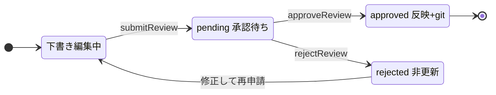

# editor コメント機能 計画 3/3: 承認タブ再構成・保留撤去・導線・docs Implementation Plan

> **For agentic workers:** REQUIRED SUB-SKILL: Use superpowers:subagent-driven-development (recommended) or superpowers:executing-plans to implement this plan task-by-task. Steps use checkbox (`- [ ]`) syntax for tracking.

**Goal:** 承認タブを「精査キュー一覧」から「編集タブで開いているテンプレート 1 件の申請を縦に並べて
1 件ずつ決着する画面」へ作り替え、保留機能を撤去し、承認画面にコメントパネルを置き、導線・
テスト・スクリーンショット・ドキュメントを揃える。

**Architecture:** 申請の状態は `pending / approved / rejected` の 3 つにし、旧 `held` は読み取りで
`pending` に正規化する。承認画面の本体は `ReviewDiffView.vue` から `ReviewDetail.vue`(申請 1 件、
`reqId` props)へ切り出し、新 `ReviewTabView.vue` が対象テンプレートの解決(`resolveReviewTarget.ts`)・
要約箱 3 つ・アコーディオン(同時展開 2 件。`reviewAccordion.ts`)・各セクションの
`CommentPanel`(計画 2)を組む。単件ルート `/reviews/:reqId` と `ReviewQueueView.vue` は消す。

**Tech Stack:** TypeScript / Zod 4 / Fastify / Vue 3 / Pinia / vitest / Playwright / `docs/_build`(Python 3.13)

**Spec:** `docs/superpowers/specs/2026-09-03-editor-reader-comments-design.md`(5 章・6 章・7 章・8 章)

## Global Constraints

- 作業ディレクトリはリポジトリルート `C:\Users\caads\workspace`。計画 1・2 が完了していること。
- テストはルートから `pnpm exec vitest run --project <shared|server|web> <テストファイル>`。
- 型チェックは `pnpm --filter @editor/shared run build` → `pnpm run typecheck:editor`。
- `editor/**` を変更したコミットの直前に **必ず** `pnpm exec biome check --write editor/<変更ファイル…>`。
- コミットメッセージは日本語の Conventional Commits。末尾に
  `Claude-Session: https://claude.ai/code/session_01FzRSKkNMZEugJR2mhsMZAv`。
- コメントは `docs/コメント規約.md`。UI 文言・docs は丁寧な日本語。
- 新規ソースファイルをテストしたらルート `vitest.config.ts` の coverage `include` へ追加する。
- OpenAPI を変えたら `pnpm --filter @editor/shared run build && pnpm --filter server run openapi:gen`
  で `editor/server/openapi/openapi.json` を再生成する(`openapiArtifact.guard.test.ts` が落ちる)。
- 変更系ルートは `routes/routeGuards.ts` の `ROUTE_POLICY` が正典。ルートを消したら宣言も消す
  (宣言だけ残ると起動時検査で落ちる)。
- 他ユーザ由来の HTML を出す iframe の `sandbox` 構成(`allow-scripts` のみ)は変えない。
- 承認・差し戻しの関所(`applyConfirmedSave` / `assertUndecided` / 自己承認拒否)は変えない。
- `docs/editor/images/*.png` は `capture_docs.spec.ts` の生成物。再撮影後は
  `py -3.13 docs/_build/build_all.py --project editor` で HTML を作り直してコミットする。
- 本文の最大幅・絞り込みバーの幅の規則(設計正典)を崩さない。承認タブの要約箱は 3 つで
  現行キューの 4 箱より狭い。

---

## ファイル構成

| ファイル | 変更 | 責務 |
|---|---|---|
| `editor/shared/src/schemas.ts` | 修正 | `ReviewStatus` 3 値、保留 3 フィールド撤去 |
| `editor/shared/src/api-paths.ts` | 修正 | `reviewRequestHold` 撤去 |
| `editor/shared/src/repositories/ReviewRepository.ts` | 修正 | `holdReview` 撤去 |
| `editor/shared/test/review.test.ts` | 修正 | `held` を拒否する |
| `editor/server/src/files/reviewFiles.ts` | 修正 | 読み取りで `held` → `pending` 正規化、`countPendingReviews` |
| `editor/server/src/repositories/reviewRepo.ts` | 修正 | `holdReview` 撤去 |
| `editor/server/src/routes/reviews.routes.ts` / `routeGuards.ts` / `openapi/document.ts` | 修正 | hold ルート撤去 |
| `editor/server/openapi/openapi.json` | 再生成 | |
| `editor/server/test/reviews.test.ts` | 修正 | hold テスト撤去・正規化テスト |
| `editor/web/src/api/local/reviewRepo.ts` / `rest/reviewRepo.ts` | 修正 | `holdReview` 撤去、local は読み取り正規化 |
| `editor/web/src/features/reviews/useReviewDiff.ts` | 修正 | `hold` 撤去 |
| `editor/web/src/stores/pendingReviews.ts` | 修正 | `pending` のみ |
| `editor/web/test/localReviewRepo.test.ts` / `useReviewDiff.test.ts` | 修正 | |
| `editor/web/src/features/reviews/resolveReviewTarget.ts` | 新規 | 対象テンプレート id の解決(純関数) |
| `editor/web/src/features/reviews/reviewAccordion.ts` | 新規 | 同時展開 2 件の管理(純関数) |
| `editor/web/src/features/editor/partKey.ts` | 修正 | `partPageIndexMap` |
| `editor/web/src/features/reviews/ReviewDetail.vue` | 新規(移動) | 申請 1 件の本体(旧 `ReviewDiffView.vue`) |
| `editor/web/src/features/reviews/ReviewVisualCompare.vue` | 修正 | `gotoPage(index)` を expose |
| `editor/web/src/features/reviews/ReviewTabView.vue` | 新規 | 承認タブ |
| `editor/web/src/features/reviews/ReviewQueueView.vue` / `ReviewDiffView.vue` | 削除 | |
| `editor/web/src/router/index.ts` / `features/layout/tabOf.ts` | 修正 | 単件ルート撤去 |
| `editor/web/src/features/templates/EditTabView.vue` / `features/editor/EditorView.vue` | 修正 | 導線を `/reviews?template=` へ |
| `editor/web/test/resolveReviewTarget.test.ts` / `reviewAccordion.test.ts` / `partKey.pageIndex.test.ts` | 新規 | |
| `editor/web/test/reviewDetail.wording.test.ts` | 改名 | 旧 `reviewDiffView.wording.test.ts` |
| `editor/web/test/reviewQueueView.test.ts` | 削除 | |
| `editor/web/test/tabOf.test.ts` | 修正 | |
| `editor/e2e/capture_docs.spec.ts` | 修正 | 承認タブの撮影経路 |
| `editor/e2e/review_tab.spec.ts` | 新規 | 対象解決・要約箱・アコーディオン・決着後 |
| `docs/editor/src/設計正典.md` / `設計書.md` / `操作手順書.md` | 修正 | |
| `docs/editor/images/reviews-list.png` / `review-diff.png` | 再撮影 | |

---

### Task 1: shared — 保留の撤去

**Files:**
- Modify: `editor/shared/src/schemas.ts:336-380`
- Modify: `editor/shared/src/api-paths.ts:62`
- Modify: `editor/shared/src/repositories/ReviewRepository.ts:41-48`
- Test: `editor/shared/test/review.test.ts`

**Interfaces:**
- Produces: `ReviewStatus = 'pending' | 'approved' | 'rejected'`。`ReviewRequestMeta` から
  `heldBy` / `heldAt` / `holdComment` が消える。`ReviewRepository` から `holdReview` が消える。
  `apiPaths.reviewRequestHold` が消える。

- [ ] **Step 1: 失敗するテストを書く**

`editor/shared/test/review.test.ts` の `describe('ReviewStatus', …)` と「保留フィールドと変更概要を
保持する」を次に置き換える。

```ts
describe('ReviewStatus', () => {
  it('pending / approved / rejected の 3 値だけを受理する', () => {
    expect(ReviewStatus.parse('pending')).toBe('pending');
    expect(ReviewStatus.safeParse('held').success).toBe(false);
  });
});

describe('ReviewRequestMeta', () => {
  it('変更概要を保持し、保留フィールドは契約に無い', () => {
    const meta = ReviewRequestMeta.parse({
      ...baseMeta,
      changedSummary: { count: 2, names: ['運用実績の表', 'ご挨拶文'] },
    });
    expect(meta.changedSummary?.names).toHaveLength(2);
    expect('heldBy' in ReviewRequestMeta.shape).toBe(false);
  });
```

「レガシー meta(新フィールド無し)も受理する」から `expect(meta.heldBy ?? null).toBeNull();` を消す。

- [ ] **Step 2: テストが失敗することを確認する**

Run: `pnpm exec vitest run --project shared editor/shared/test/review.test.ts`
Expected: FAIL(`held` が受理される)

- [ ] **Step 3: 実装する**

`schemas.ts`:
- `ReviewStatus` を `z.enum(['pending', 'approved', 'rejected'])` にする。
- `ReviewRequestMeta` から `// 保留(held)の記録。…` のコメント 2 行と `heldBy` / `heldAt` /
  `holdComment` の 3 行を消す。

`api-paths.ts` から `reviewRequestHold: '/review-requests/:reqId/hold',` を消す。

`ReviewRepository.ts` から `holdReview` とその doc コメントを消し、`rejectReview` の doc を
`/** 差し戻す(approver|admin のみ)。理由は `decision.comment`(必須)。 */` にする。
`listReviews` の doc `申請一覧(承認キュー)` を `申請一覧` にする。

- [ ] **Step 4: テストとビルド**

```bash
pnpm exec vitest run --project shared editor/shared/test/review.test.ts
pnpm --filter @editor/shared run build
```

Expected: PASS。server / web の型チェックはこの時点で赤い(Task 2・3 で直す)。

- [ ] **Step 5: コミット**

```bash
pnpm exec biome check --write editor/shared/src/schemas.ts editor/shared/src/api-paths.ts editor/shared/src/repositories/ReviewRepository.ts editor/shared/test/review.test.ts
git add editor/shared/src/schemas.ts editor/shared/src/api-paths.ts editor/shared/src/repositories/ReviewRepository.ts editor/shared/test/review.test.ts
git commit -m "feat(editor): 申請の保留状態を契約から外し状態を 3 値にする"
```

---

### Task 2: server — `held` の読み取り正規化と hold ルート撤去

**Files:**
- Modify: `editor/server/src/files/reviewFiles.ts:41-46, 100-107`
- Modify: `editor/server/src/repositories/reviewRepo.ts:76-83, 265-289`
- Modify: `editor/server/src/routes/reviews.routes.ts:102-120`
- Modify: `editor/server/src/routes/routeGuards.ts:111`
- Modify: `editor/server/src/openapi/document.ts:504-521`
- Regenerate: `editor/server/openapi/openapi.json`
- Test: `editor/server/test/reviews.test.ts`

**Interfaces:**
- Produces: `readReview` / `listReviewMetas` が返す meta は `status` が 3 値のみ(旧 `held` は
  `pending`)。`countPendingReviews` は `pending` だけを数える。

- [ ] **Step 1: 失敗するテストを書く**

`editor/server/test/reviews.test.ts` の `describe('holdReview(保留)', …)` と
`describe('未処理上限は pending+held の合算', …)` を丸ごと消し、代わりに次を足す
(`submit` / `approver` / `files` の使い方は同ファイルの既存テストと同じ)。

```ts
  describe('旧 held 申請の読み取り', () => {
    it('meta.json の status が held なら pending として読み、保留フィールドは落とす', async () => {
      const meta = await submit('AM01_141414_20250101_交付版', '141414', '<p>旧保留</p>');
      const files = await import('../src/files/reviewFiles.js');
      const metaPath = path.join(process.env.DATA_ROOT as string, 'reviews', meta.id, 'meta.json');
      const raw = JSON.parse(await fs.readFile(metaPath, 'utf8')) as Record<string, unknown>;
      await fs.writeFile(
        metaPath,
        JSON.stringify({ ...raw, status: 'held', heldBy: 'approver1', heldAt: '2026-09-01T00:00:00.000Z', holdComment: '確認中' }),
      );
      const read = await files.readReview(meta.id);
      expect(read?.status).toBe('pending');
      expect(read && 'heldBy' in read).toBe(false);
      expect((await files.listReviewMetas()).find((m) => m.id === meta.id)?.status).toBe('pending');
      expect(await files.countPendingReviews()).toBeGreaterThanOrEqual(1);
    });

    it('旧 held の申請はそのまま承認・差し戻しできる', async () => {
      const meta = await submit('AM01_151515_20250101_交付版', '151515', '<p>旧保留→承認</p>');
      const metaPath = path.join(process.env.DATA_ROOT as string, 'reviews', meta.id, 'meta.json');
      const raw = JSON.parse(await fs.readFile(metaPath, 'utf8')) as Record<string, unknown>;
      await fs.writeFile(metaPath, JSON.stringify({ ...raw, status: 'held' }));
      const result = await reviews.approveReview(meta.id, {}, approver);
      expect(result.meta).toBeTruthy();
    });
  });
```

`reviewsDir` の実パスは `config.reviewsDir` なので、テストが `DATA_ROOT` を stub している前提が
違えば `files` 経由で得られるパス(既存テストの書き方)に合わせる。`fs` / `path` の import が無ければ足す。

- [ ] **Step 2: テストが失敗することを確認する**

Run: `pnpm exec vitest run --project server editor/server/test/reviews.test.ts`
Expected: FAIL(型エラー: `holdReview` が無い / `held` が `pending` にならない)

- [ ] **Step 3: 実装する**

`reviewFiles.ts` の `readReviewMeta` を次に置き換える。

```ts
/**
 * 申請メタを読む。無ければ null(モジュール内部ヘルパ)。
 *
 * 旧い meta.json には保留(`held`)の状態と `heldBy` / `heldAt` / `holdComment` が残っている
 * ことがある。保留は撤去したので、読み取りで `pending` に正規化し保留の 3 フィールドは
 * 落とす。書き戻しはしない — 次の決着(承認 / 差し戻し)で新しい meta が書かれ自然に消える。
 */
async function readReviewMeta(reqId: string): Promise<ReviewRequestMeta | null> {
  const raw = await fs.readFile(metaPath(reqId), 'utf8').catch(() => null);
  if (raw === null) return null;
  const parsed = JSON.parse(raw) as Record<string, unknown>;
  const { heldBy: _heldBy, heldAt: _heldAt, holdComment: _holdComment, ...rest } = parsed;
  const status = rest.status === 'held' ? 'pending' : rest.status;
  return { ...rest, status } as ReviewRequestMeta;
}
```

`countPendingReviews` を `return metas.filter((m) => m.status === 'pending').length;` にし、
doc の「保留(held)も数える — …」の 2 行を消す。

`reviewRepo.ts`: `assertUndecided` の doc を
`/** 承認・差し戻しが受け付ける現在状態の検査。決着(approved/rejected)済みを 409 で拒む。 */`
にし、`holdReview` 関数と doc を丸ごと消す。`ReviewDecisionRequest` の import が未使用になれば外す。

`reviews.routes.ts`: `// 保留(精査者限定)。…` から始まる `app.post(apiPaths.reviewRequestHold, …)` を消す。

`routeGuards.ts`: `[`POST ${api(apiPaths.reviewRequestHold)}`]: 'approver',` を消す。

`document.ts`: `[toOpenApiPath(apiPaths.reviewRequestHold)]: { … }` のブロックを消す。

- [ ] **Step 4: 再生成・テスト・型チェック**

```bash
pnpm --filter @editor/shared run build && pnpm --filter server run openapi:gen
pnpm exec vitest run --project server editor/server/test/reviews.test.ts editor/server/test/reviews.routes.test.ts editor/server/test/routeGuards.test.ts editor/server/test/guardCoverage.guard.test.ts editor/server/test/openapiArtifact.guard.test.ts editor/server/test/reviews.metaFailure.test.ts editor/server/test/reviewFiles.scan.test.ts
pnpm --filter server run typecheck
```

Expected: 全て PASS / 型エラー 0

- [ ] **Step 5: コミット**

```bash
pnpm exec biome check --write editor/server/src/files/reviewFiles.ts editor/server/src/repositories/reviewRepo.ts editor/server/src/routes/reviews.routes.ts editor/server/src/routes/routeGuards.ts editor/server/src/openapi/document.ts editor/server/test/reviews.test.ts
git add editor/server/src editor/server/openapi/openapi.json editor/server/test/reviews.test.ts
git commit -m "feat(editor): 保留 API を撤去し旧 held 申請を読み取り時に承認待ちへ正規化する"
```

---

### Task 3: web リポジトリ・composable・ストアから保留を外す

**Files:**
- Modify: `editor/web/src/api/local/reviewRepo.ts`(`readReviews`、`holdReview` 撤去)
- Modify: `editor/web/src/api/rest/reviewRepo.ts`(`holdReview` 撤去)
- Modify: `editor/web/src/features/reviews/useReviewDiff.ts`(`hold` 撤去)
- Modify: `editor/web/src/stores/pendingReviews.ts`(`pending` のみ)
- Test: `editor/web/test/localReviewRepo.test.ts`、`editor/web/test/useReviewDiff.test.ts`

- [ ] **Step 1: 失敗するテストを書く**

`localReviewRepo.test.ts` の `describe('localReviewRepo.holdReview', …)` を次に置き換える。

```ts
describe('localReviewRepo の旧 held 申請', () => {
  it('localStorage に held で残る申請は pending として読み、そのまま承認できる', async () => {
    await loginAdmin();
    const target = await firstTemplate();
    if (!target) return;
    const submitted = await localReviewRepo.submitReview({
      templateId: target.id,
      fundCode: target.attributes.fundCode,
      origin: 'edit',
      html: '<div>Test</div>',
      css: 'div { color: black; }',
    });
    expect(isOk(submitted)).toBe(true);
    if (!isOk(submitted)) return;

    const all = JSON.parse(localStorage.getItem(K.reviews) ?? '{}') as Record<string, Record<string, unknown>>;
    all[submitted.value.id] = { ...all[submitted.value.id], status: 'held', heldBy: 'x', holdComment: 'メモ' };
    localStorage.setItem(K.reviews, JSON.stringify(all));

    const list = await localReviewRepo.listReviews({});
    expect(isOk(list) && list.value.find((m) => m.id === submitted.value.id)?.status).toBe('pending');
    const approved = await localReviewRepo.approveReview(submitted.value.id, {});
    expect(isOk(approved)).toBe(true);
  });
});
```

import に `import { K } from '@/api/local/store';` を足す。

`useReviewDiff.test.ts` から `holdReviewFn` の宣言・mock・`mockReset` と
「hold は reqId とコメントで repo を呼ぶ」テストを消す。

- [ ] **Step 2: テストが失敗することを確認する**

Run: `pnpm exec vitest run --project web editor/web/test/localReviewRepo.test.ts`
Expected: FAIL(`held` のまま返る)

- [ ] **Step 3: 実装する**

`local/reviewRepo.ts` の `readReviews` を次に置き換え、`holdReview` を消す。

```ts
/**
 * 保存済みの申請を読む。旧いデータに残る保留(`held`)は `pending` へ正規化し、保留の
 * 3 フィールドは落とす(server の `reviewFiles.readReviewMeta` と同じ規則)。
 */
function readReviews(): Record<string, ReviewRequest> {
  const raw = read<Record<string, Record<string, unknown>>>(K.reviews, {});
  const out: Record<string, ReviewRequest> = {};
  for (const [id, r] of Object.entries(raw)) {
    const { heldBy: _heldBy, heldAt: _heldAt, holdComment: _holdComment, ...rest } = r;
    out[id] = { ...rest, status: rest.status === 'held' ? 'pending' : rest.status } as ReviewRequest;
  }
  return out;
}
```

`rest/reviewRepo.ts` から `holdReview` を消す。`useReviewDiff.ts` から `hold` 関数と戻り値の
`hold` を消し、見出しコメントの「承認/却下」表記はそのまま。`pendingReviews.ts` の `refresh` を
`items.value = isOk(res) ? res.value.filter((m) => m.status === 'pending') : [];` にし、
doc の「保留(held)も …」の段落を消す(「status 絞りをサーバへ渡さず全件を取り client で絞る」は
承認タブが全状態を要るので残す)。

- [ ] **Step 4: テストと型チェック**

```bash
pnpm exec vitest run --project web editor/web/test/localReviewRepo.test.ts editor/web/test/useReviewDiff.test.ts editor/web/test/pendingReviews.store.test.ts editor/web/test/reviewRepo.local.test.ts
pnpm run typecheck:editor
```

Expected: PASS。型チェックは `ReviewDiffView.vue` / `ReviewQueueView.vue` の `held` 参照だけが残る(Task 5・6 で消す)。

- [ ] **Step 5: コミット**

```bash
pnpm exec biome check --write editor/web/src/api/local/reviewRepo.ts editor/web/src/api/rest/reviewRepo.ts editor/web/src/features/reviews/useReviewDiff.ts editor/web/src/stores/pendingReviews.ts editor/web/test/localReviewRepo.test.ts editor/web/test/useReviewDiff.test.ts
git add editor/web/src/api editor/web/src/features/reviews/useReviewDiff.ts editor/web/src/stores/pendingReviews.ts editor/web/test/localReviewRepo.test.ts editor/web/test/useReviewDiff.test.ts
git commit -m "feat(editor): web の申請リポジトリと composable から保留を外す"
```

---

### Task 4: 純関数 — 対象テンプレートの解決・アコーディオン・パーツのページ index

**Files:**
- Create: `editor/web/src/features/reviews/resolveReviewTarget.ts`
- Create: `editor/web/src/features/reviews/reviewAccordion.ts`
- Modify: `editor/web/src/features/editor/partKey.ts`(`partPageIndexMap` を追加)
- Test: `editor/web/test/resolveReviewTarget.test.ts`、`editor/web/test/reviewAccordion.test.ts`、`editor/web/test/partKey.pageIndex.test.ts`
- Modify: `vitest.config.ts`(include に 2 ファイルを追加。`partKey.ts` が未登録なら追加)

**Interfaces:**
- Produces:
  ```ts
  // resolveReviewTarget.ts
  export function resolveReviewTarget(query: LocationQuery, editTabPath: string | undefined): string | null;
  // reviewAccordion.ts
  export const MAX_EXPANDED = 2;
  export function toggleExpanded(expanded: readonly string[], id: string): string[]; // 開閉。3 件目で最古を閉じる
  // partKey.ts
  export function partPageIndexMap(root: HTMLElement): Map<string, number>; // pathKey → 0 始まりのページ index
  ```

- [ ] **Step 1: 失敗するテストを書く**

```ts
// editor/web/test/resolveReviewTarget.test.ts
import { describe, expect, it } from 'vitest';
import { resolveReviewTarget } from '@/features/reviews/resolveReviewTarget';

const ID = 'AM01_510037_20240710_交付版';

describe('resolveReviewTarget', () => {
  it('query の template を最優先にする', () => {
    expect(resolveReviewTarget({ template: ID }, `/edit/other`)).toBe(ID);
  });

  it('query が無ければ編集タブの直前画面 /edit/:id から取る(URL エンコードを解く)', () => {
    expect(resolveReviewTarget({}, `/edit/${encodeURIComponent(ID)}`)).toBe(ID);
    expect(resolveReviewTarget({}, `/edit/${encodeURIComponent(ID)}?x=1`)).toBe(ID);
    expect(resolveReviewTarget({}, `/preview/${encodeURIComponent(ID)}`)).toBe(ID);
  });

  it('作成経路(?created=1)の編集画面は対象にしない(作成中のテンプレートに申請は無い)', () => {
    expect(resolveReviewTarget({}, `/edit/${encodeURIComponent(ID)}?created=1`)).toBeNull();
  });

  it('一覧に居たとき・記憶が無いとき・不正な id は null', () => {
    expect(resolveReviewTarget({}, '/edit')).toBeNull();
    expect(resolveReviewTarget({}, undefined)).toBeNull();
    expect(resolveReviewTarget({ template: '../x' }, undefined)).toBeNull();
    expect(resolveReviewTarget({ template: ['a', 'b'] }, undefined)).toBeNull();
  });
});
```

```ts
// editor/web/test/reviewAccordion.test.ts
import { describe, expect, it } from 'vitest';
import { MAX_EXPANDED, toggleExpanded } from '@/features/reviews/reviewAccordion';

describe('toggleExpanded', () => {
  it('閉じているものは開き、開いているものは閉じる', () => {
    expect(toggleExpanded([], 'a')).toEqual(['a']);
    expect(toggleExpanded(['a'], 'a')).toEqual([]);
  });

  it('同時展開は MAX_EXPANDED 件まで。超えたら最も古く開いたものを閉じる', () => {
    expect(MAX_EXPANDED).toBe(2);
    expect(toggleExpanded(['a', 'b'], 'c')).toEqual(['b', 'c']);
  });

  it('入力の配列を書き換えない', () => {
    const src = ['a'];
    toggleExpanded(src, 'b');
    expect(src).toEqual(['a']);
  });
});
```

```ts
// editor/web/test/partKey.pageIndex.test.ts
import { describe, expect, it } from 'vitest';
import { partLabelMap, partPageIndexMap } from '@/features/editor/partKey';

function root(html: string): HTMLElement {
  const el = document.createElement('div');
  el.innerHTML = html;
  return el;
}

describe('partPageIndexMap', () => {
  it('partLabelMap と同じキーで 0 始まりのページ index を返す', () => {
    const r = root('<div class="page"><h1 id="cover"></h1><p></p></div><div class="page"><table></table></div>');
    const labels = partLabelMap(r);
    const pages = partPageIndexMap(r);
    expect([...pages.keys()]).toEqual([...labels.keys()]);
    expect([...pages.values()]).toEqual([0, 0, 1]);
  });
});
```

- [ ] **Step 2: テストが失敗することを確認する**

Run: `pnpm exec vitest run --project web editor/web/test/resolveReviewTarget.test.ts editor/web/test/reviewAccordion.test.ts editor/web/test/partKey.pageIndex.test.ts`
Expected: FAIL(モジュール / 関数が無い)

- [ ] **Step 3: 実装する**

```ts
// =============================================================================
// resolveReviewTarget.ts — 承認タブが対象にするテンプレート id の解決(純関数)
// =============================================================================
// 役割: 承認タブは「編集タブで開いているテンプレート 1 件」の申請を扱う。対象は
// ①`?template=<id>`(承認待ちバッジ・上部バーからの遷移が渡す)、②編集タブの直前画面
// (`stores/tabMemory.ts` が覚える fullPath)が `/edit/:id` か `/preview/:id` ならその id、
// の順で決める。作成経路(`?created=1`)は対象にしない — 作成中のテンプレートに申請は無く、
// 2 系統の判定(`route.query.created === '1'`)をここでも同じ規則で読む。
import type { LocationQuery } from 'vue-router';

const EDIT_PATH = /^\/(?:edit|preview)\/([^/?#]+)(?:\?([^#]*))?/;
/** テンプレート id の字面(`assertTemplateId` と同じ意図。`/` `\` `..` を含まない)。 */
const SAFE_ID = /^[^/\\]+$/;

function safeId(raw: string | null | undefined): string | null {
  if (!raw || raw.includes('..') || !SAFE_ID.test(raw)) return null;
  return raw;
}

export function resolveReviewTarget(query: LocationQuery, editTabPath: string | undefined): string | null {
  const q = query.template;
  if (typeof q === 'string') return safeId(q);
  if (q !== undefined) return null;
  if (!editTabPath) return null;
  const m = EDIT_PATH.exec(editTabPath);
  if (!m) return null;
  const search = new URLSearchParams(m[2] ?? '');
  if (search.get('created') === '1') return null;
  try {
    return safeId(decodeURIComponent(m[1]));
  } catch {
    return null;
  }
}
```

```ts
// =============================================================================
// reviewAccordion.ts — 承認タブのアコーディオンで同時に開ける申請数の管理(純関数)
// =============================================================================
// 役割: 1 申請を開くと見た目比較の組版 iframe を 2 面持つ。申請数に比例して開かせると
// 承認者のブラウザが固まるので、同時展開を 2 件に絞り、3 件目を開いたら最も古く開いた
// ものを閉じる。順序は「開いた順」で持つ(配列の先頭が最古)。
export const MAX_EXPANDED = 2;

export function toggleExpanded(expanded: readonly string[], id: string): string[] {
  if (expanded.includes(id)) return expanded.filter((x) => x !== id);
  const next = [...expanded, id];
  return next.length > MAX_EXPANDED ? next.slice(next.length - MAX_EXPANDED) : next;
}
```

`partKey.ts` の `partLabelMap` の下に足す。

```ts
/**
 * canvas 全パーツの安定キー → そのパーツが属するページの index(0 始まり)。承認画面の
 * コメント一覧が「行クリックで見た目比較の該当ページへ送る」ために使う。キーの作り方は
 * `partLabelMap` と同じ(`partKeyOf`)なので、両者のキー集合は必ず一致する。
 */
export function partPageIndexMap(root: HTMLElement): Map<string, number> {
  const map = new Map<string, number>();
  const pages = pageEls(root);
  pages.forEach((page, pi) => {
    for (const part of partEls(page)) map.set(partKeyOf(page, part, pages, root), pi);
  });
  return map;
}
```

- [ ] **Step 4: テスト・coverage include・コミット**

`vitest.config.ts` の include に `'editor/web/src/features/reviews/resolveReviewTarget.ts'` と
`'editor/web/src/features/reviews/reviewAccordion.ts'` を足す(`partKey.ts` が無ければそれも)。

```bash
pnpm exec vitest run --project web editor/web/test/resolveReviewTarget.test.ts editor/web/test/reviewAccordion.test.ts editor/web/test/partKey.pageIndex.test.ts
pnpm exec biome check --write editor/web/src/features/reviews/resolveReviewTarget.ts editor/web/src/features/reviews/reviewAccordion.ts editor/web/src/features/editor/partKey.ts editor/web/test/resolveReviewTarget.test.ts editor/web/test/reviewAccordion.test.ts editor/web/test/partKey.pageIndex.test.ts
git add editor/web/src/features/reviews/resolveReviewTarget.ts editor/web/src/features/reviews/reviewAccordion.ts editor/web/src/features/editor/partKey.ts editor/web/test vitest.config.ts
git commit -m "feat(editor): 承認タブの対象解決・同時展開・パーツのページ index を純関数で足す"
```

---

### Task 5: `ReviewDetail.vue` — 申請 1 件の本体(旧 `ReviewDiffView.vue`)

**Files:**
- Move: `editor/web/src/features/reviews/ReviewDiffView.vue` → `editor/web/src/features/reviews/ReviewDetail.vue`
- Modify: `editor/web/src/features/reviews/ReviewVisualCompare.vue`(`gotoPage` を expose)
- Rename: `editor/web/test/reviewDiffView.wording.test.ts` → `editor/web/test/reviewDetail.wording.test.ts`

**Interfaces:**
- Produces: `ReviewDetail`
  - props: `reqId: string`
  - emits: `decided: [meta: ReviewRequestMeta]`(承認 / 差し戻しが成立したとき。遷移はしない)
  - expose: `gotoPage(index: number): void`(見た目比較の該当ページへ。text タブのときは何もしない)
  - `ReviewVisualCompare` の expose: `gotoPage(index: number)`(`docs.anchors[index]` へ `gotoAnchor`)

- [ ] **Step 1: 失敗するテストを直す**

```bash
git mv editor/web/src/features/reviews/ReviewDiffView.vue editor/web/src/features/reviews/ReviewDetail.vue
git mv editor/web/test/reviewDiffView.wording.test.ts editor/web/test/reviewDetail.wording.test.ts
```

`reviewDetail.wording.test.ts` の `describe('ReviewDiffView の構成', …)` を次にする。

```ts
describe('ReviewDetail の構成', () => {
  const view = src('features/reviews/ReviewDetail.vue');

  it('技術語彙の警告文言を直接出さない(通知バーへ集約済み)', () => {
    expect(view).not.toContain('ファンド共通 CSS');
    expect(view).not.toContain('語句単位の着色');
  });

  it('通知バー・見た目比較・差し戻しを組み込み、保留を持たない', () => {
    expect(view).toContain('ReviewNoticeBar');
    expect(view).toContain('ReviewVisualCompare');
    expect(view).toContain('差し戻す');
    expect(view).not.toContain('保留');
    expect(view).not.toContain('held');
  });

  it('画面遷移を持たない(承認タブが遷移を決める)', () => {
    expect(view).not.toContain('useRouter');
    expect(view).not.toContain('router.push');
  });

  it('差分行 iframe の sandbox 構成を変えていない', () => {
    expect(view).toContain('sandbox="allow-scripts"');
    expect(view).not.toContain('allow-same-origin');
  });
});
```

Run: `pnpm exec vitest run --project web editor/web/test/reviewDetail.wording.test.ts`
Expected: FAIL(`保留` / `router.push` を含む)

- [ ] **Step 2: `ReviewVisualCompare.vue` に `gotoPage` を足す**

`nextAnchor` の下に足し、`defineExpose({ gotoPage })` を置く。

```ts
/**
 * 指定ページ(0 始まり)へ両面を送る。承認タブのコメント一覧が「行クリックで該当ページへ」
 * に使う。アンカーはページ単位(`buildCompareDocs` が `.page` に付ける)なので、パーツ単位の
 * 精度は持たない — ページが見えれば承認者はパーツを目で追える。
 */
function gotoPage(index: number): void {
  const id = docs.value.anchors[index];
  if (!id) return;
  anchorIndex.value = index;
  beforePanel.value?.gotoAnchor(id);
  afterPanel.value?.gotoAnchor(id);
}
defineExpose({ gotoPage });
```

- [ ] **Step 3: `ReviewDetail.vue` を直す**

見出しコメントを次にする。

```ts
// =============================================================================
// ReviewDetail.vue — 申請 1 件の精査(見た目比較主体 + 通知集約 + 承認/差し戻し)
// =============================================================================
// 主表示は「修正前｜修正後」の左右組版比較(`ReviewVisualCompare`)。事務担当者の主観点は
// 「最終の見た目がどうなるか」であり、パーツ単位の縦リストは「文字の変更を一覧で見る」タブへ
// 退避する(既存の block diff エンジン `htmlBlockDiff` をそのまま流用、`reviewDiffService` が
// 組み立て)。技術語彙の警告 4 種は `ReviewNoticeBar` の 1 行へ集約する。承認は approver|admin
// のみで、承認時にサーバが実ファイル + git へ反映する(`reviewRepo.ts`)。
// 承認タブ(`ReviewTabView.vue`)のアコーディオン 1 区画として置かれるので、ヘッダと画面遷移は
// 持たず、決着は `decided` で親へ知らせる。
```

script の変更:
- `useRouter` / `useRoute` の import と `const router` / `const route` を消す。
- `hold` を分割代入から消す。`holdRequest` 関数を消す。`onMounted` の中は `await load();` だけにする。
- `canDecide` を `auth.isApprover && review.value?.status === 'pending'` にする。
- `cameFromEdit` と `goBack` を消す。
- `DECIDED_STATUS_LABEL` の doc を `/** 「処理済み(閲覧のみ)」表示の状態ラベル。pending は別分岐(`canDecide`)。 */` にする。
- `defineEmits` と `defineExpose` を足す。

```ts
const emit = defineEmits<{ decided: [meta: ReviewRequestMeta] }>();
const visualRef = ref<InstanceType<typeof ReviewVisualCompare>>();
/** 見た目比較の該当ページへ送る(text タブ表示中は何もしない — 行リストにページの概念が無い)。 */
function gotoPage(index: number): void {
  if (activeTab.value !== 'visual') return;
  visualRef.value?.gotoPage(index);
}
defineExpose({ gotoPage });
```

- `approve` の末尾 `router.push({ name: 'reviews' });` を `emit('decided', res.value.meta as unknown as ReviewRequestMeta); await load();` にする
  (`ApproveReviewResult.meta` は `TemplateMeta` なので、`decided` へ渡す meta は `review.value` を
  `status: 'approved'` で更新した値にする。具体的には次のとおり)。

```ts
    await load();
    if (review.value) emit('decided', review.value);
```

- `reject` の `router.push({ name: 'reviews' });` も同じく `await load(); if (review.value) emit('decided', review.value);` にする。
- import に `type ReviewRequestMeta` を足す。

template の変更:
- 先頭の `<!-- ヘッダ -->` ブロック(戻るボタン・「申請内容の確認」・バッジ・AttributeBar・申請者)を丸ごと消す。
  `AttributeBar` / `ORIGIN_LABEL` が未使用になれば消す。
- `<ReviewVisualCompare` に `ref="visualRef"` を足す。
- 決定ブロックのコメント `<!-- 承認/差し戻し/保留(精査者のみ・pending/held のみ) -->` を
  `<!-- 承認/差し戻し(精査者のみ・pending のみ) -->` にし、`label` を
  `差し戻し理由（差し戻すときは必須です）`、`placeholder` を `差し戻し理由を入力します。` にし、
  `<Button … @click="holdRequest">保留する</Button>` を消す。
- `<!-- 保留中(…) -->` のコメントと `v-else-if="review.status === 'held'"` のブロックを消す。
- 処理済みブロックの `メモ: {{ review.comment }}` を `差し戻し理由: {{ review.comment }}` にし、
  `v-if="review.comment && review.status === 'rejected'"` にする。

- [ ] **Step 4: テストと型チェック**

```bash
pnpm exec vitest run --project web editor/web/test/reviewDetail.wording.test.ts
pnpm run typecheck:editor
```

Expected: PASS。型チェックは `router/index.ts` の `ReviewDiffView` 参照と `ReviewQueueView` の
`held` だけが残る(Task 6)。

- [ ] **Step 5: コミット**

```bash
pnpm exec biome check --write editor/web/src/features/reviews/ReviewDetail.vue editor/web/src/features/reviews/ReviewVisualCompare.vue editor/web/test/reviewDetail.wording.test.ts
git add -A editor/web/src/features/reviews editor/web/test
git commit -m "refactor(editor): 精査画面を申請 1 件の本体 ReviewDetail へ切り出し保留と画面遷移を外す"
```

---

### Task 6: `ReviewTabView.vue` と導線・ルート

**Files:**
- Create: `editor/web/src/features/reviews/ReviewTabView.vue`
- Delete: `editor/web/src/features/reviews/ReviewQueueView.vue`、`editor/web/test/reviewQueueView.test.ts`
- Modify: `editor/web/src/router/index.ts:56-68`
- Modify: `editor/web/src/features/layout/tabOf.ts`(`review-detail` 分岐を消す)
- Modify: `editor/web/test/tabOf.test.ts:26-29`
- Modify: `editor/web/src/features/templates/EditTabView.vue:50-55`
- Modify: `editor/web/src/features/editor/EditorView.vue:165-178`
- Modify: `vitest.config.ts`(include の `ReviewQueueView.vue` を消す)

**Interfaces:**
- Consumes: Task 4 の純関数、Task 5 の `ReviewDetail`、計画 2 の `CommentPanel` / `useComments`、
  `partLabelMap` / `partPageIndexMap`
- Produces: ルート `reviews`(`/reviews`、query `template`)。`review-detail` ルートは消える。

- [ ] **Step 1: `tabOf` のテストを直す**

`tabOf.test.ts` の「精査画面は「承認」に属する」を次に置き換える。

```ts
  it('承認タブは自分の名前に写る(単件の精査画面は無い)', () => {
    expect(tabOf({ name: 'reviews', query: { template: 'x' } })).toBe('reviews');
    expect(tabOf({ name: 'review-detail', query: {} })).toBeNull();
  });
```

Run: `pnpm exec vitest run --project web editor/web/test/tabOf.test.ts` → FAIL。
`tabOf.ts` の `if (name === 'review-detail') return 'reviews';` と doc の「精査画面は「承認」に属する。」を消す。→ PASS。

- [ ] **Step 2: `ReviewTabView.vue` を書く**

```vue
<script setup lang="ts">
// =============================================================================
// ReviewTabView.vue — 承認タブ(編集タブで開いているテンプレート 1 件の申請を縦に並べて決着)
// =============================================================================
// 対象テンプレートは `resolveReviewTarget` が決める(`?template=` → 編集タブの直前画面)。
// 申請は状態の要約箱(承認待ち / 承認済み / 却下)で絞り、新しい順にアコーディオンで並べる。
// 展開した区画だけが `ReviewDetail`(組版 iframe 2 面)を持ち、同時展開は `reviewAccordion`
// の上限に従う。各区画の右にコメントパネルを置き、行クリックで見た目比較の該当ページへ送る。
// 決着しても画面に留まり、区画が決着済み表示へ変わる(次の申請へ続けて進める)。
import { isOk, type ReviewRequestMeta, type ReviewStatus } from '@editor/shared';
import { ChevronDown, ChevronRight, ClipboardCheck, Info } from '@lucide/vue';
import { computed, onMounted, ref, watch } from 'vue';
import { useRoute, useRouter } from 'vue-router';
import { useNoteRepo, useReviewRepo, useTemplateRepo } from '@/api/repositories';
import AttributeBar from '@/components/AttributeBar.vue';
import Badge from '@/components/ui/Badge.vue';
import Button from '@/components/ui/Button.vue';
import EmptyState from '@/components/ui/EmptyState.vue';
import Skeleton from '@/components/ui/Skeleton.vue';
import CommentPanel from '@/features/editor/comments/CommentPanel.vue';
import { partLabelMap, partPageIndexMap } from '@/features/editor/partKey';
import { useComments } from '@/features/editor/useComments';
import { formatDateTimeShort } from '@/lib/format';
import { useAsyncResult } from '@/lib/useAsyncResult';
import { useLatest } from '@/lib/useLatest';
import { usePendingReviewsStore } from '@/stores/pendingReviews';
import { useTabMemoryStore } from '@/stores/tabMemory';
import { resolveReviewTarget } from './resolveReviewTarget';
import ReviewDetail from './ReviewDetail.vue';
import { toggleExpanded } from './reviewAccordion';

const route = useRoute();
const router = useRouter();
const reviews = useReviewRepo();
const templates = useTemplateRepo();
const noteRepo = useNoteRepo();
const memory = useTabMemoryStore();
const pending = usePendingReviewsStore();
const { loading, run } = useAsyncResult();
const latestLoad = useLatest();

// ── 1. 対象テンプレート ──
const targetId = computed(() => resolveReviewTarget(route.query, memory.pathFor('edit')));

// ── 2. 申請一覧(全状態を 1 回で取り、対象テンプレートで絞る) ──
const all = ref<ReviewRequestMeta[]>([]);
const mine = computed(() => all.value.filter((m) => m.templateId === targetId.value));

const SUMMARY_FILTERS: { label: string; value: ReviewStatus }[] = [
  { label: '承認待ち', value: 'pending' },
  { label: '承認済み', value: 'approved' },
  { label: '却下', value: 'rejected' },
];
const statusFilter = ref<ReviewStatus | 'all'>('pending');
const countOf = (s: ReviewStatus) => mine.value.filter((m) => m.status === s).length;
const items = computed(() =>
  (statusFilter.value === 'all' ? mine.value : mine.value.filter((m) => m.status === statusFilter.value))
    .slice()
    .sort((a, b) => b.submittedAt.localeCompare(a.submittedAt)),
);
function toggleFilter(v: ReviewStatus) {
  statusFilter.value = statusFilter.value === v ? 'all' : v;
}

const STATUS_META: Record<ReviewStatus, { label: string; variant: 'warning' | 'success' | 'destructive' }> = {
  pending: { label: '承認待ち', variant: 'warning' },
  approved: { label: '承認済み', variant: 'success' },
  rejected: { label: '却下', variant: 'destructive' },
};
const ORIGIN_LABEL: Record<ReviewRequestMeta['origin'], string> = { edit: '編集', create: '新規作成' };

async function load() {
  const isLatest = latestLoad.begin();
  const res = await run(() => reviews.listReviews({}));
  if (!isErr(res) && isLatest()) all.value = res.value;
}
onMounted(load);
watch(targetId, load);

// ── 3. アコーディオン(既定は先頭 1 件を開く) ──
const expanded = ref<string[]>([]);
watch(
  items,
  (list) => {
    if (expanded.value.length === 0 && list.length > 0) expanded.value = [list[0].id];
  },
  { immediate: true },
);
function toggle(id: string) {
  expanded.value = toggleExpanded(expanded.value, id);
}
const detailRefs = ref<Record<string, InstanceType<typeof ReviewDetail> | undefined>>({});

/** 決着した申請を一覧へ写す(要約箱の件数もここで動く)。承認待ちバッジも取り直す。 */
function onDecided(meta: ReviewRequestMeta) {
  all.value = all.value.map((m) => (m.id === meta.id ? meta : m));
  void pending.refresh();
}
const allDone = computed(() => targetId.value !== null && mine.value.length > 0 && countOf('pending') === 0);

// ── 4. コメント(対象テンプレートの全投稿。宛先パーツは区画内のセレクトで選ぶ) ──
const selectedKey = ref<string | null>(null);
const comments = useComments(() => targetId.value ?? '', () => selectedKey.value, noteRepo);
watch(targetId, () => void comments.reload(), { immediate: true });

/** パーツの表示ラベルとページ index。確定版の本文から `partKey.ts` と同じ規則で作る。 */
const partLabels = ref<Map<string, string>>(new Map());
const partPages = ref<Map<string, number>>(new Map());
async function loadParts() {
  partLabels.value = new Map();
  partPages.value = new Map();
  const id = targetId.value;
  if (!id) return;
  const tpl = await templates.getTemplate(id);
  if (!isOk(tpl)) return;
  const body = new DOMParser().parseFromString(tpl.value.filled ?? tpl.value.html, 'text/html').body;
  partLabels.value = partLabelMap(body);
  partPages.value = partPageIndexMap(body);
}
watch(targetId, loadParts, { immediate: true });

function focusPart(reqId: string, key: string) {
  selectedKey.value = key;
  const page = partPages.value.get(key);
  if (page !== undefined) detailRefs.value[reqId]?.gotoPage(page);
}

function goEdit() {
  if (targetId.value) router.push({ name: 'editor', params: { id: targetId.value } });
  else router.push({ name: 'edit' });
}
</script>

<template>
  <div class="space-y-4">
    <div class="flex flex-wrap items-center gap-3">
      <h2 class="text-lg font-bold">承認</h2>
      <p class="flex items-center gap-1.5 text-[13px] text-muted-foreground">
        <Info class="h-3.5 w-3.5 shrink-0" />
        編集タブで開いているテンプレートの申請を、1 件ずつ確認して承認・差し戻しします。
      </p>
    </div>

    <!-- 対象が決まらない / 申請が無い -->
    <EmptyState
      v-if="!targetId"
      :icon="ClipboardCheck"
      title="編集タブでテンプレートを開いてから、承認タブを押してください"
      hint="承認タブは、編集タブで開いているテンプレートの申請を表示します。"
    >
      <Button variant="outline" @click="goEdit">編集タブへ</Button>
    </EmptyState>

    <template v-else>
      <div class="flex flex-wrap items-center gap-3 rounded-[12px] border bg-card px-4 py-3">
        <span class="text-sm font-bold">対象テンプレート</span>
        <span class="mono text-sm">{{ targetId }}</span>
        <span class="flex-1" />
        <Button variant="outline" size="sm" @click="goEdit">編集画面へ</Button>
      </div>

      <!-- 状態の要約箱 = 絞り込み(同じ箱の再クリックで解除) -->
      <div class="grid grid-cols-3 gap-3" data-review-summary>
        <button
          v-for="f in SUMMARY_FILTERS"
          :key="f.value"
          type="button"
          class="rounded-[12px] border bg-card px-4 py-3 text-left shadow-sm transition-colors"
          :class="statusFilter === f.value ? 'ring-2 ring-ring' : 'hover:bg-muted/40'"
          :data-summary="f.value"
          @click="toggleFilter(f.value)"
        >
          <div class="text-[12px] text-muted-foreground">{{ f.label }}</div>
          <div class="text-2xl font-bold">{{ countOf(f.value) }}</div>
        </button>
      </div>

      <Skeleton v-if="loading && mine.length === 0" class="h-24 w-full" />
      <EmptyState
        v-else-if="mine.length === 0"
        :icon="ClipboardCheck"
        title="このテンプレートには申請がありません"
        hint="編集画面のプレビューから「確定保存を申請」すると、ここに並びます。"
      />
      <EmptyState
        v-else-if="items.length === 0"
        :icon="ClipboardCheck"
        title="この状態の申請はありません"
        hint="上の箱をもう一度押すと絞り込みを解除します。"
      />

      <!-- アコーディオン -->
      <ul v-else class="space-y-3" data-review-list>
        <li v-for="m in items" :key="m.id" class="rounded-[12px] border bg-card shadow-sm" :data-review-item="m.id">
          <button
            type="button"
            class="flex w-full flex-wrap items-center gap-3 px-4 py-3 text-left"
            data-review-toggle
            @click="toggle(m.id)"
          >
            <ChevronDown v-if="expanded.includes(m.id)" class="h-4 w-4 shrink-0" />
            <ChevronRight v-else class="h-4 w-4 shrink-0" />
            <Badge :variant="STATUS_META[m.status].variant">{{ STATUS_META[m.status].label }}</Badge>
            <Badge variant="secondary">{{ ORIGIN_LABEL[m.origin] }}</Badge>
            <AttributeBar :attributes="m.attributes" class="min-w-0 flex-1" />
            <span class="text-xs text-muted-foreground">
              申請: {{ m.submittedBy }}・{{ formatDateTimeShort(m.submittedAt) }}
            </span>
            <span v-if="m.changedSummary" class="basis-full text-xs text-muted-foreground">
              変更 {{ m.changedSummary.count }} か所<template v-if="m.changedSummary.names.length">
                （{{ m.changedSummary.names.join('、') }}）</template
              >（申請者の申告。実際の差分は開いて確認します）
            </span>
            <span v-if="m.reviewedBy" class="basis-full text-xs text-muted-foreground">
              {{ m.status === 'approved' ? '承認' : '差し戻し' }}: {{ m.reviewedBy }}・{{ formatDateTimeShort(m.reviewedAt) }}
              <template v-if="m.status === 'rejected' && m.comment">・理由: {{ m.comment }}</template>
            </span>
          </button>

          <div v-if="expanded.includes(m.id)" class="grid gap-4 border-t p-4 xl:grid-cols-[minmax(0,1fr)_312px]">
            <ReviewDetail
              :ref="(el) => { detailRefs[m.id] = el as InstanceType<typeof ReviewDetail> | undefined; }"
              :req-id="m.id"
              @decided="onDecided"
            />
            <aside class="flex max-h-[720px] min-h-[320px] flex-col overflow-hidden rounded-[12px] border bg-card">
              <div class="flex items-center gap-2 border-b px-3 py-2 text-[12.5px] font-bold">
                コメント
                <span class="flex-1" />
                <select v-model="selectedKey" class="max-w-[170px] rounded border bg-background px-1.5 py-0.5 text-[11px] font-normal" aria-label="コメントの宛先パーツ">
                  <option :value="null">宛先を選ぶ</option>
                  <option v-for="[key, label] in partLabels" :key="key" :value="key">{{ label }}</option>
                </select>
              </div>
              <CommentPanel
                :entries="comments.all.value"
                :selected-key="selectedKey"
                :can-add="selectedKey !== null"
                :part-labels="partLabels"
                compact
                @add="(content, kind) => comments.add(content, { kind })"
                @reply="comments.reply"
                @set-status="comments.setStatus"
                @update="comments.update"
                @remove="comments.remove"
                @focus="(key) => focusPart(m.id, key)"
              />
            </aside>
          </div>
        </li>
      </ul>

      <div v-if="allDone" class="flex items-center gap-3 rounded-[12px] border bg-muted/30 px-4 py-3 text-sm">
        このテンプレートの承認待ちはすべて決着しました。
        <Button size="sm" @click="router.push({ name: 'edit' })">編集タブへ戻る</Button>
      </div>
    </template>
  </div>
</template>
```

`isErr` を `@editor/shared` の import に足す。`EmptyState` が default slot を持たない場合は
`EmptyState` の下に `<div class="text-center"><Button …>編集タブへ</Button></div>` を置く。
`getTemplate` の戻りに `filled` が無い(`TemplateRepository` の型を確認)なら `tpl.value.html` だけを使う。

- [ ] **Step 3: ルート・導線を直し、旧画面を消す**

`router/index.ts`:
- `reviews` の `component` を `() => import('@/features/reviews/ReviewTabView.vue')` にする。
- `reviews/:reqId`(`review-detail`)のレコードを消す。

`EditTabView.vue` の `openReview` を次にする。

```ts
/** 「承認待ち」バッジ。承認タブをそのテンプレートで開く(件数に関わらず同じ導線)。 */
function openReview(m: TemplateMeta) {
  router.push({ name: 'reviews', query: { template: m.id } });
}
```

`pending` の import が未使用になれば消す(`:pending-reviews="pending.byTemplate"` で使っていれば残す)。

`EditorView.vue` の `goReview` を次にする。

```ts
/** 承認待ちバッジのクリック。承認タブをこのテンプレートで開く。 */
async function goReview() {
  if (!pendingReview.value) return;
  await autosave.flush();
  router.push({ name: 'reviews', query: { template: props.id } });
}
```

```bash
git rm editor/web/src/features/reviews/ReviewQueueView.vue editor/web/test/reviewQueueView.test.ts
```

`vitest.config.ts` の include から `'editor/web/src/features/reviews/ReviewQueueView.vue'` を消し、
`'editor/web/src/features/reviews/ReviewTabView.vue'` は足さない(組版 iframe を持つ画面は e2e で覆う)。

- [ ] **Step 4: 型チェック・単体テスト・ガード**

```bash
pnpm run typecheck:editor
pnpm run test:editor
```

Expected: 型エラー 0 / 全 PASS(`review-detail` を参照するテストが他に残っていれば直す:
`grep -rn "review-detail" editor/web/test editor/e2e`)

- [ ] **Step 5: コミット**

```bash
pnpm exec biome check --write editor/web/src/features/reviews/ReviewTabView.vue editor/web/src/router/index.ts editor/web/src/features/layout/tabOf.ts editor/web/src/features/templates/EditTabView.vue editor/web/src/features/editor/EditorView.vue editor/web/test/tabOf.test.ts
git add -A editor/web/src editor/web/test vitest.config.ts
git commit -m "feat(editor): 承認タブを対象テンプレートの申請を縦に並べて決着する画面へ作り替える"
```

---

### Task 7: e2e — 承認タブとスクリーンショット

**Files:**
- Modify: `editor/e2e/capture_docs.spec.ts:182-215`
- Create: `editor/e2e/review_tab.spec.ts`
- Regenerate: `docs/editor/images/reviews-list.png`、`docs/editor/images/review-diff.png`

- [ ] **Step 1: `capture_docs.spec.ts` の承認系を直す**

`test('capture review screens …')` の approver 以降を次に置き換える。

```ts
  // approver で入り直し、承認タブを対象テンプレートで開く(編集タブで開いたテンプレートの
  // 申請を縦に並べる画面。先頭 1 件は既定で展開される)
  await login(page, 'approver', 'approver');
  await page.goto(`/reviews?template=${encodeURIComponent(SEED_ID)}`);
  await page.waitForTimeout(800);
  await waitForLoaded(page);
  await page.locator('[data-review-item]').first().waitFor();
  // 展開区画の組版(前後 2 面)を待ってから、要約箱と区画ヘッダが入る全体を撮る
  await page
    .frameLocator('iframe[title="プレビュー"]')
    .first()
    .locator('[data-vivliostyle-page-container]:visible')
    .first()
    .waitFor({ state: 'visible', timeout: 60_000 });
  await page
    .frameLocator('iframe[title="プレビュー"]')
    .nth(1)
    .locator('[data-vivliostyle-page-container]:visible')
    .first()
    .waitFor({ state: 'visible', timeout: 60_000 });
  await page.waitForTimeout(500);
  await page.screenshot({ path: IMG('reviews-list.png') });

  // 展開区画(見た目比較 + コメントパネル)を切り出して撮る
  const section = page.locator('[data-review-item]').first();
  await section.screenshot({ path: IMG('review-diff.png') });
```

- [ ] **Step 2: `review_tab.spec.ts` を書く**

```ts
// =============================================================================
// review_tab.spec.ts — 承認タブが対象テンプレートの申請を並べ、1 件ずつ決着できることの回帰網
// =============================================================================
// 対象の決め方(?template= → 編集タブの直前画面 → 空状態)、要約箱 3 つの件数、同時展開の上限、
// 決着後に同じ画面へ留まることを実機で固定する。
import { expect, type Page, test } from '@playwright/test';

const SEED_ID = 'AM01_510037_20240710_交付版';

test.use({ viewport: { width: 1440, height: 900 } });

async function login(page: Page, user: string, pass: string): Promise<void> {
  await page.goto('/', { waitUntil: 'commit' });
  await page.waitForURL(/\/(login|edit|reviews)/);
  await page.evaluate(() => localStorage.removeItem('editor:session'));
  await page.goto('/login', { waitUntil: 'commit' });
  await page.locator('#u').waitFor();
  await page.locator('#u').fill(user);
  await page.locator('#p').fill(pass);
  await page.getByRole('button', { name: 'ログイン' }).click();
  await page.waitForURL(/\/(edit|reviews)/);
  await page.waitForTimeout(800);
}

async function submitOnce(page: Page): Promise<void> {
  await page.goto(`/preview/${encodeURIComponent(SEED_ID)}`);
  await page
    .frameLocator('iframe[title="プレビュー"]')
    .locator('[data-vivliostyle-page-container]:visible')
    .first()
    .waitFor({ state: 'visible', timeout: 60_000 });
  await page.getByRole('button', { name: '確定保存を申請' }).click();
  await page.getByRole('button', { name: '申請する' }).click();
  await page.waitForTimeout(1000);
}

test('対象が無ければ誘導し、編集タブで開いたテンプレートの申請を要約箱つきで並べる', async ({ page }) => {
  await login(page, 'admin', 'admin');
  await submitOnce(page);
  await submitOnce(page);

  await login(page, 'approver', 'approver');
  await page.goto('/reviews');
  await expect(page.getByText('編集タブでテンプレートを開いてから')).toBeVisible();

  await page.goto(`/edit/${encodeURIComponent(SEED_ID)}`);
  await page.waitForTimeout(2000);
  await page.getByRole('link', { name: '承認' }).click();
  await page.waitForTimeout(800);

  await expect(page.locator('[data-summary="pending"]')).toContainText('2');
  await expect(page.locator('[data-review-item]')).toHaveCount(2);
  // 先頭だけ展開されている
  await expect(page.locator('[data-review-item] iframe[title="プレビュー"]')).toHaveCount(2);

  // 2 件目も開くと合計 4 面。上限 2 件なので 3 件目は無いが、両方開いた状態を確認する
  await page.locator('[data-review-toggle]').nth(1).click();
  await page.waitForTimeout(500);
  await expect(page.locator('[data-review-item] iframe[title="プレビュー"]')).toHaveCount(4);

  // 先頭を差し戻すと同じ画面に留まり、承認待ちが 1 件に減る
  const first = page.locator('[data-review-item]').first();
  await first.locator('#review-comment').fill('数値を確認してください');
  await first.getByRole('button', { name: '差し戻す' }).click();
  await page.waitForTimeout(1000);
  await expect(page).toHaveURL(/\/reviews/);
  await expect(page.locator('[data-summary="pending"]')).toContainText('1');
  await expect(page.locator('[data-summary="rejected"]')).toContainText('1');
  await expect(page.locator('[data-review-item]')).toHaveCount(1);
});
```

`#review-comment` は `ReviewDetail` の textarea の id。同一ページに 2 区画あると id が重複するので、
`ReviewDetail.vue` の `id="review-comment"` を `:id="`review-comment-${reqId}`"` に、`label` の
`for` も同じ式にする(Task 5 で直していなければここで直す)。spec 側は
`first.locator('textarea[id^="review-comment"]')` にする。

- [ ] **Step 3: e2e を通し、スクリーンショットと docs を作り直す**

```bash
pnpm exec playwright test -c editor/playwright.config.ts editor/e2e/review_tab.spec.ts editor/e2e/capture_docs.spec.ts editor/e2e/tabbed_layout.spec.ts editor/e2e/header_layout.spec.ts
py -3.13 docs/_build/build_all.py --project editor
```

Expected: PASS。`docs/editor/images/reviews-list.png` / `review-diff.png` が更新され、HTML が再生成される。

- [ ] **Step 4: コミット**

```bash
pnpm exec biome check --write editor/e2e/capture_docs.spec.ts editor/e2e/review_tab.spec.ts
git add editor/e2e docs/editor/images docs/editor/*.html
git commit -m "test(editor): 承認タブの対象解決・要約箱・決着後の挙動を e2e で固定し画面を再撮影する"
```

---

### Task 8: ドキュメント

**Files:**
- Modify: `docs/editor/src/設計正典.md`
- Modify: `docs/editor/src/設計書.md:478-530`
- Modify: `docs/editor/src/操作手順書.md:41-44, 186, 190-251`

- [ ] **Step 1: 設計正典**

「中核原則」の「編集・プレビュー画面はタブの下に展開し…」の段落の後に足す。

```markdown
- **承認タブは「編集タブで開いているテンプレート 1 件」の申請を縦に並べて 1 件ずつ決着する**
  （2026-09）: 精査キューの一覧は持たない。対象は `?template=<id>`（承認待ちバッジ・上部バーが
  渡す）→ 編集タブの直前画面（`tabMemory`）の `/edit/:id` の順で決め（`resolveReviewTarget.ts`）、
  どちらも無ければ編集タブでテンプレートを開くよう促す。申請の状態は
  `pending / approved / rejected` の 3 つ（保留は撤去。旧 `held` は読み取りで `pending` に
  正規化する）。要約箱 3 つで絞り、新しい順のアコーディオンに `ReviewDetail.vue`（申請 1 件の
  本体。組版 iframe 2 面）を載せる。**同時に展開できるのは 2 件**（`reviewAccordion.ts`。
  申請数に比例して iframe を持たせると承認者のブラウザが固まる）。各区画の右にコメントパネル
  （`CommentPanel.vue`）を置き、宛先パーツは区画内のセレクトで選び、行クリックは見た目比較の
  該当ページへ `gotoPage` で送る（アンカーはページ単位）。決着しても画面に留まり、区画が
  決着済み表示へ変わる。コメントは承認可否と独立（関所には触れない）。
```

「してはならないこと・却下済み設計」に足す。

```markdown
- **精査キュー一覧（`ReviewQueueView`）と単件ルート `/reviews/:reqId` の復活**: しない
  （2026-09）。承認は「テンプレート 1 件の文脈」で行う。全テンプレート横断で承認待ちを見る
  場所は編集タブ一覧の承認待ちバッジと上部ナビの件数バッジ。
- **申請の保留（`held`）**: 復活させない（2026-09）。判断を先送りする状態は決着に寄与せず、
  「承認待ちに留めたまま承認者の指摘を残す」用途はコメント機能が引き受ける。
- **コメントのアンカーをページ座標にする**: しない。編集で本文が動くとずれ、版種をまたいで
  対応づけられない。`pathKey`（パーツ構造キー）が正典。
- **全テンプレート横断のコメント検索 API**: 足さない。検索は開いているテンプレート 1 件の中で
  クライアント側に閉じる。
```

「触る前のチェックリスト」は変えない。

- [ ] **Step 2: 設計書 8 章**

8.1 を次にする(状態図から `held` を消す)。

```markdown
## 8.1 ドメインと状態遷移

`ReviewStatus` = `pending | approved | rejected`。`ReviewOrigin` = `edit | create`（どちらの系統からの申請かを保持）。申請本体（`ReviewRequest`）は html / css / filledHtml を含み、一覧用の `ReviewRequestMeta` と分離している。



`draft` は自動保存の作業コピーで、置き場は `dataRoot/drafts/`（git 管理外）。`ReviewStatus` には含まれない。却下後の再申請は新しい申請 id で `pending` を作り直す。保留（`held`）はかつて存在したが撤去した。旧い `meta.json` に残る `held` はサーバの読み取り（`reviewFiles.readReviewMeta`）で `pending` に正規化し、`heldBy` / `heldAt` / `holdComment` は読み捨てる。`changedSummary`（申請時に申請者側が自己申告する変更箇所数・名前）は監査・一覧の**参考表示専用**で、精査画面の実差分計算（8.2 節）とは独立している。
```

8.2 の 2. と 6. を次にする(3.〜5. の `pending`/`held` 表記は `pending` にする)。

```markdown
2. **一覧**: 承認タブ（`ReviewTabView`）。対象は編集タブで開いているテンプレート 1 件（`?template=` → `tabMemory` の直前画面）で、そのテンプレートの申請を状態の要約箱（承認待ち / 承認済み / 却下）で絞り、新しい順のアコーディオンに並べる。approver/admin は全件、editor は自分の申請のみ見える。展開した区画だけが `ReviewDetail` を持ち、同時展開は 2 件まで。各区画の右にコメントパネル（10 章）を置く。
```

```markdown
6. **決着後**: 画面に留まり、区画が決着済み表示へ変わる。承認待ちが 0 件になると「編集タブへ戻る」導線を出す。
```

8.3 の「approve/reject に付け」はそのまま。`ROUTE_POLICY` の説明に hold があれば消す。
307 行目の表 `| reviews | 承認キュー / 精査（差分）画面 |` を `| reviews | 承認タブ（対象テンプレートの申請を縦に並べて決着） |` にする。
771 行目の「承認キューを確認」を「承認タブを確認」にする。
`NoteRepository` の INFO（532 行付近）を計画 1・2 の内容（版ごとの独立・返信・解決・右ペイン一覧）へ書き換える。

- [ ] **Step 3: 操作手順書**

- 用語表（41 行付近）の「保留」行を消し、ロール行の「精査者 = 承認・差し戻し・保留」を
  「精査者 = 承認・差し戻し」にする。
- 186 行の INFO から「精査者が判断を保留している間は「保留中」と表示されます。」を消す。
- 7 章を次の構成で書き直す（文体は既存に合わせる）:
  - 7.1 承認タブで申請を選ぶ: 編集タブでテンプレートを開く（または一覧の「承認待ち」バッジを
    押す）→ 「承認」タブ → 上部の 3 つの箱（承認待ち / 承認済み / 却下）で絞り込み → 申請の
    見出しを押して開閉（同時に開けるのは 2 件まで。3 件目を開くと一番古く開いたものが閉じる）。
    `images/reviews-list.png` を参照。
  - 7.2 精査画面の見方: 既存の記述を保ち、見出し・戻るボタンの記述を消す。`images/review-diff.png`。
  - 7.3 承認・差し戻しする: 2 つのボタン。保留の段落・INFO を消す。「うまくいかないとき」の
    「承認待ち」または「保留中」を「承認待ち」にする。
  - 7.4 コメントを書く: 区画右のコメントパネル。宛先パーツをセレクトで選び種別を付けて追加、
    返信・解決、検索・絞り込み、行を押すと該当ページへ移動。承認・差し戻しとは独立である旨。

- [ ] **Step 4: 再生成・確認・コミット**

```bash
py -3.13 docs/_build/build_all.py --project editor
pnpm run check:comments
git add docs/editor
git commit -m "docs(editor): 承認タブの再構成・保留撤去・コメント機能を設計正典・設計書・手引きへ写す"
```

---

### Task 9: 仕上げ — フル CI と PR

- [ ] **Step 1: フル CI**

Run: `pnpm run ci`
Expected: 全段階 PASS(`check:comments → check:ci → typecheck → test:coverage → build → test:e2e`)。
coverage の 85% を割ったファイルがあれば、そのファイルの単体テストを足すか include から外す判断を
ユーザーへ報告する(黙って閾値を下げない)。

- [ ] **Step 2: push と PR**

auto-push フックが push 済みであることを `git status -sb` で確認する(遅れていれば
`git push` をユーザーに `!` で依頼する)。PR は常設ブランチ `chore/deps-latest-offline-bundle` → `main`
で、本文に spec と計画 3 本のパスを載せる。PR の作成はユーザーへ確認してから行う。

---

## 計画の自己レビュー

- spec 5.1(対象の決め方)= Task 4・6。5.2(要約箱 3 つ)= Task 6。5.3(アコーディオン・上限 2・
  決着後)= Task 4・6。5.4(コメントパネル・`gotoAnchor`)= Task 5・6(ページ単位)。5.5(導線・
  単件ルート廃止・`ReviewQueueView` 削除)= Task 6。5.6(保留撤去)= Task 1〜3・5・8。6 章(サーバ)=
  Task 2。7 章の `resolveReviewTarget` / `review_tab.spec` / `tabOf` / `pendingReviews` /
  `localReviewRepo` = Task 3・4・7。8 章(docs・スクショ)= Task 7・8。
- `ReviewDetail` の expose 名 `gotoPage` と `ReviewVisualCompare` の expose 名 `gotoPage` は一致。
  `ReviewTabView` は `detailRefs[m.id]?.gotoPage(page)` で呼ぶ。
- `CommentPanel` の props/emit は計画 2 と同じ(`compact` は計画 2 で定義済み)。
- `useComments` の戻り値 `all` / `add(content, opts)` / `reply` / `setStatus` / `update` / `remove` は計画 1・2 と一致。
- `ReviewDetail` の textarea id は Task 7 で `review-comment-${reqId}` に統一する。
