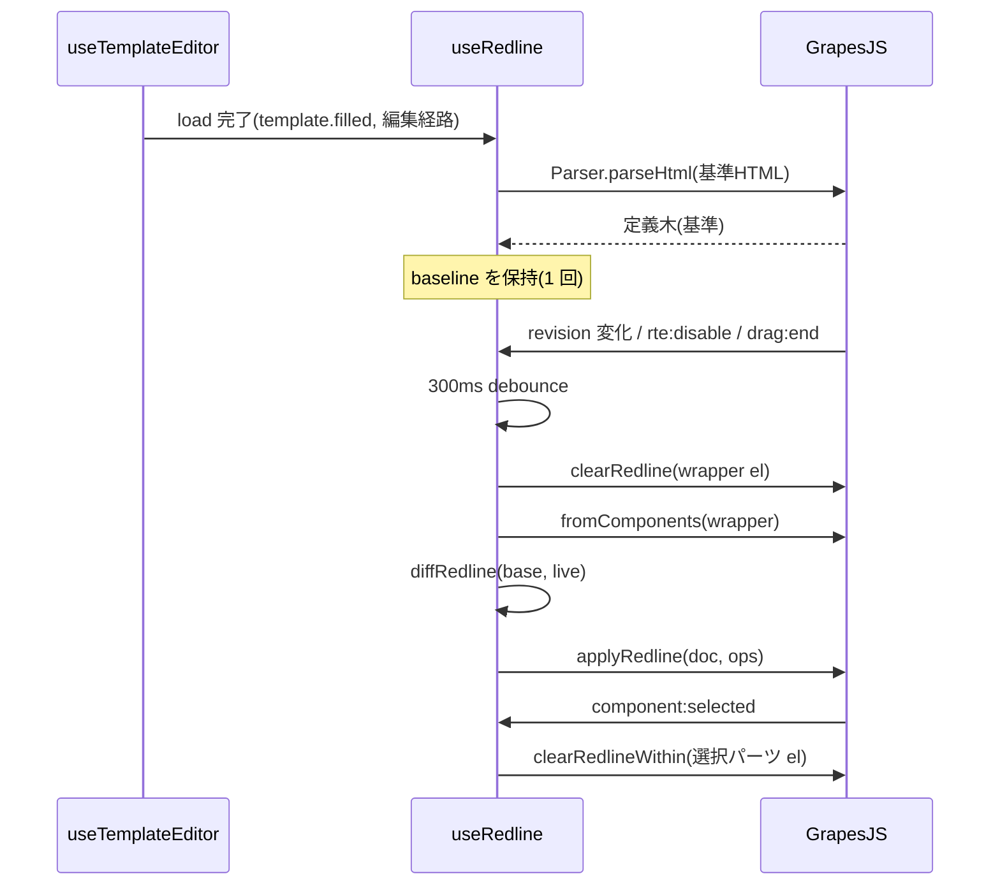

# 編集キャンバスの赤入れ表示（旧文言の取り消し線） — 設計書

- 日付: 2026-09-02
- 対象: editor の編集画面（`web/src/features/editor/`）。新規モジュールは
  `web/src/features/editor/redline/` 配下に置く。

## 1. 背景と目的

編集タブで文言を書き換えると、キャンバスには書き換え後の文言だけが残る。編集者は「何を
どう変えたか」を精査画面へ行くまで確認できず、精査者も編集画面上では変更箇所が分からない。

要件（ユーザー確定済み）:

- **編集キャンバス（GrapesJS）上で**、確定版からの変更箇所を赤入れ表示する。旧文言は
  取り消し線付きで新文言の直前にインライン表示し、追加・削除された要素は枠色で示す。
- **基準は現行の確定版**（`Template.filled`）。承認されると確定版が新文言になり、draft も
  消えるため、赤入れは自然に消える。draft を破棄した場合も同様に消える。
- 表示期間は「draft が確定版と異なる間は常時」（申請前・申請中・保留・却下後を問わない）。
- 旧文言は**保存しない**。表示のたびに draft と確定版の差分を計算し、表示層にだけ置く。
  ファイル・ペア同期・テンプレ JS の不変性検査・PDF・注記マスタのどれにも影響させない。
- 表示は「Word の変更履歴」風のインライン挿入で、行送り・改ページが PDF とずれるため、
  ツールバーのトグルで OFF にできる（既定 ON）。

## 2. 前提となる事実（コード調査の結果）

- 精査画面（`features/compare/htmlBlockDiff.ts`）に語句単位の差分エンジンがある。英数字は
  単語、CJK は 1 文字を 1 トークンとする LCS で、DP セル予算（`createLcsBudget`）を超えると
  全文 del + ins の粗い差分へ落ちる。`tokenize` / `diffTokens` / `createLcsBudget` は export
  済みで再利用できる。
- キャンバスの live DOM 要素には GrapesJS が **自動 `id`（`i3k9` 等）と `data-gjs-type`** を
  必ず付ける（`ComponentView.updateAttributes`）。一方、確定版の HTML にはこの id が無い。
  `blockKey.rawKey` は id を優先するため、live DOM と基準 HTML を DOM 同士で整列すると
  キーが一致しない。整列は **GrapesJS のモデル木**（`Component.get('attributes')` には明示
  属性しか無い）と **`Parser.parseHtml(基準HTML)` の定義木**の間で行う必要がある。両者は
  同じパーサと `parse:html:root` の刈り取りを通るので正規化が揃う。
- インラインのテキスト編集（RTE）は、開始時（`ComponentTextView.onActive`）に `lastContent`
  として `el.innerHTML` を読み、終了時に内容が変わっていれば `syncContent` で
  `el.innerHTML` をモデルへ再取込する。編集対象の要素に表示用の `<del>` が残っていると、
  **旧文言がモデルへ吸収され、`getHtml()` を経て draft に混入する**。`rte:enable` イベントは
  `lastContent` の取得より後に発火するため、そこで外しても遅い。
- 並べ替え（Sorter）はドロップ先コンテナの DOM 子要素を走査し、要素からモデルを引く。
  モデルを持たない DOM 子要素が混ざると誤動作しうる。
- 「ページの見え = PDF の見え」（メモ吹き出しの中核原則）とはインライン挿入が衝突する。
  ユーザーは衝突を承知のうえで、トグル OFF を用意することを条件にインライン挿入を選んだ。

## 3. 方式の選定

| 案 | 内容 | 判断 |
|---|---|---|
| 1. 生 DOM 装飾（モデル外） + モデル木 diff | `<del>` を iframe DOM へ直接挿入し、GrapesJS のモデルには載せない。差分はモデル木と定義木で計算する | **採用** |
| 2. GrapesJS component として挿入（`toHTML()` が空を返す専用 type） | `component:add` が dirty / undo / レイヤに流れる。RTE の再取込で `data-gjs-type` が許可リスト外となり汎用 `del` として吸収される | 却下 |
| 3. キャンバスと切り替える読み取り専用の赤入れ iframe | モデル汚染の危険は無いが、編集しながら見えない。ユーザーの選択（キャンバス表示）と一致しない | 案 1 が実機で破綻した場合の退避先 |

案 1 は、既存の「ページ表示マーカー（`PV_ATTR`）」「差し込み値ハイライト
（`jinja-vars-highlight`）」と同じ「生 DOM に書き、モデルには載せない」方針の延長である。
`editor.getHtml()` はモデルから再生成するため、DOM だけに置いた装飾は保存内容に現れない。

## 4. モジュール構成

新規ファイルは `web/src/features/editor/redline/` に置く。

### 4.1 `redlineTree.ts` — 平坦ツリーと 2 つのアダプタ

```ts
/** live 側のノード解決子。基準側は常に null を返す。 */
type NodeResolver = () => Node | null;

interface RedlineNode {
  kind: 'el' | 'text';
  /** 兄弟内で一意な整列キー。要素は `rawKey#n`、テキストは `#text#n`。 */
  key: string;
  tag?: string;
  text?: string;
  children: RedlineNode[];
  /** live 側: canvas DOM 上の対応ノード（要素または Text）。基準側は null。 */
  node: NodeResolver;
  /** 基準側のみ: 削除要素をキャンバスへ描くための定義（`ComponentDefinition`）。 */
  def?: ComponentDefinition;
}
```

- `fromComponents(wrapper)`: live のモデル木を `RedlineNode` へ写す。`textnode` 型は
  `kind:'text'`。`text` 型で `components()` が空かつ `content` が非空のものは、`content` を
  1 個の textnode 子として正規化する（RTE 再取込の前後で `content` と `components` の
  どちらに本文が入るかが揺れるため）。
- `fromDefinitions(defs)`: `Parser.parseHtml(html).html` の定義配列を同じ形へ写す。
  `attributes` / `classes` / `tagName` / `components` / `content` を読む。
- 整列キーの規則は `lib/blockKey.rawKey` と同じ（`data-part-id → 明示 id → 先頭 class →
  tag`）。要素・テキストいずれも、同一親の中で同じ基底キーが重複する場合は出現順 `#n`
  を付す（`htmlBlockDiff.keyedUnits` と同規則）。自動 id はモデルの `attributes` に含まれない
  ため混入しない。
- Jinja chip（`jinja-*` 型）は通常の要素として扱う。編集タブの chip は実値入りで
  `editable:false` なので、内容が変わることはなく差分にも現れない。

### 4.2 `redlineDiff.ts` — 純関数の差分計算

```ts
type RedlineOp =
  | { kind: 'delText'; node: NodeResolver; ops: DiffOp[] }
  | { kind: 'insText'; node: NodeResolver; ops: DiffOp[] }
  | { kind: 'addedEl'; node: NodeResolver }
  | {
      kind: 'removedEl';
      /** 挿入先の親（null = ルート）。 */
      parent: NodeResolver | null;
      /** この live ノードの直前へ挿す。null = 親の末尾。 */
      before: NodeResolver | null;
      /** 削除されたのがテキストなら inline、要素なら block。 */
      inline: boolean;
      def?: ComponentDefinition;
      text?: string;
    };

function diffRedline(base: RedlineNode[], live: RedlineNode[], budget: LcsBudget): RedlineOp[];
```

- 再帰整列は `htmlBlockDiff.diffElement` と同じ思想: 同キーの対は降りる、live のみは
  `addedEl`（テキストなら `insText`）、基準のみは `removedEl`、テキスト対は `tokenize` +
  `diffTokens` で語句差分を取り `del` が 1 つでもあれば `delText`、`ins` が 1 つでもあれば
  `insText` を出す。同じスロットで種別（要素 / テキスト）や tag が違う場合は `removedEl` +
  （`addedEl` または `insText`）として扱う。
- `removedEl` の挿入位置は「基準側で直後にあった兄弟のうち、live 側にも存在する最初の
  もの」の live ノード解決子を `before` とする。無ければ末尾（`null`）。
- 粗い差分（`coarse`）は全文 del + ins の形で返す。取り消し線は出るので要件は満たす。
  精査画面と同じ DP セル予算を 1 回の計算で共有する。
- テキスト同一判定は空白の折り畳み比較（`htmlBlockDiff.collapse` 相当）。

### 4.3 `redlineApply.ts` — DOM への適用と除去

- `applyRedline(rootEl, ops)`:
  - `delText`: 対象 textnode の live Text ノード（`node()`）を ops の順にたどり、`same` /
    `ins` の文字数ぶん進んだ位置で `splitText` し、そこへ削除語句ごとの
    `<del data-redline contenteditable="false">旧語句</del>` を割り込ませる（旧文言は新文言の
    直前に出る）。分割後も先頭の断片は GrapesJS の textnode view が持つ `el` のままなので、
    view とモデルの対応は崩れない。除去時（`clearRedline` / `clearRedlineWithin`）は `del` を
    取り除いた後に親要素の `normalize()` で断片を先頭の Text ノードへ結合し直す
    （`normalize()` は先頭ノードを残して後続を吸収するため、view の `el` 参照は有効なまま）。
    RTE が本文を読むのは選択で装飾を外した後なので、分割状態がモデルへ流れることはない。
  - `insText`: `CSS.highlights`（CSS Custom Highlight API）に `redline-ins` という名前で
    `Range` を登録する。DOM は変更しない。API が無いブラウザでは何もしない（挿入語句の
    着色は補助であり、要件は旧文言の取り消し線）。
  - `addedEl`: live 要素に `data-redline-added` 属性を付ける（属性は生 DOM のみ。モデルの
    `attributes` には触らない）。
  - `removedEl`: `<del data-redline>` を作り（`inline` なら文字列のまま、要素削除なら
    `class="redline-block"` を付ける）、テキスト削除は `text` をそのまま `textContent` へ、
    要素削除は `renderDefinition(def, doc)` で `createElement` / `setAttribute` /
    `createTextNode` により DOM を組んで中へ入れる（`id` / `contenteditable` / `on*` /
    `data-gjs-*` は写さない。文字列連結や `innerHTML` を経由しないので、本文や属性値に
    HTML の字面が入っていても文字列のまま出る）。`parent()`（無ければ `rootEl`）の
    `before()` の前（無ければ末尾）へ挿入する。
- `clearRedline(rootEl)`: `[data-redline]` を全て除去し、`[data-redline-added]` 属性を外し、
  `CSS.highlights.delete('redline-ins')` を呼ぶ。分割した Text があれば `normalize()` で戻す。
- `clearRedlineWithin(el)`: 上記を `el` の配下だけに限定する（選択パーツ用。挿入語句の
  CSS Highlight は要素を跨がず表示だけの存在なので残す）。

### 4.4 `redlineCss.ts` — キャンバスへ注入する CSS

`grapesEvents.canvasCss` に連結して iframe の `<head>` へ入れる。表示の ON/OFF は body
クラス `redline-on` で行う（`jinja-vars-highlight` と同じ手法。保存出力に載らない）。

```css
.redline-on [data-redline] {
  text-decoration: line-through;
  color: #b91c1c;
  background: rgba(220, 38, 38, 0.12);
  user-select: none;
}
.redline-on del.redline-block[data-redline] {
  display: block;
  box-shadow: inset 3px 0 0 #d97706;
  background: rgba(217, 119, 6, 0.08);
}
.redline-on [data-redline-added] { box-shadow: inset 3px 0 0 #16a34a; }
.redline-on ::highlight(redline-ins) { background: rgba(22, 163, 74, 0.2); }
body:not(.redline-on) [data-redline] { display: none; }
```

配色は精査画面（`diffHighlightCss`）に揃える（削除 = 赤、追加 = 緑、削除要素 = 橙左帯）。
トグル OFF では `del` を `display:none` にして本文の流れを PDF と同じに戻す。

### 4.5 `useRedline.ts` — composable（編集画面の統合）

- 状態: `enabled`（既定 `true`）、`available`（編集経路かつ基準あり）。`?created=1` の作成
  経路は基準が無いため `available=false` とし、トグルも出さない。
- 基準の確保: `useTemplateEditor.load` 完了後に 1 回だけ
  `ed.Parser.parseHtml(getBodyInner(template.filled)).html` を作って保持する。`filled` が空の
  場合（静的 filled 無し）は `available=false`。この `Parser.parseHtml` 呼び出しは try/catch で
  包み、パースが失敗した場合も編集セッションを道連れにせず、`baseline=null`／
  `available=false` にして `logError` するだけに留める（後続の autosave・undo の配線を
  止めない）。
- 再計算の契機: `revision` の変化を 300 ms debounce / `rte:disable`（内容が変わったとき）/
  `component:drag:end` / undo・redo・snapshot 復元（`load`）の後。手順は
  `clearRedline → fromComponents → diffRedline → applyRedline`。`dirty === false`（draft 無し）
  のときは差分を計算せず除去だけ行う。
- 安全弁（モデル吸収の防止）:
  - `component:selected`: 選択パーツ（`partPathKeyFor` が返す top-level block）配下の装飾を
    **同期的に**除去する。click は dblclick（RTE 開始）に先行するため、RTE が
    `lastContent` を読む時点で装飾は無い。
  - `component:drag:start`: 全装飾を除去する。Sorter がモデル無し要素を踏まない。
  - RTE 中（`editing`）と drag 中は再計算を抑止し、終了時に再計算する。
  - 再計算は選択中のパーツを常に素のままにし（`clearPartOf(ed.getSelected())`）、選択解除で
    再計算が装飾を戻す。
- `partKey.partEls` から `[data-redline]` を除外する（`pageView.enumeratePageEls` は `.page`
  だけを拾うので変更不要）。これによりメモの構造キーが装飾の有無で変わらない。
- 保存経路（`getHtml` / snapshot / 申請 / PDF）には一切触らない。

## 5. データフロー



承認の完結後はサーバが draft を削除するので、次回の load で `dirty=false` となり装飾は
出ない。他者の承認で確定版が先に進んだ場合は、次回 load 時の新しい `filled` が基準になる
（`baseHash` の陳腐化は既存の精査画面バナーが伝える）。

## 6. UI

- `EditorTopBar` に「変更箇所を表示」トグルを追加する（既存の `toggleSinglePage` と同じ
  形。アイコンボタン + tooltip「確定版からの変更箇所を赤入れで表示」/「赤入れを隠す」）。
  ON のときはアイコンを `text-primary` で強調する。作成経路では表示しない。
- 旧文言（`<del>`）は `contenteditable="false"` かつ `user-select:none`。クリックすると親の
  パーツが選択され、その瞬間に当該パーツの装飾が外れる（選択中は素の本文だけが見える）。
- 削除要素は橙の左帯 + 取り消し線本文、追加要素は緑の左帯。

## 7. エラー処理と限界

- 差分計算で例外が出た場合は `logError` に記録して装飾を除去するだけにし、編集を止めない。
- 語句 LCS が予算を超えた箇所は全文 del + ins の粗い表示になる（精査画面と同じ挙動）。
- `CSS.highlights` が無いブラウザでは挿入語句の着色だけが出ない。
- 表示 ON のときは行送り・改ページが PDF とずれる。トグル OFF で戻る。この乖離は仕様で
  あり、プレビュー画面と PDF は装飾の影響を受けない。
- 基準はページ構造が同じことを前提に整列する。ページの追加・削除で並びがずれた場合は
  best-effort（精査画面の位置整列と同程度）。

## 8. テスト

単体（vitest / jsdom。ルート `vitest.config.ts` の coverage include へ `redlineTree.ts` /
`redlineDiff.ts` / `redlineApply.ts` / `redlineCss.ts` を追加する。`useRedline.ts` は GrapesJS
依存のため include 外とし、e2e で担保する）:

- `redlineTree.test.ts`: 定義木 → 平坦ツリー。`text` 型の `content` / `components` の両形態が
  同一結果になる。jinja chip は要素として保持される。自動 id がキーに混入しない。
  同キーの兄弟に `#n` が付く。
- `redlineDiff.test.ts`: 語句の del / ins、要素の added / removed、同キーの再帰、`#text#n`、
  coarse フォールバック、変更なし → 空配列、種別違い → removed + （added または insText）、
  `before` の解決。
- `redlineApply.test.ts`: `del` の挿入位置と属性、`clearRedline` で `innerHTML` が完全復元、
  `clearRedlineWithin` の局所性、`renderDefinition` によるエスケープ（`` の字面が
  テキストのまま出る）、`CSS.highlights` 不在で例外が出ない。
- `partKey.test.ts` へ追記: `[data-redline]` の兄弟がパーツ採番に影響しない。

e2e（`editor/e2e/canvas.spec.ts` へ追加）:

- 文言を編集する → `del[data-redline]` が旧文言で現れる → トグル OFF で消える → autosave
  後の draft（`getDraft`）に `data-redline` が含まれない → パーツを選択すると当該パーツの
  装飾が外れる。
- `?created=1` ではトグルが表示されない。

既存ガード（`twoSystems.guard.test.ts` / `canvasActiveContent.guard.test.ts`）を含む
`pnpm test` を通す。

## 9. ドキュメント

- `docs/editor/src/設計正典.md` の中核原則へ 1 項目追記: 「赤入れ表示は生 DOM 装飾で
  モデル外に置く。選択 / drag / RTE のたびに外す。保存経路には関与しない」。却下済み設計へ
  「赤入れを GrapesJS component として挿入する」を追加。
- `docs/editor/src/設計書.md` 6.4 節へ小節を追加、`操作手順書.md` へ「変更箇所の表示」手順、
  `Editor_仕様一覧.md` へ 1 行。`py -3.13 docs/_build/build_all.py --project editor` で HTML を
  再生成する。

## 10. 実装順序（概略）

1. `redlineTree` / `redlineDiff` / `redlineApply` / `redlineCss` を TDD で作る（GrapesJS 非依存）。
2. `partKey.partEls` の除外を追加する。
3. `useRedline` を作り `useTemplateEditor` / `useGrapes`（`grapesEvents` の callbacks）へ配線する。
4. `EditorTopBar` にトグルを追加する。
5. e2e を追加し、実機（Edge）で RTE 再取込・drag・undo の 3 経路を確認する。
6. docs を更新し、HTML を再生成する。
