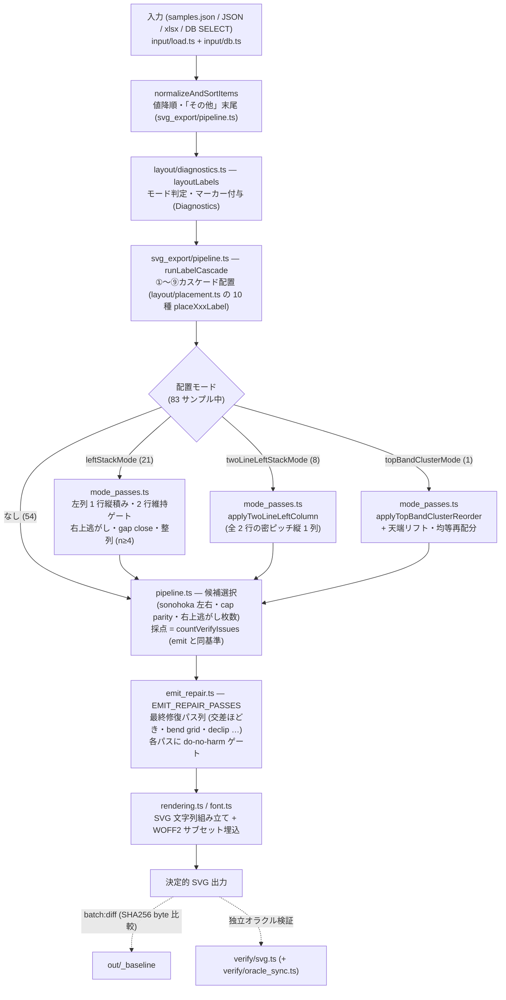
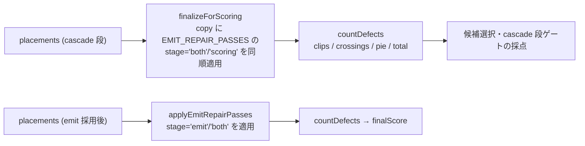

# pie-chart ARCHITECTURE

ラベル配置パイプラインの設計正典。**「どのモードでどのパスが座標を決めるか」を調べる時はまずここ**。
詳細な各パスの意図はコード内コメント（各関数の doc comment）へ委譲する。検証手順の正典は
`README.md` の「検証」節（`npm run batch` → `npm run batch:diff` で `out/_baseline` と SHA256
byte 比較。**リファクタ・コメント変更は出力バイト不変が鉄則**）。

## パイプライン全体図

## モジュール構成

| モジュール | 責務 |
|---|---|
| `src/input/load.ts` / `db.ts` | 入力取得と正規化（xlsx は load 内、DB はネイティブ依存ごと db に隔離） |
| `src/config.ts` | 寸法・スケール・配色（`createPieLayoutConfig` / `makeColors`） |
| `src/layout/diagnostics.ts` | `layoutLabels`: モード判定・per-item マーカー付与（`Diagnostics` の生産者） |
| `src/layout/placement.ts` | 角度ゾーン別 `placeXxxLabel` 10 種と leader path（カスケードの部品） |
| `src/layout/geometry.ts` | 純粋幾何ヘルパ（SVG 文字列なし・副作用なし）+ glyph advance 表の束ね |
| `src/glyph_advance/weight_{400,700}.ts` | 生成物（`npm run gen:widths`）。実 glyph advance 例外表 |
| `src/svg_export/pipeline.ts` | 公開 API `renderPdfStylePieToSvg`。カスケード実行・候補選択・fallback 変形 |
| `src/svg_export/mode_passes.ts` | モード特化パス（左列 / top-band クラスタ / 右上逃がし） |
| `src/svg_export/emit_repair.ts` | `EMIT_REPAIR_PASSES` 修復列・採点（`countDefects` 系）・do-no-harm ゲート基盤 |
| `src/svg_export/leader_geometry.ts` | leader 幾何の計測（交差・貫通・角度整合） |
| `src/svg_export/post_layout.ts` | overlap 解消・compact cascade・視覚 viewBox nudge・クランプ |
| `src/svg_export/rendering.ts` / `font.ts` | SVG 文字列プリミティブ / フォント埋込 |
| `src/verify/svg.ts` / `consistency.ts` / `oracle_sync.ts` | 独立オラクル検証 / scorer↔emit 一致 / オラクル drift ガード |

## 配置モード対応表

モードは `layout/diagnostics.ts` が**幾何条件のみ**で立てる（サンプル名指し・per-sample config は禁止）。

| モード | 件数 | 発火条件 | 担当パス（実装場所） |
|---|---|---|---|
| （なし = 素のカスケード） | 54/83 | — | `runLabelCascade` の①〜⑨カスケードのみ。各ラベルは自スライス rim 正面へ |
| `leftStackMode` | 21 | 片側過密など | 左列 1 行強制縦積み。`keepTwoLineLeftStack` ゲート・`stackTopRightLiftedLabels`・`applyLeftStackGapClose`・`alignLeftStackToAnchors`（n≥4 接触級のみ） |
| `twoLineLeftStackMode` | 8 | 左に外側ラベル ≥6（`leftColumnCount`） | `applyTwoLineLeftColumn`（全 2 行のまま canvas 全高の密ピッチ縦 1 列）。leftStack と排他 |
| `topBandClusterMode` | 1 | 12時近傍 ±30° に small slice ≥4（`topBandClusterCount`） | `applyTopBandClusterReorder`（midAngle 順再スタック + 天端リフト・均等再配分） |

補助フラグ（`lowerGapIsTight` / `oneSideDense` / `topSmallDense` / `upperLeftTriadEligible` 等）は
単独では配置を変えず、モード判定・候補選択・per-item マーカーの入力材料。一覧と分布は
`test/__snapshots__/mark_flags.test.ts.snap` がゴールデンとして固定している。

## 採点と scorer ↔ emit の一致保証

- 採点列と emit 列は**同一テーブル** `EMIT_REPAIR_PASSES` から生成され、列 drift を構造的に防ぐ
  （順序は `test/emit_passes.test.ts` が固定。**エントリ順は変更禁止**＝順序依存）。
- 修復系・fallback 系（stage 無指定 = emit 限定）を採点へ入れない理由: 「修復で直る前提」の
  スコアで候補選択が動き、修復しきれない候補を選ぶ退行を生むため。
- `verify/svg.ts` は本体からロジックを import しない**独立オラクル**。複製定数の乖離は
  `verify/oracle_sync.ts` が検出する（この分離は設計であり、統合してはならない）。

## do-no-harm ゲートの使い分け

「適用 → 悪化なら全 revert（退行 0）」が全パス共通の原則。計測系は 4 系統あり、段階で使い分ける:

| ゲート | 実装 | 使う場面 |
|---|---|---|
| `countVerifyIssuesDetailed` | emit_repair.ts | **cascade 段**の採否（emit と同一後段を適用してから数える）。例: 2 行維持、天端リフト |
| `emitDefectsWorsened`（`EmitDefectVec`） | emit_repair.ts | **emit 段**パスの標準ゲート（一級 defect + through/cross 新規対 + inv） |
| `hardDefectsWorsened` / `gateNotWorseExceptClips` | emit_repair.ts | 交差/円貫通は絶対増やさず clips 改善だけ許す等、非対称な採否 |
| `measureRepairVec` + `seamSnapshot`/`seamRestore` | emit_repair.ts | seam 系・残欠修復（`repairResidualLeaderDefects`）の全フィールド snapshot/revert |

## 設計判断の却下理由集（再提案しないこと）

- **左列の等間隔全高展開**（`spreadLeftStackFullHeight`）: 中段ラベルがスライスから離れ、rim 沿いの
  長い近平行 leader（所属が読めない）を作るためボツ。採用したのは「箱中心を自スライス rim 高さへ
  寄せる」`alignLeftStackToAnchors`（leader 判読性 > 間隔の均等さ、ユーザー選定）。
  同理由で左列のスポーク配置・テント配置もボツ。
- **サンプル名指し・per-sample config**: 禁止。発火は幾何条件のみ（`mark_flags` ゴールデンで固定）。
- **語割れ 2 行化**（`splitLongName`）: 廃止。長名の見切れは「語中で割らない標準 2 行
  `[名前, %]`」（`applyTwoLineNameFallback`）で収める。
- **天端リフトの全モード適用**: topBandCluster 以外はラベルが rim アンカー正面にあり、天端へ
  持ち上げるとアンカーから引き剥がす方向（机上試算で 38/83 サンプルが誤発火）。topBandCluster
  だけがアンカー＝12時付近なので「天端へ＝アンカーへ」となり正当。
- **glyph_advance の再輸出 index**: 置かない。束ねる Record は利用側 `layout/geometry.ts` が組む。
- **DB ローダの load.ts への統合**: しない。`input/db.ts` の module 境界はネイティブ依存の隔離と
  テストの `vi.mock` 差し替え点（統合すると同一モジュール内呼び出しになりモック不能）。

## 触る前のチェックリスト

1. 座標・leader に影響する変更か? → 影響するなら意図的差分として `out/_baseline` 更新 +
   `final_score` スナップショット確認をセットで（1 サンプルだけ動くべき変更で他も動いたら退行）。
2. コメント・リファクタのみ? → `npm run batch` → `npm run batch:diff` で **byte 一致**を確認。
3. パスを足す/並べ替える? → `EMIT_REPAIR_PASSES` はテーブル順序依存。`emit_passes.test.ts` と
   stage（emit/scoring/both）の意味を先に読む。
4. モード判定を触る? → `mark_flags.test.ts` のゴールデンが分布を固定している。差分は全件レビュー。
